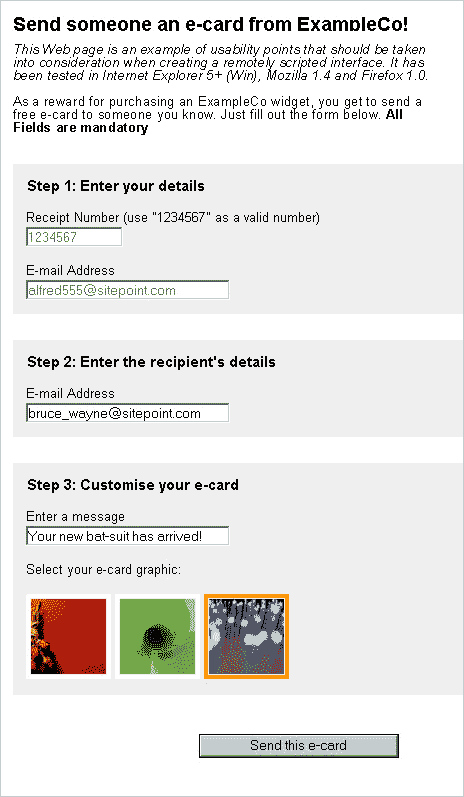
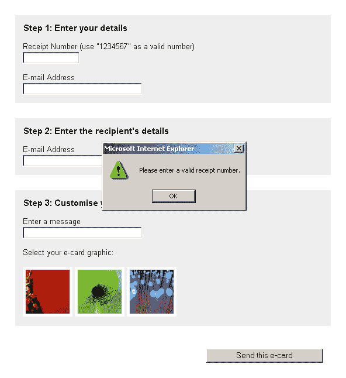
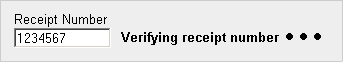
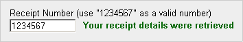
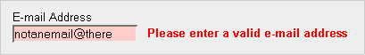
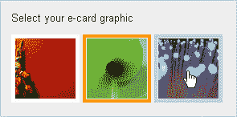
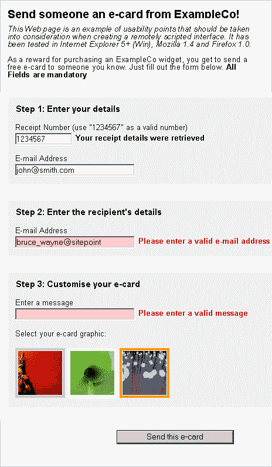

# AJAX:与远程脚本的可用交互性

> 原文：<https://www.sitepoint.com/remote-scripting-ajax/>

如果你的书签只包含一个 Web 开发博客，你肯定会知道远程脚本被吹捧为新的“Web 未来”。

虽然我感觉有些人可能对此有点兴奋过度，但是最近发布的大量使用远程脚本的高规格 Web 应用程序表明，在创建无缝 Web 应用程序和增加 Web 页面功能时，利用这些技术有一定的优势。

本文旨在向您介绍远程脚本的基础，特别是新兴的 XMLHttpRequest 协议。然后，我们将通过一个示例应用程序演示如何实现该协议，同时创建一个可用的接口。

首先，[下载代码归档文件](https://www.sitepoint.com/examples/scripting/remotescriptexamples.zip)，其中包含创建这里展示的工作示例所需的所有文件。

##### 什么是远程脚本？

本质上，远程脚本允许客户端 JavaScript 从服务器请求数据，而无需刷新网页。就是这样。创建无缝 Web 应用程序的所有其他内容都利用了操作文档对象模型的既定方法。这可能就像根据谷歌建议创建一个单词列表来选择一样简单。或者它可能包括创建一个完整的导航和缩放地图图像的界面，就像在 [map.search.ch](http://map.search.ch/) 的界面一样。

然而，随着创造新的网络体验的能力，远程脚本给了我们创造新的不可用的网络体验的能力。远程脚本和无缝应用程序带来了桌面应用程序设计领域的大量问题，使得这些问题在 Web 上也成为可能。您有责任确保您的远程脚本接口解决这些问题，并为您的用户提供尽可能好的体验。

##### 远程脚本和可访问性

如同任何在线应用程序或网页一样，我们必须始终考虑用户的需求。一些用户的浏览器可能缺少 JavaScript 功能，或者，即使他们可以执行 JavaScript，他们也可能没有远程脚本功能。

JavaScript 交互和远程脚本功能添加到基于 Web 的内容的基本功能中，这是一个公认的最佳实践:即使没有这些技术，内容也必须是可访问和可用的。对于成熟的 Web 应用程序，为没有 JavaScript 或远程脚本功能的用户提供一个完全不同的系统是可以接受的。GMail 的团队最近实现了一个非 JavaScript 的服务替代界面。

##### 使用 XMLHttpRequest 的远程脚本

尽管 XMLHttpRequest 不是公共标准，但是大多数现代浏览器都一致地实现了它，并且它正在成为 JavaScript 数据检索的事实上的标准。Internet Explorer 5 for Windows、Mozilla 1.0、Safari 1.2 以及即将发布的 Opera 8.0 版本都引入了 XMLHttpRequest 作为可用对象。

Internet Explorer XMLHttpRequest API 可供下载。

你也可以[下载 Mozilla 文档](http://unstable.elemental.com/mozilla/build/latest/mozilla/extensions/dox/interfacensIXMLHttpRequest.html)。

如果您需要支持比这些版本更老的浏览器，使用 [iframes](http://developer.apple.com/internet/webcontent/iframe.html) 的方法提供了一个可行的解决方案；然而，为这些浏览器编码也会限制您利用标准 JavaScript DOM 方法的能力。本文将关注更现代的 XMLHttpRequest 方法。

##### 创建 XMLHttpRequest 对象

对于除 Internet Explorer 之外的任何浏览器，我们都可以创建一个 XMLHttpRequest 对象，如下所示:

```
var requester = new XMLHttpRequest();
```

但是，在 Internet Explorer 中，XMLHttpRequest 是作为 ActiveX 对象实现的。对于 IE，对象是这样创建的:

```
var requester = new ActiveXObject("Microsoft.XMLHTTP");
```

*注意:这也意味着如果用户在 Internet Explorer 中禁用了 ActiveX 对象，即使启用了 JavaScript，他们也将无法使用 XMLHttpRequest。*

为了应对这些浏览器使用的对象创建语法的差异，最好使用 try/catch 结构来自动为您提供正确的对象，或者在 XMLHttpRequest 对象不可用时返回错误:

```
try 

{ 

  var requester = new XMLHttpRequest(); 

} 

catch (error) 

{ 

  try 

  { 

    var requester = new ActiveXObject("Microsoft.XMLHTTP"); 

  } 

  catch (error) 

  { 

    return false; 

  } 

}
```

幸运的是，实现之间的差异到此为止，对 XMLHttpRequest 对象的所有后续方法调用都可以执行，而不管脚本运行在哪个浏览器中。

##### 使用 XMLHttpRequest 对象传输数据

一旦创建了 XMLHttpRequest 对象，我们必须调用两个独立的方法，以便让它从服务器检索数据。

```
open() initialises the connection we wish to make, and takes two arguments, with several optionals. The first argument is the type of request we want to send; the second argument identifies the location from which we wish to request data. For instance, if we wanted to use a GET request to access feed.xml at the root of our server, we'd initialise the XMLHttpRequest object like this:

```

```
requester.open("GET", "/feed.xml");
```

URL 可以是相对的，也可以是绝对的，但是出于跨域安全考虑，目标必须与请求它的页面位于同一个域中。

`open()`方法还接受可选的第三个布尔参数，该参数指定请求是异步发出的(`true`，缺省值)还是同步发出的(`false`)。对于同步请求，浏览器将冻结，不允许任何用户交互，直到对象完成。异步请求在后台发生，允许其他脚本运行，并允许用户继续访问他们的浏览器。建议您使用异步请求；否则，当用户等待出错的请求时，我们将面临浏览器锁定的风险。`open()`可选的第四个和第五个参数是用户名和密码，用于在访问受密码保护的 URL 时进行身份验证。

一旦`open()`被用于初始化连接，`send()` 方法激活连接并发出请求。`send()`接受一个参数，允许我们在调用的同时发送额外的数据，比如 CGI 变量。Internet Explorer 将其视为可选的，但是如果没有传递任何值，Mozilla 将返回一个错误，因此最安全的方法是使用:

```
requester.send(null);
```

要使用 GET 请求方法发送 CGI 变量，我们必须将变量硬编码到`open()` URL 中:

```
requester.open("GET", "/query.cgi?name=Bob&email=bob@example.com"); 

requester.send(null);
```

要使用 POST 请求方法发送 CGI 变量，CGI 变量可以像这样传递给`send()`方法:

```
requester.open("POST", "/query.cgi"); 

requester.send("name=Bob&email=bob@example.com");
```

一旦我们调用了`send()`，XMLHttpRequest 将联系服务器并检索我们请求的数据；然而，这个过程需要不确定的时间。为了找出对象何时完成数据检索，我们必须使用一个事件侦听器。对于 XMLHttpRequest 对象，我们需要监听其变量`readyState`的变化。此变量指定对象的连接状态，可以是下列任一项:

*   `0`未初始化
*   `1`加载
*   `2`已加载
*   `3`交互式
*   `4`已完成

readyState 变量的变化可以使用一个特殊的 onreadystatechange 监听器来监控，所以我们需要设置一个函数来处理`readyState`发生变化时的事件:

```
requester.onreadystatechange = stateHandler;
```

```
readyState increments from 0 to 4, and the onreadystatechange event is triggered for each increment, but we really only want to know when the connection has completed (4), so our handling function needs to realise this. Upon the connection's completion, we also have to check whether the XMLHttpRequest object successfully retrieved the data, or was given an error code, such as 404: "Page not found". This can be determined from the object's status property, which contains an integer code. "200" denotes a successful completion, but this value can be any of the HTTP codes that servers may return. If the request was not successful, we must specify a course of action for our program:

```

```
function stateHandler() 

{ 

  if (requester.readyState == 4) 

  { 

  if (requester.status == 200) 

  { 

    success(); 

  } 

  else 

  { 

    failure(); 

  } 

} 

return true; 

}
```

尽管 XMLHttpRequest 对象允许我们多次调用`open()`方法，但每个对象实际上只能用于一次调用，因为一旦`readyState`变为“4”(在 Mozilla 中)，事件`onreadystatechange`不会再次更新。因此，每当我们想要进行远程调用时，我们都必须创建一个新的 XMLHttpRequest 对象。

##### 解析 XMLHttpRequest 对象中的数据

如果我们发出了一个成功的请求，XMLHttpRequest 对象的两个属性可能包含数据:

*   存储由对象检索的任何 XML 数据的 DOM 结构对象。使用标准的 JavaScript DOM 访问方法和属性，例如`getElementsByTagName()`、`childNodes[ ]`和`parentNode`，可以导航这个对象。
*   `responseText`将数据存储为一个完整的字符串。如果服务器提供的数据的内容类型是 text/plain 或 text/html，那么这是包含数据的唯一属性。任何文本/xml 数据的副本将被展平并放在这里作为`responseXML`的替代。

根据数据的复杂程度，简单地以纯文本字符串的形式返回数据可能更容易，从而使 XMLHttpRequest 中的 XML 变得多余。但是，对于更复杂的数据类型，您可能希望使用 XML 格式，如下所示:

`<?xml version="1.0" ?>
<user>
       <name>John Smith</name>
       <email>john@smith.com</email>
</user>`

我们能够使用标准的 DOM 访问方法访问数据的不同部分。请记住，标记之间包含的数据被视为表示父节点的子文本节点，因此我们在检索数据时必须考虑额外的结构层:

```
var nameNode = requester.responseXML.getElementsByTagName("name")[0]; 

var nameTextNode = nameNode.childNodes[0]; 

var name = nameTextNode.nodeValue;
```

我们还必须小心空白:在 XML 文件中缩进值可能会在值中产生不需要的空白，或者添加额外的文本节点。

一旦我们解析了来自 XMLHttpRequest 对象的数据，我们就可以随意更改、删除数据，并将其写入我们的 Web 页面。

##### 示例远程脚本应用程序

为了演示如何在远程脚本应用程序中使用 XMLHttpRequest 协议，我创建了一个简单的单页示例。它假设 JavaScript 和 XMLHttpRequest 是可用的，以使代码更具可读性，但在任何现实世界的应用程序中，您应该始终检查 XMLHttpRequest 是否可用，并在它不可用时有一个后备(即正常的表单提交)。

示例应用程序将允许用户向朋友的电子邮件地址发送免费的电子贺卡。为此，用户必须首先输入一个收货号，这是他们以前购买商品时收到的，并且已经存储在 ExampleCo 的数据库中。然后，用户必须在发送电子贺卡之前完成剩余的字段，输入收件人的电子邮件地址、消息和将用于贺卡的图形图像:



在本例中，远程脚本用于三个操作，以:

*   最大限度地减少验证收据编号的等待时间
*   确认收据号码后，自动将检索到的数据输入到表单中
*   一旦电子贺卡发送成功，请重写页面内容

除了这些操作，该示例还包含 JavaScript，它在提交之前验证其他表单字段，并允许用户选择电子贺卡图形。

该示例创建了两个不同的版本。第一个版本演示了 XMLHttpRequest 协议在应用程序中的实现，但是它包含几个不太理想的可用性问题。这些问题将在第二个示例中解决，第二个示例旨在强调在从基于页面的应用程序模型向更具动态性和交互性的环境迁移时可能会遇到的一些问题。

##### 示例 1:实现 XMLHttpRequest

在传统的服务器/客户端应用程序中，必须将整个电子贺卡表单提交给服务器、进行检查并返回给浏览器，然后客户端才能知道他们的收据号码是否有效。使用远程脚本模型，我们能够在用户处理完该字段后立即检查收据号码。因此，当用户提交表单时，浏览器已经识别出数据是否有效。

远程检查数据的第一步是了解用户何时在收据编号字段中输入了值。使用该字段的 onchange 事件处理程序可以检测到这一点。每当用户修改文本字段的值，然后从该字段“模糊”时(即，他们从该字段移开或点击)，文本字段上的“改变”被记录。这通常是一个很好的迹象，表明用户已经完成了字段的填写，并且可以处理其中包含的数据。通过捕获这个 onchange 事件，我们可以告诉我们的脚本开始验证字段的内容:

```
receipt.onchange = onchangeReceipt;
```

```
onchangeReceipt is a function that is called when the onchange event is triggered. It's inside this function that we initialise our XMLHttpRequest object and send off the relevant data to be checked:

```

```
var requester = null;  

function onchangeReceipt()  

{  

  /* Check for running connections */  

  if (requester != null && requester.readyState != 0 && requester.readyState != 4)  

  {  

    requester.abort();  

  }  

  try  

  {  

    requester = new XMLHttpRequest();  

  }  

  catch (error)  

  {  

    try  

    {  

      requester = new ActiveXObject("Microsoft.XMLHTTP");  

    }  

    catch (error)  

    {  

      requester = null;  

      return false;  

    }  

  }  

  requester.onreadystatechange = requesterExecuteAction;  

  requester.open("GET", "receipt.php?receipt=" + this.value);  

  requester.send(null);  

  return true;  

}
```

您可能认识到本文第一部分中的一些语法，即分叉的 try/catch 结构，以及控制 XMLHttpRequest 对象的`open()`和`send()` 方法。

第一个 if 语句检查 XMLHttpRequest 对象是否已经存在并且当前正在运行；如果是，它将中止该连接。这确保了大量冲突的 XMLHttpRequest 调用不会同时运行，否则会阻塞网络。然后，该函数继续创建一个新的 XMLHttpRequest 对象，并打开一个到服务器端验证脚本 receipt.php 的连接。

在 receipt.php，检查 CGI 变量 receipt，如果它的值是`"1234567"`，则返回一些 XML 数据；否则，返回一个纯文本字符串`"empty"`，表示收据号无效:

```
if ($receipt == "1234567")  

{  

  header("Content-type: text/xml");  

  $filePointer = fopen("example.xml", "r");  

  $exampleXML = fread($filePointer, filesize("example.xml"));  

  fclose($filePointer);  

  print($exampleXML);  

}  

else  

{  

  header("Content-type: text/plain");  

  print("empty");  

}
```

本例中使用了硬编码的值和数据来简化代码，但是在现实世界中，这个 PHP 脚本会根据数据库检查收据号码，并返回该号码的适当数据。

注意，如果收据号无效，则发送的内容类型头是`"text/plain"`。这在一定程度上简化了消息打印过程，但也意味着，在客户端，XMLHttpRequest 对象的 responseXML 属性将不包含任何内容。因此，您应该始终知道您的服务器端脚本返回什么，并适当地关注`responseXML`或`responseText`。

除了调用服务器端脚本之外，`onchangeReceipt()`还通过 onreadystatechange 事件指派`onreadystatechangeReceipt()`来监控连接的状态，正是这个函数决定了连接何时完成以及应该采取的进一步行动。为此，我们使用前面讨论过的`readyState` / `status`条件嵌套:

`function onreadystatechangeReceipt()  
{  
 /* If XMLHR object has finished retrieving the data */  
 if (requester.readyState == 4)  
 {  
   /* If the data was retrieved successfully */  
   if (requester.status == 200)  
   {  
     writeDetails();  
   }  
   /* IE returns a status code of 0 on some occasions, so ignore this case */  
   else if (requester.status != 0)  
   {  
     alert("There was an error while retrieving the URL: " + requester.statusText);  
   }  
 }  

 return true;  
}`

当返回成功的状态代码时，调用`writeDetails()`。这个函数解析返回的数据，并决定对网页做什么:

```
function writeDetails()  

{  

  var receipt = document.getElementById("receipt");  

  if (requester.responseText.charAt(0) == "<")  

  {  

    var email = document.getElementById("email");  

    var name = document.getElementById("name");  

    receipt.valid = true;  

    email.value = requester.responseXML.getElementsByTagName("email")[0].  

childNodes[0].nodeValue;  

  }  

  else  

  {  

    receipt.valid = false;  

  }  

  return true;  

}
```

该函数首先检查 XMLHttpRequest 对象的`responseText`属性，查看收据号是否有效。如果有效，数据将是 XML 格式，其第一个字符将是左尖括号(`<`)；否则，它将是一个普通的字符串。在每种情况下，扩展属性“有效”都是在“收据编号”字段中适当设置的。此外，如果收据号码有效，额外的数据将被添加到 email 字段，这些数据是从 XMLHttpRequest 对象的 responseXML 属性解析而来的。

`writeDetails()`的执行标志着收据号码验证远程脚本过程的结束。通过在字段上设置扩展的有效属性，浏览器知道数据是否正确，并可以在用户尝试提交表单时提醒用户任何错误:

```
orderForm.onsubmit = checkForm;  

function checkForm()  

{  

if (!receipt.valid)  

{  

  receipt.focus();  

  alert("Please enter a valid receipt number.");  

  return false;  

}  

...
```

如果表单有错误，点击提交按钮时会出现一个`alert()`对话框，要求用户在提交表单前纠正错误:



```
checkForm() also handles the submission of the form data via remote scripting (though, in reality, normal form submission would probably suffice for an application like this). The remote scripting for the data submission uses the same code we used for validation, but a different server-side script is supplied to process the data, and instead of onreadystatechangeReceipt() being called once the connection has finished, onreadystatechangeForm() is called.

```

```
onreadystatechangeForm() triggers sentForm() to re-write the Web page and inform the user that the ecard was either successfully or unsuccessfully sent, depending upon the data returned from the server:

```

```
function sentForm()  

{  

  var body = document.getElementsByTagName("body")[0];  

  body.innerHTML = "<h1>Send someone an e-card from ExampleCo!</h1>";  

  if (formRequester.responseText == "success")  

  {  

    body.innerHTML += "<h1>Send someone an e-card from ExampleCo!</h1><p>Your ExampleCo e-card has been sent!</p>";  

  }  

  else  

  {  

    body.innerHTML += "<p>There was an error while sending your ExampleCo e-card.</p>";  

  }  

  return true;  

}
```

这将删除呈现给用户的初始表单，并插入最终状态消息:


虽然这个应用程序几乎重写了整个页面，但是很容易看出如何使用远程脚本修改 DOM 的特定部分，这将使应用程序界面的独立部分能够独立于网页本身进行更新。

##### 示例 2:创建一个可用的远程脚本接口

远程脚本模型与弥漫在大多数 Web 中的基于页面的标准交互有很大的不同，这种不同带来了新的可用性缺陷，这些缺陷很容易被引入到您的项目中。这些缺陷通常来自用户访问界面时对界面的动态操作，或者来自访问网页外部数据的需要。

示例 1 使用远程脚本验证收据号码，并自动插入从数据库中检索的数据；然而，这些信息都没有得到很好的利用，用户也不清楚发生了什么。示例 2 旨在纠正第一个示例中的这一缺陷和其他缺陷，使用户的体验更快、更容易、更容易理解。下面的五个建议解释了一些可以用来把不好的经历变成好的经历的改变。

***提示 1:告诉用户为什么他们在等待***

远程脚本不是即时的。无论您的网络连接速度如何，与外部信号源的通信时间都会有所不同。因此，当与服务器进行通信时，您必须告诉用户他们等待的原因。(示例 PHP 脚本使用`sleep()`调用来突出可能由网络流量或其他因素引起的等待时间。)

由于远程脚本应用程序不使用普通的浏览器界面进行调用，通常通知用户传输状态和活动的状态栏不能正常工作，因此，我们必须自己向用户提供反馈。

在示例 2 中，验证收据编号时，收据编号字段旁边会显示一个标签，解释等待的原因。



XMLHttpRequest 连接完成后，标签会发生变化以指示完成。



当收据号码字段的 onchange 事件被触发时，在 XMLHttpRequest 连接之前初始化状态消息:

```
receipt.onchange = onchangeReceipt;   

function onchangeReceipt()   

{   

  message(this, "loadingMessage", "Verifying receipt number");   

  /* Check for running connections */   

  if (requester != null && requester.readyState != 0 && requester.readyState != 4)   

  {   

    requester.abort();   

  }   

...
```

远程脚本操作完成后，消息会更新以告知用户收据编号是否有效:

```
function writeDetails()   

{   

  if (requester.responseText.charAt(0) == "<")   

  {   

    message(receipt, "statusMessage", "Your receipt details were retrieved");   

...   

  else   

  {   

    message(receipt, "errorMessage", "Please enter a valid receipt number");   

...
```

更新消息以表明完成是重要的，因为它为用户提供了结束。如果加载消息简单地消失了，用户就不能确定它已经成功了。

在上面的两个代码示例中，message 函数是一个自定义函数，它为一个表单元素动态创建一个状态标签，并将其放置在相关元素旁边。它还接受一个状态标签类，允许 CSS 样式以不同的方式应用于加载、错误和完成消息:

```
function message(element, classString, errorMessage)   

{   

  var messageDiv = document.createElement("div");   

  element.parentNode.insertBefore(messageDiv, element);   

  messageDiv.className = classString;   

  messageDiv.appendChild(document.createTextNode(errorMessage));   

  return true;   

}
```

当 XMLHttpRequest 进程运行时，标签会显示动画，指示该操作正在进行并且仍然有效。在示例 2 中，这是通过带有动画 GIF 的 CSS 样式来执行的，但是也可以使用 JavaScript 动画来实现。

同样的特性也适用于表单提交按钮。同样，这提醒用户正在进行某个操作，并让他们知道他们确实单击了该按钮，这将有助于阻止用户多次按下该按钮:


为此，只需更改 submit 按钮的值和 CSS 类:

```
submit.className = "submit loading";   

submit.value = "Contacting server";
```

***提示#2:不要干扰用户的交互***

用户对干扰他们完成任务的界面感到沮丧。在示例 1 中，这种干扰可能发生在用户输入收据号码之后:如果他们在收据号码被验证之前就开始填写他们的姓名和电子邮件地址，那么一旦从服务器接收到他们的用户数据，这些详细信息就会被覆盖。

为了纠正这一点，示例 2 在脚本向文本字段输入任何数据之前，检查用户是否更改了文本字段的值。当页面加载时，可以检测到文本字段的默认值，并使用自定义 DOM 属性进行记录:

```
email.defaultValue = email.value;
```

然后，在脚本尝试向字段中写入任何数据之前，可以根据其当前内容检查字段的默认值:

```
if (email.value == email.defaultValue)   

{   

  email.value = newValue;   

}
```

这确保了用户——可能比我们更清楚自己的名字——不会有任何条目被过分热情的自动化覆盖。

您应该避免的一些其他常见干扰情况包括:当用户正在填写另一个字段时，将光标移动到另一个字段，以及将用户锁定在界面之外(这就是为什么应该异步使用 XMLHttpRequest)。

***秘诀三:及早发现错误，但不要太早***

最好在错误一出现就捕捉它们。目前出现在 Web 上的许多表单都依赖于用户提交表单，然后才会显示任何表单错误，要么使用服务器端脚本，要么使用不雅的 JavaScript 警告(如例 1 所示)。这些方法对用户来说有几个缺点:

*   提交表单的过程会占用用户的时间。
*   JavaScript 警告不会永久标记所有需要更正的字段。
*   在错误发生后很久才指出错误，这需要用户在头脑中回忆错误字段要求他们做什么。
*   即使用户知道要更正哪些表单元素，他们也必须重新提交表单，以确定这些元素是否得到了正确的更正。

由于这些原因，最好在用户出错时就通知他们。在示例 2 中，如果用户输入了无效的电子邮件地址，应用程序会直接告诉他们。使用提示 1 中的`message()`函数，通知就放在电子邮件字段的旁边:



然而，你不应该在用户开始输入时就检查有效性，因为在你完成输入数据之前就被告知你犯了一个错误，这是令人分心的——更不用说令人讨厌了。只有当用户完成输入时，即当他们离开输入时，才应进行字段检查。对于文本字段，最好使用 onchange 事件来捕获这种类型的操作:

```
email.onchange = onchangeEmail;
```

然后，由事件触发的函数可以检查该字段，并确保它包含的数据对于该数据类型有效:

```
function onchangeEmail()   

{   

  if (!this.value.match(/^[w.-]+@([w-]+.)+[a-zA-Z]+$/))   

  {   

    field.valid = false;   

    message(field, "errorMessage", "Please enter a valid e-mail address");   

    field.className = "text error";   

  }   

  return true;   

}
```

***提示#4:让用户知道错误何时被修复***

一旦发现某个字段不正确，并且提醒用户注意该错误，同样重要的是让用户知道他或她何时将它修改为正确的，否则用户将再次陷入表单提交周期。

在这些情况下，等待浏览器的 onchange 事件触发是不够的，因为这通常只在用户散焦表单元素时发生。因此，最好使用 onkeyup 事件来检查已知不正确的字段的正确性:

```
email.onkeyup = onkeyupEmail;
```

`onkeyupEmail()`函数检查电子邮件字段旁边是否显示了错误消息，然后继续检查该字段是否正确。因此，只要用户对字段进行适当的更正，错误消息就会消失；但是，如果用户是第一次在字段中键入内容，将不会出现任何消息:

```
function onkeyupEmail()   

{   

  /* If an error message is displayed */   

  if (this.message != null && this.message.className == "errorMessage")   

  {   

    if (this.value.match(/^[w.-]+@([w-]+.)+[a-zA-Z]+$/))   

    {   

      this.valid = true;   

      /* Remove error message */   

message(this);   

/* Remove error CSS class */   

      this.className = "text";   

    }   

...
```

这些场景没有捕捉到必填字段被跳过的情况，因此允许用户提交不完整的表单是一个好主意，因为这允许程序准确地突出需要完成的内容，而不是搜索尚未填写的细节。

***提示#5:提供界面反馈***

创建一个无缝的 Web 应用程序可以让你探索浏览器中没有的新功能，但是在这样做的时候，我们仍然必须记住可用界面设计的基础。一个这样的基础是提供界面反馈:让用户知道他们能做什么，以及他们已经做了什么。

在示例 1 中，不完全清楚用户是否可以点击电子贺卡图形的缩略图。如果我们在任何给定时间给光标所在的图像一个灰色轮廓，这很容易被抵消。



使用过 CSS 的人对这个伪类都很熟悉。当光标移动到一个对象上时，它允许该对象改变它的外观。尽管理论上可以通过 CSS 单独实现鼠标悬停效果，但是当前版本的 Internet Explorer 不允许在除了锚标签之外的任何元素上使用`:hover`效果。因此，为了在图像元素上实现悬停效果，示例 2 附加了`onmouseover`和`onmouseout`事件处理程序:

```
var cards = document.getElementById("ecardSet").   

getElementsByTagName("img");   

for (var i = 0; i < cards.length; i++)   

{   

  cards[i].onmouseover = onmouseoverCard;   

  cards[i].onmouseout = onmouseoutCard;   

}
```

然后，这些事件处理程序可以更改每个图像的类，并允许我们使用 CSS 提供视觉反馈:

```
function onmouseoverCard()   

{   

  this.className = "hover";   

  return true;   

}   

function onmouseoutCard()   

{   

  this.className = "";   

  return true;   

}
```

改变光标以指示其“可点击性”也可以帮助向用户提供反馈。这可以通过 CSS 中的一个简单规则来实现:

```
img.hover   

{   

  cursor: pointer;   

}
```

##### 结论

在对示例 1 做了所有这些更改之后，示例 2 变成了一个更有用的应用程序。



这里提供的技巧的共同主题是让用户感到舒适和可控。如果用户不具备他们所需要的信息来理解正在发生的事情，他们会对你的应用程序心存疑虑，其性能将会因此受到影响。

虽然本文主要关注远程脚本的过程及其可用性问题，但是在创建无缝 Web 应用程序时，也应该考虑一些可访问性问题。示例 3 是一个复杂得多的 ecard 应用程序版本，它使用了更强大的脚本，对于没有 JavaScript 或 XMLHttpRequest 的用户来说降级很容易。一旦您掌握了上述技术，您可能想看看最后一个例子，并开始使您的应用程序真正健壮。

## 分享这篇文章