# 使用新的 Vorlon.js 插件远程调试和测试 JavaScript

> 原文：<https://www.sitepoint.com/remotely-debug-and-test-javascript-with-new-vorlon-js-plug-ins/>

本文是微软网站开发系列的一部分。感谢您对使 SitePoint 成为可能的合作伙伴的支持。

2015 年 4 月，我们在微软的工程师和技术传播者团队推出了 [Vorlon.js](http://www.vorlonjs.com/) ，这是一款开源、可扩展、平台无关的工具，用于远程调试和测试您的 JavaScript。

当我们在 Microsoft Build Developer Conference keynote 上启动这个项目时，我们只有三个插件:DOM Explorer、交互式控制台和 Modernizr。我们知道，像 Vorlon 这样的项目成功的关键是插件的数量和质量。当你想调试你的网站时，你不想做太复杂的事情。你只需要选择正确的插件并获得正确的信息。

这就是为什么我们让这个项目开源。我们知道您有很多想法可以为 web 开发人员提供出色的调试体验。

于是两个月，66 次拉取请求，78 次发布，547 次提交之后:我们自豪地宣布，我们(你和团队)刚刚发布了 vor lon . js 0 . 0 . 15 版！你可以通过克隆[我们的 GitHub 库](https://github.com/MicrosoftDX/Vorlonjs)或者使用 **npm** 命令工具(`npm install –g vorlon`)来安装它。

**注**:如果你还在疑惑 Vorlon.js 是什么，请先阅读大卫·卡图赫的这篇文章:_[http://blogs . msdn . com/b/eternal coding/archive/2015/04/30/why-we-made-vorlon-js-and-how-to-use-it-debug-your-JavaScript-remote . aspx](http://blogs.msdn.com/b/eternalcoding/archive/2015/04/30/why-we-made-vorlon-js-and-how-to-use-it-to-debug-your-javascript-remotely.aspx/?WT.mc_id=13416-DEV-sitepoint-article40)*)。*

让我们来看看这个版本有什么新内容。

## 新插件

**XHR 面板**在这里帮助您获得通过 XMLHttpRequest 完成的请求列表。您可以使用**播放**按钮选择启用或禁用录制。

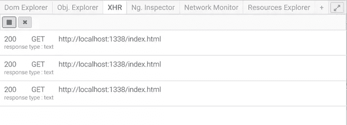 XHR 小组

**网络监视器**为您带来了在 Vorlon 中查看浏览器和网络服务器之间所有网络交换的能力。它提供了资源名称、服务器域、请求类型、持续时间(毫秒)和一个漂亮的可视化时间线！

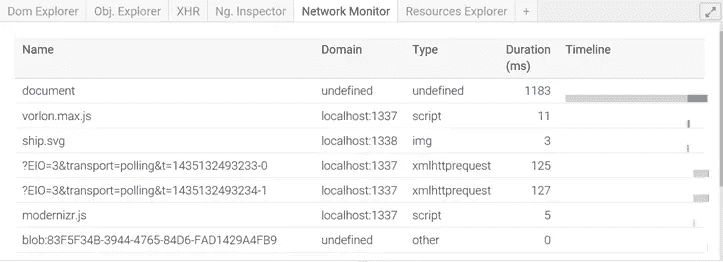

**Resource Explorer** 为您提供了关于客户端浏览器实例上本地存储的内容的信息。有关于**会话**、**cookie**和**本地存储**的数据。当您想要调试本地缓存或登录/持久用户数据问题时，这非常有用。

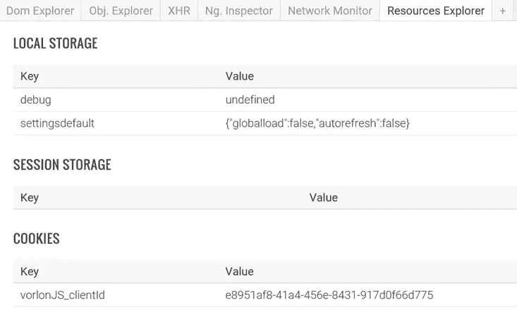

**NG Inspector** 是 AngularJS 的`$scope`调试器。您可以轻松地访问存储在每个作用域中的所有值。这个第一个版本给你提供信息，未来的版本会给你编辑你的范围的能力。

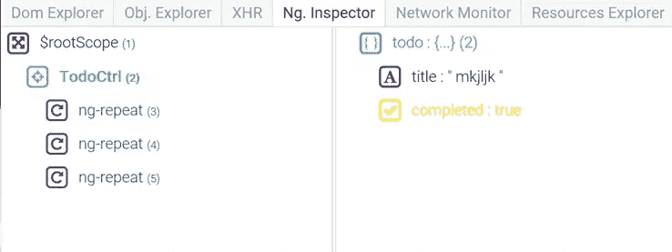

## 插件改进

### DOM Explorer 改进了很多。

以前，每当 DOM 数据发生变化时，这个插件都会将所有 DOM 数据从客户端发送到仪表板。这对表演产生了巨大的影响。这个问题现在已经解决了，你可以通过手动点击**刷新**按钮，或者激活**设置**面板上的自动刷新来从客户端刷新 DOM。自动刷新更智能，如果客户端浏览器上有`MutationObserver`的话，会使用它。

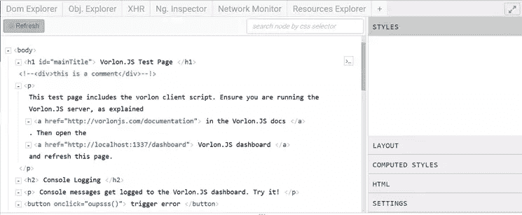

额外功能:当客户端的 DOM 发生变化时，刷新按钮中的圆形指示器会变为红色！

如您所见，DOM Exploring 窗格更漂亮，也更容易阅读。

你现在可以通过点击来编辑 HTML 内容和属性。当按 ENTER 键时，更改将应用于客户端。

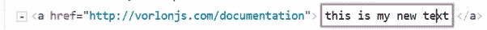

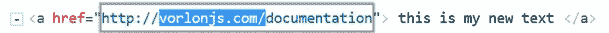

DOM 高亮特性更容易访问。当您的鼠标经过 Vorlon 仪表板中 DOM explorer 上的 DOM 元素时，就会发生这种情况。

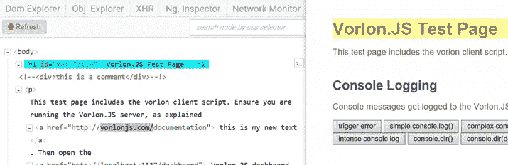

你也可以右击一个元素来删除或编辑内容。这是在属性上启用删除的最佳人机工程学方法。

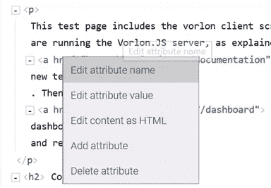

在右窗格中，你有更多的信息，现在只有真正的 CSS 代码。

“布局”选项卡为您提供了传统 F12 工具中常用的信息:边距、填充、边框和大小信息。

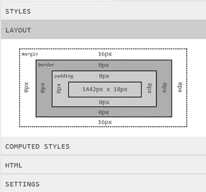

对于包含所有显式和隐式继承的 CSS 样式的**计算样式**也是如此。

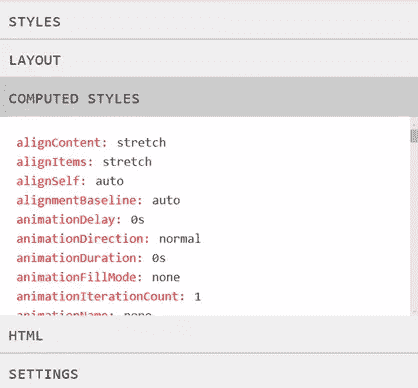

HTML 标签是编辑 DOM 中文本的更好的工具。您可以创建隔断线，然后点击保存按钮应用更改。

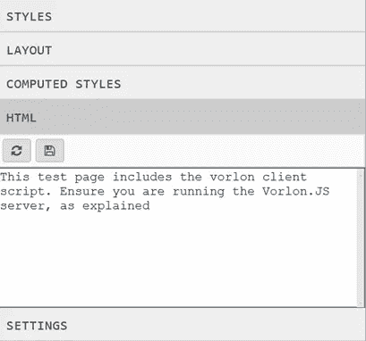

最后，**设置**部分是您可以激活 DOM 自动刷新的地方。

### 交互式控制台也有一些新特性。

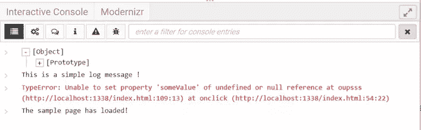

我们有`windows.onerror`、`console.dir`和复杂`object`日志支持。您可以使用可视化树在对象属性中导航。过滤器仅用于显示日志的子集，您可以使用类似搜索的文本区域进行过滤。

## 其他变化和改进

我们在代码组织和结构上做了很多其他的改变，这些改变在插件和特性中是不可见的。

例如，我们将包含插件列表和一些参数的`catalog.json`文件重命名并移动到服务器文件夹中。现在叫`config.json`是因为有些参数与插件无关。为了避免复制粘贴并简化调试和使用，我们还在`config.json`的插件配置中添加了一个`enabled`布尔参数。对于特定插件，如果为 false，则不会加载到仪表板中，也不会在生成的 vorlon.js 文件中发送到客户端。

我们还将插件分成两个独立的文件。最初，一个插件只由一个 JavaScript 文件组成，其中包含仪表板和客户端的代码。当我们开始这个项目时，事情变得简单多了。现在创建了更复杂的插件，出于优化的原因，我们把它分成两个不同的文件:`yourplugin.client.js`和`yourplugin.dashboard.js`。

你可以在[我们的 GitHub repo](https://github.com/MicrosoftDX/Vorlonjs/blob/master/whatsnew.md) 上看到更多关于我们在 **whatsnew.md** 文件中所做的修改。

## 下一步是什么？

我们现在正在开发下一个版本，它将包含新的插件和核心改进。认证，webgl，webaudio 都是列表的一部分！

正如我所说，我们希望这个项目是网络开发人员的项目。如果您有想法，您可以:

*   在 GitHub 上提交问题
*   自己创建并提交一个拉取请求(我们每天都审查这个！)

_ 注意:为了帮助你学习如何创建插件，我写了这个简介。

让我们在 Vorlon.js 上一起努力，让调试体验变得更简单、更好。

不要忘记关注我们团队的推特账号！

## JavaScript 的更多实践

这篇文章是微软技术倡导者的 web 开发系列的一部分，内容涉及实用的 JavaScript 学习、开源项目和互操作性最佳实践，包括[微软 Edge](http://blogs.windows.com/msedgedev/2015/05/06/a-break-from-the-past-part-2-saying-goodbye-to-activex-vbscript-attachevent/?WT.mc_id=13416-DEV-sitepoint-article40) 浏览器和新的 [EdgeHTML 渲染引擎](http://blogs.windows.com/msedgedev/2015/02/26/a-break-from-the-past-the-birth-of-microsofts-new-web-rendering-engine/?WT.mc_id=13416-DEV-sitepoint-article40)。

我们鼓励您使用 [dev.modern.IE](http://dev.modern.ie/tools/?utm_source=SitePoint&utm_medium=article40&utm_campaign=SitePoint) 上的免费工具跨浏览器和设备进行测试，包括 Windows 10 的默认浏览器 Microsoft Edge:

*   [扫描你的网站，寻找过时的库、布局问题和可访问性](http://dev.modern.ie/tools/staticscan/?utm_source=SitePoint&utm_medium=article40&utm_campaign=SitePoint)
*   [在 Mac、Linux 和 Windows 上使用虚拟机](http://dev.modern.ie/tools/vms/windows/?utm_source=SitePoint&utm_medium=article40&utm_campaign=SitePoint)
*   [在您自己的设备上远程测试 Microsoft Edge](https://remote.modern.ie/?utm_source=SitePoint&utm_medium=article40&utm_campaign=SitePoint)
*   [GitHub 编码实验室:跨浏览器测试和最佳实践](https://github.com/deltakosh/interoperable-web-development)

来自我们的工程师和布道者的关于 Microsoft Edge 和 Web 平台的深入技术学习:

*   【2015 年微软 Edge 网络峰会(对新浏览器、新支持的网络平台标准以及来自 JavaScript 社区的演讲嘉宾有何期待)
*   哇，我可以在 Mac 电脑上测试 Edge & IE 浏览器& Linux！(来自雷伊·班戈)
*   [在不破坏网络的情况下推进 JavaScript】(来自 Christian Heilmann)](http://channel9.msdn.com/Events/WebPlatformSummit/2015/Advancing-JavaScript-without-breaking-the-web/?WT.mc_id=13416-DEV-sitepoint-article40)
*   使网络正常工作的边缘渲染引擎(Jacob Rossi)
*   [用 WebGL 释放 3D 渲染](https://channel9.msdn.com/Events/WebPlatformSummit/2015/Unleash-3D-rendering-with-WebGL-and-Microsoft-Edge/?WT.mc_id=13416-DEV-sitepoint-article40)(来自大卫·卡图赫，包括[伏龙。JS](http://vorlonjs.com) 和 [babylonJS](http://babylonjs.com) 项目)
*   [托管网络应用和网络平台创新](https://channel9.msdn.com/Events/WebPlatformSummit/2015/Hosted-web-apps-and-web-platform-innovations/?WT.mc_id=13416-DEV-sitepoint-article40)(来自律师奶爸和基里尔·赛克谢诺夫，包括[流形。JS](http://manifold.js.com) 项目)

更多面向网络平台的免费跨平台工具和资源:

*   [适用于 Linux、MacOS 和 Windows 的 Visual Studio 代码](https://code.visualstudio.com/?WT.mc_id=13416-DEV-sitepoint-article40)
*   [用节点编码。JS](https://www.microsoftvirtualacademy.com/en-US/training-courses/building-apps-with-node-js-jump-start-8422/?WT.mc_id=13416-DEV-sitepoint-article40) 和[在 Azure 上免费试用](https://azure.microsoft.com/en-us/pricing/free-trial/?WT.mc_id=13416-DEV-sitepoint-article40)

## 分享这篇文章