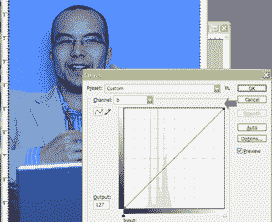
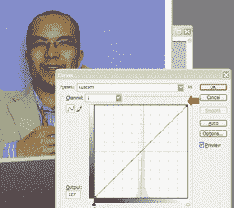
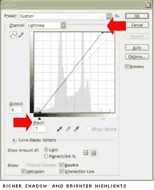
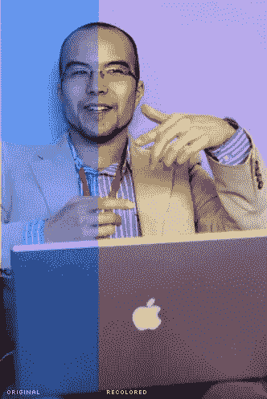

# 使用 Photoshop Lab Color 移除色偏

> 原文：<https://www.sitepoint.com/remove-color-casts-using-photoshop-lab-color/>

作为一名网页设计师，色彩校正是你很少实践的事情之一，所以我想我们可能会找到我更喜欢使用的快速且最简单的方法。

**** 让我们从一个问题开始。这是什么？(见右边的蓝筹股)。如果你说，“这是一种特别令人愉快的蓝色，”你至少说对了一部分。

然而，如果你说“卡梅隆·亚当斯脸颊的放大部分”，你就 100%正确了，因为，正如你在下面的照片中看到的，[穿蓝色衣服的男人](http://www.themaninblue.com/)就是这张照片拍摄当天穿蓝色衣服的男人*。*

这是一张很棒的照片，但当我使用它时，它出现了问题，因为它是作者拍在书的封面上的。虽然蓝色单独看起来很酷，但当它与一些正常的粉黄色作者照片放在一起时，就有点奇怪了。我需要调节蓝色色调(或者更准确地说是“ [cast](http://en.wikipedia.org/wiki/Colour_cast) ”)，但正如上面的芯片所示，有很多！

去年，你可能还记得我们使用 Photoshop 的 Lab 颜色模式给任何照片一个视觉上的刺激。

今天，我们将看看 LAB 在不破坏整体色彩平衡的情况下，对问题色彩进行极具戏剧性但极具针对性的修正的能力。

1).首先，我们需要将照片从默认的 RGB 转换到 LAB 色彩空间( **`Image/Mode/Lab Color`** )。请随意保存上面的图片，并在 Photoshop 中继续操作。

2).正如我在关于 Lab color 的第一篇文章中解释的那样，在 Lab 宇宙中，一切都可以用三个渠道来解释:

*   l–明亮与黑暗
*   a–红色与绿色
*   B——蓝色 vs 黄色(我记得“B”代表蓝色)

如果这些颜色中的任何一种开始主导一幅图像，恢复色彩平衡的最快方法就是增强其相反的颜色。

正如你在右边的截图中看到的，B 通道几乎所有的音调都集中在图表的蓝色(左手边)上。重新平衡这一渠道将大大有助于修复这一形象。

3).选中你的图像，调出曲线对话框( **`Image/Adjustments/Curves`** ，切换到 B 通道。

4).接下来，抓住图形的右上角(或黄色)并将其慢慢拖动到左侧，观察蓝色色板开始冲洗掉。

正如你在左边的例子中所看到的，虽然肤色开始立即变得清晰，但真正的蓝色和红色只受到轻微的影响。

5).好吧，肤色更好，但缓和蓝色带来了轻微的绿色色调。我们可以通过切换到 A 通道并稍微增加红色来解决这个问题。

你需要对这个通道有点敏感，因为卡梅隆背后的蓝色墙壁有相当多的红色，所以添加太多的红色会使背景变成紫色。

6).最后，我们将做最后的调整来清理 L 通道。

抓住线的每一端，慢慢水平滑回图表的中心线。

没有数学上正确的公式来放置你的点，但是:

*   你的阴影应该看起来更丰富，而不会太“块状”，或填充。
*   你的高光应该看起来更亮，在最亮的色调和次亮的色调之间没有明显的边缘或台阶。

当您对结果满意时，单击“确定”并随意将颜色模式切换回正常颜色模式(大概是 RGB 或 CMYK)。

我会在我们的成品上给你留下原始图像的覆盖图。对于两步过程(即改变颜色模式、调整曲线)来说，这是一个不错的结果。

##### 在设计视图#42 中发布

## 分享这篇文章