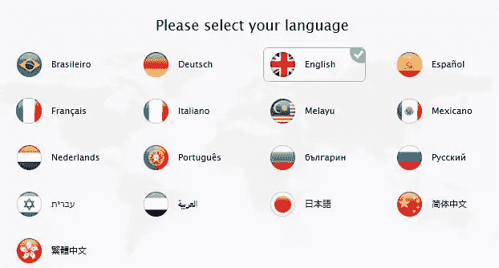
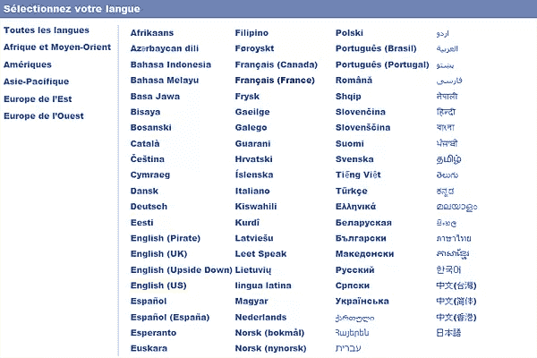

# 你如何在网络上表现一种语言？

> 原文：<https://www.sitepoint.com/representing-language-on-the-web/>

照片:托班 B.

互联网有点像一卷世界大小的胶带，以一百万种不同的方式把我们绑在一起。

虽然遥远的距离经常在网上消失，但一些全球差异更为根本。语言是一个很大的区别，可以说是我们本地化网站和应用程序的最重要的方式。

这就引出了一个重要的用户界面问题:“*你如何在网络上用图形表示一种语言？*

### 有什么问题？

乍一看，这似乎是一个荒谬的问题。使用标志来表示网站的语言似乎是显而易见的。但是仔细观察，我们会发现一些明显的问题。

国旗是代表一个国家或群体的图形符号，通常与一个独特的地理区域联系在一起。

用旗帜来表示语言的问题是，世界上许多国家有两种、三种甚至四种民族语言。

这意味着，举个例子，展示一面瑞士国旗并不是特别有用，因为瑞士承认德语、法语、意大利语和罗曼斯语为国语。即使是“玩数字游戏”和选择最常用的语言，也只会剥夺那些不说主流语言的当地人的权利。

出于同样的原因，语言也是跨国家共享的，所以新西兰人点击英国国旗就像巴西人点击葡萄牙国旗一样违反直觉。

### 有哪些替代方案？

从目前的情况来看，目前还没有任何被广泛接受的解决方案。当然，许多网站仍然使用标志来标注翻译选项，而其他网站则走上了不同的道路。虽然还不能确定哪种方法更好，但这是让更多人讨论解决这个明显问题的最佳方法的好方法。

我认为这篇文章是一个引发讨论的问题，也是一个答案。

### 解决方案 1:带缩写文本的标志

一种常见的变化是保留标志，但添加一个文本标签。这看起来是一个进步，因为它消除了访问者可能有的任何困惑。它还允许你保留一个图形，同时允许访问者毫不费力地识别他们的国家。

伴随着旗帜，你的首选语言的简单缩写可以放在你的图标旁边或下面。这让你不仅能够概括每个国家的一种语言。现在，您可以使用适当的缩写显示瑞士国旗，缩写包括 GER、FRA、ITA 和 ROM。这使得访问者可以用他们最熟悉的语言浏览你的网站，并且不会孤立任何人。

然而，这种方法有一些明显的问题，因为它假设所有语言都可以用两个或三个标志就绪字母缩写。

但是那些会说波斯语、阿拉伯语、泰语和泰卢固语的用户呢？你如何缩写那些？

### 解决方案 2:翻译图像

另一个解决方案是用旗帜图像来代替一些全新的东西，而不是显示一个图形来直观地传达翻译的概念。你可能对这种类型的设置很熟悉，因为像谷歌这样的网站已经在他们的[翻译页面](https://translate.google.com/)上这样做了。

这里你会看到字母表中的一个字母，通常是字母“A ”,然后用一个双向箭头连接到一个不同的符号。通常这个符号要么是汉字，要么是日文。理想情况下，这个图标可以通知访问者网站提供翻译服务，一旦点击，弹出的菜单会提示他们选择自己喜欢的语言。

虽然这确实是代替旗帜的一个更好的选择，但还是要考虑一些事情。虽然对大多数用户来说，按下按钮将显示其他语言选项是可以理解的，但有些人可能会假设，比如说，汉字字形将只提供日语翻译。

### 解决方案 3:纯文本

我们的第三个解决方案是完全抛弃图形，这可能是避免任何类型混乱的最明智的选择。

目前有很多网站都在使用这种方法，而且这种方法似乎越来越受到旗帜用户的青睐。或许可以有把握地认为，如果操作正确，这种方法产生的问题比标志少。

当只使用文本显示可用语言时，有各种选项可用。你可以使用下拉菜单，把你的语言选项放在屏幕的底部或者其他方式，这样它就可以很好的适应你的网站设计。

除了一般的读写问题之外，似乎没有其他问题可以理解为什么会出现这些语言。但是，您需要确保每个语言链接/按钮都是用目标语言编写的。

换句话说，“德语”应该显示为“德语”，而“西班牙语”应该显示为“西班牙语”。还要确保指出美国英语和英国英语之间的区别，即英语(美国)和英语(英国)。

### 解决方案 4:自动检测

最后但同样重要的是，你可以总是使用自动检测，而不是提示用户按下翻译按钮。这显然是一种技术解决方案，通常试图通过用户的浏览器设置来识别用户的语言。配置完成后，服务器将尝试自动以检测到的语言显示网站。如果没有可用的语言数据，它将退回到默认值。

脸书只是众多利用自动检测来提供更好的语言偏好体验的网站之一。

当然，自动检测无法确保其检测结果 100%准确。有时，访问者可能暂时在国外，或者只是使用不熟悉的浏览器，因此检测到的语言可能不是他们的最佳匹配。

自动检测是一个很好的第一猜测，但始终确保有一个可视的选项来更改语言以防万一。很少有比试图在一个你看不懂的网站上找到隐藏的语言控件更令人沮丧的任务了。

### 结论

这就是你要做的，四种可能的方法来解决旗帜语言的困境。

现在是你插话的时候了。你认为用图形表示一种语言的最好方法是什么？你有自己的解决方法吗？让我知道你在评论中的想法，并随时分享你可能遇到的任何网站翻译问题。

## 分享这篇文章