# 研究:设计师的第一步

> 原文：<https://www.sitepoint.com/research-first-steps-designers/>

*****在他的新书《性感网页设计中，埃利奥特·杰伊·斯托克分享了他用来创建令人惊叹的网页界面的方法——其中最重要的一步就是做一些研究。在书中的这个例子中，Elliot 探索了为你的下一个项目收集灵感和酷想法的不同方法。*****

我们受雇于一个活动发起人，为即将到来的网络行业专业人士的活动建立一个网站。目标是让游客购买一张“进入所有区域”的门票；当用户访问时，设计应该对他们有巨大的影响，界面应该是可用的和整洁的，他们应该对他们所看到的印象深刻。但是在我们考虑接触 Photoshop 之前，我们需要做一些研究。

让我们从第一个逻辑步骤开始，分析与事件相关的品牌价值。这些反过来将是网站需要传达的核心信息。假设我们向客户询问一些品牌价值，他们给了我们以下想法:

*   有趣和令人兴奋:不仅仅是一个会议
*   可信度:绝对专家的建议
*   发明和创新:一群有创造力的人接受新思想

这可能已经开始在我们的脑海中产生一些风格上的想法，但是让我们暂时把它放在一边。我们应该问自己:一个活动场所是由什么组成的？我们的客户尚未指定他们想要的实际页面，因此我们将通过头脑风暴来帮助他们:

*   首页:事件介绍；引导人们进入网站的其他部分
*   预订:出售门票类型
*   日程安排:了解活动详情
*   演讲者:对相关专家的简单一瞥
*   地点:活动地点和可用设施
*   赞助商:可能出现在侧边栏或页脚，而不是一个单独的页面
*   社区:聚会、社交网络链接、照片等等

让我们看看我们的网站想要传达的一些价值，并看看其他活动网站是如何做到这一点的。

##### 乐趣的元素

活动——或者更具体地说，我们喜欢在网络社区举办的活动——往往强调欢乐的一面。谁会想到人们喜欢和朋友、同事出去喝一杯社交酒呢？

有趣的元素是如此重要的一个卖点，所以在我们的网站上突出这一点是有意义的。虽然强调在这样的活动中可以获得的知识很重要，但我们都知道我们对聚会同样感兴趣！这就是为什么我们会建议我们的客户，应该用一整页的篇幅来专门介绍活动期间发生的社交聚会，用网站的图像描绘出一种有趣的、像聚会一样的气氛。

##### 庄严和权威

但是我们不能被这些有趣的说大话冲昏头脑。我们需要明确这也是一个可信的、严肃的事件。否则，代表们如何说服他们的老板从他们的培训预算中支付这笔费用？下面显示的 [Web Directions North](http://north.webdirections.org/) 的网站整洁、干净、有商业意义。

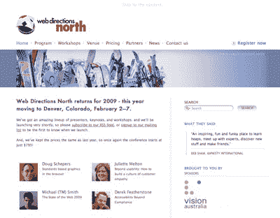

参加活动应该是一种教育经历，尤其是涉及到研讨会的时候。我们在下图中看到的[侧边栏工作坊](http://sidebarworkshops.com/2008/washingtondc/)网站很好地做到了这一点，它在页面顶部附近明确地陈述了你将学到的内容，同样在注册信息的正下方。除了突出的位置之外，文本也很短，容易消化:一个很好的，容易记住的大块带走。

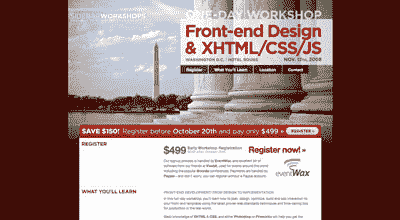

##### 发明和创新

我们的客户也希望我们确保设计能给人一种发明和创新的感觉。最能体现这个想法的一个方法是创造一个稍微打破常规的设计，无论是在颜色、布局还是字体方面。当我们四处寻找设计灵感时，我们一定会留意例证这一目标的例子。然而，真正尝试新事物的机会会在以后到来，那时是时候规划设计的美学了。

##### 实现平衡:信息和氛围

在传达正确氛围的同时平衡信息的展示是一个巨大的挑战。

当我设计 Web 应用的未来(FOWA)2008 年迈阿密站时，我试图两全其美，给网站一种有趣的感觉，背景是海滩，但前景是整洁有序的信息。您可以在图 1.3 中的时间表页面上看到这一点，其中明确划分了时间段和信息。我们决定，如果我设计一些图标来直观地指示每种类型的会话，会更有帮助；这样，用户可以清楚地看到这是一个演示，午休，还是一个聚会，等等。这使得我有机会在这个组合中加入更多的有趣的感觉，所以我加入了一些小家伙。

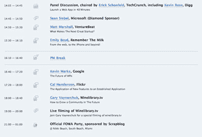

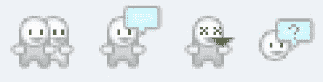

侧边栏的人在他们的研讨会网站上保持了时间表看起来相当有条理，如图 1.4 所示，但它看起来仍然很棒，是注意细节的一个很好的例子。

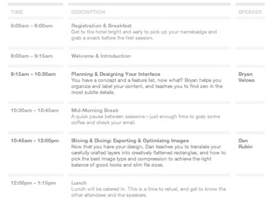

##### 什么最重要？

如果你想到什么是与活动相关的最重要的信息，你可能会说日期、地点和价格——但十有八九还有其他吸引潜在参与者的因素。

大多数活动的网站都认识到名人的吸引力，尽可能让他们的大牌发言人显而易见，就像下图所示的 [dConstruct](http://2008.dconstruct.org/) 。反之亦然:如果活动缺少很多网络名人，他们会淡化发言名单。有时，发言人名单过于庞大，以至于他们选择将其从主页上完全删除，而是专注于更一般的信息，正如下面的[西南偏南互动](http://sxsw.com/interactive/)主页所示。

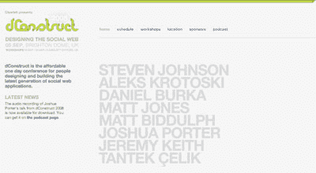

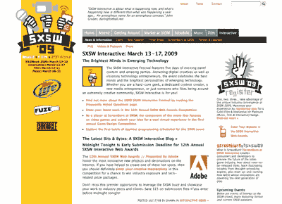

场地和位置有时会吸引代表。当这个地方也是像迈阿密这样的热门度假目的地时，你真的应该大声说出来。

##### 品牌一致性

品牌一致性的目标是在公司的所有通信中保持一致的外观、感觉和信息，包括其网站。根据项目的不同，你可能会发现自己处于许多潜在情况中的一种。让我们来看看。

##### 从头做起

如果活动的品牌尚未存在，那么我们的网站将提供一个定义的体验的开始，并作为其他活动的风格指南。请注意，限制可能仍然适用:这可能是第一次事件，但它可能应该与公司已经建立的概念相结合。这可能会转化为一个简单的动作，如将母公司的标志合并到页脚中，也可能会更复杂:可能会有一组我们必须遵循的特定的样式准则，如配色方案或字体。

##### 新设计

如果以前的网站设计存在，那么你应该保持一致性，但每个事件可以有自己的声音，或主题。您可以使用该网站的早期版本作为设计可重用元素的指南。也许你可以使用不同的调色板，但仍然保持类似的设计模板。

##### 搭售商品

您可能需要创建一个与之前建立的身份紧密关联的设计。下面的[一个与众不同的事件](http://aneventapart.com/)网站有自己的品牌，但是融入了与其姐妹网站[一个与众不同的列表](http://alistapart.com/)完全相同的外观和感觉。当一个子站点是由一个母公司创建的时候，你可能会发现，这两者并不仅仅是设计模式的小元素，而是被平等对待的:一个硬币的两面。

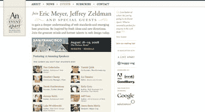

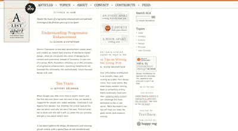

在我们的项目中，我们需要加入举办活动的组织的公司标志——但在实际的活动品牌推广方面，我们可以自由支配，因为这是第一次这样的活动(也就是说，第一个场景——从零开始——如上)。这将展示你如何在遵循一些指导方针的情况下发挥创造力。顺便说一句，指南是好的:它们消除了完全空白的画布的一些恐惧因素！

#### 灵感资源

到目前为止，我们一直在其他活动的网站上寻找灵感，但我们不必拘泥于这一领域。收集一流设计的例子并把它们存档在图片分享服务网站 Flickr 上已经变得非常流行。首先，看看[帕特里克·哈尼的大量收藏](http://www.flickr.com/photos/splat/collections/72157600060481506/)，以及他管理的[网页设计灵感 Flickr 库](http://www.flickr.com/groups/webdesign-inspiration/)。更多的 Flickr 资源，请查看 Vandelay Design 的 99 个 Flickr 群组列表，寻找设计灵感。还有许多网站存在，例如 [Smashing Magazine](http://www.smashingmagazine.com/) 和 [UI Pattern Factory](http://uipatternfactory.com/) ，它们是有趣设计范例的绝佳来源。

##### 氛围灵感

让我们了解一下我们希望我们的网站拥有的氛围——我们通过颜色、主题和纹理唤起的感觉。你可能熟悉情绪板的概念，它描述了图像、纹理的一般集合——几乎任何传达你想要实现的相同情绪的东西。让我们来看看木制这个术语:传统的情绪板可能需要，例如，从目录中剪下木制家具的图像，或者从杂志中剪下树木的照片，然后将它们放在画布上进行蒙太奇。

哦，顺便说一下，没有必要使用实际的电路板-任何表面(物理或虚拟)都可以！甚至有各种软件工具可以帮助你创建自己的情绪板，如果你想这样做的话。下图显示了在 Photoshop 中从公共领域和网络上的知识共享许可图像创建的情绪板。

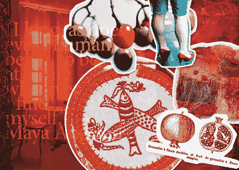

整理 Flickr 上的一组照片类似于创建一个情绪板，尤其是在[研究氛围](http://www.flickr.com/photos/elliotjaystocks/sets/72157612161024243/)的时候。我收集了一些，你会在下面看到。

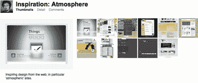

##### 构图灵感

我们的目标是创建一个独特而有趣的网站，将它与你每天看到的网站区分开来。一个值得注意的区别于其他网站的方法是考虑一个不寻常的组成或布局。为了创意的利益，我们需要冒一些风险，所以我收集了一些遵循相同原则的设计例子。当然，我们仍然会注意网站的可用性——坚持用户能理解的东西是很重要的——但是你会发现，即使是一点点跳出框框的想法也会大有帮助。这是我在 Flickr 上的作品:

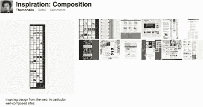

##### 功能灵感

我们的网站将包含许多功能元素，如导航机制、购票表单、时间表等等。看看其他设计师选择的实现这些元素的不同方式是很有用的。
[【克里斯·梅西纳】](http://factoryjoe.com/)多年来一直在 Flickr 上收集的用户界面(UI)设计的[例子，他的收集超越了纯粹的灵感，成为一种不可或缺的资源。你还会发现在](http://www.flickr.com/photos/factoryjoe/collections/72157600001823120/) [Pattern Tap](http://patterntap.com/) 上收集的大量 UI 示例，用户在这里收集、标记和评论来自网络各处的小部件。

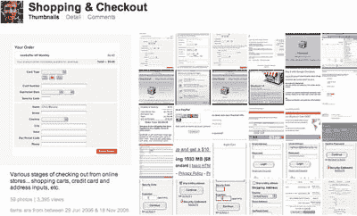

#### 看看网络之外

我坚信这样一个观点，如果你只是用网站来获得灵感，你只会建立一个看起来和其他网站一样的网站。当然这并没有错——网站看起来和行为起来都像网站是很重要的——但是如果你只在一个地方寻找刺激，你的设计就有变得陈旧的风险。

外面的世界充满了杰出的设计——建筑、时尚、产品、包装……为什么要把自己局限在一种媒介中，限制自己的创造潜力呢？带上你可信赖的相机去散步——收集标志、纹理和任何你感兴趣的东西的照片。每当你有一个有趣的想法时，就在笔记本上涂鸦。在你意识到之前，你会从现实世界中收集到大量鼓舞人心的材料。

如果你特别关注印刷设计领域，你会发现大部分网页设计的原则都在起作用。毕竟，网页设计的新学科来源于多年的印刷设计传统，但有一些限制和自由被扭转了。因此，我们仍然可以从印刷设计世界中获得大量的灵感，以更好地告知我们可以在网络上实现什么。我在另一个 Flickr 集合中收集了一些离线示例，如下所示。

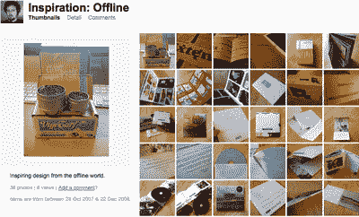

##### 收集工具

我一直在我的 Flickr 个人资料中保存有趣和鼓舞人心的片段，但这不是唯一的方法。

web 开发应用 RapidWeaver 背后的团队 RealMac Software 最近发布了一款 Mac 应用程序 [LittleSnapper](http://realmacsoftware.com/littlesnapper/) ，它可以让你从网络上收集灵感来源，并与你的同行分享。对于基于 Mac 的设计师来说，这是一个很棒的新工具，我强烈推荐。

对于 Windows 用户，TechSmith 的 [Snagit](http://www.techsmith.com/screen-capture.asp) 应用程序可以捕捉屏幕截图和屏幕图像，并提供一个库，您可以使用该库按标签、URL 和日期组织屏幕截图。

然后是适用于 Mac 和 Windows 的 Evernote，这是一个包罗万象的笔记应用程序，由于有桌面、手机和网络浏览器版本，你几乎可以从任何地方访问它。你可以创建、上传和保存图像、文本和音频，如果图像中包含文本，Evernote 的光学字符识别(OCR)引擎将识别它并使其可搜索。当您的 notes 档案变得相当大时，这非常方便！

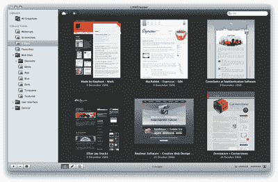

##### 研究:一个持续的过程

作为设计师，研究是最有价值的方式之一。睁大眼睛，敞开胸怀，尽可能让自己受到影响。最终，你做的研究越多，你的设计就越有可能成功。

***如果你喜欢埃利奥特·杰伊·斯托克的《T2》*性感网页设计* 的节选，那么你会喜欢[完整的样本章节](https://www.sitepoint.com/books/sexy1/)。更好的是，[买本书](https://www.sitepoint.com/books/sexy1/),现在就开始创建令人惊叹的网络界面。***

## 分享这篇文章