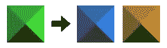

# “reskin able”SVG 符号:如何制作它们(..以及为什么)

> 原文：<https://www.sitepoint.com/reskinnable-svg-symbols-how-to-make-them-and-why/>


由于其文件大小、可扩展性和 CSS，SVG 在现代网页中的广泛采用在 2016 年确实有所增加。

它可以用于图标系统(看一看[构建你自己的 SVG 图标](https://www.sitepoint.com/build-svg-icons/))，尽管在某些情况下，图标字体可能更好(这里有一些信息:[图标大辩论:字体 Vs SVG](https://www.sitepoint.com/icon-fonts-vs-svg-debate/) )。

但是 SVG 也可以用于徽标或图形元素(至少不会过于复杂)，它天生的灵活性使它成为响应式网站的完美解决方案(看看 Sara Soueidan 的[用 CSS](http://tympanus.net/codrops/2014/08/19/making-svgs-responsive-with-css/) 制作 SVG 响应式)。

SVG 的使用使得通过 CSS 定位和改变整个元素的大小和颜色成为可能，但是，除非你的 SVG 代码嵌入到你的 HTML 页面中，**你不能用这种方式修改它的一个部分**。

## 问题

让我们看一个更简单的例子。这里我们有一个图像，我们需要在一个颜色范围内显示。



当然，传统上我们会简单地创建三个独立的图像——每个都有不同的*风格*。但是，如果我们想使用一个 SVG 文件并在渲染时对其进行样式化呢？

此外，有没有一种方法可以让我们的图像成为一个' [SVG 符号](http://tutorials.jenkov.com/svg/symbol-element.html)，以利用浏览器缓存？

我将把这称为一个“*可重新生成的* SVG 符号”——SVG 图像的“骨骼”保持不变，但很容易改变表面外观。

完美的解决方案是通过 CSS 选择器访问符号元素，并向它们添加一些规则(与我们在嵌入式 SVG 中使用的方法相同)。

在下面的示例中，我已经为每个三角形添加了一个类(`top`、`right`、`bottom`和`left`，将图像排列为一个符号，并尝试通过 CSS 对其进行修改，如下所示:

```
.top { fill: #356BA5; }
.right { fill: #357FD9; }
/* and so on... */
```

不幸的是，目前这只适用于 Firefox，如下面的代码所示。第二张图片仅在 Firefox 上显示为蓝色(为了方便起见，我在笔中嵌入了符号代码，但我们对外部 SVG 文件也有相同的结果)。

参见 [CodePen](http://codepen.io) 上马西莫·卡珊德拉([@马西莫-卡珊德拉](http://codepen.io/massimo-cassandro))的 Pen [svg 元素编辑(演示 1)](http://codepen.io/SitePoint/pen/kkvAgr) 。

参见 [CodePen](http://codepen.io) 上马西莫·卡珊德拉([@马西莫-卡珊德拉](http://codepen.io/massimo-cassandro))的笔 [SVG CSS 样式(演示 1)](http://codepen.io/SitePoint/pen/yapRgy/) 。