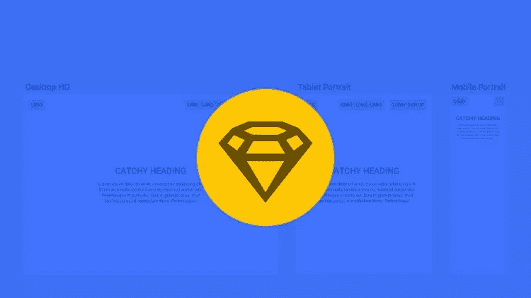
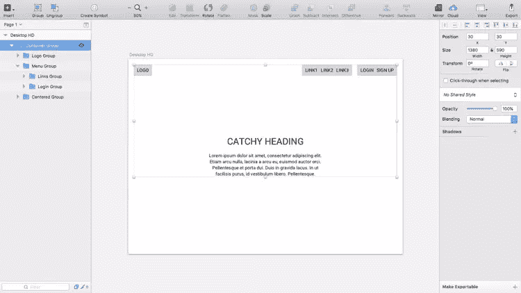
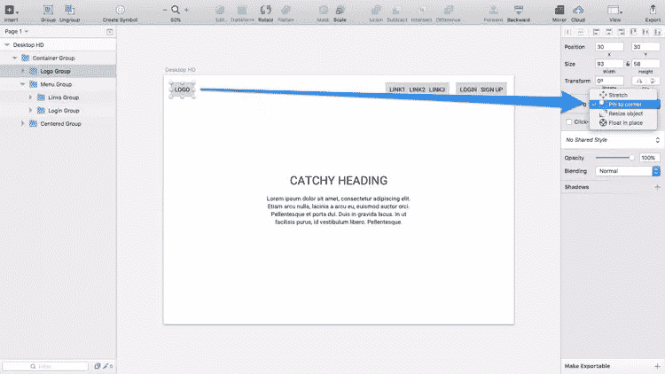
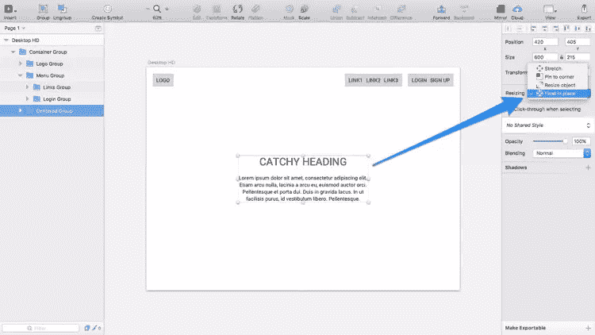
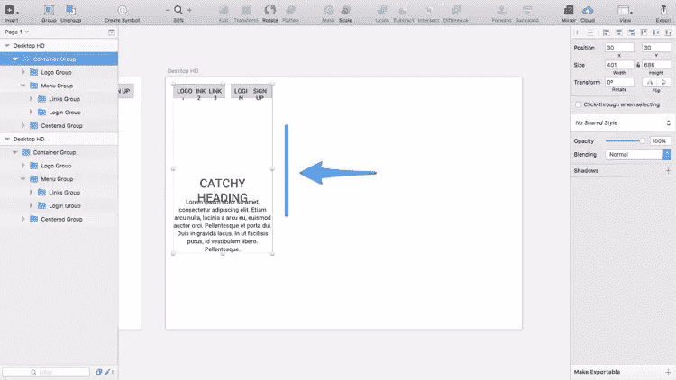
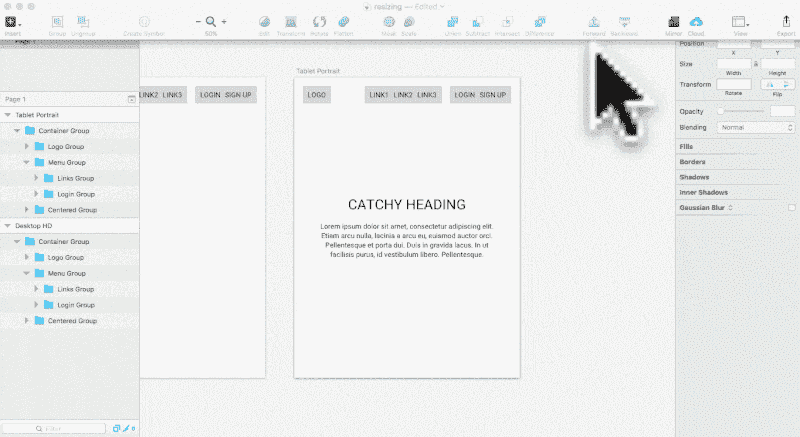
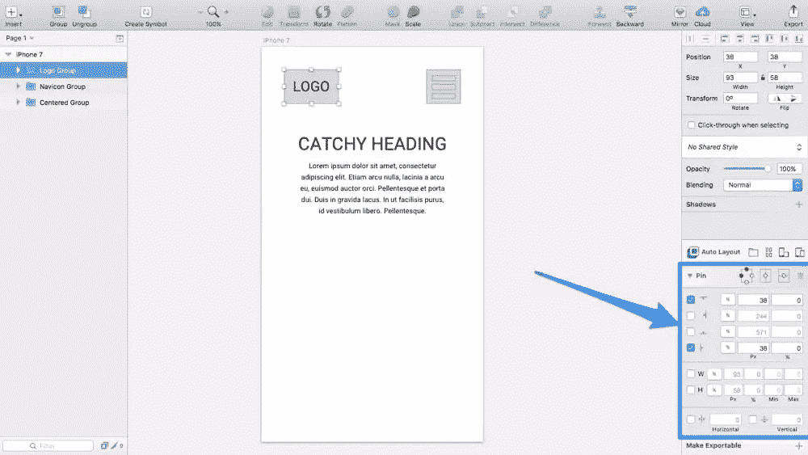
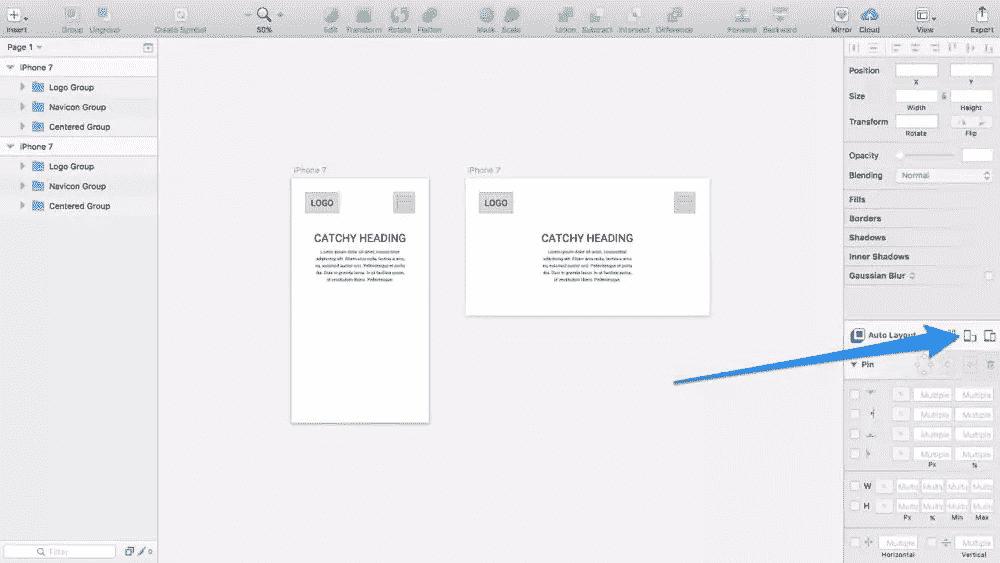
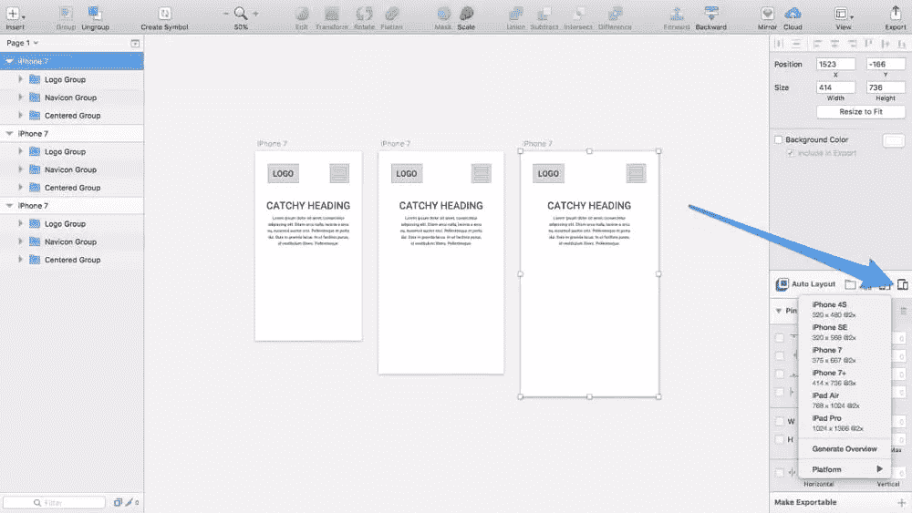
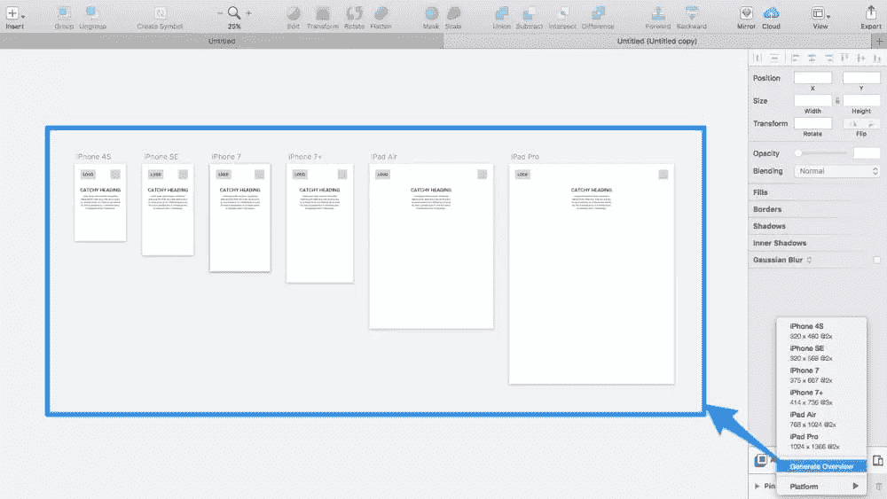

# 草图中的响应式设计:群组大小调整与自动布局插件

> 原文：<https://www.sitepoint.com/responsive-design-in-sketch-its-finally-here/>

我们在 2017 年 4 月更新了这篇文章，以便我们可以将 Sketch 的响应式设计功能与广受好评的自动布局插件进行比较。

欢呼吧，各位素描用户！Sketch 39 最终让我们有能力创造出真正流畅的布局。流体布局是这样的布局，当视口/浏览器的大小改变时，其单个元素可以自动调整大小，浮动到一边，或者保持固定不动。⏤响应设计的基本概念来自流体设计。

在 Sketch 中，流体设计被称为组调整大小，为 Sketch 提供类似于[流体插件的功能；最重要的区别是群组大小调整是*固有的*特性，因此在提供几乎相同功能的同时提供了更简化的用户体验。群组调整是这里最明显的赢家！](https://www.sitepoint.com/how-to-create-responsive-layouts-in-sketch-using-fluid/)

然而，素描迷们一直对这个用于素描的[自动布局插件赞不绝口。显然，自动布局本身并没有提供流体设计功能，但它看起来是这样的，并且由于它的一些附加功能(例如切换画板方向的能力，以及快速将 iPhone 7 画板转换为 iPhone 6 画板的能力(这对于测试通用应用程序的响应能力非常有用)，它实际上提供了比调整组大小更快的工作流。](https://animaapp.github.io/Auto-Layout/)

那么，调整组大小和自动布局插件哪个更好呢？嗯，我使用原生组大小调整功能模仿更小、更概念性的想法，但当我需要处理更大的东西时，我使用自动布局插件(稍微不太原生的体验是对它带来的额外功能的公平权衡)。

让我们参加一个在 Sketch 中设计响应式布局的速成班，因为我们学习了组大小调整和自动布局，因为它们都很棒，并且可以同时安装！

## 为什么要设计响应式布局？

在开始设计高保真原型之前，能够测试粗略的响应布局*减少了以后遇到挫折的可能性(挫折是因为没有在所有屏幕尺寸上测试你的概念)。事实上，在你开始接受反馈之前，采取移动优先的方法进行低保真度原型制作，可能是验证你的想法并为设计提供响应性解决方案的最佳(也是最安全的)方式。*

流体设计当然不会考虑你在调整设备屏幕尺寸时想要隐藏(或改变，视觉上)的元素，但它确实意味着 Sketch 中的组突然变得更加有用。虽然不是 100%的响应式设计，但也够接近了。

群组现在可以在不缩放其中所有对象的情况下调整大小，这对于您需要复制移动画板并将其放大时非常理想(因为移动优先！)到桌面画板。例如，你的 logo 需要留在左上角，你的菜单需要留在右上角，你的主要内容会均匀地浮动在屏幕中央。群组大小调整和自动布局实现了这一点。

让我们先来看看组大小调整。

## 步骤 1:低保真度原型制作

在添加颜色、字体和其他视觉美感之前，最好先设计一个低保真度的概念模型。低保真度的设计可能快得惊人；它不需要占用你太多的时间(事实上，从长远来看，它可能会为你节省一些时间，因为你可以带着你的概念*起作用的平和心态继续前进*。

对于画板，按下 **A** ，然后从检查器中选择“桌面高清”画板。

使用文本和形状的模糊组合在画板的左上角设计标识，就像创建简单的线框一样。对右上方的菜单和居中的标题+文本组合重复这些步骤(没什么特别的，我们只是在尝试一个想法)。之后，将所有的标识层组合在一起，然后是所有的菜单层，然后是所有居中的内容层，最后将所有组的**组合成一个组。**

快速参考:

*   矩形:R
*   椭圆形:0
*   正文:T
*   群组:Command+G

## 步骤 2:将调整大小规则放置到位

### 固定并拉伸

现在，我们在这里定义画布对象的位置。当然，徽标需要保留在左上角，所以从检查器的“调整大小”选择框中选择“固定到角落”，其中相关的角落也是层最近的角落(您可能已经注意到第一个选项是“拉伸”⏤，这是调整组大小时的默认行为，您一直都很熟悉的行为)。

对右上角的菜单重复此步骤。

### 调整对象大小

我花了一段时间才意识到“调整对象大小”是如何工作的。它不会相对缩放图层，它缩放图层的量与您缩放包含图层的组的量相同。

这是…非常规的，但是，幸运的是，我们在本教程中不需要它。

### 原地漂浮

“原地浮动”确实如你所想的那样。它在调整大小时保持层对齐，但是，它对于水平或垂直居中层特别有用，所以让我们对居中的内容也这样做，以保持它水平对齐。

下一步，我们将调整组的大小来测试它的响应性，并使用该信息来确定响应断点应该在哪里；这些断点决定了为了更好的用户体验，设计需要调整哪个屏幕尺寸。

复制画板，并开始调整组的大小。

## 步骤 3:为响应测试调整组的大小

在调整了组的大小后，这个设计就不再有意义了。在这种情况下，徽标和菜单开始重叠，中间的内容对于这样一个小屏幕⏤来说感觉太大了。这意味着我们已经到达了一个断点，现在我们需要调整我们的布局。

从图层列表中选择画板，并在*检查器*中单击“调整大小以适合”按钮，然后将画板放大到下一个常用屏幕大小，即*响应式网页设计→平板电脑纵向*。

然后，您可以更进一步，在移动设备上进行测试，或者，您可以颠倒这些步骤，采用移动优先的方法(推荐)。正如你所看到的，这个设计需要在移动设备上进行重构，以提供更好的用户体验，因此需要将菜单转换为导航图标。

然而，由于组大小调整已经为我们保持了布局的一致性，剩下要做的就是线框化导航图标并改变居中元素的字体大小。如此简单！

调整布局以适应移动屏幕

## 群组调整大小与自动布局插件

那么，自动布局与调整组大小有什么不同呢？首先，自动布局驻留在检查器中一个可爱的小框中，这使得自动布局*感觉*像一个原生功能。其次，如果您选择“Pin”下拉菜单，您将看到所有您已经熟悉的使用组大小调整的功能。在这里，您可以将一个元素固定到一个角上，垂直对齐一个元素，或者用*百分比*指定一个元素的宽度。相当标准的东西，到目前为止与组大小调整没有太大区别。

### 方向和画板大小

让我们来看看 Auto Layout 真正的亮点在哪里。点击设备方向图标可以在“纵向”和“横向”模式⏤之间快速切换，而群组调整大小*和自动布局一样，让我们可以创建流畅的设计，自动布局让我们只需点击一下就可以切换方向。*

在这里，我复制了画板，这样你可以看到两个方向并排。

接下来，让我们将画板从 *iPhone 7* 转换为 *iPhone 7+* 和 *iPhone SE* 。同样，我复制了画板，以便您可以并排查看比较。

### 生成所有屏幕尺寸的概览

实际上，当您在不同大小的设备中测试流体设置时，您将始终使用同一个画板，来回转换同一个画板。也就是说，如果您需要立即在所有尺寸的设备上看到您的设计(也许您希望导出画板，以便向您的团队演示该设计在所有屏幕尺寸上的外观)，只需选择“生成概览”选项。

## 结论

在我理解它对于创建和测试流体布局是多么有用之前，我只使用了一小会儿组大小调整功能，直到今天，我仍然使用它来快速可视化一个响应概念。对于需要在各种设备中测试的更深入的模型，自动布局可以帮助您切换画板大小(和方向),以便在几秒钟内进行快速测试。另外，当[与 Slinky Sketch 插件](https://blog.mrdaniels.ch/warz/designing-emails-in-sketch/)结合使用时，您还可以创建(并导出)HTML 格式的回复邮件！

## 分享这篇文章