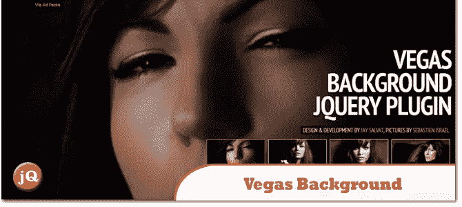
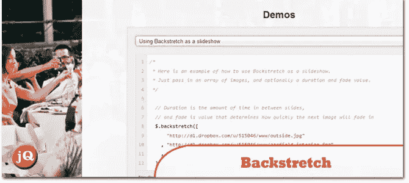
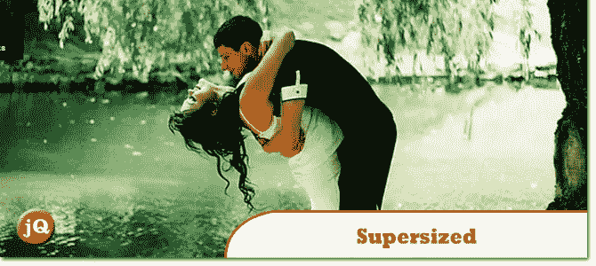
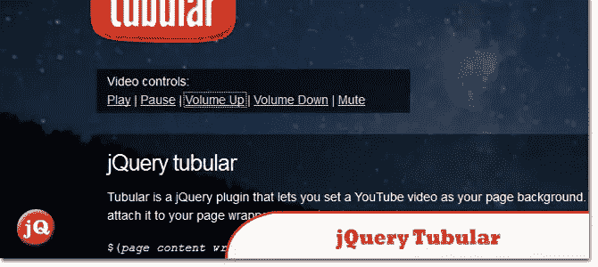
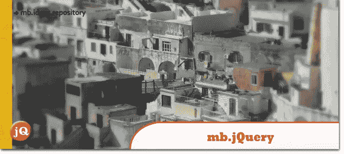

# 5 个 jQuery 响应全屏背景图片插件

> 原文：<https://www.sitepoint.com/responsive-fullscreen-background-image-plugins/>

随着越来越多的网站将它们的图片展示为全屏背景，我整理了一个我认为最好的 5 个 jQuery 响应全屏背景图片插件的快速列表。创建一些美丽的响应背景，幻灯片，过渡和更多。如果你不需要 jQuery 的话，我已经提供了一个 CSS 背景图片的链接。尽情享受吧！:)

**相关帖子:**

*   [**5 jQuery 后台视频插件**](http://www.jquery4u.com/media/background-video-plugins/)

## 1.Vegas 后台 jQuery 插件

Vegas 是一个 jQuery 插件，可以给你的网页添加漂亮的全屏背景。你甚至可以制作出令人惊叹的幻灯片

 
[来源](http://vegas.jaysalvat.com/) [演示](http://vegas.jaysalvat.com/demo/)

## 2.非终点直道

一个简单的 jQuery 插件，允许你在任何页面或元素上添加一个动态调整大小的，支持幻灯片显示的背景图片

 
[源+演示](http://srobbin.com/jquery-plugins/backstretch/)

## 3.超大 jQuery 插件

jQuery 的全屏背景幻灯片插件

 
[来源](http://buildinternet.com/project/supersized/) [演示](http://buildinternet.com/project/supersized/slideshow/3.2/demo.html)

## 4.jQuery 管状

Tubular 是一个 jQuery 插件，可以让你将 YouTube 视频设置为页面背景。只需将其附加到页面包装器元素上，设置一些选项，就可以了。

 
[源+演示](http://www.seanmccambridge.com/tubular/)

## 5.mb.jquery

在你的页面中添加额外内容或导航工具的好方法。

 
[来源](http://pupunzi.com/#mb.info/info.html) [演示](http://pupunzi.com/mb.components/mb.bgndGallery/demo/demo.html)

## 仅 CSS 技术

如果你想得到我的好朋友克里斯[的帮助，还有一个只有 CSS 的技术来源](http://css-tricks.com/perfect-full-page-background-image/) [演示](http://css-tricks.com/examples/FullPageBackgroundImage/progressive.php)。

## 分享这篇文章