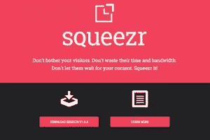
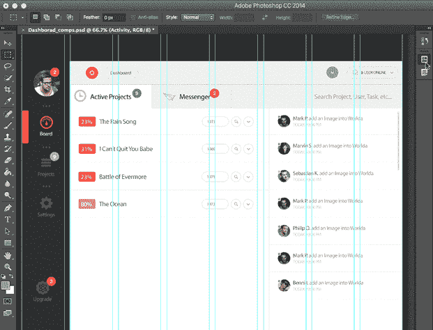
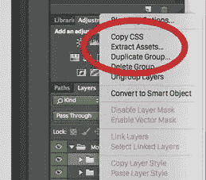
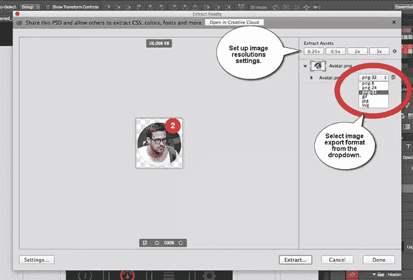
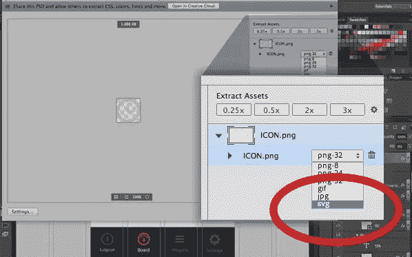
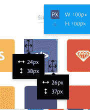

# 使用 Photoshop CC 2014 生成响应迅速的图像资产

> 原文：<https://www.sitepoint.com/responsive-image-assets-photoshop-css-2014/>

*本文由 [Adobe](http://www.adobe.com/products/photoshop.html?sdid=KQYQW) 赞助。感谢支持 SitePoint 的赞助商！*

[摄影:安迪施菲尔德](https://www.flickr.com/photos/andyschofield/4987310357/)–[cc](http://creativecommons.org/licenses/by-nd/2.0/)

### 合适设备的合适资产

五年前，网络是一个更加可预测的地方，不是吗？

作为 web 开发人员，我们可以合理地期望 web 浏览器不窄于 640 像素，不宽于 1240 像素——这就好像我们的“互联网高速公路”只与家用轿车的*一起通行。*

 *我们当前的现实是一幅非常不同的画面。

今天，移动用户通常占我们流量的一半以上。事实是，2014 年“我们的高速公路”上的 ***摩托车*** 与轿车和卡车一样多。

那么，为什么我们仍然在所有这些大相径庭的设备上加载相同的“家庭大小”的图像呢？

### 但这真的重要吗？

上个月，Tammy Everts [发表了一些关于网站性能对用户行为影响的令人清醒的数据](http://www.webperformancetoday.com/2014/10/30/scary-ecommerce-web-performance-infographic/)。它们包括:

1.  慢速网页每年导致超过 30 亿美元的销售损失
2.  44%的购物者将缓慢的表现解释为*“出问题了”*
3.  交易过程中 2 秒钟的延迟= 87%的购物车放弃率

Tammy 的数据告诉我们，向婴儿大小的设备发送缓慢的家庭大小的图像不仅仅是不礼貌的——它实际上在耗费我们的客户和金钱。通过根据每台设备的限制定制我们的图像，我们可以更快地交付页面，同时节省带宽成本，这是一个双赢的局面。

#### 传递正确的图像

已经有许多用于向设备传送自适应图像内容的既定方法。当前的最佳选择是:

Squeezr.it

*   Adaptive-images.com:马特·威尔库克斯的解决方案是目前许多开发者的最爱。它与设备无关，并且是移动优先的，尽管它通常需要一些 Apache 和 PHP 设置知识。
*   Squeezr 深受自适应图像的启发，但更倾向于客户端策略来确定断点并对其做出反应。

不要害怕:这两个都是很好的解决方案，但是我们今天不会关注它们。相反，我想看看问题的另一部分:图像资产。

我们如何生成所有这些不同的图像资产？

Adobe 对这个问题进行了大量的思考，并在 Photoshop CC 2014 中显示出来。他们提供了一套旨在提供帮助的工具，有些是新的，有些是旧的。

这里有一些开始使用响应式图像的技巧。

## 技巧 1:将所有图像作为智能对象嵌入

SmartObjects 并不新鲜——自 2005 年以来它们就存在于 Photoshop 中——但它们已经成为响应式设计的核心工具。SmartObjects 总是保持一个到它们的原始图像状态的引用链接，即使我们已经对它们应用了破坏性的变换。

例如，在大多数情况下，多次重新缩放图像会在每次迭代中降低图像质量。然而，SmartObjects 会将每个新的变换应用到*原始*图像状态，而不会损失图像质量。

这使得您几乎可以不费吹灰之力地将所有高分辨率图像资源(头像、背景、照片等)转换为 SmartObjects，从而开始您的项目，让您可以毫无顾虑地调整它们的大小、旋转、变换和重新定位。

将任何层转换为 SmartObject 非常简单，只需右键单击并选择“*转换为 SmartObject* ”。

## 技巧#2:利用图层构图

在响应式设计时代，***布局*****变成了*布局***。我们需要一种方法来管理两个、三个或更多位置和大小的相同页面元素。****

 ****这正是“图层复合”的设计目的。把每个新的“图层构图”想象成你的图层面板在特定时刻的“快照”。然后，只需在“图层复合”面板中单击一下，就可以随时返回到该快照状态。

实际上，这通常意味着构建您的移动布局(首先是移动)，然后将其采集为新的图层复合。然后，您可以开始重新设计平板电脑的布局，并再次将其采集到另一个图层复合中。

图层组合在运行中

“图层复合”面板允许您通过单击在这些状态之间即时切换。图层复合减少了图层面板中的重复，并从整体上简化了项目文件。

## 技巧 3:忘记“保存为网页格式”–使用“提取资产”

我必须承认，我一直很喜欢 Fireworks 的图像导出面板。Photoshop 有图像准备作为一个单独的应用程序，并有自己内置的“保存为 Web 格式”功能，但对我来说，这两者都不如 Fireworks 简单、强大或快速。

从“层”面板内部启动“提取资源”面板。

Photoshop CC 2014 采用了一种全新的、经过大幅改进的图像导出方法——一种新的“提取资产”功能。让我们仔细看看。

[提取资产](http://adobe.ly/1FJ0Vsu)面板将针对您在图层面板中选择的任何图层。理论上，这可以是单一层、所有层或其间的任何组合。

您可以从两个地方启动这个新面板:

1.  右键单击任何层并选择“提取资产”
2.  或者从“文件”菜单中选择“提取资产”

让我们看看新的“提取资产”面板。

层可以以六种图像格式中的任意一种导出:

1.  PNG8
2.  PNG24
3.  PNG32
4.  使用 jpeg 文件交换格式存储的编码图像文件扩展名
5.  GIF 格式
6.  SVG(是的。稍后将详细介绍)

您还可以选择同时生成多达八种不同分辨率的图像，分辨率从 25%到 400%不等。Photoshop 还可以让您轻松地自动为每个文件名添加前缀，并导出到合理的文件夹名称。

您甚至可以将其设置为在更新原始文档时自动重新生成整个文件集。不难看出这会节省多少时间。

请注意，如果您对当前的工作流程感到满意，经典的“保存为 web 格式”选项仍然可用。然而，我怀疑大多数人会看到新功能的强大和灵活性。

## 技巧 4:尽可能使用 SVG

SVG 已经成为 2014 年热门的网页设计趋势之一，所以看到 Photoshop 支持 SVG 是一件令人兴奋的事情。矢量非常适合响应式设计，因为它们提供微小的文件，可以在不损失图像质量的情况下立即重新缩放。

从纯实践的角度来看，使用 SVG(如果可行的话)意味着您只需要为所有分辨率管理一个文件(不包括为老客户提供的[回退)。](http://blog.fynydd.com/support-svg-in-older-browsers-with-png-fallbacks/ "Support SVG in Older Browsers with PNG Fallbacks")

Photoshop 中的 SVG 导出工具

虽然 Photoshop 允许您将任何图层导出为 SVG，但基于像素的图像元素不太可能产生良好的效果。任何基于路径的图形——包括徽标、图标、遮罩和其他形状——都可能是 SVG 导出的理想选择。

## 技巧 5:不要忘记创意云资产

与 PSD 合作的一个新的附带好处是 Adobe 的新在线服务。将你的 PSD comps 同步到 [Creative Cloud](https://assets.adobe.com/files) 可以解锁一系列方便的技巧。[我在上一篇文章](https://www.sitepoint.com/adobe-extract/)中对此做了更详细的介绍，但重点是:

#### 轻松与客户分享您的 PSD

通过浏览器提取资产。

忘记发送 JPEG 图片给客户审阅吧。Creative Cloud 允许他们在浏览器中实时查看和评论您的 PSD comps。没错——他们不再需要 Photoshop 来审核 PSD 了。

#### 将 PSD 分发给外部承包商

外部承包商可以直接使用最新版本的资产，直接使用浏览器导出资产。

#### 为同事提供提取资产的权限

您现在有一个简单的方法来与您的团队共享版本管理的 PSD。他们甚至可以从你的 PSD 中提取 CSS、图像和其他资源，而不需要安装自己的 Photoshop。

任何拥有免费 Adobe 帐户的人都可以使用这项服务。

### 总结

生物多样性是个好东西！我们的浏览器生态系统——手机、平板电脑、笔记本电脑、台式机甚至电视——丰富多样，未来几年只会变得更加多样化。这使得我们的工作既困难又有趣。

响应式网页设计告诉我们,“页面”实际上已经变成了一个“T0”页面家族,“T1”页面——爸爸页面、妈妈页面和一些婴儿页面。出于同样的原因，*的形象*也成为了*的形象家族*。

[Photoshop CC 2014](http://www.photoshop.com/products/photoshop "Photoshop CC 2014") 现在为生成那些“图像族”提供了一个相对无痛且快速的工作流程。

看看这个。

## 分享这篇文章*****