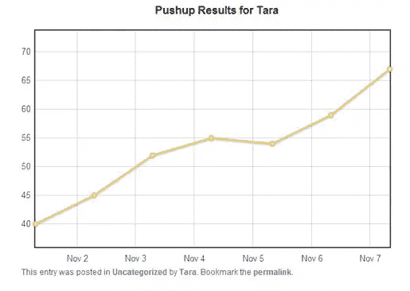

# WordPress 中的响应性实时图表:处理数据

> 原文：<https://www.sitepoint.com/responsive-real-time-graphs-in-wordpress-dealing-with-data/>

这是我写的一个特别的帖子，只是为了帮助那些努力让你的图表正常工作的人。

我首先讨论 PHP 和 MySQL。如果您真的很难读完本系列的这些部分，请花些时间来回顾这一部分。有些是在重复以前的章节，但是现在你已经真正做到了，你可能会对这个过程是如何工作的以及为什么工作有一些顿悟。

接下来，我将介绍一些基本的故障排除。你们中的许多人会发现自己盯着一个空白的屏幕。这通常是由于我们可以解决的几个非常具体的问题之一。

在本系列的最后一部分，您将真正了解如何使用我们自己的品牌颜色、阴影和其他调整来设计图表的样式。

### **PHP/MySQL 初学者技巧:**

如果你是 PHP 和 MySQL 的新手，你可能想知道那些带美元符号的单词是什么意思。如果您将这段代码粘贴到一个支持代码检查的编辑器中，您会看到它将这些单词变成了不同的颜色。

这些都是变量，是 PHP/MySQL 难题的关键部分。让我们看看$wpuser 变量。在该文件的顶部，我们通过一小段歌舞来查找谁是当前登录的用户。简而言之，等号左边的变量“得到”等号右边的任何东西。

所以$current_user 变量“获取”当前用户使用 WordPress–WP _ get _ current _ user()内置的代码登录的任何内容；。这段代码在一个数组中返回大量信息，看起来像一个信息表。该数组中的一行是用户的登录 ID。

因此，我们能够使用代码$current_user->user_login 为$wpuser 分配登录 ID。您可以为它分配其他一些东西，但是我们现在只需要 user_login。

变量是在 PHP 内传递信息的最安全的方式。您可以在函数外部传递变量，以便其他代码可以使用它——甚至是 JavaScript！

### 将函数添加到插件文件

如果您遵循了本系列前面的部分，那么您可能已经完成了这一部分。在 WordPress 中，进入你的“插件”>“编辑器”，选择 Flot for WordPress 作为你想要编辑的插件。

同样在以前的文章中，我们创建了一个简单的表单，用于使用 phpMyAdmin 向自定义表格添加内容。我把那个 PHP 文件放在这里了。在文件底部添加 include 调用:

[sourcecode language="php"]

/*
这里是你添加自定义文件的地方，用于提取和添加数据
记住，你不能使用 URL 指向任何你想
包含的文件。你必须使用路径。所以你可以把这些文件放在 WP 安装中任何你想放的地方，只要用一个路径指向它们。
plugin _ dir _ PATH 调用将使用 WP wp-content/plugins
文件夹中的路径:http://codex . WordPress . org/Function _ Reference/plugin _ dir _ PATH
*/
include(plugin _ dir _ PATH(_ _ FILE _ _)。flot/custom _ workout . PHP’)；
包含(插件目录路径(__ 文件 _ _)。flot/pushops _ results . PHP’)；

[/sourcecode]

我们已经有了 custom_workout.php 文件，所以只需为 pushups _ results.php 文件添加 include。现在，你所要做的就是把 short code[pushoups _ results _ sc]放到你想要的任何地方，你就完成了！

### 解决纷争

你们首先会碰到的是一个巨大的空白屏幕。首先要检查的是，占位符 div 被包装在一个定义了高度和宽度的 div 中。定制这个来适应你的文章宽度。但是，如果你看到一个空白的屏幕，这通常是罪魁祸首。

这里我没有花太多时间来讨论 pushups _ results.php 文件的细节——用于显示图形结果的代码。我希望你浏览一下评论。即使是开发新手，除了我在这里和代码注释中提到的内容之外，你也应该有足够的信息来搜索答案。

从不同的数据集开始绘制数据并不太难:

1.  插入您自己的数据库连接信息
2.  更改查询以匹配您的数据库
3.  更改 JavaScript 中的变量以匹配您的数据库调用

就是这样！冲洗并重复你能想象到的所有图表。

### 完善功能

我做了一个工具，让用户能够删除记录，我想把“添加俯卧撑”功能与图形结合起来。因此，请执行以下操作来快速添加一个完整的俯卧撑追踪器工具:

1.  创建一个新帖子，命名为俯卧撑跟踪者
2.  将以下短代码添加到帖子中:
    1.  [俯卧撑 _sc]
    2.  [俯卧撑 _ 结果 _sc]
    3.  [俯卧撑 _ 记录 _sc]
    4.  发布它

*   从我提供的资源文件中，上传 pushups _ records.php 和 delete _ pushups.php 到 WP-content/plugins/flot-for-WP/flot 文件夹*   转到 WordPress 中的“插件”>“编辑器”，在底部添加下面的 include 语句，另外两个已经在那里了:
    *   包含(插件目录路径(__ 文件 _ _)。flot/pushops _ records . PHP’)；*   导航到俯卧撑跟踪站，看看它的好处！

我真的很高兴看到你们所有人想出的东西！不要忘记，您可以从任何地方调用数据来使您的图表工作。真的只是被你的想象力限制了。查看 pushups _ results.php 文件，了解一种将数据放入页面并调用 Flot graphs 的方法。

现在前进，让数据变得有趣。你有这个能力！

在本系列的最后一节，我将详细介绍如何定制图表，以便您可以将颜色和其他设计元素与您的品牌相匹配。Flot 有很多定制图表和图形的功能，但是它们不是很直观。这就是我来帮忙的地方！

## 分享这篇文章