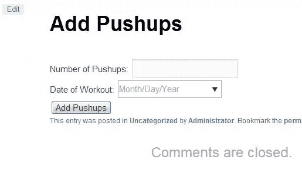
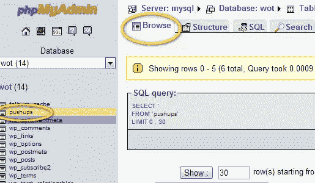

# WordPress 中的响应性实时图形:表单处理

> 原文：<https://www.sitepoint.com/responsive-real-time-graphs-in-wordpress-form-processing/>

在本系列中，我们一直在构建创建令人惊叹的实时图形所需的功能。到目前为止，我们已经完成了以下工作:

### 第一部分

1.  我们加载了一个基本插件来加载我们的图形库
2.  我们通过 FTP 上传了一个空白的 PHP 文件
3.  我们告诉 WP 如何找到我们定制的 PHP 文件
4.  我们熟悉了初学者的管理功能

### 第二部分

1.  我们创建了一个带有占位符短代码的空白帖子
2.  我们告诉了 WordPress 你的短代码
3.  我们创建了一个数据库表来收集数据

在本系列的这一部分中，将创建一个开始收集数据的表单。如果您的数据库中已经有了大量数据，您可能仍然希望简单地回顾这一部分，跳到本系列的下一部分，在那里我们查询数据库并为我们的 graph 插件格式化数据。

对于初学者来说，当您开始将数据输入数据库时，本文将是一个极好的资源。出于教育目的，我坚持使用简单的锻炼跟踪器，但这可以适用于任何情况。

### 步骤 1:为俯卧撑创建一个表单

现在，如果您以前从未使用过 phpMyAdmin 或任何其他数据库，那么在完成最后一步后，您可能会感到有些不确定。嗯，这是意料之中的。但是，你要鞭策自己，不断学习！到目前为止，除了一个空白的短代码和一个空的数据库表，您什么也没有得到。但是，您距离那些实时图表如此之近，而您却不知道！所以，让我们敲出一个创建俯卧撑锻炼记录的简单表格。

在“插件”>“编辑器”中打开 custom-workout.php 我们将为俯卧撑功能添加一些功能。如果你已经跟上了，现在我们在俯卧撑函数中只有一个语句。我希望您用以下代码替换文件的所有内容:

[sourcecode language="php"]

函数俯卧撑(){

get _ currentus erinfo()；
$ current _ user = WP _ get _ current _ user()；
$ WP user = $ current _ user->user _ log in；
$currentpage = $_SERVER['请求 _ URI ']；

echo ' [登录](’. wp_login_url() . ‘)开始添加俯卧撑！'；
echo '
a href = " '。' home_url()。'/wp-register.php" >如果您还没有注册< /a >。
’；
呼应'<形成动作= '。'插件 _url( $path)。'/flot-for-WP/flot/add _ pushops . PHP " method = " get " id = " add _ pushops ">'；
echo ' < label >俯卧撑次数:</label><input type = " text " name = " pushoups _ count "/> '；
echo ' < label >健身日期:</label><input type = " Date " name = "俯卧撑 _ Date "/> '；
echo ' <输入 type="hidden" value= " '。$wpuser。" name = " pushops _ WP user "/>'；
echo ' <输入 type="hidden" value= " '。$currentpage。" name = " current _ page "/>'；
echo '<input type = " submit " value = " Add pushoups " form = " Add _ pushoups "/></form>
'；

//您放在 posts =[pushops _ sc]
add _ short code(' pushops _ sc '，' pushops ')；

？>

[/sourcecode]

因为我们使用 PHP，所以我使用 echo 将表单 HTML 打印到页面上。我们所做的只是向我们在本系列最后一部分的[中创建的“添加俯卧撑”帖子添加一个表单，其中帖子的正文只包含简短代码[pushoups _ sc]。去你的 WordPress 网站，找到你的“添加俯卧撑”帖子。这是我的样子:](https://www.sitepoint.com/build-responsive-real-time-graphs-in-wordpress-functions-and-data/ "Build Responsive, Real-​​Time Graphs in WordPress: Functions and Data")

*注意:您可能需要进入“设置”>“WP-缓存”，删除缓存，并禁用它才能看到任何更改。无论你刷新页面多少次，如果你的 WP-Cache 是开着的，你在很长很长时间内都不会看到变化。*

我们现在有一个表单！继续并提交一些信息。这是行不通的，但是了解这个表单如何将数据发送到流程的下一步是很有用的。

我知道这还不太好。您可以随时返回并根据自己的满意程度对表单进行样式化。现在，我们正在学习困难的东西，所以让我们继续表单处理。

### 步骤 2:为数据库信息创建脚本

我喜欢在我的插件中加入的一个最佳实践是将我的数据库凭证从脚本中分离出来。首先，如果你有几十个文件访问你的数据库，它会使速度快很多。通常，您可以将数据库凭证放在每个文件中。但是，您总是可以使用 PHP 的 include()函数来访问数据库信息。

创建一个名为 connect_to_db.php 的新的空白文件。您可能需要登录您的域托管提供商并获得以下信息:

[sourcecode language="php"]

/*
将您的 db connect 详细信息放在这里，这样您就不必
一直更新它们。如果你想在另一个网站上使用你所有的
设置，这也
会让它变得更快。
*/

函数 connect _ to _ db(){
$ username = " { username } "；
$ password = " { password } "；
$ hostname = " { hostname } "；
$ dbname = " {数据库名称} "；

MySQL _ connect($主机名，$用户名，$密码)或 die(MySQL _ error())；
MySQL _ select _ db($ dbname)；

}

？>

[/sourcecode]

我们这里有一个简单的函数，您可以随时调用它来创建数据库连接。我们需要这样做来发送数据，并从前面创建的表中检索数据。把这个文件上传到 plugins/flot-for-wp/flot 文件夹，就大功告成了。

### 步骤 3:添加一个 PHP 文件来处理表单数据

如果您尝试提交表单，您可能会得到 404 错误，但是在您的浏览器栏中，您有一堆额外的信息。这是我们将用来更新您在步骤 1 中在数据库中创建的俯卧撑表的信息。为了进行这些更新，我们需要一个函数将数据转换成您的数据库可以消化的东西。

创建另一个新的空白 PHP 文件。粘贴以下代码，并将其命名为 add _ pushups.php

[sourcecode language="php"]

//获取 db 连接
include(" connect _ to _ db . PHP ")；
连接 _ 到 _ 数据库()；

$ pushops _ count = $ _ GET[' pushops _ count ']；
$ pushops _ date = strtotime($ _ GET[' pushops _ date '])* 1000；//转换为 Unix 时间戳
$ pushops _ WP user = $ _ GET[' pushops _ WP user ']；
$ current page = $ _ GET[' current _ page ']；

$ query = " INSERT INTO pushops(pushops _ count，pushops _ date，pushops _ WP user，active)
值(' $ pushups _ count '，' $ pushups _ date '，' $ pushups _ wpuser '，1)"；
MySQL _ query($ query)；

/*
如果你没有得到你想要的结果，注释掉
header(" Location:$ current page ")；和
取消注释下面的回显代码。这将显示
发送到表单的数据。如果所有的字段都有数据，
，那么你可能有一个数据库连接问题。

回显'

查询:'。$query。

’；
呼应'< p >俯卧撑:'。$俯卧撑 _count。
’；
回音'< p >日期:'。$俯卧撑 _ 日期。
’；
echo ' < p > WP 用户:'。$ pushups _ wpuser。
’；
echo ' < p >网址:'。$current_page。
’；
*/
header(" Location:$ current page ")；

MySQL _ close()；
？>

[/sourcecode]

好吧，这里发生了很多事。如果你是 MySQL 的新手，那么这可能是完全的胡言乱语，没关系。你必须从某个地方开始。

在文件的开头，我们使用了在步骤 3 中创建的 connect_to_db.php 文件。然后，我们*从表单中获取*所有信息。当用户单击“提交”时，表单中的信息被“粘贴”到 URL 字符串中。使用$_GET，我们可以告诉 add _ pushups.php 文件如何处理这些信息。

我还想解释一下$ pushups _ date 是怎么回事。我们将在本教程的下一部分使用的图形库要求您的时间在 Unix 时间戳中。如果您不熟悉这些，也不用担心。我处理了代码中的问题。

使用 FTP 将此文件上传到 plugins/flot-for-wp/flot 文件夹。这是我们告诉你的“添加俯卧撑”帖子发送信息的地方。

### 检查你的工作

转到你网站上的“添加俯卧撑”帖子，输入一些信息。你应该会自动重定向到你的“添加俯卧撑”页面。如果没有，仔细梳理你的代码。我已经准备好了一些基本的错误检查代码，但是您必须手工注释掉标题行并取消对回显代码的注释。你不能让 header 和 echo 代码同时工作，否则你会得到一个 PHP 错误。

您的大多数问题要么是数据库连接部分的简单输入错误，要么是您的标题位置(在底部)语法错误。

在你成功地添加了一些数据到你的站点之后，重新登录到你的 phpMyAdmin 账户，然后浏览到俯卧撑表。点击“浏览”标签，尽情享受这些数据吧！

### 解决纷争

无论我如何有条不紊地编写代码，还是会有很多人遇到问题。故障排除是该过程的正常部分，您只需耐心处理错误。挫折是可以预料的；这就是我们学习的方式。

如果你遇到错误，从 StackOverflow.com 到谷歌，你可以参考几十个惊人的网站，只需输入错误。不要害怕在下面的评论中提问，因为这里有许多有才华的开发人员可以提供帮助，包括我自己。

### 概述

那么，让我们来看看我们在教程的这一部分已经完成了什么。我们一起做了很多！事实上，我觉得我对你有点太了解了。但是坚持住——我们马上就要开始有趣的事情了。

1.  我们使用 PHP 创建了一个表单来添加我们站点上的俯卧撑帖子。
2.  接下来，我们创建了一个连接数据库的脚本。
3.  然后，我们上传了一个 PHP 文档，它从我们的表单中获取数据，并将其插入到我们的数据库中。
4.  最后，我们检查了我们的结果，以查看我们的数据正在我们的数据库中收集。

在本系列的下一部分中，我们将使用已经构建的代码库来创建一个响应式图形工具，该工具可以自动将我们的推上数据提取到一个大而漂亮的图形中。你就快成功了，所以坚持住！

## 分享这篇文章