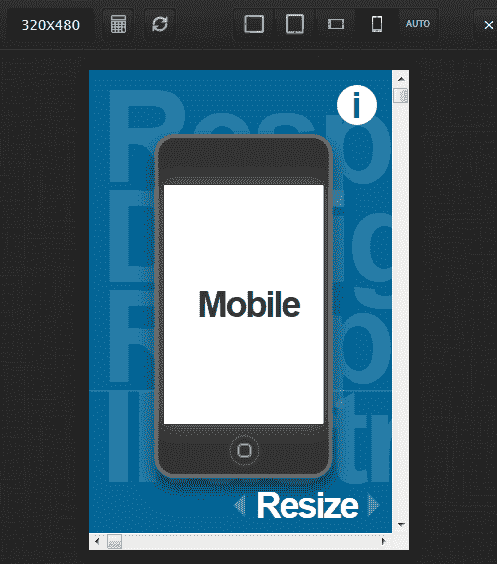
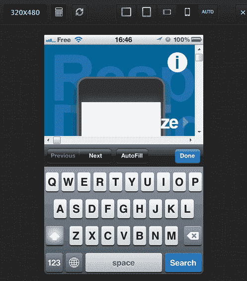

# 响应式网页设计书签

> 原文：<https://www.sitepoint.com/responsive-web-design-tool/>

响应式网页设计——或 RWD——有很多好处:

*   如果使用得当，你的网站可以在任何设备上浏览，不管屏幕分辨率或方向如何。
*   与多个网站或原生移动应用相比，这是一个廉价的解决方案。
*   很简单，也很好玩。所有酷小孩都在用。

虽然 RWD 技术众所周知，但帮助开发人员的工具相对较少。许多类似于 Matt Kersley 的响应式网页设计测试工具 T1，它以各种尺寸的 iframes 显示一个页面。很有用，但是仅限于直播网站。你不能(轻易地)将它指向运行在你个人电脑上的网络服务器。

最终，我们大多数人都会将浏览器的大小调整到一个近似手机/平板电脑的分辨率。这是可行的，但是你将花更多的时间来调整窗口大小，而不是写代码。

幸运的是，法国网络开发者维克多·库隆决定用他的免费 [**RWD 书签**](http://responsive.victorcoulon.fr/) 来解决这个问题。访问页面并将链接拖到浏览器的书签栏。

要测试它，请访问任何有响应的网站。[这个就行](http://www.thismanslife.co.uk/projects/lab/responsiveillustration/)。现在点击 RWD 书签链接——将加载一个工具栏，您可以在其中选择典型的平板电脑和移动设备分辨率:

点击看起来像计算器的图标，你会看到一个键盘视图。这是一个独特的特性，也是设计师在响应式设计中创建表单时很少考虑的一个特性。

虽然这些视图显然是以苹果为中心的，但它们适用于许多移动和平板设备。bookmarklet 也适用于在本地或内部网服务器上开发的站点(假设您可以通过 web 访问来加载它)。

RWD 书签是一个很好的工具。它可能在技术上并不复杂，也不具有革命性，但它非常有用。谢谢维克多！

## 分享这篇文章