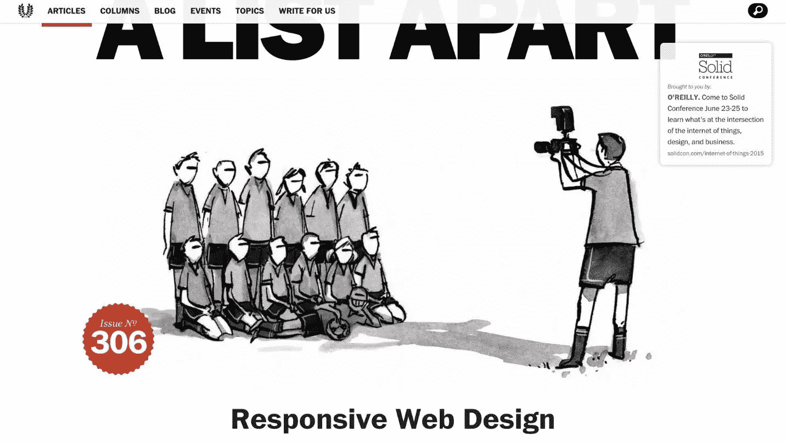
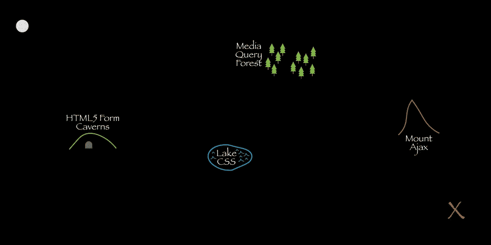
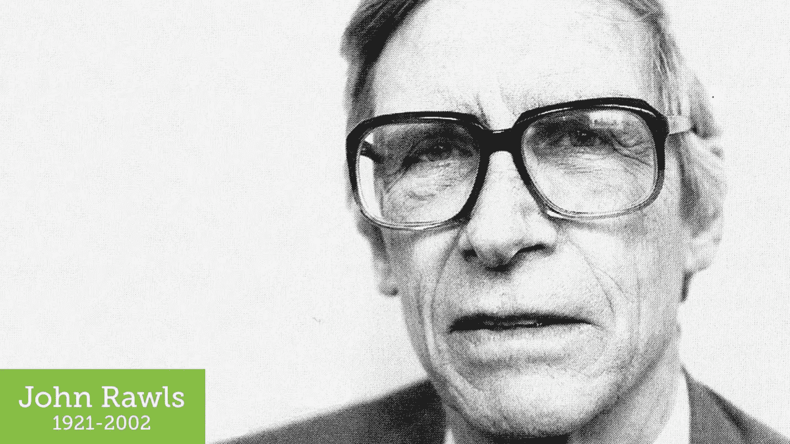
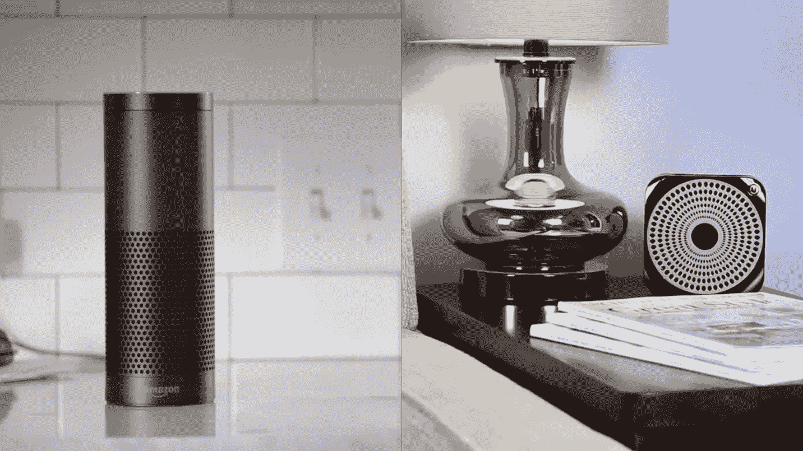
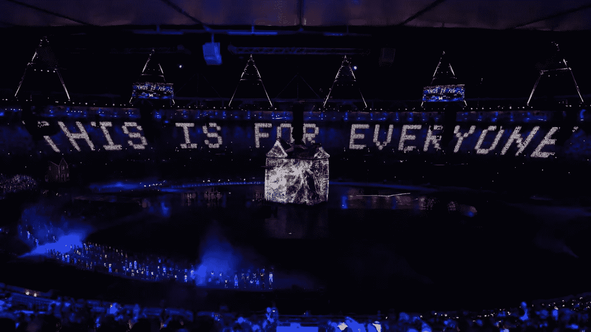

# 响应式网页设计:我们将何去何从？

> 原文：<https://www.sitepoint.com/responsive-web-design-where-do-we-go-from-here/>

本文是微软网站开发系列的一部分。感谢您对使 SitePoint 成为可能的合作伙伴的支持。

*很荣幸在* [*响应式日出 3:最后的断点*](http://responsiveconf.com/2015/) *发表闭幕主题演讲。该会议于 2015 年 6 月 19 日在英国布莱顿举行，是设计师和开发人员分享他们的工作流程策略、技术和响应式网页设计经验的聚会。*

以下是我要说的。

今天提供了一个令人惊叹的世界响应设计之旅。我们已经看到了如何提升我们的工作流程和过程。我们已经学会了新的方法来提高产品的易用性。我们已经努力应对现代 CSS 和 HTML 功能，这些功能帮助我们适应在我们周围旋转的巨大可变显示尺寸。

我们已经探索了模块化代码的未来和浏览器在没有网络连接的情况下工作的能力。我们甚至对网络的未来进行了一次旅行。



自从 [Ethan 的文章](https://huffduffer.com/adactio/243780)、流体网格、灵活媒体和媒体查询以来，我们已经走过了漫长的道路。这三个原则播下了一颗种子，随着我们逐渐更好地理解设备扩散的含义，这颗种子已经茁壮成长。我们已经看到网络可以去任何地方，做任何事情。

我认为[“响应式网页设计”](https://huffduffer.com/adactio/243780)是第一篇真正成功地抓住了约翰·奥尔索普多年前在[“网页设计之道”](http://www.alistapart.com/articles/dao/)中讨论的概念，并将它们提炼为设计和开发社区可以真正投入的东西。它提供了一个具体的例子，说明网络有能力将自己弯曲并塑造成它需要的任何形状。

这是许多设计师第一次接受“体验”不是铁板一块的想法。

当然，我们 web 标准社区中的许多人一直在谈论和实践关于[渐进增强](http://alistapart.com/article/understandingprogressiveenhancement)的内容。我们获得了皈依者，但进展缓慢。Ethan 直接而简洁地展示了视觉设计的渐进增强是什么样子的。

为每一个试图访问我们网站的人提供相同的体验是不可能的。要考虑的因素实在太多了。我们有屏幕大小、显示密度、CPU 速度、RAM 数量、传感器可用性、功能可用性、接口方法……*呼吸*……操作系统类型、操作系统版本、浏览器类型、浏览器版本、安装的插件、网络速度、网络延迟、网络拥塞、防火墙、代理、路由器，以及我的头脑在技术考虑的旋风中可能无法挑出的十几个其他因素。

这还没有考虑我们的用户。

当谈到我们的工作需要接触的人时，我们必须考虑文化水平，阅读能力，领域知识水平，认知障碍，如学习障碍和阅读障碍，注意力缺乏问题，环境干扰，视力障碍，听力障碍，运动障碍，他们对如何使用他们的设备有多了解，他们对如何使用他们的浏览器有多了解，他们对常见的网络惯例有多熟悉，以及许多其他“人为因素”。

每个人都是不同的，每个人都有自己的特殊需求。有些总是伴随着他们，比如失明。有些是短暂的，比如折断你的老鼠手臂。还有一些纯粹是环境因素，取决于你当时使用的设备及其技术能力或限制。

试图为每一个人设计一个在每一种情况下都要考虑到每一个因素的整体体验是不可能的。然而，蒂姆·伯纳斯·李爵士却有一个能去任何地方的网络愿景。他疯了吗？

蒂姆爵士对网络的愿景是内容可以一次创建，在任何地方都可以访问。分散在全球的不同但相关的“超媒体”可以通过链接相互连接。此外，任何人都可以在任何能够阅读 HTML 的设备上检索它们。免费的。

最终，蒂姆爵士设想了普遍无障碍。

对于我们大多数人来说，确保我们的网站是可访问的是事后的想法。当谈到“以用户为中心”这个或那个时，我们谈论一个好游戏，但是经常把“可访问性”这个词当作“屏幕阅读器”的同义词。远不止这些。“可及性”是关于人的。人们以许多不同的方式消费内容和使用界面，有些与我们的方式相似，有些则完全不同。

当然，有视觉障碍的人经常使用屏幕阅读器来阅读内容。但他们也可能使用盲文触摸反馈设备或盲文打印机。他们可能也使用键盘。或者他们可以使用触摸屏配合音频提示。或者，他们甚至可以使用摄像头，通过 OCR 和文本到语音转换来“阅读”内容。是的，视力障碍影响了相当一部分人(尤其是随着年龄的增长)，但这只是“可及性”难题的一部分。

文本和背景之间的对比度是确保内容在不同照明条件下保持可读性的一个重要因素。颜色选择是一个易访问性问题。

我们在网站和界面上使用的语言会直接影响用户理解我们所做的事情、我们提供的产品及其重要性的难易程度。它还会影响我们如何让用户感受到他们自己、他们的体验和我们的公司。语言是一个可访问性问题。

我们网页的大小直接影响到我们网页的下载时间，我们的客户访问它们的费用，甚至(有时)内容是否能被访问到。性能是一个可访问性问题。

我可以继续说下去，但我相信你已经明白了。

可访问性是指为每个人提供良好的体验，无论其身体或精神能力、性别、种族或语言如何。它认识到我们都有特殊的需求—物理限制、带宽限制、设备限制—这可能要求我们以不同的方式体验相同的界面。

例如，当我在手机上访问网站时，我会受到屏幕分辨率的视觉限制(特别是如果我使用的是支持缩放的浏览器)，我与按钮和链接的交互能力也受到限制，因为我是用指尖浏览的，指尖比鼠标光标大得多，也远没有鼠标光标准确。

在触摸屏上，我可能需要稍微不同的体验，但我仍然需要能够做我来到网站要做的任何事情。我需要*一个*的经验，而且我需要*适当的*经验。

接受体验不仅仅是一件事这一现实，将有助于我们接触到更多的人，同时减少头痛。经验可以——也应该——被加工成一个连续体。这是渐进的增强:我们从适用于每个人的基线体验开始——内容、真实链接、第一代表单控件和实际提交给服务器的表单。然后我们从那里积累经验。



你的浏览器支持 HTML5 表单控件？太好了！当你去输入你的电子邮件地址时，你会得到一个更好的虚拟键盘。可以用 CSS？太棒了，让我给你更好的阅读体验。哦，你能处理媒体的询问！让我调整一下布局，这样线条长度会更舒服一些。哇，你的浏览器支持 Ajax？！在这里，让我载入一些你可能会感兴趣的相关内容的预告。

想象一下，在餐馆坐下来，服务员马上给你端来了牛排。但你是素食主义者。你问他们是否提供你可以吃的东西，他们礼貌地回答说:哦，对不起，肉是必须的。你为什么不吃肉呢？很简单！你真的错过了一些美味的食物。真正关心你体验的服务员都不会这么做。

然而，作为一个行业，我们似乎可以毫不犹豫地告诉别人，他们需要改变他们的浏览器来适应我们。那是错误的。没有用户，我们的工作毫无意义。我们应该竭尽全力吸引和留住他们。这是客服 101。

这又回到了杰里米经常提到的波斯特尔定律:

> 做自己的事要保守，接受别人的东西要开明。

当涉及到浏览器支持时，我们需要放松，不要对我们能发送什么做太多(或者任何更好的)假设。

当然，这不是我们行业中每个人都愿意接受的方法，所以我将提供另一个我反复引用的引用…

> 当事情发生时，你唯一能控制的是你对它的态度；你要么接受，要么反感。

我们无法控制世界，我们只能控制自己对世界的反应。

现在，你们中那些聚集在一起准备这最后一天回应的人(或者那些在家跟随的人)可能比大多数人更理解这一点。我们感受到新设备、屏幕尺寸和功能的不断冲击。我发现处理所有这些的唯一方法是接受它，拥抱多样性，并将设备和浏览器的激增视为一种特性，而不是一个错误。

我们有责任教育我们周围的人——无论是无意还是有意——不接受多样性是我们生活的现实，事情只会变得更加疯狂。把我们的头埋在沙子里不是一个选择。

当我试图帮助人们理解和接受多样性时，我经常会引用约翰·罗尔斯的一个我最喜欢的思维练习。



罗尔斯是一位哲学家，他曾经与学生、教会团体等一起进行社会实验。

在实验中，参与者被允许创造他们理想的社会。它可以遵循任何哲学:它可以是君主制、民主制或无政府主义。可能是资本主义或社会主义。这个实验中的人可以完全自由地控制社会的各个方面…但是他补充了一点:他们无法控制自己在社会中的地位。

这种扭曲就是早期博弈理论家约翰·哈萨尼(John Harsanyi)所称的“T2”、“无知之幕”( Veil of ignition )( T3 ),罗尔斯一次又一次地发现，参与实验的个人会被吸引去创造最平等的社会。

这是有道理的:如果当面纱被揭开时，有哪个理性的、自私的人会可怜地对待老人、病人、特定性别、种族、信仰或肤色的人呢？

我们现在为适应特殊需求所做的事情在将来会有回报。看坡道。


对于坐轮椅的人来说，它们是一个无障碍功能的经典例子，也有利于不坐轮椅的人:提行李的人，用手推车拖重物的送货服务，推着婴儿车的孩子(或他们精心打扮的狗)的父母，骑自行车的通勤者，以及喜欢在平缓的斜坡上行走而不愿花力气登上台阶的人。

当我们创造了从 A 点到 B 点的可选路径时，人们可以选择最适合他们的路径，无论是出于选择还是出于需要。每个人都能完成他们的目标。

我们都有特殊的需求。有些是我们生来就有的。有些是我们开发的。有些是暂时的。有些与我们个人无关，而是取决于环境或纯粹取决于我们使用的硬件、我们可用的交互方法，甚至是我们访问互联网或处理数据的速度。

如果不是易访问性，那么响应式网页设计是什么？是的，它的基本原则与视觉设计有关，但从全局来看，它们都是为了提供最好的阅读体验。

作为响应式设计的实践者，我们理解调整界面的好处。我们理解倒退。我们知道如何设计在各种条件下都有效的体验。我们每天都在扩大产品的可及性。

这些技能将使我们变得无价，因为技术继续提供消费和与我们的网站互动的新方式。

我们刚刚开始接触基于动作的手势控制的世界。当然，我们已经在触摸屏上有了二维的控件，但是三维的基于动作的控件才刚刚开始出现。

[https://www.youtube.com/embed/VXhhE-l96qQ](https://www.youtube.com/embed/VXhhE-l96qQ)

这个方向的第一次大飞跃是 Xbox 360 上的 Kinect(以及后来的 Windows)。通过 Kinect，我们可以使用身体动作与计算机进行交互，例如举手(这可以让 Kinect 集中注意力)，将手向前推以点击/轻击，以及抓住以向特定方向拖动画布。

Kinect 在与计算机的接口方面迎来了一场重大革命，但从交互的角度来看，它对 Wii 控制器和索尼的 PlayStation Move 提出了类似的挑战。像举起你的手(或一个魔杖控制器)这样的大的身体姿势会很累。

[https://www.youtube.com/embed/21LtA5-wiwU](https://www.youtube.com/embed/21LtA5-wiwU)

它们也不是非常准确。如果你认为触摸屏的准确性是一个问题，那么 Kinect 或 [LEAP Motion](https://en.wikipedia.org/wiki/Leap_Motion) 的手势会带来更大的挑战。

为了适应这样的交互(我们目前没有办法检测)，我们需要意识到点击交互控件有多容易。我们需要确定我们的按钮和链接是否足够大，它们之间是否有足够的空间来确保用户的意图被准确地传达给浏览器。可以帮助解决这个问题的两个规范是媒体查询级别 4 和指针事件。

在 [Media Queries Level 4](http://dev.w3.org/csswg/mediaqueries-4/) 中，我们能够将样式规则应用于特定的交互上下文。例如，当我们对光标进行非常精确的控制时(如在手写笔或鼠标的情况下)或不太精确的控制时(如在触摸屏或物理手势的情况下):

```
 @media (pointer:fine) {
  /* Smaller links and buttons are ok */
}
@media (pointer:coarse) {
  /* Larger links and buttons are probably a good idea */
} 
```

[view raw](https://gist.github.com/aarongustafson/372271534c78cf11d4a6/raw/00734e21d8b5c925491a9730e96ccfaca8466cf0/mq4-pointer.css)[mq4-pointer . CSS](https://gist.github.com/aarongustafson/372271534c78cf11d4a6#file-mq4-pointer-css)|[view raw](https://gist.github.com/aarongustafson/372271534c78cf11d4a6/raw/00734e21d8b5c925491a9730e96ccfaca8466cf0/mq4-pointer.css)

本文中包含的可嵌入 GitHub 代码示例可在此处获得:[https://gist . GitHub . com/aarongustafson/372271534 c 78 cf 11 D4 a6 # file-mq4-pointer-CSS](https://gist.github.com/aarongustafson/372271534c78cf11d4a6#file-mq4-pointer-css)

当然，我们希望在大小和间距方面提供一个合理的默认值，作为旧浏览器和设备的后备。

我们还能够确定设备是否能够悬停在某个元素上，并相应地调整界面。

```
 @media (hover:hover) {
  /* hover-related interactions are A-OK */
}

@media (hover:on-demand) {
  /* hover-related interactions are potentially difficult,
     maybe do something else instead */
}

@media (hover:none) {
	/* No hover possible :-( */
} 
```

[view raw](https://gist.github.com/aarongustafson/372271534c78cf11d4a6/raw/00734e21d8b5c925491a9730e96ccfaca8466cf0/mq4-hover.css)[mq4-hover . CSS](https://gist.github.com/aarongustafson/372271534c78cf11d4a6#file-mq4-hover-css)|[view raw](https://gist.github.com/aarongustafson/372271534c78cf11d4a6/raw/00734e21d8b5c925491a9730e96ccfaca8466cf0/mq4-hover.css)

然而，我们仍然需要弄清楚所有这些最终在 Surface 平板电脑等多模态设备上的效果如何。当用户在输入模式之间切换时，设计会改变吗？应该吗？为此，该规范还提供了 any-pointer 和 any-hover，允许您查询*任何*支持的交互方法是否满足您的需求，但是该规范有一个警告:

仅仅因为 _any-hover 或 _ any-pointer _*_ 表明具有这些功能的输入机制是可用的，就设计一个依赖于悬停或精确指向的页面，很可能会导致糟糕的体验。*

这些媒体查询选项开始在 Chrome、Mobile Safari 和 Microsoft Edge 中推出，因此值得一看。

[指针事件](https://www.w3.org/TR/pointerevents/)是另一个开始受到关注的规范。它将交互概括为单一事件，而不是强迫我们将体验局限于鼠标驱动、触摸驱动、笔驱动、(唉)力驱动等等。

我们可以不引人注目地检测对指针事件的支持…

```
if (window.PointerEvent) {
  window.addEventListener("pointerdown", detectType, false);
}
```

[view raw](https://gist.github.com/aarongustafson/372271534c78cf11d4a6/raw/00734e21d8b5c925491a9730e96ccfaca8466cf0/pointer-test.js)[pointer-test . js](https://gist.github.com/aarongustafson/372271534c78cf11d4a6#file-pointer-test-js)|[view raw](https://gist.github.com/aarongustafson/372271534c78cf11d4a6/raw/00734e21d8b5c925491a9730e96ccfaca8466cf0/pointer-test.js)

…然后以同样的方式处理它们，或者基于指针类型创建分支:

```
function detectType( event ) {

  switch( event.pointerType ) {
    case "mouse:
      /* mouse input detected */
      break;
    case "pen":
      /* pen/stylus input detected */
      break;
    case "touch:
      /* touch input detected */
      break;
    default:
      /* pointerType is empty (could not be detected) or UA-specific custom type */
  }
}
}
}
```

[view raw](https://gist.github.com/aarongustafson/372271534c78cf11d4a6/raw/00734e21d8b5c925491a9730e96ccfaca8466cf0/pointer-event.js)[pointer-event . js](https://gist.github.com/aarongustafson/372271534c78cf11d4a6#file-pointer-event-js)|[view raw](https://gist.github.com/aarongustafson/372271534c78cf11d4a6/raw/00734e21d8b5c925491a9730e96ccfaca8466cf0/pointer-event.js)

当然，除了考虑用户在与屏幕交互时的准确度，我们还需要考虑用户阅读内容的潜在距离。

为此，我一直在试验视口宽度(vw)单位。

很长一段时间以来，我一直使用 ems 来显示布局的最大宽度(所以线条长度与字体大小成正比)。我也使用相对字体大小。以此为基础，我可以使用匹配最大宽度的媒体查询，并将基本字体大小设置为最大宽度的 vw 等效值。

```
body {
  max-width: 64em;
}

@media screen and (min-width: 64em) {
  body {
    font-size: 1.5625vw; /* ( 1em / 64em ) * 100 */
  }
}
```

[view raw](https://gist.github.com/aarongustafson/372271534c78cf11d4a6/raw/00734e21d8b5c925491a9730e96ccfaca8466cf0/vw-scaling.css)[VW-scaling . CSS](https://gist.github.com/aarongustafson/372271534c78cf11d4a6#file-vw-scaling-css)|[view raw](https://gist.github.com/aarongustafson/372271534c78cf11d4a6/raw/00734e21d8b5c925491a9730e96ccfaca8466cf0/vw-scaling.css)

那么当超过那个尺寸时，整个设计将简单地缩放布局。

[youtube 6XoN9mMgI38]

如果您不想自动打开类似的功能，您可以使用 JavaScript 来启用它。

【youtube 96l_W7ca6SM】

当你开始考虑像 HoloLens 这样的设备时，事情变得更加疯狂。不，我还没玩过。

[https://www.youtube.com/embed/3AADEqLIALk](https://www.youtube.com/embed/3AADEqLIALk)

但是能够将可调整大小的虚拟屏幕放在任何表面上的想法给用户带来了一些有趣的可能性，也给设计师带来了一些独特的挑战。当然，HoloLens 也带来了手势控制，因此考虑各种输入类型应该会让我们走得很远。

同样，我们应该开始思考，当我们仅仅用目光浏览时，体验会是什么样子，应该是什么样子。视线跟踪起源于可及性空间，作为一种向手受限或不使用手的人提供界面控制的手段。传统上，视线追踪硬件要几千美元，很多人都买不起，但这种情况正在开始改变。

在过去的几年里，随着与支持视线跟踪相关的硬件成本大幅下降，我们设备的计算能力有所提高。环顾四周，你可以看到目光追踪开始进入公共领域:许多智能手机和智能手表可以识别你在看它们(或者至少有时会这样)。这离知道你在屏幕上看哪里只有一步之遥。几乎每部高端智能手机现在都配备了前置摄像头，这使它们成为提供这种交互方式的完美候选。

[https://www.youtube.com/embed/DEk7PlJWQgI](https://www.youtube.com/embed/DEk7PlJWQgI)

芝麻手机被设计成允许人们不用手就能使用智能手机。它使用面部跟踪在屏幕上移动虚拟光标，允许用户与底层操作系统以及单个应用程序进行交互。它支持点击、滑动和其他手势(通过上下文菜单)，在我的体验中令人印象深刻。像这样的技术使患有多发性硬化症、关节炎、肌肉萎缩症等疾病的人能够使用智能手机，并且——对我们来说更重要的是——浏览网页。

[眼球部落](https://theeyetribe.com/)和[注视点](http://www.fixational.com/)也在努力将眼球追踪引入智能手机和平板电脑。眼睛跟踪类似于面部跟踪，但是光标跟随您的焦点。微手势——眨眼、眨眼等。—允许您与设备进行交互。

尽管大多数凝视跟踪软件模仿鼠标并具有可调灵敏度，但它作为指针设备的准确性并不出色。例如，当我使用芝麻手机时，我很难控制我的头的位置，以保持光标静止悬停并点击按钮。我确信这将随着实践而改进，但是可以肯定地说，在凝视交互中，更大、间距更好、更容易定位的链接和按钮将是天赐之物。

到目前为止，我关注的是促进导航和消费内容的交互方法。但是填表呢？我可以告诉你，用你的脸在虚拟键盘上一个字母一个字母地输入电子邮件，糟透了…

令人欣慰的是，这些手势实现大多都配有某种形式的语音识别。例如，Kinect 将接受口头命令来导航和完成填表等任务。芝麻手机还支持某些基本操作的语音命令，口述电子邮件等。

再加上语音，Kinect 和芝麻手机的另类交互方式效果真的很好。但是语音交互也可以独立存在。

我们大多数人都熟悉[苹果的 Siri](https://en.wikipedia.org/wiki/Siri) 、 [Google Now](https://en.wikipedia.org/wiki/Google_Now) 和[微软的 Cortana](https://en.wikipedia.org/wiki/Microsoft_Cortana) 。这些数字助理擅长从精选的资源中检索信息，并做其他辅助性的事情，如计算小费和设置提醒。然而，就与网络的互动而言，他们还没有……我们可以和他们互动，但他们不一定能和网页互动。

通过语义 HTML 和结构化语法(如[微格式](http://microformats.org/)、[微数据](https://en.wikipedia.org/wiki/Microdata_%28HTML%29)和 [RDFa](https://en.wikipedia.org/wiki/RDFa) 、暴露存储在我们网页中的信息，最终会让我们的内容对这些助手可用，但我们真的不知道。他们的各种制造商并没有真正给我们任何关于如何做到这一点的线索，而且就目前的情况来看，他们中没有一个人能找到一个网页并读给你听。为此，您需要调用一个屏幕阅读器。

每个公司都提供第一方屏幕阅读器。所有这些都能够帮助你与网页互动，包括帮助你填写表格，而不必看网页。然而，这些技术还没有与它们相应的助手相结合。也许用不了多久，我们就会看到这种情况发生。

当我们开始考虑如何在语音环境中体验我们的网站时，网页的可读性变得至关重要。清晰、写得好的散文和合乎逻辑的源顺序是绝对必要的。如果我们的页面读起来没有意义，那还有什么意义呢？

内容策略师 Steph Hay 将界面视为与用户对话的机会。很快就真的会了。

有趣的是，微软向我们展示了为我们的网站设计定制的语音命令，而不仅仅是操作系统本身对 Cortana 的支持。换句话说，他们让我们教他们的助手。

在 Windows 10 中，可安装的 web 应用程序可以在页面头部包含一个[语音命令定义(VCD)文件](https://msdn.microsoft.com/en-us/library/windows/apps/dn722331.aspx/?WT.mc_id=13418-DEV-sitepoint-article42)，以支持自定义命令:

```
 <meta name=“msapplication-cortanavcd" content="http://myapp.io/vcd.xml"/> 
```

[查看 rawvcd.xml](https://gist.github.com/aarongustafson/372271534c78cf11d4a6#file-vcd-html) | [查看 raw](https://gist.github.com/aarongustafson/372271534c78cf11d4a6/raw/00734e21d8b5c925491a9730e96ccfaca8466cf0/vcd.html)

引用的 VCD 文件只是一个 XML 文件，它定义了 web 应用程序的关键字和可以发出的命令。

VCD 使用非常基本的语法来识别 Cortana 应该提取的给定短语和变量的可选部分:

```
 Group Post
    Group Post add note

      add a note {message} using group post
      [please] add a note [that] {noteSubject}
      adding {noteSubject} to Group Post 
```

[查看 rawvcd.xml](https://gist.github.com/aarongustafson/372271534c78cf11d4a6/raw/00734e21d8b5c925491a9730e96ccfaca8466cf0/vcd.xml) | [查看 raw](https://gist.github.com/aarongustafson/372271534c78cf11d4a6/raw/00734e21d8b5c925491a9730e96ccfaca8466cf0/vcd.xml)

这个特定的应用程序将捕获的信息传递给 JavaScript 进行处理。没错， [Cortana 也有 JavaScript API](https://msdn.microsoft.com/en-us/library/dn722330.aspx#handle_activation_and_execute_voice_commands/?WT.mc_id=13418-DEV-sitepoint-article42)。相当整洁。

但是传统电脑和智能移动设备并不是我们开始看到基于语音的体验的唯一地方。我们也有脱离实体的声音，比如亚马逊的回声和 T2 的无脑声音。



现在，他们似乎都专注于帮助你的房子变得“更智能”——流媒体音乐，调节恒温器等。—但不难想象这些设备将具备浏览和与网络互动的能力。

在不久的将来，基于语音的网络交互将完全成为可能。一开始可能会有点糟糕，但是会好起来的。

我要做一个有点大胆的预测:虽然触摸在许多方面对改善数字接入是革命性的，但语音将会更加重要。基于语音的界面将为人们创造与数字世界互动和参与其中的新机会。

因为我们一直在思考我们创造的体验如何在各种设备上消费，所以当涉及到语音时，我们已经超越了在网络上工作的其他人。我们将经验视为一个连续体，从文本开始。

随着语音技术的成熟，我们将成为人们眼中的专家。我们将使下一代网站和应用程序具备语音功能，这样，我们将改善数十亿人的生活。因为“无障碍”不是关于残疾，而是关于无障碍和人。当然，我们会让查找电影时间和购买电影票看最新的《变形金刚》变得更容易，但我们也会让全球近 9 亿文盲——其中超过 60%是女性——拥有更多权利。这是一个在我们占主导地位的网络上被忽略的群体。

我们将为穷人和弱势群体创造新的机会，让他们参与一个排斥他们的世界。你可能不知道，但是 80%的财富 500 强公司——想想塔吉特，沃尔玛——只接受在线或通过电脑的工作申请。我们将使计算机技能有限或阅读困难的人能够申请这些公司的工作。

我们可以帮助弥合数字鸿沟和文化鸿沟。我们可以为人们创造机会，改善他们和他们家人的生活。我们有能力在这个世界上创造比我们大多数人梦想的更多的公平。

这是一个令人难以置信的激动人心的时刻，不仅仅是对于响应式设计社区，不仅仅是网络，而是对于整个世界！未来就要来了，我迫不及待地想看看你是如何让它变得如此棒！



响应日 3:最终断点于 2015 年 6 月 19 日在英国布莱顿举行。

*   听听这个关于赫芬顿的介绍。
*   阅读奥德·桑德斯对我演讲的笔记。
*   阅读 Hidde de Vries 的一天回顾。

如果你有兴趣了解更多关于响应式网页设计的知识，可以看看我们的新书，克里斯·沃德写的《快速启动响应式网页设计》。

## 更多的 Web 开发实践

这篇文章是微软技术倡导者的 web 开发系列的一部分，内容涉及实用的 JavaScript 学习、开源项目和互操作性最佳实践，包括[微软 Edge](http://blogs.windows.com/msedgedev/2015/05/06/a-break-from-the-past-part-2-saying-goodbye-to-activex-vbscript-attachevent/?WT.mc_id=13418-DEV-sitepoint-article42) 浏览器和新的 [EdgeHTML 渲染引擎](http://blogs.windows.com/msedgedev/2015/02/26/a-break-from-the-past-the-birth-of-microsofts-new-web-rendering-engine/?WT.mc_id=13418-DEV-sitepoint-article42)。

我们鼓励您使用 [dev.modern.IE](http://dev.modern.ie/tools/?utm_source=SitePoint&utm_medium=article42&utm_campaign=SitePoint) 上的免费工具跨浏览器和设备进行测试，包括 Windows 10 的默认浏览器 Microsoft Edge:

*   [扫描你的网站，寻找过时的库、布局问题和可访问性](http://dev.modern.ie/tools/staticscan/?utm_source=SitePoint&utm_medium=article42&utm_campaign=SitePoint)
*   [在 Mac、Linux 和 Windows 上使用虚拟机](http://dev.modern.ie/tools/vms/windows/?utm_source=SitePoint&utm_medium=article42&utm_campaign=SitePoint)
*   [在您自己的设备上远程测试 Microsoft Edge](https://remote.modern.ie/?utm_source=SitePoint&utm_medium=article42&utm_campaign=SitePoint)
*   [GitHub 编码实验室:跨浏览器测试和最佳实践](https://github.com/deltakosh/interoperable-web-development)

## 来自我们的工程师和布道者的关于 Microsoft Edge 和 Web 平台的深入技术学习:

*   【2015 年微软 Edge 网络峰会(对新浏览器、新支持的网络平台标准以及来自 JavaScript 社区的演讲嘉宾有何期待)
*   哇，我可以在 Mac 电脑上测试 Edge & IE 浏览器& Linux！(来自雷伊·班戈)
*   [在不破坏网络的情况下推进 JavaScript】(来自 Christian Heilmann)](http://channel9.msdn.com/Events/WebPlatformSummit/2015/Advancing-JavaScript-without-breaking-the-web/?WT.mc_id=13418-DEV-sitepoint-article42)
*   使网络正常工作的边缘渲染引擎(Jacob Rossi)
*   [用 WebGL 释放 3D 渲染](https://channel9.msdn.com/Events/WebPlatformSummit/2015/Unleash-3D-rendering-with-WebGL-and-Microsoft-Edge/?WT.mc_id=13418-DEV-sitepoint-article42)(来自大卫·卡图赫，包括[伏龙。JS](http://vorlonjs.com) 和 [babylonJS](http://babylonjs.com) 项目)
*   [托管网络应用和网络平台创新](https://channel9.msdn.com/Events/WebPlatformSummit/2015/Hosted-web-apps-and-web-platform-innovations/?WT.mc_id=13418-DEV-sitepoint-article42)(来自律师奶爸和基里尔·赛克谢诺夫，包括[流形。JS](http://manifold.js.com) 项目)

## 更多面向网络平台的免费跨平台工具和资源:

*   [适用于 Linux、MacOS 和 Windows 的 Visual Studio 代码](https://code.visualstudio.com/?WT.mc_id=13418-DEV-sitepoint-article42)
*   [用节点编码。JS](https://www.microsoftvirtualacademy.com/en-US/training-courses/building-apps-with-node-js-jump-start-8422/?WT.mc_id=13418-DEV-sitepoint-article42) 和[在 Azure 上免费试用](https://azure.microsoft.com/en-us/pricing/free-trial/?WT.mc_id=13418-DEV-sitepoint-article42)

## 分享这篇文章