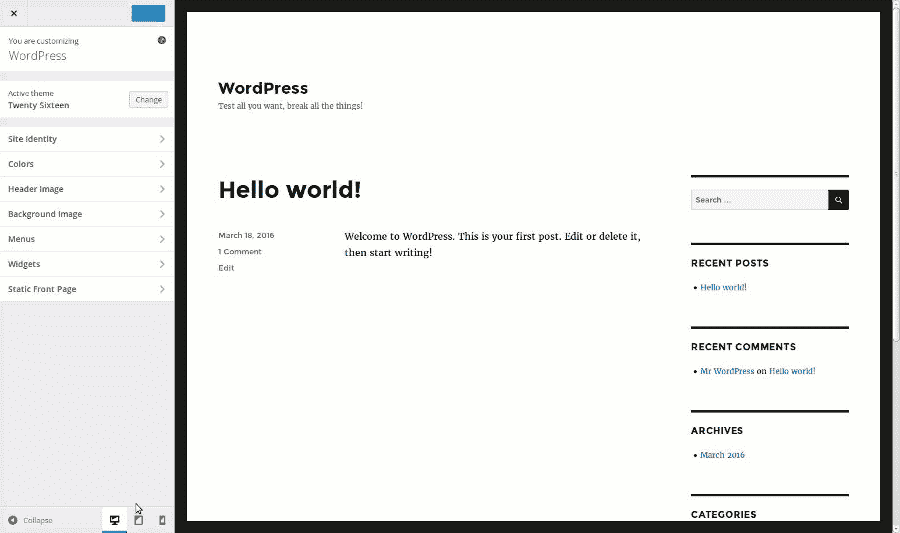
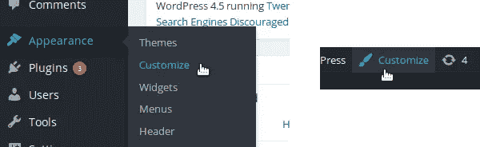
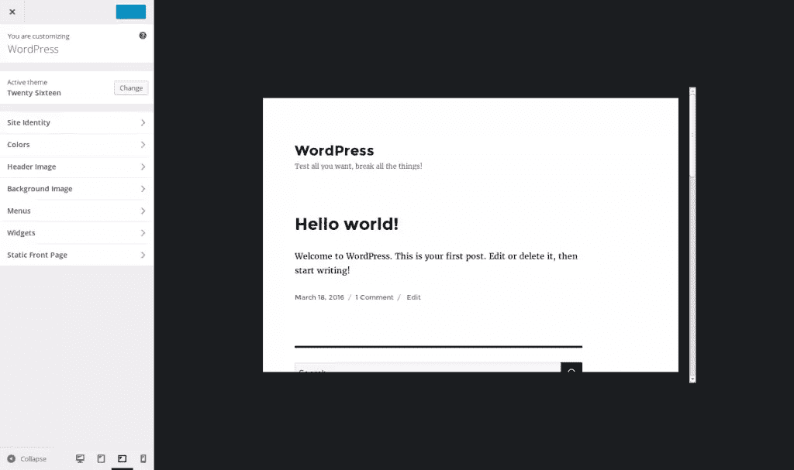

# 探索 WordPress 主题定制器中的响应能力

> 原文：<https://www.sitepoint.com/responsiveness-in-the-wordpress-theme-customizer/>

当我们有一个网站时，我们不能忽视移动世界。例如，如果你的文章在社交网络上分享，这些链接很可能会在智能手机上看到。

如果你想让访问者参与到你的网站中，你需要在手机上提供良好的体验。你必须使用一个有反应的主题。

在 WordPress 4.5 中，主题定制器中引入了一个新的响应视图。本文将介绍什么是主题定制器中的响应式视图，为什么它很有用，最后，作为开发人员如何使用它。

## 什么是响应视图

响应式视图允许您以不同于您当前使用的格式来可视化您的网站。例如，你将能够在智能手机上看到你的网站是如何显示的，直接在你的桌面浏览器上，而不需要使用真正的移动设备。

这真的很有用，因为你可以在一个更小的设备上测试你用主题定制器对你的主题所做的改变，而不必先保存它们。这意味着您不会因为需要在移动设备上测试而破坏任何东西。

基本上，响应式视图唯一能做的就是缩小你浏览网站的框架。当你调整浏览器窗口的大小时，或者当你使用[浏览器自己的响应视图](https://www.sitepoint.com/debugging-mobile-websites-firefox/)时，或多或少会发生这种情况。

改变窗口的大小(或者在浏览器的响应视图中改变视窗的大小)就足以看到你的网站在较小的设备上是什么样子。然而，当您使用主题定制器时有一个问题:侧边栏(定制器本身)也会被调整大小。如果你想在像智能手机这样非常小的设备上进行测试，这并不实际。

使用主题定制器的响应式视图的优点是只有网站的预览被调整大小:唯一被调整大小的是你唯一想测试的东西。然后，您可以更快、更容易地测试更改。



此外，传统用户不一定知道他们的浏览器中有一个响应视图，他们也不一定有调整浏览器窗口大小来测试视图的习惯。由于主题定制器的响应式视图使用起来简单明了，这是一个很好的工具。

## 如何使用响应式视图

要使用响应式视图，您需要在主题定制器中。要访问它，你可以使用 WordPress 仪表盘“外观”菜单下的“定制”条目。登录后，您还可以使用网站每个页面顶部栏中的“自定”按钮。



主题定制器分为两部分:右边是网站的预览，左边是侧边栏，可以更改细节。在侧边栏的底部，您可以找到允许您启用响应式视图的按钮。

有几种格式可供选择:默认情况下，我们有桌面视图、平板视图(纵向模式)和智能手机视图(也是纵向模式)。要启用视图，您必须点击相应的按钮。网站的预览将被调整大小，而不需要做更多的事情。

让我们弄清楚，如果你想知道，这些按钮不会调整你的网站本身的大小。它们只是在较小的设备上预览你的网站外观的一种方式。如果您启用了 smartphone 视图，访问您网站的用户将继续以完整尺寸查看网站！

## 选择要显示的视图

如果你正在开发一个主题，无论是为了你自己还是为了分享它(或者两者都是！)，你得让它有反应。作为一名开发人员，你会希望使用你的浏览器工具来测试你的主题的响应，因为它们比主题定制器的响应视图更完整。

然而，您的用户会更喜欢这个视图，因为使用主题定制器导航会更舒服。这就是为什么你不能忽视这种回应的观点。

好消息是，你不需要做任何事情来启用响应式视图:一旦用户将他们的 WordPress 安装更新到 4.5 版(或更高版本)，他们就可以使用它了。但是，如果需要，您可以管理可用的视图。

例如，如果您的主题没有响应，您可以禁用响应视图。你也可以禁用一个特定的视图:如果由于某种原因你的主题只能在手机上使用，你只能启用这个视图，甚至禁用桌面视图。另一个可能的应用是简单地选择默认视图。

要管理响应视图，您可以使用`customize_previewable_devices`过滤器。此过滤器中使用的函数必须接受一个参数(可用视图)并返回要显示的视图。下面是在主题的`functions.php`文件中实现的基本代码:

```
<?php
add_filter('customize_previewable_devices', function($devices){
    return $devices;
});
?>
```

这相当于(如果您愿意的话):

```
<?php
function manage_previewable_devices($devices) {
    return $devices;
}
add_filter('customize_previewable_devices', 'manage_previewable_devices');
?>
```

为了管理设备，我们需要知道变量`$devices`中包含了什么。这是一个列出视图的关联数组。默认情况下，它设置为:

```
Array
(
    [desktop] => Array
        (
            [label] => Enter desktop preview mode
            [default] => true
        )
    [tablet] => Array
        (
            [label] => Enter tablet preview mode
        )
    [mobile] => Array
        (
            [label] => Enter mobile preview mode
        )
)
```

一旦 WordPress 应用了`customize_previewable_devices`过滤器，它将列出这个数组后面的视图。将`default`键设置为`true`的第一个条目将是默认视图(即使有其他条目将该键设置为`true`)。`label`条目不显示在屏幕上，甚至不在`title`属性中。例如，它们由屏幕阅读器使用。很有可能你不需要改变他们的价值观。

如果您想禁用一个视图，您必须删除相应的条目。例如，如果要禁用数位板视图，请在过滤器调用的函数中使用以下代码行:

```
<?php
unset($devices['tablet']);
?>
```


要禁用响应视图，请返回一个空数组:

```
<?php
$devices = array();
// OR:
return array();
?>
```

最后，要改变默认视图，我们需要做两件事:将当前默认视图的`default`属性设置为`false`，然后将我们想要设置为默认的视图的`default`属性设置为`true`。例如，使用下面的代码，默认情况下，用户将总是看到移动视图。

```
<?php
$devices['desktop']['default'] = false;
$devices['mobile']['default'] = true;
?>
```

## 自定义不同视图的大小

桌面视图将占用所有的可用空间，正如我们所期望的那样。然而，也许你想知道其他视图使用的不同尺寸是什么。

移动视图模拟纵向模式下的屏幕。设置为 320 × 480 像素。平板电脑视图也是纵向模式，模拟 6 × 9 英寸的屏幕(对角线在 10 到 11 英寸之间)。

这些是默认值。它们被设置在一个 CSS 文件中，你不能通过我们上面使用的过滤器来定制它们。然而，如果你真的想定制这些尺寸，可以使用你自己的 CSS 文件，不需要编辑 WordPress 核心文件(这是不推荐的)。

在你的主题文件夹中创建一个新的 CSS 文件。我把它命名为`custom-responsive-views.css`，并把它放在我的主题文件夹的根目录下，但是你可以随意选择这些细节。

然后，在你的主题的`functions.php`文件中，使用`admin_enqueue_scripts`动作将你的样式加入队列。

```
<?php
add_action('admin_enqueue_scripts', function() {
    wp_enqueue_style('custom-responsive-views', get_template_directory_uri() . '/custom-responsive-views.css');
});
?>
```

现在 WordPress 将会读取这个文件，所做的修改将会生效。让我们举一个具体的例子，假设你想以横向模式显示平板电脑视图。然后，您可以在刚刚创建的文件中使用下面的 CSS 代码。

```
.preview-tablet .wp-full-overlay-main {
    margin: auto 0 auto -4.5in;
    width: 9in;
    height: 6in;
}
```

如你所见，不要忘记调整页边空白，始终将视图居中。如果你想定制移动视图，使用`.preview-mobile`类而不是`.preview-tablet`类。桌面视图使用了`.preview-desktop`类。由于这些简单的 CSS 规则，您可以为不同的视图选择您想要的大小。下面是我用上面的 CSS 得到的平板视图。



## 创建新的响应视图

与内置的浏览器工具相反，WordPress 的响应式视图不允许调整视图的大小。这意味着，如果用户想要查看更大的设备，他们将无法调整移动视图的大小。

也许以后我们会看到这样的特色。与此同时，如果你真的想在不覆盖默认视图的情况下为平板电脑视图提供更大的移动视图或横向模式，仍然可以通过创建自己的视图来实现。

为此，让我们返回过滤器调用的回调函数`customize_previewable_devices`。正如我们在上面看到的，WordPress 会将所有的条目以按钮的形式列在`$devices`数组中。然后，要创建一个新视图，添加您自己的条目，如下所示。

```
<?php
$devices['tablet-landscape'] = array(
    'label' => 'Enter tablet preview mode (landscape)'
);
?>
```

如果你愿意，你可以选择这个视图作为默认视图，通过添加键`default`设置为`true`(但是不要忘记禁用当前的默认视图，就像我们上面看到的)。

有了这个条目，WordPress 将生成相应的按钮，带有正确的 JavaScript 回调:当按钮被点击时，网站预览将自动获取正确的 CSS 类。例如，在上面的例子中，预览将获得类`preview-tablet-landscape`。

这里我们有一个问题:我们创建的按钮几乎是不可见的。如果你知道在哪里搜索，你就能找到它，但它并不是我们真正想要的。我们需要添加一些 CSS 以正确的方式显示它(即其他按钮的显示方式)。我们将使用在上一部分中创建的 CSS 文件来完成这项工作。

按钮中显示的图标位于一个`:before`伪元素中。由于您提供的名称，可以找到您的按钮。在上面的例子中，用来检索按钮图标的 CSS 是`.wp-full-overlay-footer .devices .preview-tablet-landscape:before`。然后，你所要做的就是指出内容，一个要显示的图标。WordPress 的按钮使用 Dashicons 字体。你可以在 [WordPress 开发者资源网站](https://developer.wordpress.org/resource/dashicons/)上找到可用图标的完整列表。

在我们的例子中，我们有一个平板电脑，所以我们选择图标`f471`。CSS 如下所示。

```
.wp-full-overlay-footer .devices .preview-tablet-landscape:before {
    content: '\f471';
}
```

然而，我们的平板电脑处于横向模式，而图标中显示的平板电脑处于纵向模式。我们将在这里使用 CSS 的力量来转换图标:使用下面的 CSS，平板电脑现在以横向模式显示。

```
.wp-full-overlay-footer .devices .preview-tablet-landscape:before {
    transform: scaleX(-1) rotate(0.25turn);
    content: '\f471';
}
```

您仍然需要做一件事:定义与您的新视图相对应的大小。这可以通过我们改变上面的视图的相同方式来实现，这要感谢相同的 CSS 文件。下面是我们的平板在横屏模式下对应的 CSS 规则。

```
.preview-tablet-landscape .wp-full-overlay-main {
    margin: auto 0 auto -4.5in;
    width: 9in;
    height: 6in;
    max-height: 100%;
    max-width: 100%;
    left: 50%;
}
```

## 设置 JavaScript 触发器

可以定义一个 JavaScript 函数，每次响应视图改变时都会调用这个函数。例如，如果你的主题对`resize`事件作出反应，这是很有用的。在主题定制器中，窗口不会自行调整大小，因此不会触发该事件。

然后您可以使用功能`wp.customize.previewedDevice.bind()`。这个回调可以使用一个参数:一个表示新视图的字符串。例如，如果视图变为移动视图，这个字符串将是`mobile`。在我们上面创建的视图中，它将是`tablet-landscape`。

下面是一个在控制台中显示新视图的示例。

```
wp.customize.previewedDevice.bind(function(new_device) {
    console.log('Reponsive view has been changed to: ' + new_device);
});
```

由于有了`wp_enqueue_script()`函数，这段代码可以放在 JavaScript 文件中并排队。我们在上面使用的让自定义 CSS 入队的动作`admin_enqueue_scripts`非常适合这个调用。

```
<?php
add_action('admin_enqueue_scripts', function() {
    wp_enqueue_style('custom-responsive-views', get_template_directory_uri() . '/custom-responsive-views.css');
    wp_enqueue_script('responsive-views-callback', get_template_directory_uri() . '/responsive-views-callback.js', array(), false, true);
});
?>
```

如果你需要更多关于我们使用的参数含义的帮助，请看我们关于在 WordPress 中正确包含 JavaScript 文件的文章。

## 结束语

主题定制器的响应式视图对于希望在所有可用设备中轻松查看其更改的最终用户非常有用。禁用一些视图并添加您自己的视图可以相当容易地实现。这只是这个功能的第一个版本。也许我们会在未来的版本中看到一些新的东西，比如调整视图大小。

如果您想检索我们在本文中创建的示例，我创建了一个示例插件，您可以在这里下载。注意，这个插件的存在只有一个原因:提供一个示例插件比提供一个示例主题更简单(也更清晰)。然而，像我们在这个插件中做的那样使用主题定制器是与主题相关的功能，所以它应该总是在一个主题中完成。

## 分享这篇文章