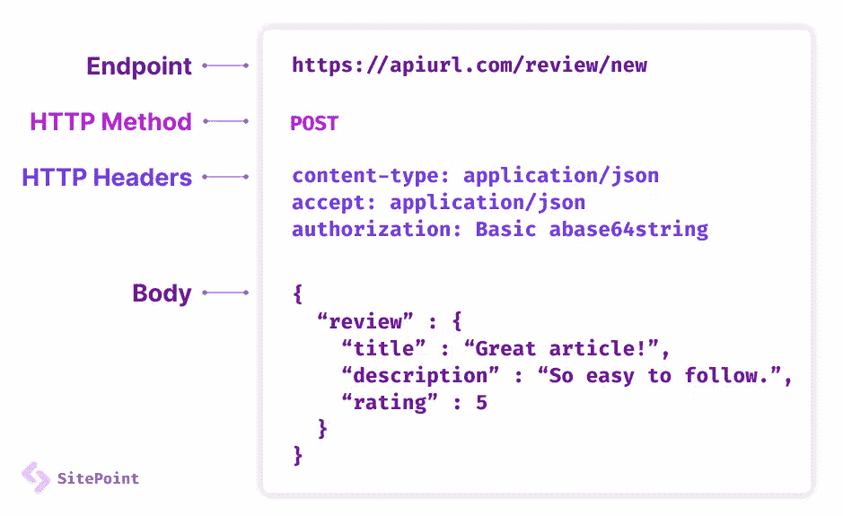

# 什么是 REST API？

> 原文：<https://www.sitepoint.com/rest-api/>

什么是 REST API？REST 是*表述性状态转移*的首字母缩写——对最常用的 web 服务技术的描述几乎毫无意义！REST API 是两个计算机系统使用 web 浏览器和服务器中的 HTTP 技术进行通信的一种方式。

在两个或多个系统之间共享数据一直是软件开发的基本要求。例如，考虑购买汽车保险。您的保险公司必须获得有关您和您的车辆的信息，因此他们从汽车注册机构、信贷机构、银行和其他系统请求数据。所有这些都以透明的方式实时发生，以确定保险公司是否能提供有竞争力的保单。

API(应用程序编程接口)通过为系统之间提供相互通信的接口来帮助系统之间进行这种类型的通信。REST 只是一种被广泛采用的 API 风格，我们用它来以一致和可预测的方式与内部和外部进行通信。这可以与我们过去如何以某种方式发送一封带有邮票、地址和信封的信进行比较，以确保它被投递和阅读。

REST 通常被 web 系统上的人们用来进行交互。例如，在社交媒体应用程序中检索和更新帐户信息。

## REST API 示例

在您的浏览器中打开以下链接，向[开放琐事数据库](https://opentdb.com/)请求一个随机的计算机问题:

[https://opentdb.com/api.php?amount=1&类别=18](https://opentdb.com/api.php?amount=1&category=18)

这是一个作为 RESTful web 服务实现的公共 API(它遵循 REST 约定)。您的浏览器将显示一个带有答案的 JSON 格式的测验问题，例如:

```
{
  "response_code": 0,
  "results": [
    {
      "category": "Science: Computers",
      "type": "multiple",
      "difficulty": "easy",
      "question": "What does GHz stand for?",
      "correct_answer": "Gigahertz",
      "incorrect_answers": [
        "Gigahotz",
        "Gigahetz",
        "Gigahatz"
      ]
    }
  ]
} 
```

您可以使用任何 HTTP 客户端请求相同的 URL 并获得响应，例如 [curl](https://curl.haxx.se/) :

```
curl "https://opentdb.com/api.php?amount=1&category=18" 
```

HTTP 客户端库在所有流行的语言和运行时中都可用，包括 JavaScript 中的 [Fetch、Node.js 以及 PHP](https://developer.mozilla.org/docs/Web/API/Fetch_API) 中的 Deno 和 [file_get_contents()。JSON 响应是机器可读的，因此可以在输出 HTML 或其他格式之前对其进行解析和使用。](https://www.php.net/manual/en/function.file-get-contents.php)

## REST APIs 和其他

多年来，各种数据通信标准不断发展。你可能遇到过的选项包括 [CORBA](https://www.corba.org/) 、 [SOAP](https://en.wikipedia.org/wiki/SOAP) 或者 [XML-RPC](http://xmlrpc.com/) 。大多数建立了严格的信息规则。

Roy Fielding 在 2000 年定义了 REST，它比其他的要简单得多。它不是一个标准，而是 RESTful web 服务的一组建议和约束。其中包括:

*   **客户端-服务器:** SystemA 向 SystemB 托管的 URL 发出 HTTP 请求，后者返回响应。这和浏览器的工作原理是一样的。浏览器请求特定的 URL。该请求被路由到通常返回 HTML 页面的 web 服务器。该页面可能包含对图像、样式表和 JavaScript 的引用，这会引发进一步的请求和响应。
*   **无状态:** REST 是无状态的:客户端请求应该包含响应所需的所有信息。换句话说，应该可以以任何顺序发出两个或更多 HTTP 请求，并且会收到相同的响应(…除非 API 被设计为返回随机响应，如上面的测试示例)。
*   **可缓存:**应该定义响应是否可缓存。缓存可以提高性能，因为不需要为同一个 URL 重新生成响应。特定时间特定用户的私有数据通常不会被缓存。
*   **分层:**请求客户端不需要知道它是否正在与实际的服务器、代理或任何其他中介进行通信。

## 创建 RESTful Web 服务

RESTful web 服务**请求**包含:

1.  **一个端点 URL** 。实现 RESTful API 的应用程序将使用域、端口、路径和/或查询字符串定义一个或多个 URL 端点，例如，`https://mydomain/user/123?format=json`。
2.  **The HTTP method**. Differing HTTP methods can be used on any endpoint which map to application create, read, update, and delete (CRUD) operations:

    | HTTP 方法 | create, read, update, and delete | 行动 |
    | --- | --- | --- |
    | 得到 | 阅读 | 返回请求的数据 |
    | 邮政 | 创造 | 创建新记录 |
    | 放置或修补 | 更新 | 更新现有记录 |
    | 删除 | 删除 | 删除现有记录 |

    示例:

    *   对`/user/`的 GET 请求返回系统上注册用户的列表
    *   对`/user/`的 POST 请求使用主体数据创建一个 ID 为`123`的用户(参见 4。下面)。响应返回 ID。
    *   对`/user/123`的 PUT 请求用主体数据更新用户`123`(参见 4。下面)
    *   对`/user/123`的 GET 请求返回用户`123`的详细信息
    *   对`/user/123`的删除请求删除了用户`123`
3.  **HTTP 头**。诸如[认证令牌](#restapiauthentication)或 cookies 之类的信息可以包含在 HTTP 请求头中。
4.  **身体数据**。数据通常以与 HTML `<form>`提交相同的方式在 HTTP 主体中传输，或者通过发送一个 JSON 编码的数据字符串。



### REST API 响应

**响应**有效载荷可以是任何实用的东西:数据、HTML、图像、音频文件等等。数据响应通常是 JSON 编码的，但是也可以使用 [XML](https://www.sitepoint.com/really-good-introduction-xml/) 、CSV、简单字符串或任何其他格式。您可以允许在请求中指定返回格式—例如，`/user/123?format=json`或`/user/123?format=xml`。

还应该在响应头中设置适当的 [HTTP 状态代码](https://developer.mozilla.org/docs/Web/HTTP/Status)。`200 OK`用于成功的请求，尽管`201 Created`也可以在创建记录时返回。错误应该返回一个适当的代码，比如`400 Bad Request`、`404 Not Found`、`401 Unauthorized`等等。

可以设置其他 HTTP 头，包括 [Cache-Control](https://developer.mozilla.org/docs/Web/HTTP/Headers/Cache-Control) 或 [Expires](https://developer.mozilla.org/docs/Web/HTTP/Headers/Expires) 指令，以指定响应在被认为*过时之前可以被缓存多长时间*。

但是，没有严格的规定。端点 URL、HTTP 方法、主体数据和响应类型都可以按照您喜欢的方式实现。例如，`POST`、`PUT`和`PATCH`经常互换使用，因此任何人都将根据需要创建或更新记录。

## REST API“Hello World”示例

下面的 Node.js 代码使用 [Express framework](https://expressjs.com/) 创建了一个 RESTful web 服务。单个`/hello/`端点响应 HTTP GET 请求。

确保您已经安装了 [Node.js](https://www.sitepoint.com/an-introduction-to-node-js/) ，然后创建一个名为`restapi`的新文件夹。在该文件夹中创建一个新的`package.json`文件，内容如下:

```
{
  "name": "restapi",
  "version": "1.0.0",
  "description": "REST test",
  "scripts": {
    "start": "node ./index.js"
  },
  "dependencies": {
    "express": "4.18.1"
  }
} 
```

从命令行运行`npm install`来获取依赖项，然后用下面的代码创建一个`index.js`文件:

```
// simple Express.js RESTful API
'use strict';

// initialize
const
  port = 8888,
  express = require('express'),
  app = express();

// /hello/ GET request
app.get('/hello/:name?', (req, res) =>
  res.json(
    { message: `Hello ${req.params.name || 'world'}!` }
  )
);

// start server
app.listen(port, () =>
  console.log(`Server started on port ${port}`);
); 
```

使用`npm start`从命令行启动应用程序，并在浏览器中打开`http://localhost:8888/hello/`。响应 GET 请求时会显示以下 JSON:

```
{
  "message": "Hello world!"
} 
```

API 还允许自定义名称，因此`http://localhost:8888/hello/everyone/`返回:

```
{
  "message": "Hello everyone!"
} 
```

## 客户端 REST 请求和 CORS

考虑在 URL `http://localhost:8888/`的浏览器中启动的以下 HTML 页面:

```
<!DOCTYPE html>
<html lang="en">
<head>
<meta charset="UTF-8">
<title>REST test</title>
</head>
<body>
<script> fetch('http://localhost:8888/hello/')
  .then((response) => {
    return response.json();
  })
  .then((json) => {
    console.log(json);
  }); </script>
</body>
</html> 
```

`fetch`调用发出相同的 API 请求，浏览器控制台如您所料显示`Object { message: "Hello world!" }`。

然而，假设您的 RESTful web 服务现在已经在域`http://mydomain.com/hello/`上发布了。页面 JavaScript `fetch()` URL 也相应改变，但是现在在浏览器中打开`http://localhost:8888/`会返回控制台错误**跨源请求受阻**。

出于安全考虑，浏览器只允许客户端 [XMLHttpRequest](https://developer.mozilla.org/docs/Web/API/XMLHttpRequest) 和 [Fetch API](https://www.sitepoint.com/introduction-to-the-fetch-api/) 调用托管调用页面的同一个域。

幸运的是，[跨源资源共享(CORS)](https://developer.mozilla.org/docs/Web/HTTP/CORS) 允许我们绕过这个安全限制。设置一个`Access-Control-Allow-Origin` HTTP 响应头告诉浏览器允许请求。它可以设置为特定的域，也可以设置为所有域的`*`(由上面的测验 API 实现)。

可以更改 web 服务 API 代码，以允许来自任何域上运行的任何客户端脚本的访问:

```
// /hello/ GET request
app.get('/hello/:name?', (req, res) =>
  res
    .append('Access-Control-Allow-Origin', '*')
    .json(
      { message: `Hello ${req.params.name || 'world'}!` }
    )
); 
```

或者，Express.js 中间件函数可以将报头附加到每个端点请求:

```
// enable CORS
app.use((req, res, next) => {
  res.append('Access-Control-Allow-Origin', '*');
  next();
});

// /hello/ GET request
// ... 
```

注意，浏览器向 REST API 发出两个请求:

1.  对同一 URL 的 HTTP `OPTIONS`请求确定`Access-Control-Allow-Origin` HTTP 响应头是否有效
2.  实际的休息呼叫

当您的服务器接收到一个`OPTIONS`请求方法时，它可以设置`Access-Control-Allow-Origin` HTTP 响应头返回一个空响应，以确保工作不会重复。

## REST API 挑战

REST 的成功很大程度上归功于它的简单性。开发人员可以随心所欲地实现 RESTful APIs，但这会带来更多的挑战。要深入了解实现策略，请看一下我们的 [13 个构建 RESTful APIs 的最佳实践](https://www.sitepoint.com/build-restful-apis-best-practices/)。

### 终点共识

考虑以下端点:

*   `/user/123`
*   `/user/id/123`
*   `/user/?id=123`

所有选项都是为用户`123`提取数据的有效选项。当您进行更复杂的操作时，组合的数量会进一步增加。例如，返回姓氏以“A”开头的十个用户，当按出生日期倒序排序时，从记录 51 开始为 companyX 工作。

最终，如何格式化 URL 并不重要，但是 API 之间的一致性非常重要。对于有许多开发人员的大型代码库来说，这可能是一个挑战。

### REST API 版本控制

API 的变化是不可避免的，但是端点 URL 不应该失效，否则会破坏使用它们的应用程序。

API 通常被版本化以避免兼容性问题。例如，`/2.0/user/123`取代`/user/123`。新旧端点都可以保持活动状态。不幸的是，这样就有必要维护多个历史 API。旧版本最终会被废弃，但这一过程需要仔细规划。

### REST API 认证

上面显示的问答 API 是 *open* :任何系统都可以在未经授权的情况下获取笑话。这对于访问私有数据或者允许更新和删除请求的 API 是不可行的。

与 RESTful API 位于同一域的客户端应用程序将像任何其他 HTTP 请求一样发送和接收 cookies。(注意，旧浏览器中的`Fetch()`需要设置`credentials` [初始化选项](https://developer.mozilla.org/docs/Web/API/WindowOrWorkerGlobalScope/fetch#Parameters)。)因此，可以对 API 请求进行验证，以确保用户登录并具有适当的权限。

第三方应用程序必须使用替代的授权方法。常见的[认证选项](https://swagger.io/docs/specification/authentication/)包括:

*   **[HTTP 基本认证](https://swagger.io/docs/specification/authentication/basic-authentication/)** 。包含 base64 编码的 username:password 字符串的 HTTP `Authorization`头在请求头中传递。
*   **[API 键](https://swagger.io/docs/specification/authentication/api-keys/)** 。通过发布可能具有特定权利或被限制到特定域的密钥，第三方应用被授予使用 API 的许可。该密钥在 HTTP 头或 querystring 上的每个请求中传递。
*   **[OAuth](https://oauth.net/)** 。通过向 OAuth 服务器发送客户端 ID 和可能的客户端秘密，在可以进行任何请求之前获得令牌。OAuth 令牌随每个 API 请求一起发送，直到过期。
*   **[【JSON Web 令牌(JWT)](https://jwt.io/)** 。数字签名的身份验证令牌在请求和响应标头中安全传输。jwt 允许服务器对访问权限进行编码，因此不需要调用数据库或其他授权系统。

API 身份验证会因使用环境而异:

*   在某些情况下，第三方应用程序被视为拥有特定权利和权限的任何其他登录用户。例如，地图 API 可以向调用应用程序返回两点之间的方向。它必须确认应用程序是有效的客户端，但不需要检查用户凭证。
*   在其他情况下，第三方应用程序请求个人用户的私有数据，如电子邮件内容。REST API 必须识别用户及其权限，但它可能不关心哪个应用程序正在调用该 API。

### REST API 安全性

RESTful API 提供了另一种访问和操作应用程序的途径。即使它不是一个引人注目的黑客攻击目标，一个行为恶劣的客户端也可能每秒发送数千个请求，使您的服务器崩溃。

安全性超出了本文的范围，但是常见的最佳实践包括:

*   使用 HTTPS
*   使用可靠的[认证方法](#restapiauthentication)
*   使用 [CORS](#clientsiderestrequestsandcors) 将客户端调用限制到特定的域
*   提供最少的功能，也就是说，不要创建不需要的删除选项
*   验证所有端点 URL 和正文数据
*   避免在客户端 JavaScript 中公开 API 令牌
*   阻止来自未知域或 IP 地址的访问
*   阻止意外的大负载
*   考虑速率限制——也就是说，使用相同 API 令牌或 IP 地址的请求被限制为每分钟 N 个
*   用一个适当的 [HTTP 状态码](https://developer.mozilla.org/docs/Web/HTTP/Status)和[缓存](https://developer.mozilla.org/docs/Web/HTTP/Headers/Cache-Control)头来响应
*   记录请求并调查故障

### 多个请求和不必要的数据

RESTful APIs 受到其实现的限制。一个响应可能包含比您需要的更多的数据，或者需要更多的请求来访问所有数据。

考虑一个 RESTful API，它提供对作者和书籍数据的访问。要显示十大畅销书的数据，客户端可以:

*   请求按销售数量排序的前 10 个`/book/`详细信息(首先是最畅销的)。响应包含一个带有每个作者 ID 的图书列表。
*   制作多达 10 个`/author/{id}`请求来获取每个作者的详细信息。

这就是所谓的 **N+1 问题**；n 必须为父请求中的每个结果发出 API 请求。

如果这是一个常见的用例，那么可以修改 RESTful API，使每本返回的书都包含完整的作者信息，比如他们的姓名、年龄、国家、传记等等。它甚至可以提供他们其他书籍的全部细节——尽管这可能会大大增加响应负载！

为了避免不必要的大响应，可以调整 API，使作者信息是可选的——例如，`?author_details=full`。API 作者需要满足的选项数量可能会变得令人困惑。

## GraphQL 修复 REST APIs 了吗？

其余的难题促使脸书创造了 graph QL——一种网络服务查询语言。可以把它想象成 web 服务的 SQL:一个请求定义了您需要什么数据以及您希望如何返回它。

GraphQL 解决了 RESTful APIs 带来的一些挑战，尽管它引入了其他挑战。例如，缓存 GraphQL 响应变得很困难。

您的客户不太可能遇到与脸书类似的问题，因此一旦 RESTful API 发展到超出其实际限制，就值得考虑 GraphQL。

## REST API 链接和开发工具

有许多工具可以帮助所有语言的 RESTful API 开发。值得注意的选项包括:

*   **[Swagger](https://swagger.io/)** :各种帮助设计、文档化、模拟、测试和监控 REST APIs 的工具
*   **[邮差](https://www.getpostman.com/downloads/)**:RESTful API 测试应用
*   Hoppscotch

也有大量的公共 REST APIs 来迎合笑话、货币转换、地理编码、政府数据和你能想到的每一个主题。许多都是免费的，尽管有些要求您注册一个 API 密钥或使用其他身份验证方法。分类列表包括:

*   [任何 API](https://any-api.com/)
*   [API 列表](https://apilist.fun/)
*   [公共 API](https://github.com/public-apis/public-apis)
*   [谷歌 API 浏览器](https://developers.google.com/apis-explorer/)

在实现自己的 web 服务之前，尝试在自己的项目中使用一些 RESTful APIs。或者考虑跟随脸书、GitHub、谷歌和许多其他巨头的脚步，通过[构建自己的 RESTful API](https://www.sitepoint.com/build-restful-apis-best-practices/)。

## 分享这篇文章