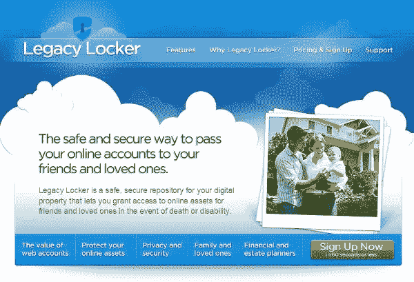

# 安息吧——您的在线遗产将会延续

> 原文：<https://www.sitepoint.com/rest-in-peace-your-online-legacy-will-continue/>

就在你以为你已经看到了一切的时候，遗产柜出现了。这项服务安全地存储所有用户的在线登录数据，以防他们死亡或被禁用。[公告](http://www.prweb.com/releases/2009/03/prweb2216334.htm)今天将 Legacy Locker 描绘成用户的“数字遗产”储存库。但实际上，这项服务只是简单地存储登录和密码数据，以便一个人的继承人或同事可以很容易地访问它们。

Legacy Locker 的联合创始人杰里米·托曼(Jeremy Toeman)将这项服务描述为“在线保险箱”具有讽刺意味的是，这项服务的费用也一样高，每年约 30 美元，终身会员约 300 美元，对我来说，这似乎有点高成本和低价值。

有这么多的服务已经提供了更先进的功能和工具，人们不得不对这样的发展感到惊讶。在密码和登录的情况下，逻辑应该指向闪存驱动器上的备份和真正的保险箱，作为几十个选项之一。在最坏的情况下，我认为任何足智多谋的网民都可以在他们自己的电脑上或谷歌上的某个地方设计出类似的工具。

传统储物柜登录页面

Legacy Locker 确实有一些安全的特性，以及一些有用的工具，虽然有些可怕。其中一个功能是“遗产信件”，允许用户在去世后发送信件。其他功能旨在吸引房地产律师，并解决一系列“死亡或残疾”事件。至于观众，这项服务的目标是一个非常特殊的利基市场，大约有 1250 万有 18 岁以下孩子的美国家庭，他们已经提交了遗嘱。

##### 更好的遗产

一家旨在为个人留下遗产的初创公司应该看起来更像我们之前写过的 [ThisMoment](https://www.sitepoint.com/stream-your-life-completely-with-thismoment/) ，而不是提供为后代保存人们的密码。通过使人们能够通过各种媒体“构建”他们的遗产的图片，并用 512 位加密来保护它(就像 LL 声称的那样)，一些非凡的东西可能会被留下。我猜这家初创公司的“痛点”是很少有人敢想这么做。

##### 创业墓志铭

这家初创公司的生存能力与寿命直接相关。在我看来，如果不能保证用户数据始终可用，除了保护身份和密码之外，这项服务似乎毫无用处。另一个“终结”服务是 MyWonderfulLife，它允许人们计划他们的葬礼。但是，Legacy Locker 没有提供这样的组织能力，老实说，我没有看到数百万人在那里存储他们的银行或商业密码。

至于 Legacy Locker，他们今天肯定从硅谷得到了一些主要报道，特别是考虑到他们[宣布](http://blogs.wsj.com/digits/2009/03/10/now-that-im-dead-whos-going-to-update-my-facebook-status/)他们没有做大的公关宣传？自从我开始写新闻稿以来，鉴于这种“令人惊讶”的报道，毫无疑问，Legacy Locker 今天将会出名，但说服用户为它付费将是另一回事。

## 分享这篇文章