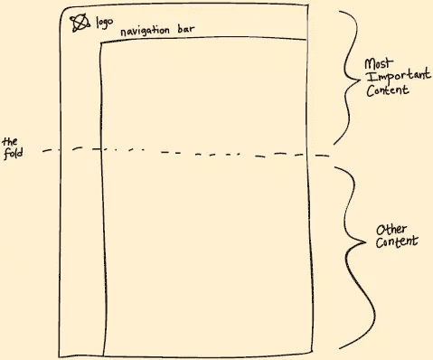
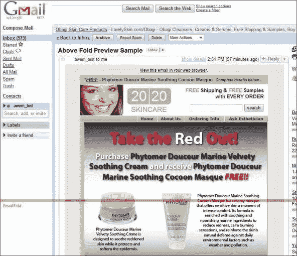
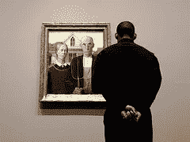
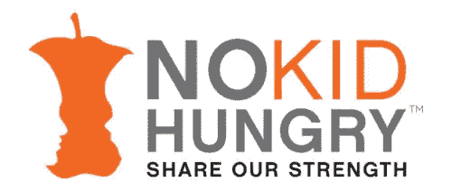

# 如何用好的设计留住用户

> 原文：<https://www.sitepoint.com/retain-users-good-design/>

好的设计是任何成功网站提高用户满意度和参与度的关键。

脸书目前拥有世界上最大的用户群，他说他们留住用户的最重要的方法之一是专注于用户友好的设计(通过[计算机世界](http://www.computerworld.com/s/article/9227032/Study_Facebook_relies_on_good_design_to_retain_users?taxonomyId=11&pageNumber=2));而[谷歌说](http://www.google.com/intl/en/about/company/philosophy/)他们的首要哲学是“专注于用户，其他一切都会随之而来”

显然，谷歌和脸书一直在做一些正确的事情，以成为他们今天的巨头，所以从他们以用户为中心的建议出发，你如何使用好的设计来留住客户？

首先，你可能会问，到底是什么让设计变得用户友好？

### 轻松导航:

导航应该尽可能简单——整合标签、链接页面的路径和链接文本——这样用户就不会在搜索他们需要的信息时感到沮丧。

如果你受困于如何让你的导航尽可能有效，看看
[MarketingProf](http://www.marketingprofs.com/articles/2012/6737/how-to-streamline-site-navigation-to-attract-and-retain-customers) 的用户友好导航的伟大指南。

智能布局:

折叠上下的内容是关键。

高冲击力的视觉效果、重要的项目符号和你的行动号召应该放在页面上方，这样用户一进入你的页面就能看到它们。Tagliaerbe 提供了这些图片示例，展示了如何将文件夹上方和下方的内容分开。

途径:切割机

将任何展开的内容放在文件夹下面，这样用户可以通过向下滚动获得更全面的信息。

换句话说，让用户在第一眼看到你的产品时，就能感受到你的产品，这样他们就会想浏览你的网站，获取更多信息。

### 注意空间:

今天的用户快速浏览，而不是缓慢阅读。

有大量信息的杂乱网站会迷惑和分散用户的注意力，所以确保你的设计是用户友好的，不仅要注意位置，还要注意内容占用的空间。

照片:未经训练的眼睛

去任何一家美术馆，你都不会发现这些画边对边贴在一起。你可能会说，如果墙上的一幅杰作很好，那么两幅一定是两倍好，对吗？

当然，事实并非如此。我们都明白，每件作品周围的负空间使其更加特别。

同样，负空间，或空白，是你设计中的朋友。这是任何未被内容占据的区域，平衡它与包含内容的区域可以创建一个整体上更有效的设计。

负空间可以用来分隔大块的文本、图形和其他冗长的信息，这样用户可以放松下来，轻松地吸收信息。负空间在设计图形或标志时也非常有价值——见下面联邦快递如何有效地使用负空间(通过[六次修改](http://sixrevisions.com/web_design/negative-space-in-webpage-layouts-a-guide/))。

 **伟大。所以，你已经有了基本的东西，你的网站是为了取悦用户而设计的，但是你如何确保你的设计能提高用户的忠诚度和参与度呢？
**

*   Draw their eyes where you want by using highlighted and bolded text and graphics. Direct focus strategically to pull users in.
*   Isolate important information and condense it as much as possible.
*   Use bullet points, subheadings, and graphics to break up text.
*   If you have big chunks of text, make it more manageable and visually appealing with appropriate line spacing.

当然，永远不要忘记你不能读懂你的用户的想法。

一次又一次的测试，了解用户喜欢什么，参与什么，不喜欢什么。可用性测试有助于你了解用户的浏览行为，以及对什么有用什么没用的真实反应。像 [UserTesting](http://www.usertesting.com/) 这样的工具可以让你收集详细的指标，这样你就可以在改进网站设计时整合用户的反馈和体验。

那么，好的设计是如何影响用户体验的呢？

用户下意识地被那些既舒适又易于快速理解的设计所吸引。在你的设计中遵循一些惯例是很重要的。

不要给用户太多惊喜

虽然一个创新的、设计华丽的网站可能会吸引用户的眼球，但如果你偏离他们习惯的东西太远，也会让他们失去兴趣。

既定的网页设计准则是基于可靠的浏览习惯，遵循这些准则会让用户感觉舒适和熟悉。

看看流行的网站——大多数网站都没有偏离标准设计规则太远，比如在右手边有登录按钮，在顶部有导航标签，在左边有链接标志，可以链接到更多的公司信息。

想象一下，如果你到达一个网站，登录按钮隐藏在底部，标签在侧面，你会有多困惑。

不要给用户太多惊喜，否则你可能会拒绝他们。

#### 但是，出于同样的原因，不要害怕尝试新的东西

脸书怎么知道它的用户想要什么？通过有时尝试用户还不知道他们想要的东西。正如亨利·福特所说的那样。*如果我问人们想要什么，他们会问一匹更快的马*。

脸书有时会慢慢推出引人注目的设计变化，并允许用户在开始时选择加入，这样他们就可以利用用户的反馈进行相应的调整。

所有的网页设计支柱——三栏设计、登录面板、模态窗口——都曾经是新颖的、打破常规的设计理念。

Pinterest 风格的图片墙是一种新颖的、非标准的设计成为新模式的最新例子。

历史告诉我们，大多数激进的设计“突变”最终都会成为新奇事物、脚注和有趣的实验。

但是，这些设计变化中的极小一部分在正确的时刻找到了正确的方向，并在很短的时间内成为一种新的设计模式，被其他人效仿。

## 分享这篇文章