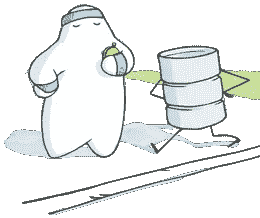

# Ruby 中的 rethink db:Map Reduce 和 Joins

> 原文：<https://www.sitepoint.com/rethinkdb-ruby-map-reduce-joins/>



[上次在](https://www.sitepoint.com/rethinkdb-ruby/ "First RethinkDB post")左右，我们讲述了 RethinkDB 的一些基础知识:安装它，查询它，插入文档——所有这些都使用 Ruby 驱动程序。在本文中，我们将深入了解 RethinkDB 的一些特性。在我们开始之前，您应该已经安装并运行了 RethinkDB。

## MapReduce

假设我们有一组分布在一组节点上的数据。我们试图对这些数据进行某种计算。应该怎么做？一个显而易见的解决方案(这显然也不好)是试图将所有数据移动到一个运行算法的节点，以便获得我们需要的信息。这是一个可怕的想法，原因有很多:

*   我们可能在单个节点上没有足够的存储
*   这将占用大量带宽等。

那么，我们如何利用所有这些节点呢？那么，编写算法，以便它可以在集群中以并行方式运行。不幸的是，没有任何“指导方针”，这可能是一个相当困难的任务。例如，如果在我们运行算法时，其中一个节点出现故障，该怎么办？我们如何划分数据集，使所有节点各尽其责？

过去，当谷歌的研究人员/开发人员遇到这些问题时，他们开发了一个名为 MapReduce 的框架。本质上，MapReduce 迫使你以某种方式构建算法，作为回报，它可以处理系统故障等。给你的。有了 MapReduce，无论您的代码是运行在一个节点上还是一千个节点上，它都保持不变。原来，RethinkDB 包含一个 MapReduce 实现，它允许您以一种高效的方式将计算应用到数据集。

那么，MapReduce 是如何工作的呢？假设我们试图对许多数据进行操作，并将它们都放在一个列表中。MapReduce 范式由两个步骤组成(RethinkDB 引入了一个称为*分组*的独立步骤，我们将在后面讨论):map 和 Reduce。Map 就像`map` Ruby 方法一样，取一个列表，对其进行操作，然后吐出另一个列表。Reduce，就像 Ruby 中的`reduce`一样，接受一个列表，然后“提炼”出一个值。如果您使用这些“map”和“reduce”片段编写算法，RethinkDB 将会找出如何有效地分割计算(通过表和碎片)。

## 包括…在内

让我们举一个非常简单的例子，非常类似于[文档](http://rethinkdb.com/docs/map-reduce/)，它(不幸地)聚焦于 Python。还记得我们上次在周围做的[的“人”表吗？你当然不知道。所以，让我们再把它放在一起。记住，对于这里提到的任何`irb`命令，必须具备以下条件:](https://www.sitepoint.com/rethinkdb-ruby/ "First RethinkDB post")

```
require 'rethinkdb'
include RethinkDB::Shortcuts
conn = r.connect(:host => "localhost", :port => 28015)
```

好吧，让我们做张桌子，放些东西进去:

```
r.db_create("testdb").run(conn)
r.db("testdb").table_create("people").run(conn)
r.db("testdb").table("people").insert({:name => "Dhaivat", :age => 18, 
    :gender => "M"}).run(conn)
r.db("testdb").table("people").insert({:name => "John", 
    :age => 27, :gender => "M"}).run(conn)
r.db("testdb").table("people").insert({:name => "Jane", 
    :age => 94, :gender => "F"}).run(conn)
```

如果您已经在 RethinkDB 中设置了正确的结构，其中一些调用可能会失败。

好吧，假设我们想要计算`people`表中文档的数量。我们如何用 map-reduce 来做到这一点(RethinkDB 实现用小写字母表示；Google 的实现是“MapReduce”)？我们的 map 操作将获取包含表中每个文档的列表中的每个元素作为输入。我们将把它转换成一个 1 的列表，然后 reduce 操作将它们相加并产生一个数。代码非常简单:

```
map_op = Proc.new { |person| 1 }
reduce_op = Proc.new { |val_a, val_b| val_a + val_b }
r.db("testdb").table("people").map(map_op).reduce(reduce_op).run(conn)
```

这应该很好地给出“3”(当然，如果表中有三个文档)。就语法而言，前两行只是普通的 Ruby 代码，但是有一些事情需要注意。如前所述，`map_op`只有一个参数:map 操作是将序列中的每个元素映射到结果序列中的一个元素。`reduce_op`获取由`map`生成的两个 1，并将它们相加。然后，我们通过将过程分别传递给`map`和`reduce`来构造一个查询。

如果我们想计算年龄的总和呢？简单:

```
map_op = Proc.new { |person| person["age"] }
reduce_op = Proc.new { |val_a, val_b| val_a + val_b }
r.db("testdb").table("people").map(map_op).reduce(reduce_op).run(conn)
```

基本上唯一的区别就是`map`返回年龄而不是`1`。事实证明，有一种更简单的方法来完成这两项任务:`count`和`sum`方法。看一看:

```
r.db('testdb').table('people').count().run(conn)
r.db('testdb').table('people').sum("age").run(conn)
```

当我们在现有的 [API](http://rethinkdb.com/api/ruby/) 中找不到等效的东西时，我们应该使用 map-reduce 查询。map-reduce 范式非常强大，但如果我们能找到已经完成这项工作的东西，这多少是一种不必要的痛苦——你会惊讶于仅仅`count`、`sum`、`avg`和`filter`能让你走多远。

## 分组

让我们倒回去一点。映射步骤获取列表/序列中的每个元素。如果我们想以一种特殊的方式对元素进行分组呢？例如，也许我们想统计女性和男性的数量。这就是我们使用分组的地方。学习它的最好方法是看它的实际应用:

```
group_op = Proc.new { |person| person['gender'] }
r.db('testdb').table('people').group(group_op).count.run(conn)
```

proc `group_op`为序列中的每个元素返回一个键，每个元素根据其键进行分组。在本例中，我们基于性别创建组，因此我们使用`person['gender']`作为键。然后，我们使用 count 函数对每个分组中的元素进行计数。结果应该是这样的:

```
{"F"=>1, "M"=>2}
```

如果您不想使用`count`实用函数，我们可以使用我们之前定义的相同的`map_op`和`reduce_op`进程:

```
map_op = Proc.new { |person| 1 }
reduce_op = Proc.new { |val_a, val_b| val_a + val_b }
r.db("testdb").table("people").group(group_op).
    map(map_op).reduce(reduce_op).run(conn)
```

`map_op`现在对每个组中的每个元素进行操作，而不是对序列/列表中的每个元素进行操作。然后，`reduce_op`将每个组减少到我们在输出中看到的一个值。

## Hadoop

如果您是 Hadoop 用户或者听说过 Hadoop，您可能会想知道:RethinkDB 上的 map-reduce 与 Hadoop 中的有何不同？其中一个核心原因是 Hadoop 是针对非结构化“blob”数据的。Hadoop 分布式文件系统(HDFS)设置为一次读取 64MB 数据块，侧重于基于文件的访问。另一方面，RethinkDB 是一个文档存储库，它“理解”文档的结构。一般来说，RethinkDB 应该用作后端，您可以不断地将内容放入其中并从中进行查询(例如，直接连接到 web 应用程序)，Hadoop 可以用于对 RethinkDB 中保存的数据进行批处理。

## 连接

让我们彻底改变一下。如果您以前使用过任何类型的 SQL 数据库，您可能对“连接”很熟悉。它们从两个独立的表中获取信息，然后将它们组合起来，产生一组包含两个表中的组件的信息。我们最常看到它们与我们存储的事物之间的关系。例如，如果每个人可以有许多宠物，这就是一个一对多的关系，我们可以使用一个表连接。这是一个很好的例子，所以我们将看看如何在 RethinkDB 中建模。让我们首先创建正确的表:

```
r.db('testdb').table_create('pets').run(conn)
```

获取“people”表中文档的 id:

```
itr = r.db('testdb').table('people').run(conn)
itr.each do |document|
    p document["id"]
end
```

挑一个身份证。我们将创建一只宠物，它的主人来自 people 表:

```
person_id = <picked id goes here>
r.db("testdb").table("pets").
    insert({:name => "Bob", :animal => "dog",
    :person_id => person_id}).run(conn)
```

每个人可以养一只或多只宠物。所以，每只宠物都必须有一个主人，并且可以为那个主人存储`id`。我们最终在每个 pet 文档中都有一个名为“person_id”的字段。我们可以按如下方式创建连接:

```
r.db('testdb').table("pets").
    eq_join("person_id", r.db("testdb").table("people")).run(conn)
```

在这里，我们正在跟踪`eq_join("person_id", r.db("testdb").table("people"))`。这告诉 RethinkDB 我们正在尝试将“pets”表中的`person_id`连接到“people”表中的主键。应该会吐出类似这样的东西:

```
[{"left"=>
   {"animal"=>"dog",
    "id"=>"bfc9d1c1-442a-40d0-a58c-93641fe45ffb",
    "name"=>"Bob",
    "person_id"=>"6cf24b3d-aa75-4e8c-be88-868c74099ded"},
  "right"=>
   {"age"=>94, "id"=>"6cf24b3d-aa75-4e8c-be88-868c74099ded", "name"=>"Jane"}}]>
```

“左”侧表示包含相关 ID 的一侧(在本例中为`person_id`),“右”侧包含另一侧。我们可以很容易地将表示扁平化:

```
r.db('testdb').table("pets").
    eq_join("person_id", r.db("testdb").table("people")).
    zip.run(conn)
```

我们所做的只是添加了一个对`zip`的调用。现在，我们得到一个迭代器，表示:

```
[{"age"=>94,
  "animal"=>"dog",
  "id"=>"6cf24b3d-aa75-4e8c-be88-868c74099ded",
  "name"=>"Jane",
  "person_id"=>"6cf24b3d-aa75-4e8c-be88-868c74099ded"}]
```

厉害！我们基本上已经将两个表中的信息结合在一起，就像我们希望的那样。

## 包装它

我希望您喜欢这篇关于 RethinkDB 的一些特性的概述(以及与其他系统的一些比较)。在下一篇文章中，我们将看看如何使用 RethinkDB 作为后端来构建一个 web 应用程序。

请在下面的评论区提出问题。

## 分享这篇文章