# 使用 Photoshop 对肖像进行微妙的修饰

> 原文：<https://www.sitepoint.com/retouching-a-portrait-with-subtlety-using-photoshop/>

修饰图像是摄影的主要部分，也是任何设计项目的常见组成部分。无论你是为一个印刷项目拍摄模特，还是[润色登陆页面的图像](https://www.sitepoint.com/build-great-landing-pages-by-color-matching-photos-in-photoshop/ "Build Great Landing Pages by Color Matching Photos in Photoshop")，几乎总会有一些简单的方法将你的照片从好的变成*棒的*。

但是，“伟大”可能是一个主观的术语，尤其是在摄影领域。有几件事你可以做，以确保一张照片的主题看起来最好。修饰模特的首要规则是微妙；你不希望你的照片出现 PS。如果主题有一些突出的负面特质，关键是减少它们的影响，而不是完全消除它们。

下图可以在这里找到[。主体的皮肤有许多瑕疵，但没有太多的瑕疵会使这张照片难以处理。](http://www.sxc.hu/browse.phtml?f=download&id=859583)

[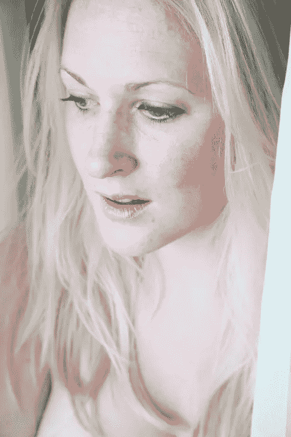](https://www.sitepoint.com/wp-content/uploads/2012/06/Screen-shot-2012-06-11-at-12.22.14-AM.png)

我们的第一步是去除主要的难看的瑕疵。这将包括丘疹，抓痕，以及其他任何不是永久特征的东西。要做到这一点，选择斑点愈合画笔工具，并设置选项来创建纹理。您的第一反应可能是选择令人惊叹的内容感知选项，但这有时会导致问题，因为它会从不需要的区域引入颜色和样本。下面，我强调了一些问题领域:

[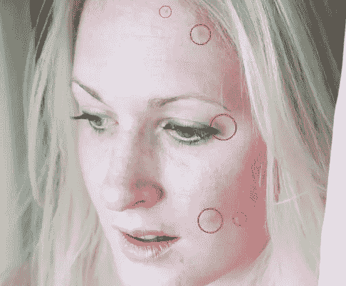](https://www.sitepoint.com/wp-content/uploads/2012/06/Screen-shot-2012-06-11-at-12.33.12-AM.png)

只需点击你想要去除的瑕疵。切记不要全部去除，尤其是永久性的特征，比如痣或者胎记。我尽可能多的留了雀斑，因为这是天生的特征。结果如下所示:

[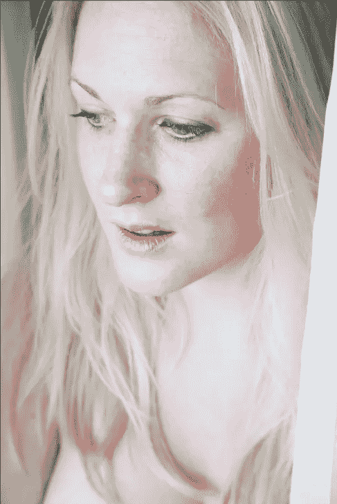](https://www.sitepoint.com/wp-content/uploads/2012/06/Screen-shot-2012-06-08-at-1.47.16-AM.png)

接下来我们就来提亮眼睛。有两种方法可以做到这一点。第一种方法是选择减淡工具，点击每只眼睛的颜色部分。一次或两次单击应该足以使眼睛变亮，而没有任何负面副作用。你可以选择降低减淡工具的不透明度到 50%，这样你就可以稳定地增加眼睛的亮度。

另一种方法是选择画笔工具——白色作为你的前景——并选择一个软边圆形画笔。直接在每只眼睛的瞳孔上绘画，设置不透明度为 20%，混合模式为叠加。

[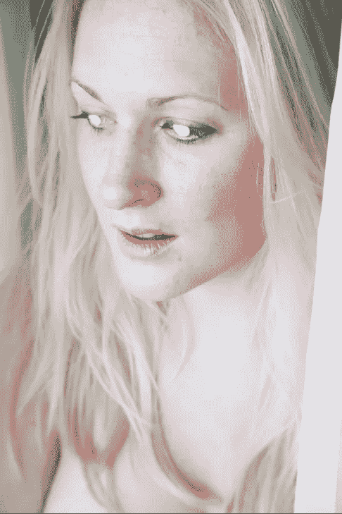](https://www.sitepoint.com/wp-content/uploads/2012/06/Screen-shot-2012-06-08-at-1.15.09-AM.png)
[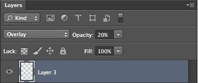](https://www.sitepoint.com/wp-content/uploads/2012/06/Screen-shot-2012-06-08-at-1.15.36-AM.png)

这应该会使眼睛变亮，而不会使图像的高光区域溢出。

[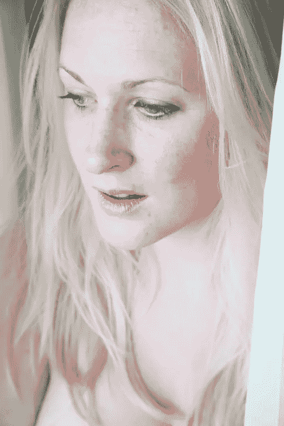](https://www.sitepoint.com/wp-content/uploads/2012/06/Screen-shot-2012-06-06-at-12.43.40-AM.png)

接下来，我们将通过点击 Command/Ctrl + "J "来复制原始的背景层。选中复制的图层，右键点击图层，选择“转换为智能对象”现在，当我们将滤镜应用于该层时，它会将智能滤镜应用于该层，允许我们返回并重复编辑调整。

接下来，应用模糊复制层，使皮肤变得更加平滑。进入“滤镜”>“模糊”>“表面模糊”将半径设置为大约 45 像素，将阈值设置为大约 15 级。这应该给我们适量的模糊来软化和光滑皮肤。设置这一层的不透明度为 60-70%左右。我们降低不透明度的原因是为了让一些瑕疵显示出来，以及一些皮肤纹理。

[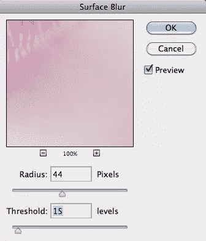](https://www.sitepoint.com/wp-content/uploads/2012/06/Screen-shot-2012-06-08-at-1.33.21-AM.png)

[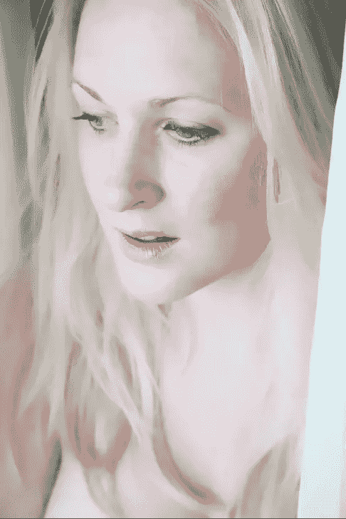](https://www.sitepoint.com/wp-content/uploads/2012/06/Screen-shot-2012-06-08-at-1.50.56-AM.png)

从上面的结果可以看出，表面模糊滤镜在平滑皮肤方面做得很好，但它也平滑了头发和图像中的其他所有东西，几乎给了事物一个绘画的外观。要将所有东西重新聚焦，请使用快速选择工具，单击并拖动主体的面部。使用智能滤镜时，Photoshop 会为该滤镜创建一个蒙版。选择女人的脸，按 Command/Ctrl + Shift + "I "来反转选择。然后，选择智能滤镜蒙版，用黑色填充选区。这将从头发和其他我们不想影响的区域中移除智能模糊滤镜。

图像作为一个整体被洗去，可以使用级别调整。转到“图层”面板，单击“新建调整图层”图标，然后选择“色阶”。在“调整”面板中，移动直方图上的滑块，直到它们到达颜色信息。这个调整可能有点太苛刻了，所以我们将调整层的不透明度降低到 80%。

[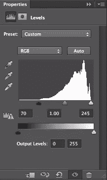](https://www.sitepoint.com/wp-content/uploads/2012/06/Screen-shot-2012-06-10-at-11.28.18-PM.png)

[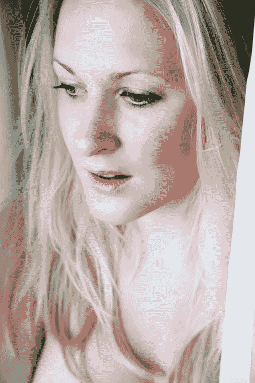](https://www.sitepoint.com/wp-content/uploads/2012/06/Screen-shot-2012-06-10-at-11.29.40-PM.png)

嘴唇有点暗，所以我们会让它们亮一点。这里要记住的关键是微妙。去你的背景层，选择嘴唇周围。请务必忽略牙齿，因为我们将要使用的效果将在每个选定的像素上工作。

[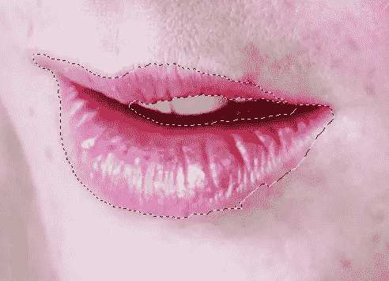](https://www.sitepoint.com/wp-content/uploads/2012/06/Screen-shot-2012-06-10-at-11.59.58-PM.png)

按 Command/Ctrl + "J "复制选区到它自己的图层上，移动新图层到模糊的皮肤图层上使它可见。

[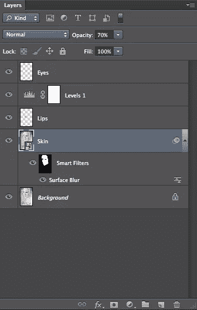](https://www.sitepoint.com/wp-content/uploads/2012/06/Screen-shot-2012-06-11-at-12.03.03-AM.png)

接下来，我们将运行一个塑料包装过滤器，给嘴唇一个自然光滑的外观。前往“滤镜”>“滤镜库”一个大的对话框将出现我们的活动层的预览。点击“艺术”并选择“塑料包装”将高光强度设置为 15，细节设置为 1(最低)，平滑度设置为 7。将平滑度设置为中间点将获得平滑、有光泽的外观，同时留下波纹，就像您在湿嘴唇上看到的波纹一样。

[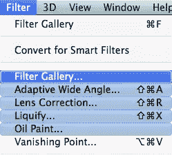](https://www.sitepoint.com/wp-content/uploads/2012/06/Screen-shot-2012-06-11-at-12.06.33-AM.png)

[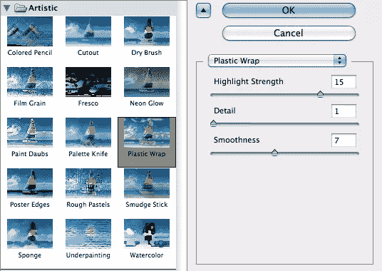](https://www.sitepoint.com/wp-content/uploads/2012/06/Screen-shot-2012-06-11-at-12.14.39-AM.png)

嘴唇应该有光泽的外观，但看起来会太粗糙，不微妙。因此，设置混合模式为“叠加”，图层的不透明度大约为 50%。这个可能不一样，看你的形象。

[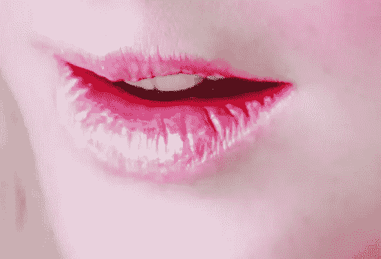](https://www.sitepoint.com/wp-content/uploads/2012/06/Screen-shot-2012-06-11-at-12.19.02-AM.png)

经过微妙的修饰，我们的肖像看起来更加生动，同时保持自然。这位女性拥有相对光滑的皮肤，同时保持皮肤的质地。以下是最终结果:

[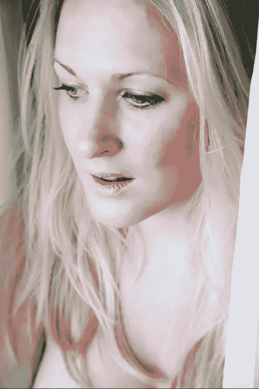](https://www.sitepoint.com/wp-content/uploads/2012/06/Screen-shot-2012-06-11-at-12.39.39-AM.png)

### 结论

当处理肖像图像时，遵循一些准则是很重要的。记住减少某些缺陷，而不是消除它们。此外，降低混合皮肤层的不透明度，以便保留皮肤中的一些细节，避免超平滑、明显经过 PS 处理的外观。如果你添加颜色到某些区域，使用颜色混合模式，只添加少量的颜色。如果你遵循这些简单的指导方针，你的肖像会看起来干净、自然、专业。

你对细微的图像调整有什么建议吗？你的客户更喜欢自然的图像外观，还是更喜欢有光泽的、超风格的、“PS 过的”外观？

## 分享这篇文章