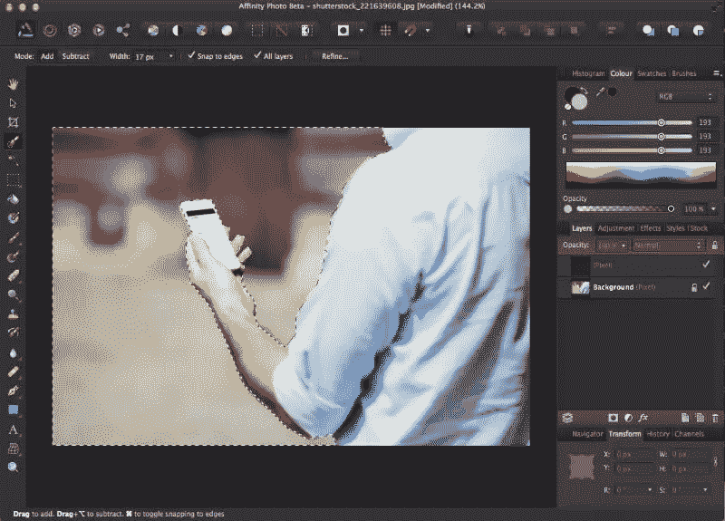
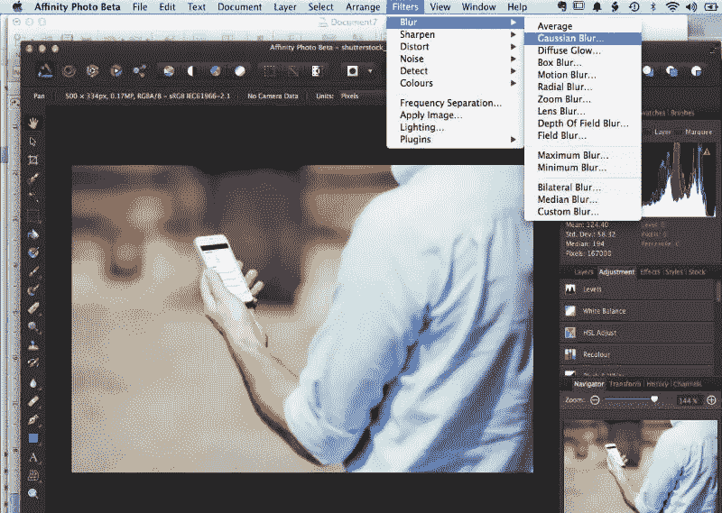
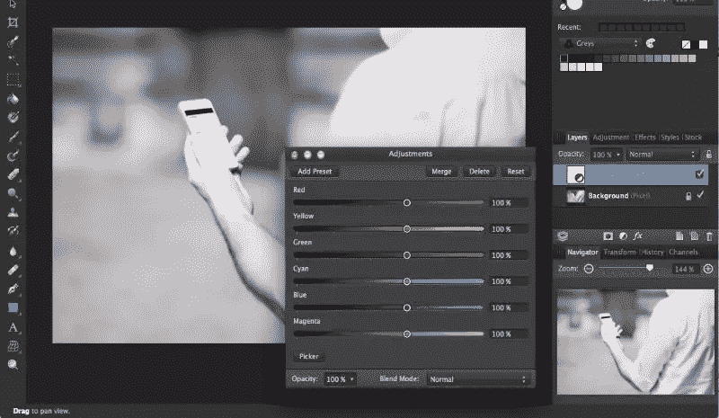
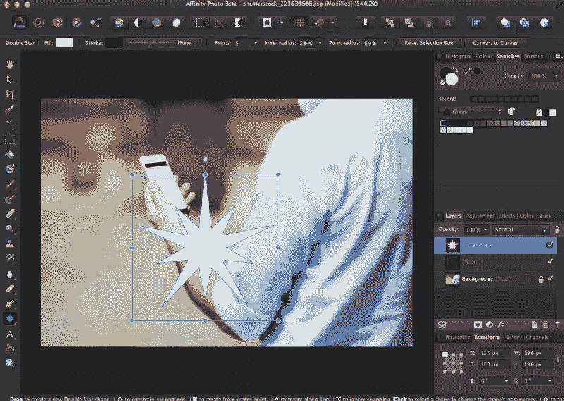
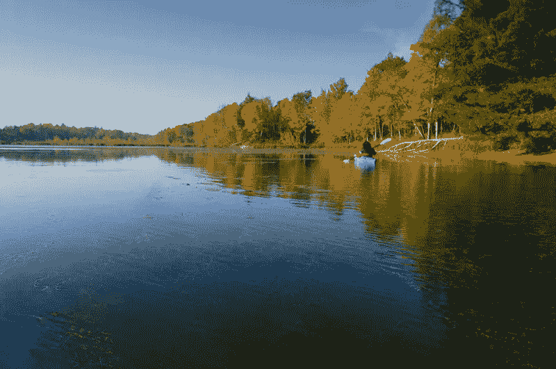
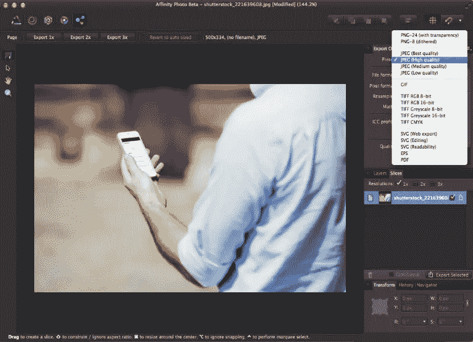

# 评论:亲和力照片-一个新的图像编辑器竞争者？

> 原文：<https://www.sitepoint.com/review-affinity-photo-image-editor/>

许多价格合理的图像编辑程序的问题是，它们缺乏专业人员完成工作所需的许多功能。当你牺牲价格的时候，你通常会牺牲你期望看到的功能。

Affinity Photo 是一款新的图像编辑器，它打破了这一概念，价格合理，拥有高成本照片编辑器的所有功能。我发现，当与现有的图片编辑器进行并排比较时，两者非常接近——非常接近。

Affinity Photo 是由 [Serif](http://www.serif.com/# "Serif Software") 开发的一个程序，这家公司也是 Affinity Designer 的开发者，Affinity Designer 是相当于 Adobe Illustrator 的矢量图形。他们的新程序 Affinity Photo 相当于 Photoshop。

在我们继续下去之前，请注意 Serif 目前只做 Mac 软件，而且在可预见的未来也没有改变的前景。

让我们看看亲和照片和它的特点。

## 速度

当启动 Affinity Photo 时，我注意到的第一件事是纯粹的速度。我用的是 15 英寸的 Macbook Pro，16GB 内存，1TB 混合硬盘。

作为一个粗略的比较，我的 Photoshop 安装通常需要 45 秒到 2 分钟才能启动并开始运行。亲和照片需要 10-20 秒。

处理不同的任务也更快。滤镜和效果是实时应用的。我一个接一个地使用滤镜，从未体验到停顿或“沙滩球”效果。一切运行顺利如丝。

Affinity Photo 的制造商 Serif 声称，这是因为他们利用硬件来充分发挥机器的性能。他们的目标是让他们的软件尽可能高效地运行。

## 选区和遮罩

Affinity 有一个很棒的功能，可以使用画笔进行选择，也可以使用不同的设置来优化选择。我发现这是 Photoshop 中的一个基本功能，在 Affinity Photo 中看到它非常棒。您也可以在图像上绘制遮罩，从而轻松组合图像和创建分层布局。

## 过滤

我喜欢 Affinity Photo 的滤镜，因为它拥有你需要的一切，没有臃肿。当您运行过滤器时，您通常会做 4 件事情中的 1 件。您可能会模糊图像、锐化图像、扭曲图像或去除噪声。亲和照片也有灯光效果。

## 层

图层工作起来就像 Photoshop 或几乎任何标准图形编辑器中的图层一样。我使用 Photoshop 已经大约 15 年了，这种转变只花了几分钟。您可以堆叠层并重新排列它们。您可以更改图层的不透明度并锁定它们，因此您有很大的灵活性。

## 图层效果

Photoshop 最重要和最广泛使用的功能之一是图层样式。亲和照片有那些，叫图层效果。您有内发光、外发光、内阴影、外阴影、高斯模糊、轮廓、斜面和浮雕、颜色叠加和渐变叠加。应用效果后，您可以双击“fx”图标返回并编辑它们。

## 混合模式

混合模式可用，这对于应用颜色效果以及组合图像和效果非常有用。你会发现所有你希望的典型混合模式，如乘法，变暗，屏幕，叠加，等等。

## 调整

它们就像调整层一样工作，保持完全可编辑。必要时，您可以返回并进行更改。调整的好处在于，您可以将设置存储为预置以备后用。

你有所有典型的调整层，如色调/饱和度，黑白，色调，通道混合器，曝光，曲线，梯度地图，阈值，水平和亮度/对比度。如果你用 Photoshop 的时间和我一样长，那么你会认出所有这些。

## 形状

老实说，在 Affinity Photo 中处理形状比在大多数像素编辑器中更容易。已经有很多预设了，你也可以自己画。

预设有编辑手柄，使调整变得容易。上面截图中的橙色圆点允许你同时编辑所有内部点和所有外部点。它很快，你不必单独选择每个点。它甚至会给你指引，让你知道什么时候事情会变好。

编辑形状很容易，有很多很棒的选项。您可以点按一个选项以将预设形状更改为曲线，在曲线中您可以单独编辑每个锚点。您可以使用界面顶部的工具将锚点更改为圆形，根据您的指定捕捉点，以及平滑和连接路径。

## 修补

虽然“修复”这个词对我们大多数人来说可能没有什么意义，但你可能会通过它在 Photoshop 中的名字——“内容感知填充”来识别这个功能。此功能允许您对选区周围的像素信息进行采样，将其混合在一起，并生成填充。

它在 Affinity Photo 中有一个不同的名称，但看起来工作得一样好，正如你可以从之前和之后的例子中看到的那样。

修复:独木舟被删除，由自动生成的湖面代替。

修复:在这个例子中，原始镜头有一个独木舟船头填充前景。

## 个人的

那么，什么是人物角色？这有点像执行特定任务的模块。

Affinity Photo 使用人物角色执行特定任务，如编辑照片、执行液化滤镜、冲洗相机原始照片、对图像执行特定效果(如色调映射和滤镜预设)以及以特定格式导出图像。

这是一个让你的所有任务紧凑有序的好方法。这也可以让你专注于特定的任务而不会分心。

## 导出图形

Affinity Photo 专门开辟了一个版面来输出不同用途的图像。你所有的出口需求都在一个地方，让事情变得简单。默认情况下，您可以 1 倍、2 倍和 3 倍的倍率导出图像。此外，您可以导出不同格式的图形。

#### 联合图像专家组

正如您所料，您可以根据项目需要以不同的质量导出图像。您可以将它们以最佳或高质量导出用于打印，或者以中低质量导出用于 web。你也可以改变质量，以及颜色模式。能够在导出过程中从 RGB 转换到 CMYK 是有意义的。

#### PNG

Affinity Photo 支持 PNG 8 和 PNG 24 透明。这允许您为 web 创建全透明的全彩色图像。您也可以从 Affinity 界面的这一部分导出灰度 png。

#### GIF 格式

Affinity Photo 使您能够创建具有您期望的所有颜色设置的 GIF，在一个 GIF 中有 2 到 256 种颜色。您可以从不同的调色板中进行选择，从自动和 web safe 到您自己的自定义调色板。

#### 争执

您可以导出 TIFF 格式的图像，从 RGB 到灰度和 CYMK TIFFs。

#### 挽救（saving 的简写）

这个功能在 Photoshop 中期待已久，很高兴能在 Affinity Photo 的测试版中找到。您可以将矢量图形导出为不同格式的 SVG 文件。您可以自定义和调整您的设置。

#### EPS

对于 postscript 打印，可以使用 EPS 格式，导出图像时会有几个设置。

#### 便携文档格式

pdf 是世界上最常查看和支持的文件格式之一。您可以将图像和文件导出为 pdf 格式，这样您就可以轻松地向客户发送快速校样。

## Affinity Photo 和 Photoshop 的区别

截至目前，Photoshop 中有一些扩展功能是 Affinity Photo 中没有的。

没有像 Photoshop 里面的 3D 功能，这很好，因为我怀疑大多数设计师不会经常使用这个功能。Affinity Photo 的蒙版功能可以使用更多的可见性，因为事后编辑实际的蒙版可能会有点乏味。

## 结论

亲和力真正闪光的地方是它的速度和价格。绝对实惠，性能也很壮观。它速度快，组织良好，几乎拥有大多数图像编辑日常所需的一切。它拥有完成工作所需的所有画笔，并具有许多定制功能。

如果你正在寻找一个高质量的图像和图形编辑器，而不是一个沉重的价格标签，亲和力照片是一个伟大的选择。

## 分享这篇文章