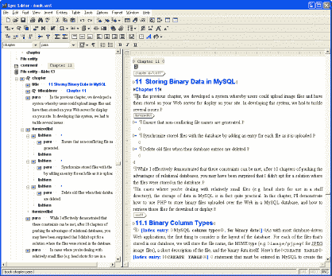
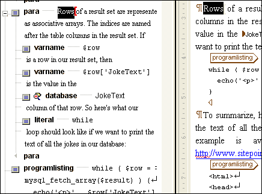
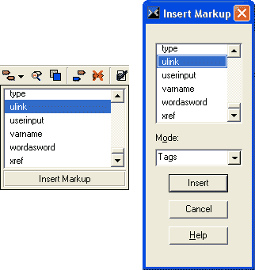
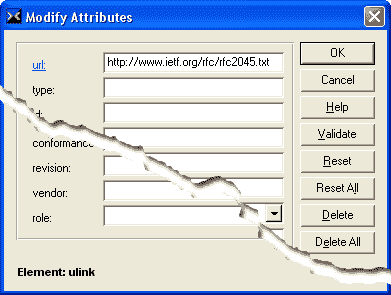

# 回顾 Epic 编辑器 4.0

> 原文：<https://www.sitepoint.com/review-epic-editor-4-0/>

当我为 SitePoint 的新书出版业务研究 XML 内容创作软件时，这类工作的流行选择似乎是 Adobe Framemaker 7。在其最新版本中进行了改进，以提供对 XML 文档的所见即所得编辑，这似乎是一个有希望的领先优势。

不幸的是，Framemaker 的起源是一个非标准文件格式的编辑器。要在 Framemaker 中编辑现有的 XML 内容，您必须将该内容导入 Framemaker 结构化文档格式，然后在完成后再次将其导出为 XML。这些导入和导出过程，以及给定文档类型的编辑器的行为，都是由“编辑工具包”决定的。不幸的是，Adobe 在很大程度上把为您可能想要编辑的任何 XML 文档类型创建编辑工具包的任务留给了您。

特别是，我们对编辑 [DocBook](http://www.docbook.org/) 格式的 XML 内容感兴趣。Framemaker 附带了一个 DocBook 编辑工具包，但它有一些错误，使它无法在导入时读取有效的文档，并导致它在导出时生成无效的文档。

##### 进入:史诗编辑器

Arbortext Epic Editor 提供了同样的 WYSIWYG 编辑功能，但是直接处理 XML 文档。Epic Editor 没有影响作品的导入/导出过程，并且从头开始设计了一个允许作者生成有效 XML 文档的环境，因此它真正设立了一个 Framemaker 可望而不可及的标准。

乍一看，Epic Editor 的界面看起来很像普通的文字处理器，最明显的例外是窗口左侧的文档结构图。文档结构图显示文档的标签、属性和内容的结构视图。默认情况下，它与主编辑器视图同步滚动，因此您可以一眼看到您正在处理的特定文档区域的结构。您甚至可以在文档结构图中编辑您的文档。对于不太懂技术的用户，文档结构图可以完全隐藏。

然而，一旦你开始使用 Epic Editor，你会很快意识到这个现代的文字处理器界面掩盖了一个隐藏在表面下的光滑的 XML 编辑器。

##### 便捷的快捷方式和易用性

一旦你习惯了可用的键盘快捷键，在 Epic Editor 中标记高度结构化的内容将会是一种惊人的高效体验！

最常用的功能已经特别集成，以便您可以快速完成它们。例如，插入一个新元素(标签)只需要按回车键。这将弹出一个按字母顺序排列的弹出菜单，其中包含可以合法添加到光标位置或当前选择周围的所有元素。该弹出窗口的顶部还包括一个可以在当前位置执行的常见结构任务列表，例如将一个段落一分为二。

在复杂的文档类型(比如 DocBook XML)中，元素的菜单可能非常广泛，因此存在额外的元素插入方法。

如果您键入 Ctrl-I，会出现一个包含相同元素菜单的小弹出窗口，这次是在一个可滚动列表中。键入您想要插入的元素名称的前几个字母将直接把您带到列表中的条目，因此您可以通过按 Enter 键来插入它。例如，要在 DocBook 文档中快速插入一个<function>标签，只需键入“Ctrl-I，F，U，Enter”。如果在输入元素名称时出错，只需暂停片刻，然后重新开始输入名称。</function>

##### 插入标记功能

最后，还有完整的“插入标记”对话框，可通过工具栏按钮访问。除了刚才描述的合法标签的键盘搜索列表之外，它还允许您插入处理指令、文本实体和其他 XML 标记。

标签属性的编辑可以通过一个简单而有效的对话框界面来实现。

键入 Ctrl-A 将打开一个对话框，其中列出了当前元素的可能属性(还提供了一个工具栏按钮)。必需的属性会突出显示，具有一组固定可能值的属性会显示为下拉列表。当您插入具有必需属性的新元素时，属性对话框会自动出现，以便您轻松输入它们。

最强大的结构特性之一是支持拖放编辑。想在文档中的其他位置移动一个节吗？只需在文档结构图中将它的图标拖到您想要移动它的位置，然后放开它。鼠标光标在拖动操作过程中会发生变化，以指示合法和非法的放置位置，以及编辑器将自动插入新元素以使拖动的元素合法的位置。

##### 文字处理功能

所有这些 XML 编辑能力，Epic Editor 仍然设法提供现代文字处理器的大部分便利。工具栏按钮和键盘快捷键用于最常见的格式化命令(例如，粗体工具栏按钮在 DocBook XML 模式下插入一个<emphasis role="bold">标签)。多级撤销/重做和文档更改跟踪按预期工作。实时拼写检查(拼写错误的单词用红色锯齿状下划线标出)和词库是受欢迎的书写工具。然而，内置的字典有些过时，所以如果你打算写一些技术方面的东西，请准备花一些时间在自定义字典中添加像“互联网”、“下载”和“配置”这样的词。幸运的是，对于每个单词来说，这是一个无痛的一键式过程。</emphasis>

高级功能多种多样，大多数默认情况下是禁用的，以免新手或非技术用户感到困惑。可以将查找/替换功能设置为使用正则表达式，并匹配标记(标签和属性)，而不仅仅是文档内容。一个“将选择编辑为 XML 源”的特性可以让您在需要的时候动手做代码级的工作(这样的例子出奇的少！).标签名别名、编辑行为和所见即所得格式都是完全可配置的。

##### 大型工作的编辑

简而言之，Epic Editor 是大中型 XML 内容所见即所得编辑的理想选择。它不费吹灰之力就处理了一本约 300 页、结构严谨的技术书籍，远远优于我能找到的任何竞争对手。事实上，这个程序唯一的缺点是没有可供下载的评估版本，所以你只能相信我的话。

Epic Editor 4.3 现在可用于 Windows、Solaris 和 Unix(非 Linux)。

**产品:**史诗编辑器 4.3 (Arbortext)
**价格:** US$860
**更多信息:** [访问 arbortext.com](http://www.arbortext.com/html/epic_editor_overview.html)

## 分享这篇文章