# 评论:对于 Web 开发者来说，Editor X 是一个严肃的选择吗？

> 原文：<https://www.sitepoint.com/review-is-editor-x-a-serious-option-for-web-developers/>

在本文中，我们将带着 Editor X 进行一次测试，看看它对于任何开发人员或设计人员来说是否是一个可行的解决方案，来创建一个奇妙的、功能齐全的网站。我们知道我们可以自己建立很多网站，但有时值得看看其他任何可以使这更容易，更快，更易维护的选择。

### 编辑器 X 是什么？

[编辑器 X](https://wixstats.com/?a=65839&oc=768&c=2890&s1=) 是一个功能齐全的综合性网站构建器。虽然你很可能不熟悉 Editor X 的产品名称，但你更可能知道它背后的公司——Wix。

#### 那么，编辑器 X 和 Wix 是一样的吗？

不，它们完全不同。Wix 平台从一开始就旨在通过引导用户使用一些合理的预设来简化网站创建。当然，这限制了事情出错的可能性，但是如果你是一个需要更多控制他们网站如何工作的用户，这就不那么吸引人了。

Editor X 并没有使 Wix 变得复杂，它似乎是为了迎合更懂技术、要求更高的用户而构建的——也就是 SitePoint 社区中的许多人。

与[最近的 Webflow 评论](https://www.sitepoint.com/review-webflow-is-it-a-serious-option-for-tech-savvy-users/)一样，这是*而不是*一个标准“这个产品能工作吗？”复习。我们将为开发者和那些能够用其他工具建立自己网站的人评论编辑**。我们将涵盖:**

*   编辑器 X 提供了什么功能和灵活性？
*   有什么困难和/或限制？
*   Editor X 是从头开始构建定制站点的可行替代方案吗？

## 我们在建造什么？

为了正确测试功能，我将从一个空白模板开始，从头开始构建这个 Figma 设计。我将对其他服务做同样的事情，并能够比较它们的优势和劣势

[https://www.figma.com/embed?embed_host=share&url=https%3A%2F%2Fwww.figma.com%2Ffile%2FR46VEOdLUOEqdoxxJND8yS%2FTrashmonger---basic-layout](https://www.figma.com/embed?embed_host=share&url=https%3A%2F%2Fwww.figma.com%2Ffile%2FR46VEOdLUOEqdoxxJND8yS%2FTrashmonger---basic-layout)

## 评判标准

我们将把评论分为以下五类。

1.  **布局&设计工具:**一个称职的设计师会有足够的权力去做大多数事情吗？
2.  **CMS/数据管理:**能否处理产品或帖子等数据集？
3.  集成:电子商务、多媒体和其他定制产品。
4.  **移动性能:**您在笔记本电脑上构建，您能让它在移动设备上工作吗？
5.  **定价:**底线。

记住这一点，让我们开始吧。

## 正在设置

编辑器 X 向优秀的入职流程问好，带您浏览他们的界面。当你浏览应用程序时，这些入门部分会在有用的时候重新出现。

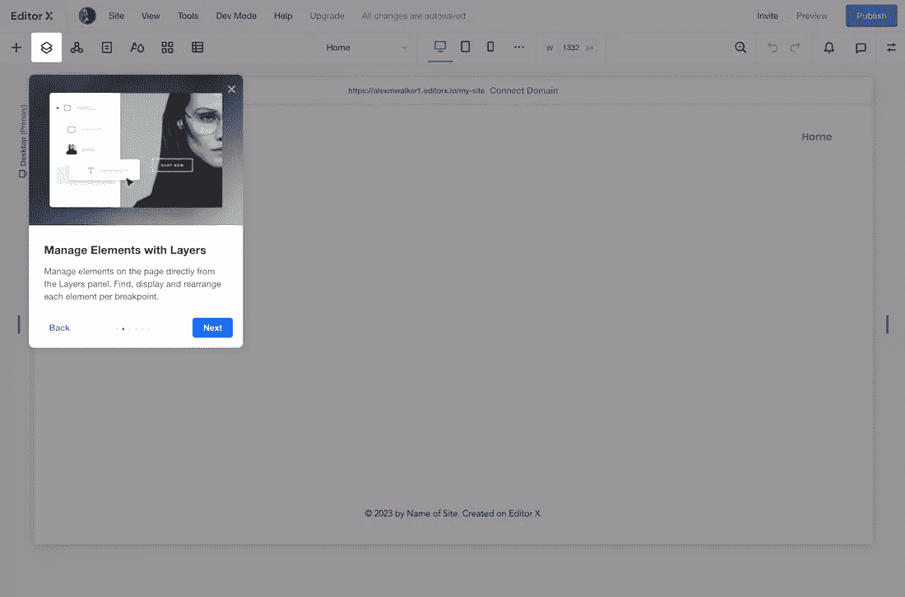

The Editor X onboarding walk-thru.

## 1.布局和设计工具

编辑器 X 提供了一系列的工具来“屏蔽”你的布局。有趣的是，大多数(如果不是全部)布局是使用 [CSS 网格布局](https://developer.mozilla.org/en-US/docs/Web/CSS/CSS_Grid_Layout)代码生成的，而不是 flexbox。取决于你是否已经精通 CSS 网格的使用，这可能是优点也可能是缺点。当然，Editor X 自动生成代码，但它仍然有助于 CSS 网格模型的工作知识，以充分利用它。

与大多数构建一样，最简单的方法是从视觉上将布局细分为多个容器部分开始。

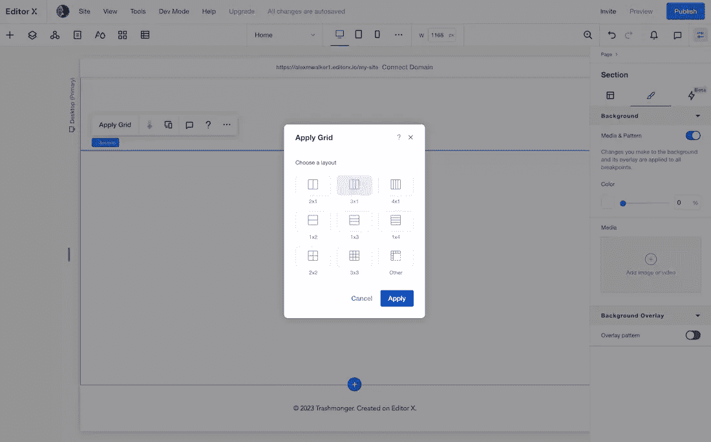

Subdividing your layout with CSS grid.

然后，您可以在基本容器中插入更复杂的布局模块，如马赛克、砖块和滑块。现在，我不是 CSS 网格专家，但是我还没有想出一个我不能用这些工具构建的布局想法。

Sophisticated layout modules such as mosaics, bricks, and sliders are available.

Editor X 布局工具在提供直观的可视化布局创建器的同时，还能让您与底层 CSS 网格代码保持联系，这两者之间取得了很好的平衡。

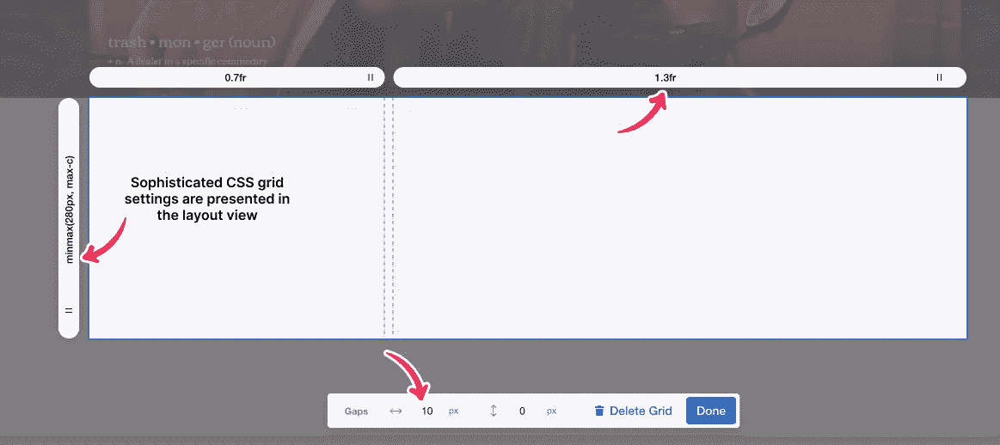

The Editor X CSS grid tool help teach you CSS grid.

将静态内容(如文本、图像、视频等)插入到您的布局中主要是通过点击并在右侧面板中进行一些样式调整。大多数有用的 CSS 属性都显示在右边的面板中。

然而，我确实有过几次挠头的时刻。最好的例子:如果你很少接触过 CSS，你会知道所有的四边尺寸(即边距、填充、边框等)都是从顶部开始按顺时针方向编码的——右上左下。

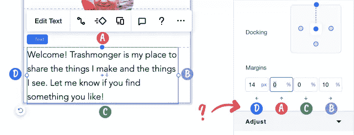

Head-scratching moment: Unconventional ordering of margin controls.

奇怪的是，编辑器 X 的控件顺序是左上右下。如果你的目标是有经验的用户，我想不出任何不遵循标准 W3C 规范编号方案的合理解释。

此外，尽管给容器添加一个标准的 CSS 边框很容易，但我找不到任何简单的方法来分别控制边框宽度或边框颜色。这就排除了许多有用的 CSS 技术来生成下划线、分隔线、分隔符，甚至更复杂的 CSS 形状。

### 编辑器 X 中的图层是什么？

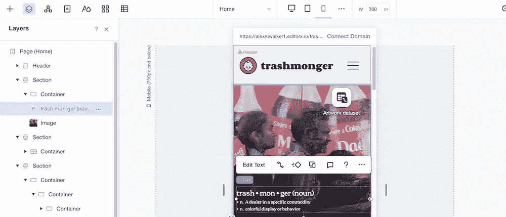

The Layers panel

视觉布局的左侧有一个可停靠的“图层”面板，显示布局的结构(见上图)。我发现这个面板很方便，原因有三:

1.  它阐明了组件是如何嵌套的。这在视觉布局视图中常常不太清楚。
2.  这个面板是重新排列布局的好地方。只需在堆栈中拖放项目。
3.  此面板提供了一个位置，可以精确地将样式调整定位到组件。例如，您可以对指定断点的项目应用“*不显示*”指令。

### 编辑器 X 里有哪些大师？

编辑器 X 允许你添加 UI 组件到一个调用“Masters”的库中。然后，您可以在多个页面上基于这些母版创建“实例”。对主实例的任何更新都会立即传递到所有从实例。

显然，这对于重复的 UI 组件(如标题、导航和页脚)是有意义的。

### SVG 支持

如果您正在使用 Figma、XD 或 Sketch，尽可能将您的图像保存为轻量级 SVG 矢量会很有帮助——只要它们不会被阻止上传。令人高兴的是，编辑器 X 对我给它的最复杂的 SVG 都没有问题(使用符号和模式)。我打了一个大勾。

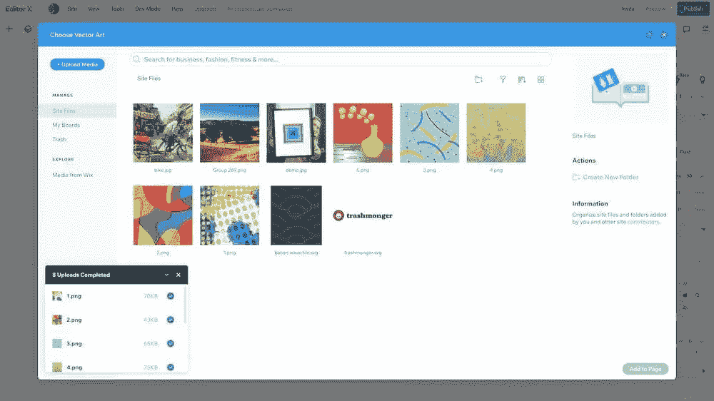

The Editor X media uploader handles SVGs as efficiently as PNGs and JPGs.

**另一个不错的处理**:编辑器 X 自动从我的 logo SVG 中提取颜色，并将它们添加到内部调色板中。

**缺点:**虽然我可以上传我的波浪图案 SVG，并将其定位为图像，但编辑器 X 不允许我将 SVG 用作背景。显然，至少现在，背景只是位图图像。🤔

### 开发模式

Editor X 面向开发者的一个最明显的标志是主菜单中非常突出的“开发模式”选项。激活它，你会看到这样的东西。

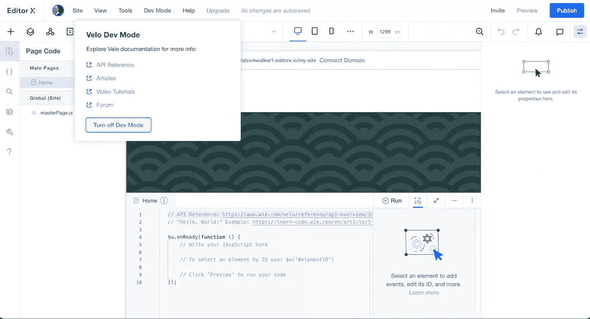

Switching on Dev Mode activates the Editor X JavaScript interface

正如你所看到的(如上)，编辑器 X 有自己的名字间隔的`$w.onReady()`函数，等待你选择一个目标 ID 并添加一个触发器和动作。

Wix 已经有了自己的超级全面的 JavaScript 平台，名为 [Velo](https://www.wix.com/velo/reference/api-overview) (谁知道呢，嗯？).这允许您编写自己与站点中几乎任何组件的复杂交互的脚本。您可以从头开始编写新组件，也可以在现有代码的基础上构建。

开发人员已经展示了一些可能性的例子:

1.  **[预订动态定价](https://www.wix.com/velo/example/dynamic-pricing-for-bookings) :** 根据游客选择调整服务价格。
2.  **[发送预约确认短信](https://www.wix.com/velo/example/send-sms-on-booking-confirmation) :** 在客户预约服务时生成确认短信。
3.  **[创建测验](https://www.wix.com/velo/example/create-a-quiz) :** 创建从数据库集合中随机选择问题的测验。

脚本示例有很多，而且各种各样，似乎没有什么是您做不到的。如果你对 JavaScript 很熟悉，那么 Editor X 的脚本能力应该是一个很强的吸引力。

有趣的是，我认为用 JavaScript 控制 CSS 边框宽度可能比用 CSS 更容易。

## CMS/数据管理

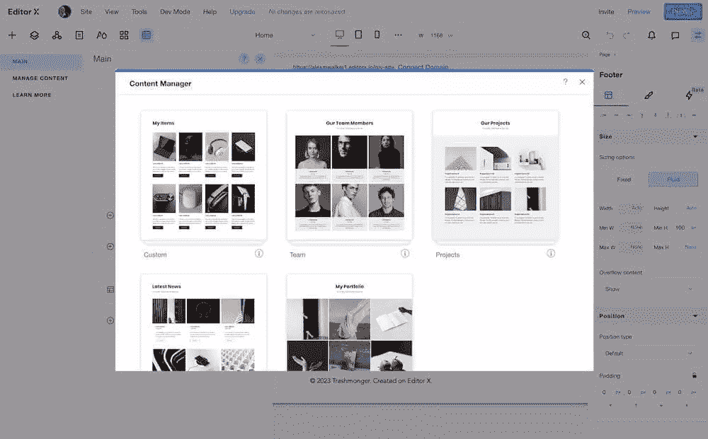

The Editor X flexible CMS builder.

编辑器 X 提供了一个灵活的 CMS 构建器。它附带了一些常见的预置数据模型——项目、团队成员、投资组合项目和新闻数据。然而，如果您为'*复古鱼饵*或'*爵士吉他制表*'创建一个定制数据库，从头开始构建您自己的定制数据模型并不困难。

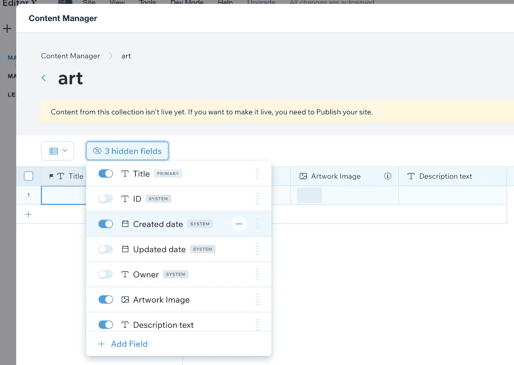

Design a datatype: Add fields to create a custom data model

在我的情况下，我可能会使用“组合”预设，但决定从头开始建立我的艺术作品 CMS 集合。添加带有日期、图像和文件上传类型的新字段非常简单。

我发现我可以添加一个“**创建日期**字段，但不允许编辑它，因为这是一个“**系统**文件创建时的值。有点困惑，直到我解决了。最后，我为我的“艺术品创作日期”添加了一个独立的日期字段，我可以编辑它。

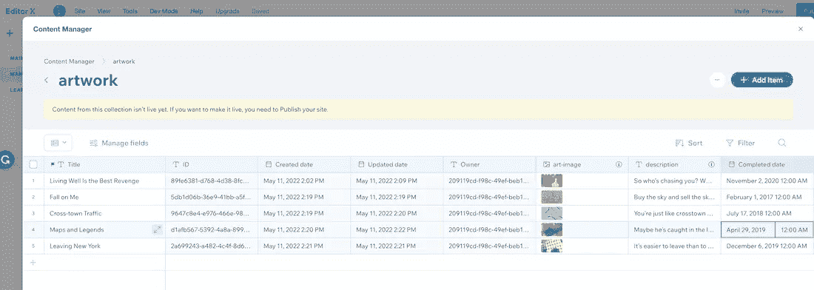

The Editor X Content manager

将新的 CMS 数据注入到布局中也是显而易见的。我使用 Editor X 的“Repeater”布局模块创建了一个静态的 5 单元卡片库。

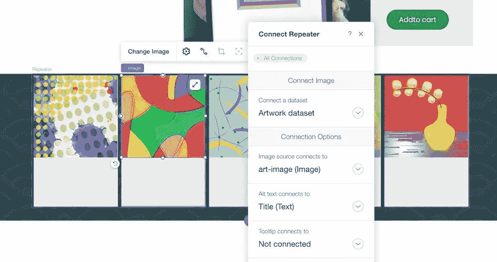

Connecting data to your layout components.

单击这些静态卡元素，您可以选择连接到新数据集，并用动态 CMS 数据替换静态页面元素。

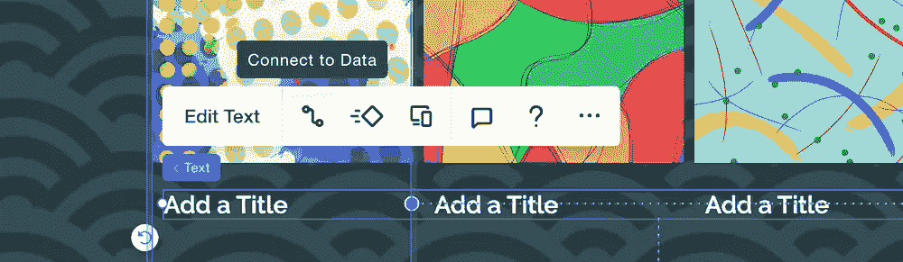

Replacing static text with dynamic data

总而言之，即使是免费计划中内置的 CMS 设施也是无可挑剔的。我发现它们非常灵活、强大、易于使用。

## 集成

### 第三方应用

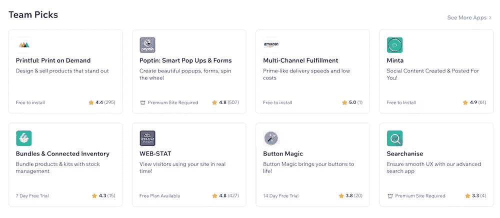

Browsing the Third-Party Apps library.

有时候编写自己的代码会更快——其他时候你需要直接插入到你的站点中的经过良好测试的功能。编辑器 X 依靠 Wix 应用商店提供第三方应用。

应用程序列表太长，无法在此详述，但包括:

*   高级搜索 UX
*   自动化社交媒体发布
*   在线聊天
*   高级 web 统计
*   产品履行

## 移动性能

Editor X 设置了三个断点——移动设备、平板电脑和笔记本电脑——添加新断点既快速又轻松。

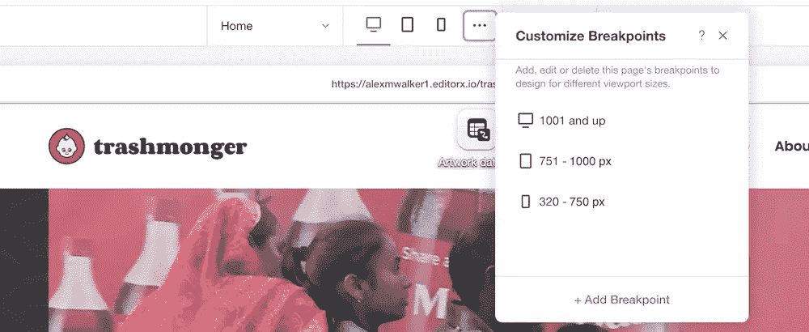

Three preset breakpoints – desktop, tablet, & mobile – and a custom breakpoint setting.

正如我所料，Editor X 认为桌面布局是默认视图，并添加了额外的规则来定制平板和移动视图(就像 Webflow 一样)。我不认为有任何方法可以创造出“移动优先”的响应式设计。

也许有一种观点认为，创建一个基于桌面的网站构建器会违背直觉，它会立即要求你从移动布局开始——即使这种方法最终会产生更好的结果。

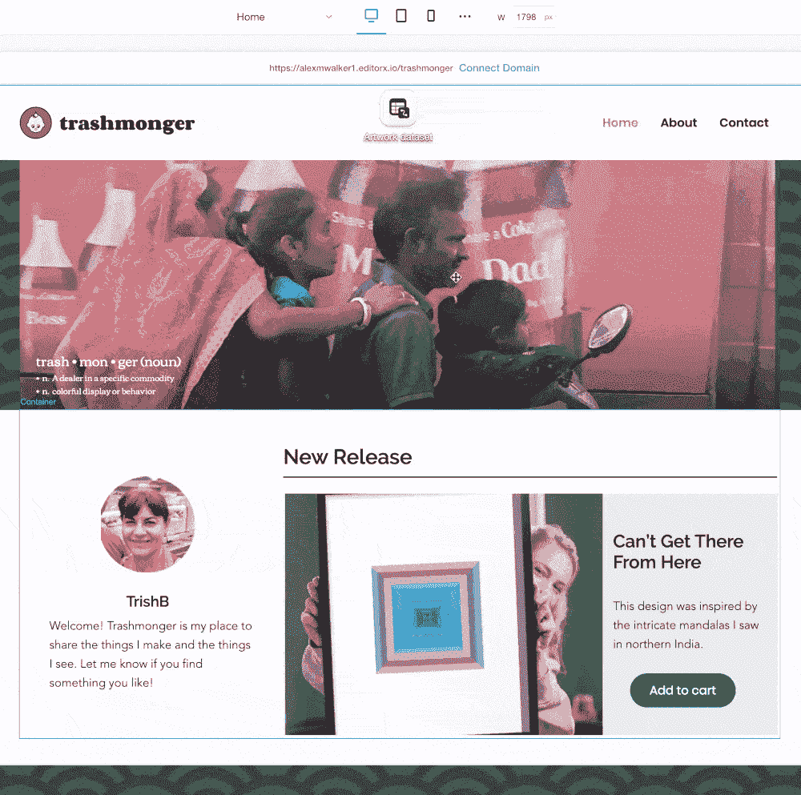

Switching breakpoints – desktop view is the default.

Editor X 还允许您在每个图像上标记一个焦点，这允许您在图像根据不同的响应布局调整大小时控制图像的裁剪和框架。聪明。

总的来说，我发现在每个断点处调整和重塑布局非常容易。

然而，我也发现更难有一个全面的，考虑周到的反应策略。也许这只是我的看法，但不断积累零碎的响应调整很容易，但要从更高的层面了解正在发生的事情却很难。

编辑器 X UI 如何显示您的响应策略呢？我不确定，所以也许这是一个不公平的批评。我只是觉得我的手机设计越来越“技术混乱”，我不知道如何解决这个问题。

## 定价

编辑 X 为一个标准网站提供了一个三级定价模型。

电子商务网站还有第二种定价模式。

1.  **发布**–起价 32 美元/月
2.  **提高**–从每月 69 美元起
3.  **规模**–每月 219 美元起

它们的定价层之间的核心区别是存储。您需要为空间付费，所以如果您计划托管大型图像、视频或音频文件，请注意这一点。

假设你*而不是*推送大量视频，我会认为 10GB 的启动器足以满足大多数使用案例——至少在一段时间内。

可以说，与 Webflow 相比，Editor X 的基本电子商务计划(称为“启动”)是他们最引人注目的产品。虽然它们目前的价格相似，但 Editor X 没有库存上限，同时增加了购物车恢复和在脸书/Instagram 上销售的能力。

## TLDR

与我见过的大多数在线网站建设者相比，Editor X 提供了更多的自由和灵活性，这正是精通网络的用户所寻求的。

我必须承认，内置的 JavaScript 脚本工具允许您做的事情之多让我感到惊讶。这比我对一个在线建筑商的期望要远大得多。

对布局使用 CSS 网格是一把双刃剑。Grid 为您提供了一些布局超能力，但是仍然有很多前端开发人员更熟悉使用 flexbox 来完成繁重的工作。

定价与大多数同类竞争产品相似，尽管大型视频和数据存储产品的价格变得昂贵。

添加电子商务设施比一些竞争对手略多，尽管他们的基础电子商务包不提供库存上限和更复杂的工具来帮助转换和销售。你得到你所支付的。

## 分享这篇文章