# 回顾:新的和改进的谷歌字体更好吗？

> 原文：<https://www.sitepoint.com/review-is-the-new-and-improved-google-fonts-better/>

自谷歌[首次推出全球最大的免费网络字体服务之一](https://en.wikipedia.org/wiki/Google_Fonts)以来，已经过去了六年。他们易于使用的界面有助于将通常被认为是脆弱的技术带给大众。自 2010 年以来，这项服务在图书馆的多样性和规模上都稳步增长。

[最近，该服务进行了全面改造，](https://fonts.google.com/)为您带来了一种更简化的方式来预览字体，并立即启动和运行。

但是真的是*更好*吗？让我们来看看。

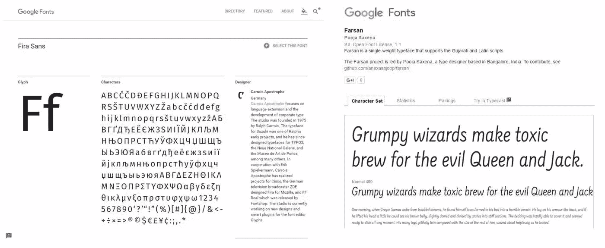

最新网站在左边，旧网站在右边

## 一个抛光和更新的外观

我当然相信谷歌字体的整体观感有所改善。你首先会注意到的一件大事是，整个场地使用了[材料设计](https://material.google.com/)。厚重的边框、低分辨率的图形和亮蓝色的按钮都不见了。这些被微妙的动画和互动所取代，帮助你专注于缩小你的字体。

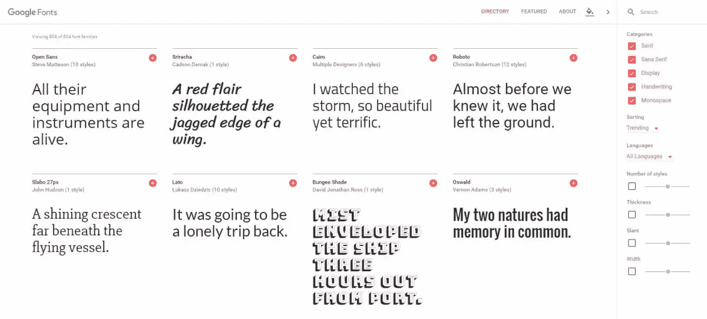

视觉效果的更新非常令人印象深刻，但更好的是，该网站现在完全可以移动响应。该网站的前一版本没有处理较小的分辨率或优雅地调整大小，导致许多随机的 UI 错误，使该网站看起来很奇怪/删除功能。

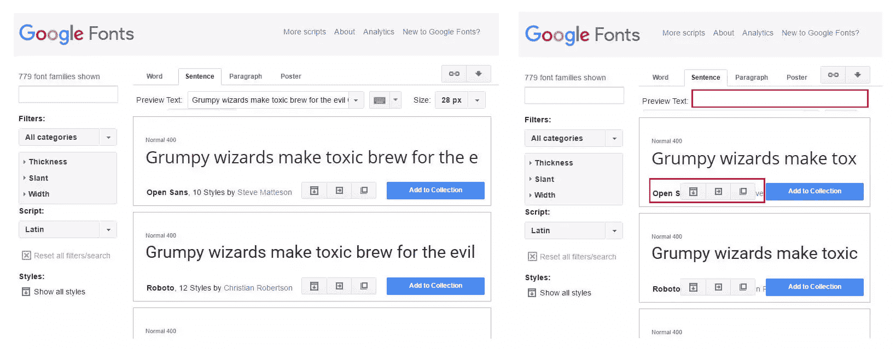

在右边，随着屏幕变小，你可以看到我们失去了“预览文本”输入字段，使我们无法获得文本的实时预览。此外，随着屏幕变窄，动作按钮开始掩盖字体名称和作者，最终完全消失。

传统网站已经存在了很长时间，并提供了大量的功能，所以我们通常可以放他们一马。令人耳目一新的是，新网站看起来很棒，可以在所有类型的设备上运行。

### 动态主题选择器

设计师关心的一个方面是选择一种在不同前景/背景颜色下都能很好工作的字体。有时候一种字体在白底黑字上看起来很棒，但是当使用亮色时就几乎无法阅读了。

谷歌在网站顶部添加了一个自定义颜色选择器。单击时，它会提供一个快速的颜色样本，让您预览字体的外观。您可以使用它来查看在深色/浅色背景上使用深色/浅色文本时，字体是如何配对的。

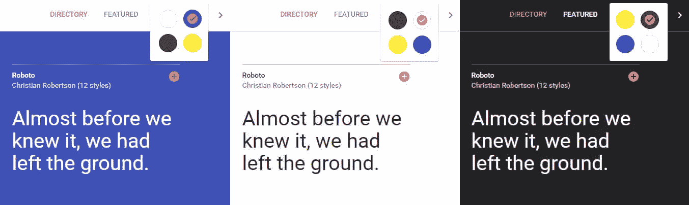

尽管你不能精确地指定你想要的颜色，但这是一个每个人在挑选字体时都应该使用的漂亮工具。

### 展示特色字体

特色字体是更新后的谷歌字体网站的全新介绍。这些特色字体可以从顶部菜单访问，是谷歌想要突出显示的字体集合。这些集合由谷歌自己或外部机构创建，以展示特定的设计风格或哲学。

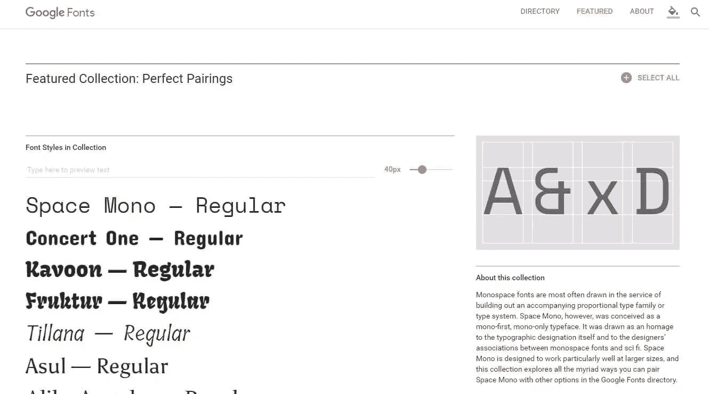

目前，只有几组特色字体，但是，如果随着更多字体的添加和以前的谷歌字体网站的停止，这个范围会随着时间的推移而增加，这将是有意义的。

## 增压内嵌字体选择器

谷歌字体的主要体验是如何预览和选择你的字体，有人会说这是网站最重要的部分。

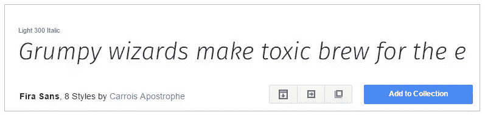

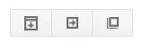

以前，当您查看字体时，您会看到类似于下图的内容——带有一系列动作按钮的简单文本预览。你的视图可能看起来不同，取决于你如何过滤你的搜索，但一般来说，它是一个简单的方形框，有一系列的行动，一个大的蓝色添加按钮。

虽然这种方法并没有什么特别的错误，但就是感觉不够完美或直观。例如，每种字体底部的动作按钮，你能在不点击/悬停在它们上面的情况下确定它们做了什么吗？如果我以前没有使用过这个网站，我会发誓它们是“下载”、“转发”和“复制”。

唯一有意义的元素是“添加到收藏”按钮。

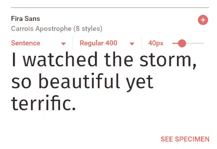

新的设计更加精致，提供了预览字体所需的一切。以下是你可以做的重点:

*   你可以选择查看一个句子、段落甚至你自己的文本，看看它会是什么样子。它加载速度非常快，有助于展示字体在字符间的作用。

*   您可以立即在不同的字体粗细之间切换。该网站几乎立即加载新的字体，并让你通过键盘简单地浏览它们。

*   调整字体大小很容易，通过一个简单的滑块，您可以调整您正在查看的字体或页面上的其他字体。此外，当调整到更大的字体时，页面的其余部分会重排(不像以前那样文本会被裁剪在一个框内)

如果你事先改变了字体大小，默认情况下它会普遍应用于页面上的所有字体。虽然这在理论上看起来很棒，但它有重排页面的副作用。这意味着，如果你在页面中间看到一种字体，然后调整了大小，你必须再次滚动搜索该字体。

让我们以' **Montserrat** '为例，看看当我们重新调整字体大小时会发生什么

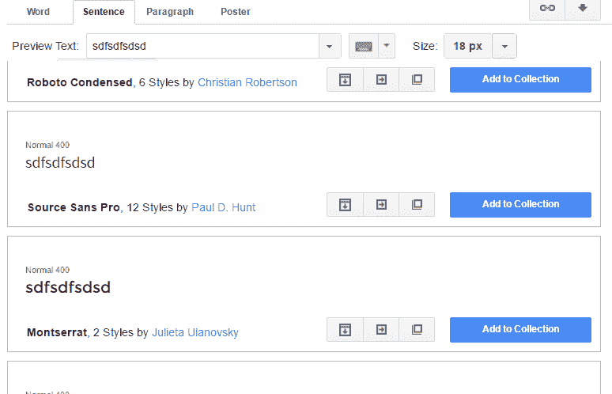

原字体大小调整功能

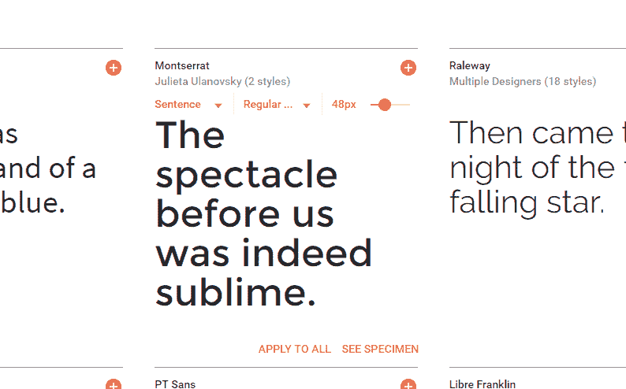

新的字体调整功能

注意到当我们调整字体大小时，跟踪字体变得更加困难了吗？这是让你的字体预览变得乏味的一个小问题。有了这个新网站，你可以在预览窗口中单独改变字体的大小，这意味着其他字体不会移动，你也不需要滚动那么多。

### 刷新的标本预览

作为重新设计的一部分，谷歌字体改变了样本预览的工作方式。以前，要进入样本视图，您需要在查看字体时点击“弹出”按钮。这将打开一个弹出窗口，概述了字符集，统计数据，配对和一个链接到 typecast。

刷新后的标本预览

更新后的网站完全取消了弹出功能。当你点击每种字体上的单词“**See speciment**”时，页面会加载一个长长的页面，概述该字体中的所有字符、其各种粗细、作者/设计者，以及次要信息，如它最常用的位置以及与它匹配的字体。总的来说，这是一个更新鲜的现代外观，实际上吸引了我的注意力。

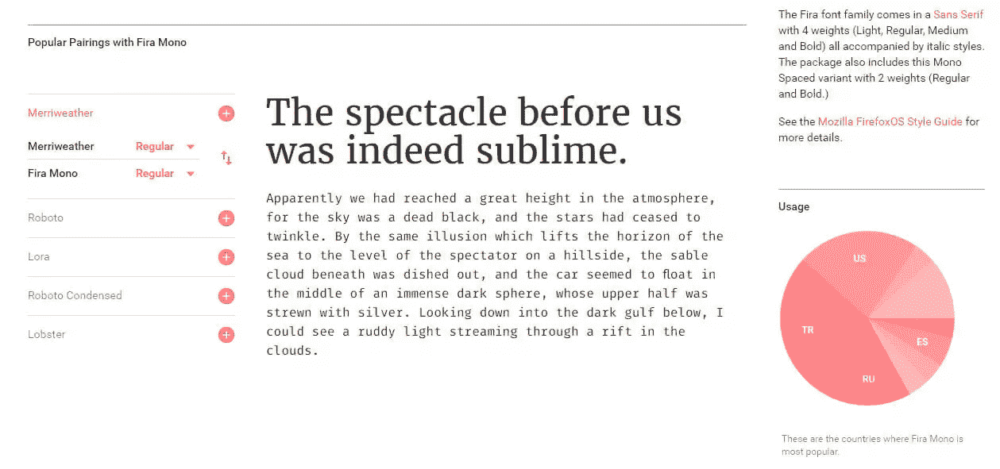

### 简化字体配置面板

添加完字体后，您将转到配置页面，在那里您将为字体选择各种粗细和样式。它在旧网站上运行得很好——一个简单的单页界面。

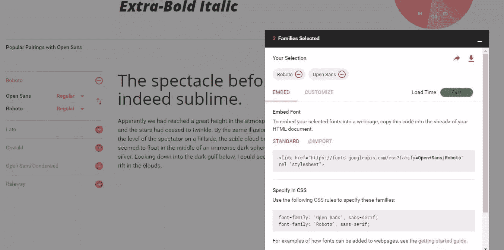

在更新版本中，您的配置面板位于网站的底部。一旦你添加了字体，它就会显示出来，让你不用离开页面就可以快速配置你需要的字体。

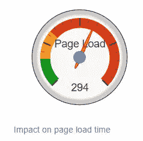

旧页面负载指标

屏幕分为“嵌入”和“自定义”两个面板。嵌入部分允许您访问样式表的 URL 和需要使用的 CSS 规则。在“自定义”面板中，您可以选择字体粗细/样式，并查看字体的速度效果。

我唯一的批评是，页面负载指标不再反映指标，即你看不到你的字体影响将是 150 点，只有它的影响权重是“中等”。

前一个网站试图更准确地描述添加这种字体会有什么影响。

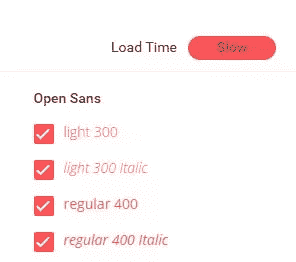

新的页面负载指标

例如，如果你有几种风格，影响可能被判断为“缓慢”，但如果没有数字，就很难理解影响的规模。

它并没有给你足够的信息来做出明智的决定。当然，谷歌寻求简化一个复杂的过程是好事，但我相信，在这种情况下，在这里有一个数字将是有益的。

## 奖励:提供你对谷歌字体的反馈

如果你仔细观察新网站的左下方，你会看到一个感叹号。如果您按下此按钮，您可以在网站上提供反馈。虽然这可能看起来不令人兴奋，甚至不值得注意，但它实际上是一个非常棒的工具，可以让你选择网站的一部分进行截图。

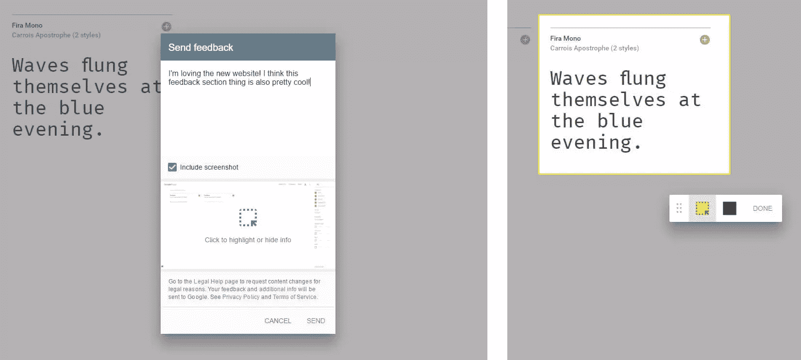

你不需要使用截图功能来提供你的反馈，但是如果你想强调一些让他们关注的东西，它给了你机会，这很好。

## 那么，这很好吗？

如果你以前喜欢谷歌字体，那么你可能会爱上这个新网站。这是你喜欢的旧网站的所有东西，没有缺点。整个体验已经被简化，因此预览、选择和实现字体几乎是无缝的。

一切都感觉是新的，并具有你期望在谷歌的现代网络服务中看到的那种水平。现在是您体验新网站的最佳时机，这样您就可以直接看到它有多么显著的改进，以及它应该如何使您选择字体的任务变得更加简单。

也许一个缺点是，它可能(仍然)需要一段时间来找到完美的字体。 [IDEO 建立了一个字体地图](https://www.sitepoint.com/ideo-font-map-a-faster-way-to-find-the-best-google-fonts/),它使用机器学习在地图上显示谷歌字体——它们被排列成相似的字体并排放置。这是发现完美字体的更好方法吗？

现在是测试这项新服务的最佳时机。让我知道你的想法！

## 分享这篇文章