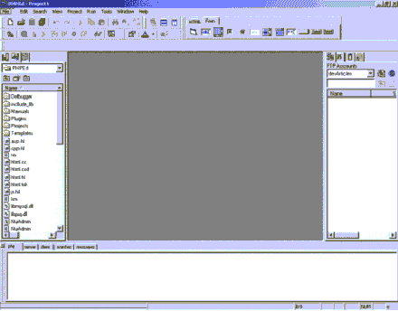
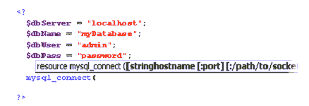
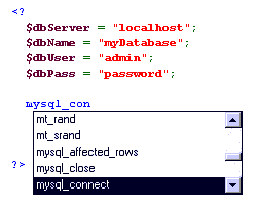
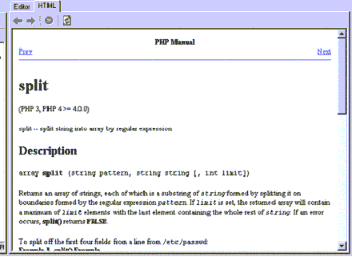
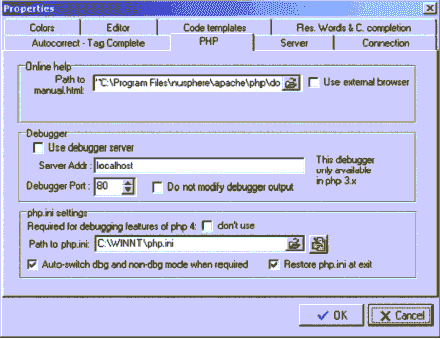
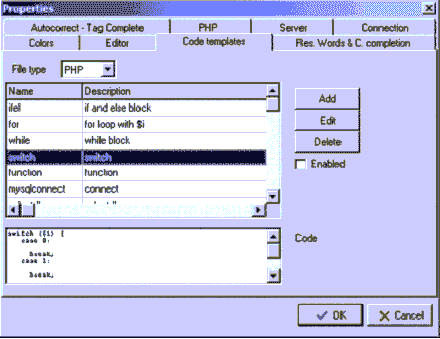
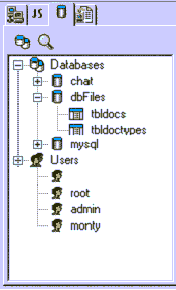
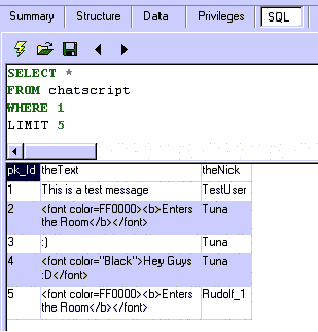
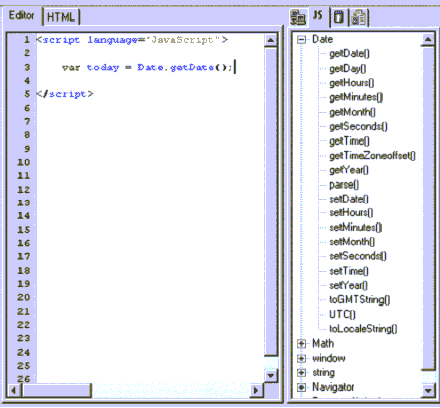
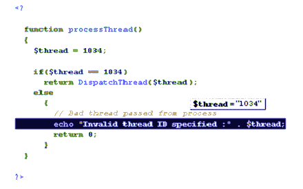

# 回顾——NuSphere 的 PHPEd

> 原文：<https://www.sitepoint.com/review-nuspheres-phped/>

**最近， [NuSphere](http://www.nusphere.com/index.htm) 发布了 PHPEd 作为面向企业开发者的 PHP 开发环境。正如 NuSphere 所说，**

为了跟上市场需求的步伐，开发专业人员需要一个经济高效的、可定制的应用程序来利用 PHP 的优势。NuSphere PHPEd 就是那个应用。”

我想我应该开着它转一圈…

##### 安装

我对 PHPEd 的最初印象是“哇”。安装程序包含了创建、测试、调试、保护和部署 PHP + MySQL 网站所需的所有应用程序:Apache、PHP、MySQL、Perl、NuSphereMail、MyODBC、MySQL JDBC、CVS、NuSphere 安全控制台和实际的 PHPEd IDE 本身。

安装程序完全存在于 Web 浏览器窗口中，安装和配置上述所有内容大约需要 10 分钟。我已经安装了 MySQL，所以安装程序巧妙地检测到了这一点并跳过了它。

##### 使用 PHPEd

一旦所有东西都安装好了，我就通过开始菜单启动 PHPEd。迎接我的是 PHPEd IDE，它看起来像这样:

点击 File -> New 菜单选项，我可以选择八种新的文档类型:HTML 文件、include 文件、JavaScript 文件、Perl 文件、PHP 文件、Python 文件、SQL 文件和文本文件。因为 PHPEd 主要是一个 PHP 脚本编辑 IDE，所以我选择创建一个新的 PHP 文件。

我着手创建一个新的 PHP 文档来连接我本地安装的 MySQL。与许多其他 IDE 一样，我的代码根据语法、注释等进行着色。我注意到的一件很棒的事情是内置的语法建议工具。要使用它，您只需键入 PHP 函数名的开头，例如“MySQL _ con ”, PHPEd 就会显示它的语法建议，告诉您应该如何调用该函数:

此外，当您键入要在 PHP 脚本中调用的函数的名称，但不太确定它的名称时，PHPEd 会显示一个函数列表，这些函数的首字母与您到目前为止键入的相似。它们显示在浮动列表框中，类似于 Microsoft 在 Visual Basic 和 C++中实现智能感知功能的方式:

正如你在上面的例子中看到的，我已经创建了四个变量。每次我在变量名的开头按下“$”键，PHPEd 就会显示一个当前在我编写的 PHP 脚本中声明的变量列表。这是一个方便的特性，有助于最小化变量的不正确名称引用。

内置 PHP 手册！

PHPEd 还包括 PHP 手册的内置副本。要查看任何函数的定义和示例，只需在脚本中键入该函数的名称，然后按 F1 功能键:

当我创建 ASP 页面时，我使用 Visual Interdev。我最喜欢的 Visual Interdev 特性是它的无限撤销命令。令我惊讶的是，PHPEd 还支持编辑菜单中的无限撤销命令。当您决定更改代码的某些关键方面，保存它，然后在最后一刻决定恢复到旧代码时，这是非常好的。

另一个引起我注意的功能是 PHPEd 非常直观的设置对话框。通过简单地点击 Tools -> Settings 菜单选项，我看到了大量的选项卡，其中包含了 PHPEd 用来格式化代码、完成单词、连接 Apache 等的所有选项。，包含在此窗口中:

“代码模板”选项卡提供了一些 PHP 最流行的关键字和函数的代码示例，包括“switch”、“for”、“mysql_connect”和“list”。如果您发现一个您知道几乎会一直使用的新函数，那么您可以单击“添加”按钮，将其添加到包含您自己的代码示例的函数列表中:

因为我通常用记事本创建我的 PHP 代码，我不习惯 PHP 自动为我关闭括号和大括号。其实我觉得挺烦的。幸运的是，在设置菜单中有“自动关闭引号”和“自动关闭括号”选项，我只是简单地取消了它们。

PHPEd 内置了对连接、查看和查询 MySQL 数据库的支持。MySQL 选项卡提供了对数据库的一键式登录访问。连接后，您可以使用树视图结构浏览数据库、表和用户:

要显示数据库或表的模式，只需点击它，它就会出现在主窗口中。有五个按钮为我们提供关于当前选择的 MySQL 表的信息:摘要、结构、数据、特权和 SQL，这允许您查询数据库并在 PHPEd 的主窗口中查看查询结果:

这是一个非常省时的功能，其工作方式与 Microsoft SQL Server 的查询分析工具相同。它让您不必一直使用 MySQL 控制台应用程序或 phpMyAdmin 来操作数据库。

虽然内置的 MySQL 支持很好，但 PHPEd 确实缺乏对 PHP 支持的其他几个流行数据库的支持，包括 MS SQL Server、Oracle 和 PostgreSQL。这真的很遗憾，因为 PHPEd 对 MySQL 的支持如此之好。

***轻松 JavaScript 创作***

如前所述，您可以使用 PHPEd 轻松创建 JavaScripts。如果你对 JavaScript 没有太多经验，那么 PHPEd 的“JS”标签可能正是你需要的。它包含每个 JavaScript 函数的树形视图列表。要将这些 JavaScript 函数的代码添加到您的代码中，您只需双击您想要的函数，PHPEd 会处理剩下的部分:

我想说的最后一个(也是最重要的)特性是 PHPEd 的内置调试支持。如果您正在处理一个变量，并希望在代码中的任何一点看到它的当前值，您只需突出显示它，PHPEd 将显示一个带有其当前值的工具提示，如下所示:

PHPEd 的另一个调试特性是代码调试和显示特性。我们可以将一段代码传递给调试器，调试器会在 PHPEd 的内置浏览器窗口中显示结果。为此，我们只需选择要调试的代码，然后单击 Run -> Run In Debugger 菜单项，或者按 F5 功能键。

就像在 Visual Basic 中一样，我们也可以设置断点，将代码运行到某一行，单步执行、进入和退出代码，并在代码中添加变量观察点。所有这些选项都可以从“运行”菜单中访问(如右图所示)。

当你创建了自己的网站并准备上传时，PHPEd 会用它内置的 FTP 管理器来拯救你。通过 FTP 连接到你的网络服务器实际上是一个双击的过程:一次点击编辑你的账户信息，另一次点击连接到你的服务器。

还可以使用 PHPEd 内置的 FTP 管理器在本地打开远程文件。如果您经常更改远程 Web 服务器上的文件，这将是一个非常节省时间的方法。

##### 一目了然

***优点:***

*   对 MySQL 数据库的紧密集成的支持和功能
*   出色的内置调试和步进特性，使得调试 PHP 脚本变得轻而易举
*   自动完成函数名建议和函数参数列表
*   内置的 FTP 管理器可以快速方便地打开远程文件
*   安装并自动配置 Apache、PHP 和 MySQL

***缺点:***

*   对于支持 GPL 下发布的脚本语言的 ide 来说，有点昂贵(也有点讽刺)
*   当我在我的 Windows 2000 机器上运行 PHPEd 时，它在我测试的 6 个小时内崩溃了 4 次

##### 结论

 * **谁的？***

PHPEd 是一个很棒的 IDE，可以快速轻松地创建包含 MySQL 数据库功能的 PHP 脚本。如果您正在寻找一个 IDE，它将允许几个开发人员一起轻松地处理一个项目，或者甚至是一个工具，只是为了帮助您更快地完成工作，那么 PHPEd 绝对适合您。

我将把它推荐给任何有大约 3-6 个月 PHP 和 MySQL 经验的人，并且正在寻找一种方法将 phpMyAdmin 的高级功能、一个灵活的调试器和一个方便的 IDE 结合到一个完整的包中。

***综合评分***

总的来说，我给 PHPEd 打了八颗星。

***定价***

PHPEd 有两种口味:零售价为 299 美元的 PHPEd 和零售价为 495 美元的 PHPEd Advantage。

欲了解更多关于 PHPEd 或购买的信息，请访问网站。

## 分享这篇文章