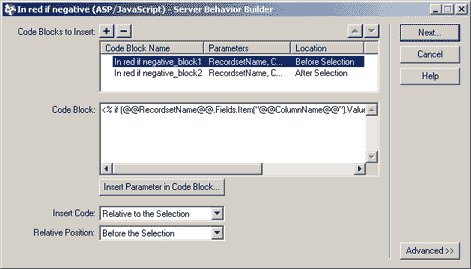

# 回顾:UltraDev 4

> 原文：<https://www.sitepoint.com/review-ultradev-4/>

HTML 编辑器已经不是以前的样子了。随着服务器端脚本和数据库驱动的站点设计领域的快速发展，行业工具也随着 Web 开发人员的需求而发展。包括支持由 ASP、JSP 和 CFML 驱动的网站的所见即所得开发，Macromedia 的 Dreamweaver UltraDev 4 带来了许多强大的新功能，以及 Dreamweaver 4 必须提供的一切(见[评论:Dreamweaver 4](http://www.webmasterbase.com/article.php?aid=308) )。

对于不熟悉 UltraDev 的读者来说，它实际上是 Macromedia 卓越的 Web 编辑器 Dreamweaver 4 的“增强版”,具有针对动态和/或数据库驱动的网站开发人员的功能。UltraDev 在这一领域相对于其竞争对手(包括 Allaire Cold Fusion Studio、Microsoft Visual Interdev 和 Adobe GoLive)的主要优势是一定程度的语言和服务器独立性。虽然这些其他程序仅限于使用单一的脚本技术(ASP，或 Allaire 产品的 CFML)，但 UltraDev 让开发人员可以自由地使用 ASP、JSP 或 CFML，并与这些语言可以连接的任何数据库服务器进行交互。

虽然自由地使用三种受支持语言中的任何一种都很好，但是自 2000 年 6 月发布原始版本以来，UltraDev 的标志就是实时数据预览。单击按钮，定义为包含从数据库中挑选的动态信息的字段将显示为从数据库中提取的实时数据。委婉地说，这是一个令人印象深刻的壮举。当竞争对手的编辑器自动将预览页面上传到您的服务器并在 Web 浏览器中打开它时，UltraDev 会将数据带给您，让您以所见即所得的方式实时查看页面的实际外观、动态数据等。UltraDev 还可以缓存页面中使用的查询结果，这样，当您的开发计算机没有连接到网络，因而无法访问数据库服务器时，您仍然可以使用实时数据预览。

UltraDev 4 中的新功能，您现在可以配置实时数据预览，以使用您完成的站点将使用的相同连接机制连接到数据库。这在出于安全原因不能从开发机器直接访问数据库服务器的情况下非常方便。为此，UltraDev 将一组脚本上传到服务器上的一个特殊目录中。然后，它使用这些脚本通过标准 HTTP 请求与数据库服务器通信。当您完成开发工作后，您可以指示 UltraDev 从服务器上删除这些脚本，从而消除它们所代表的潜在安全漏洞(请注意，要利用这个漏洞，黑客仍然需要获得您的用户名和密码才能登录到数据库—脚本只是为连接提供了一个桥梁)。

从第 4 版开始，Dreamweaver 已经融合了 WYSIWYG 编辑器和基于代码的编辑器，允许设计人员在两种视图之间切换，或者在分屏视图中同时查看两种视图。UltraDev 4 也继承了这些新功能，除了 Dreamweaver 中提供的 JavaScript 和 HTML 突出显示之外，还为 ASP、JSP 和 CFML 提供了完整的语法突出显示。Dreamweaver 4 中的便捷参考面板提供了 O'Reilly 提供的 HTML、JavaScript 和 CSS 的完整参考，可以在 UltraDev 4 中扩展，通过从 Macromedia Exchange 下载两个免费插件来提供 WROX Press 的 ASP 和 JSP 参考。尽管在撰写本文时还没有 CFML 的参考资料，但我不会对 Macromedia 在不久的将来推出这样的参考资料感到惊讶。

对于以前版本的 UltraDev 的用户来说，服务器行为的概念应该非常熟悉。对于外行来说，服务器行为就是 Macromedia 所说的 UltraDev 中可用的服务器端功能。其中包括为数据库结果集中的每一行重复 HTML 的一部分(例如，显示结果表)，显示向数据库添加记录的表单，提供下一个/上一个链接以浏览每页显示有限数量结果的结果集，以及数据库驱动的站点的其他常见设计元素。在 UltraDev 4 中，通过为现有行为提供更大的灵活性并为用户身份验证添加行为，服务器行为库得到了扩展。这些新行为允许您通过要求用户提供用户名和密码来保护页面，并根据您自己选择的数据库表中的条目进行检查。这些新行为产生的结果看起来非常专业；您再也不用手动编写网站注册表单了！

虽然现有的服务器行为库非常广泛，但 UltraDev 被设计为可扩展的产品，因此可以通过使用 Dreamweaver JavaScript API 对其进行编程来添加新的行为。虽然这是一个强大的选项，但并不特别方便。UltraDev 4 提供了一个新的服务器行为生成器，让您无需编码即可设计新的行为。在下面的截图中，我整理了一个非常简单的例子，它将提示设计者选择一个数据库记录集和一个列名，如果数据库中的值恰好是负数，它将以红色显示所选文本。

JSP 开发人员对之前版本的 UltraDev 最大的不满之一是它对 JavaBeans 的支持很弱。在 UltraDev 4 中，JavaBeans 现在可以像数据库查询一样作为数据源添加；它们的属性可用于创建动态文本字段等。这方面的灵活性还可以更好(例如，您必须将希望使用的 JavaBeans 的 Java 类文件的副本放在 UltraDev 目录中)，但是 UltraDev 现在允许您手工编写这类内容，这使得使用 JavaBeans 组件比以前的版本更方便。

如果你习惯手工编写数据库驱动的网站，UltraDev 的拖放式 WYSIWYG 范式肯定需要一些时间来适应。然而，有了 UltraDev 4 对直接代码编辑的支持，您可以直接使用您现有的技能，然后逐渐迁移到 UltraDev 的有用的、节省时间的特性。UltraDev 4 唯一令人失望的地方是缺乏对 PHP 的支持。如果你致力于用 PHP 开发你的站点，你最好去别处看看；否则，请下载 30 天试用版，亲自了解 UltraDev 如何简化您的动态 Web 开发任务，让您在更短的时间内完成更多的工作！

##### 定价和可用性:

适用于 Windows 和 Macintosh 的 Dreamweaver UltraDev 4 599 美元
UltraDev 4 Fireworks 4 Studio 699 美元
Dreamweaver UltraDev 4 从 Dreamweaver UltraDev 升级 129 美元
Dreamweaver UltraDev 4 针对 Dreamweaver 用户的促销 299 美元

30 天免费试用版和完整版现已在[www.macromedia.com](http://www.macromedia.com/)推出。

## 分享这篇文章