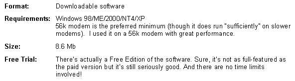

# 审查-网络首席执行官

> 原文：<https://www.sitepoint.com/review-web-ceo/>

 **##### 描述

Web CEO 是一个由十个主要工具组成的软件包，帮助你在搜索引擎中推广你的网站，分析你的访问者，并轻松地保持你的网站在最佳质量。

##### 想开门见山吗？

如果你是网站所有者或网站开发者，现在就停止阅读这篇关于网络 CEO 的评论。前往 www.webceo.com 购买。别说我不给你好建议！

如果你仍然不确定，继续读下去，我会告诉你一个软件的内幕，如果我足够聪明，我会在几年前购买它——并为自己节省数千美元和数千小时。

所以，你决定继续读下去？好吧，我从头说起。

##### 特征

Web CEO 具有丰富的功能，包括:

*   关键词研究工具:为你的网站找到合适的关键词。
*   **搜索引擎优化工具:**将您的网站优化准备情况与排名靠前的网站进行比较。
*   **简单编辑器:**访问、查看和编辑你的 HTML 页面的各个部分。
*   **搜索引擎提交工具:**自动(或手动)将你的站点提交给搜索引擎。包含每个单独搜索引擎的注释，并为您自己的具体评论留出空间。
*   检查你的排名:为需要相关数据的搜索引擎专家和网站所有者节省大量时间。
*   **链接检查器:**快速方便地检查谁链接到你，谁链接到你的竞争对手，等等。
*   **网站质量保证:**通过详细的分析报告对所有网站组件进行全面审查。快速找到并修复任何损坏的文件或页面。
*   **FTP 上传器:**不离开软件快速上传文件。
*   **随时了解您站点的状态:**即使您不在，实时监控也会对您的站点进行监视(您可以通过电子邮件或电话了解结果)。
*   **全面的站点报告:**包括数百份详细报告，让您每次都能做出正确的决定！

听起来不错吧？我以为你会喜欢。以下是软件规格:

##### 费用

网络 CEO 有几种类型，每一种都有不同的价位:

*   免费网络 CEO:免费
*   网络 CEO 创业:19 美元
*   网络 CEO small biz:295 美元
*   网络 CEO 专业版:495 美元

但是等等！还没完呢！

Web CEO 对软件的可选组件收取持续费用。这是并将继续是秘密(除了辉煌的软件！)到他们的成功。

*   例如，HitLens(流量分析组件)对“电力报告”的定价为每 1000 次页面浏览 59 美分，对“电子商务报告”的定价为每 1000 次页面浏览 79 美分。
*   站点监控每天的费用在 0 美元到 41.80 美元之间。
*   访问可下载的知识库更新要多花一点钱。

现在，我们中的许多人对这样的持续收费望而却步。但是，现实一点:提供分析和监控服务以及保持知识更新需要时间、金钱和大量资源。Web CEO 的人不会为了给客户节省几分钱而牺牲使用他们产品的网站的成功。

您想要质量最好的软件和持续的优质服务吗？当然，需要有一个持续的费用。要求更少会损害正在进行的服务的质量，并且很快减少软件对像你我这样的客户的价值。

这是一项伟大的战略，对客户大有裨益。

##### …听起来像你认识的人吗？

从前有一个英俊的男人。让我们叫他布兰登。布兰登英俊迷人……两者兼而有之！Brendon 拥有一些电子商务业务，他还经营着一家繁忙的小型网络开发公司，从事大量的搜索引擎工作。

布兰登过得很好，在他的世界里一切都很好。

“我非常聪明，连我自己都感到惊讶，”他经常这样说。“我在这里，从我的网站上赚了不少钱，”有一天他高兴地说。

“当然，手动检查我需要检查的所有内容需要一段时间，我对我的搜索引擎策略没有 100%的把握，我当然也不会知道我的竞争对手在做什么——这太难弄清楚了。尽管我在我的网站管理系统上花费了数千小时和金钱，但我非常非常确定没有人会像我一样在他们的网站上拥有如此多的信息！我太聪明了……我们去找面镜子让我照照……他蹦蹦跳跳地走了。

我承认:我是“布兰登”。我不是很帅。我当然也不迷人。但最重要的是，我不聪明。我所看到的网络 CEO 的成就意味着我是个白痴。

如果我聪明的话，我会在第一眼看到网络 CEO 的时候就买下它。为什么？好吧，是时候认真对待事实真相并找出答案了。

网络 CEO 有三个主要部分。让我们依次看一看。

##### 第 1 部分:推广你的网站

软件的这一部分包含以下工具。

***研究关键词***

关键词才是王道。找到正确的关键词，你就能让你的网站从挣扎走向成功。在寻找金块的过程中，花大量时间分析关键词数据是值得的！

Web CEO 从 16 个元搜索引擎中搜索，以获得用户搜索的关键词。我将这些结果与单词跟踪器和 Overture 建议工具的结果进行了比较，它们相当不错。

当然，它们来自不同的数据源，与单个引擎识别的总数不同，但是这个工具提供了相同范围的关键字。

从同一个界面，你可以看到非常酷的“KEI”。关键词有效性指数(KEI)是由搜索引擎大师苏曼特拉·罗伊开发的。KEI 指数“将每天的搜索量与竞争网页的数量进行比较，以准确定位哪些关键词足够好，这样你就可以在优化你的网站时使用它们。

具有最高 KEI 的关键词结合了吸引人的流行度和较少的竞争。这意味着如果你使用这些关键词进行优化，你很有可能获得高排名。”这很聪明——它为优化你的页面提供了一个很好的起点。

另一个漂亮的小功能是“分析竞争”标签，从这里你可以评估该关键词的链接数量、流量排名和点击付费，以及一系列其他有用的信息。它非常易于使用，并且拥有大量数据。

***获取优化建议***

只需点击这里的一个按钮，软件就会查看你的页面，关注搜索引擎的最新要求，并根据这些要求对页面进行优化。在过去的几年里，我每天花 10 个小时在搜索引擎优化上，我很高兴地告诉大家，Web CEO 提供的信息确实非常可靠。

随着知识库每 2-3 天更新一次，Web CEO 团队显然能够跟上正在发生的事情，而作为用户的你，可以避免熬夜试图跟上最新的搜索引擎策略。

该软件将您的页面与您的目标关键词的排名靠前的页面进行比较，分析离页因素(这在当今非常重要)，并以非常易读的格式提供结果。

只需点击一个按钮，你就会知道你需要做些什么来提高你的网站在搜索引擎中的排名。

(搜索引擎优化人员可以在专业版的报告上放置他们自己的徽标，这是让您在客户面前更好看的一个好方法！)

***编辑网页***

虽然我没有广泛地使用这个特性，但是在我进行的过程中，它可以方便地进行一些小的调整。它不是为主要工作而构建的，而是更适合于做在你使用软件时突然出现的小工作。

同样，花费在创建一个极其简单的用户界面上的时间和精力是值得的——你可以用最少的时间和精力做很多事情。

***提交网址***

我从来不热衷于使用自动化软件向搜索引擎提交 URL(因为有些软件会告诉你避免自动提交)。所以我没有在更大的引擎上广泛使用这个特性。尽管我很不情愿，我还是用这个软件把网站自动提交给了许多我从未听说过的小型搜索引擎。

该软件提供了需要手动提交的搜索引擎列表，以及该搜索引擎所属的其他网站的评论，以及接近这些网站的最佳方式。

甚至有一个空间，你可以添加自己的搜索引擎特定的评论。

***检查排名***

随着 URL 的自动提交，搜索引擎对软件查询他们的数据库并不感到兴奋。这背后相当合理的想法是，如果每个人都这样做，对他们的资源的调用将是巨大的，搜索引擎对“真正的”搜索者的搜索结果将大大降低。

话虽如此，处罚那些使用软件查询数据库的人会有点困难，因为搜索引擎无法知道是谁在进行查询，并且很容易因为竞争对手的行为而处罚网站。

明智地使用，这个工具可以节省你的时间和时间令人沮丧的搜索引擎审查。

在点击一个按钮，你会有广泛的搜索引擎排名报告的关键字在各种搜索引擎。该软件还提供了竞争对手的评论以及详细的历史记录，通常出色的界面显示清晰的图表，能够导出数据或通过电子邮件发送……你明白了吧。

对于一个搜索引擎优化器来说，这个特性本身就证明了软件的价值。这确实是一份简单得令人吃惊的报告。

***分析链接人气***

软件的这一部分包括一个详细的链接检查，以不同的格式向您显示链接来自的搜索引擎(以及上次运行分析时返回的数据的比较)。你也可以看看你的竞争对手，看看哪些特定的网站(和网页)链接到你。

以清晰、简洁的格式打印结果非常容易，这使得这个工具非常好用。

##### 第 2 部分:维护您的站点

该软件的第二部分旨在帮助您维护您的网站。

***控制现场质量***

这个工具要看到才会相信。该软件全面检查您的网站，并提供一系列易于阅读的报告。

如果你的网站很大，这种类型的评论的重要性就很容易理解了。有了这个工具的帮助，原本单调乏味的工作只需几分钟。

***使用 FTP 上传文件***

一个漂亮、简单的界面意味着 Web CEO 使文件的移动变得非常容易。这里没有大的技术进步——只是在包中有这个功能很好。

***监控站点正常运行时间***

想象一下，你有一个每天赚 10，000 美元的网站。现在，如果该网站宕机 3 或 4 个小时，取决于一天中的时间，可能会花费您 5000 美元。

那可是一大笔啤酒钱！想象一下几个小时的停机时间会给一个大站点带来多大的损失！

站点监控是有意义的。你知道的。我知道是的。但是，我不像你那么聪明。我采取了简单的方法，用老式的方法交叉手指祈祷！

通过手机、电子邮件或寻呼机发送通知，这种站点监控服务可以为您节省大量资金。只需很少的额外费用，就能让您高枕无忧。

##### 第 3 部分:分析你的访问者

这个包的第三个部分帮助你关注访问者信息——并把它变成你的优势！

***获取路况报道***

我甚至不确定是否应该描述 Web CEO 提供的流量分析的质量。但我想我必须试一试。

在过去的几天里，我的一名员工一直在努力为我们的一个网站建立一个全面的统计分析系统。请记住，我们知道我们需要特定信息的原因是多年电子商务经验的结果。然而，这是一个非常全面的系统。

至少我是这么认为的。

HitLens，Web CEO 的报告组件，包含了我们所想到的一切…以及更多。这是比我们所能想到的更详细、更相关的信息，格式更好，更容易理解，而且不需要花力气去制作和整理数据。

到目前为止，我们分析的数据使我们能够将某个网站的销售转化率从 3%提高到 4%。这是一场轻而易举的胜利，感谢 Web CEO 为我们提供的信息。

这 1%的增长让我们每天多了 12 笔销售额——每天约 3000 美元，一年超过 100 万美元。

我真的无法更清楚地表达《Web CEO》中提供的令人兴奋的分析质量。从完整的流量分析，到完整的营销活动分析，再到电子商务活动的全面细分，这确实是一项令人印象深刻的服务。

***弊端***

作为一个男人，我做的最后一件事就是看说明书。说明书是给懦夫看的！

我发现网络 CEO 有一个不错的学习曲线。尽管我曾经使用过一些软件，但我还是花了一些时间来理解这个软件。但是，考虑到 WebCEO 中可用功能的深度，这并不奇怪。

虽然优化建议是全面的，但我认为一个可以提供重要价值并可以轻松添加的功能可能是“这是如何让人们链接到您的网站”部分。

在离页方面提供了注释，但是(以链接为例)报告说，“你有 x 个链接；您的竞争对手有 y 个链接。评论告诉你为什么链接很重要。但是这里一些关于如何获得额外链接的具体信息(甚至可能是美国网站所有者可以发送的示例电子邮件)在这里会非常有用。

***支持***

我接到的支持电话很少，而且作为一个正在做产品审查的人，你永远无法确定我得到的支持的速度和质量是否和其他人一样。

因此，作为我对软件尽职调查的一部分，我在网上搜索了关于网络 CEO 支持的评论。

该软件所提供的支持给人以压倒性的印象，这是一个完全致力于卓越服务的高度专业的机构。我甚至可以说，我发现的评论(和我交谈过的人)对 Web CEO 支持的称赞超过了我见过的任何其他产品支持服务。

##### 我有什么资格评判？

我有什么资格评判这个软件？好问题！

我拥有 3 个相当规模的电子商务网站。其中一个网站曾在 2 小时内完成 20 多万美元的交易。那是两年前的事了。那个网站继续做得非常非常好。

我 12 周前刚创办的另一个网站每天的收入已经达到 1 万美元。再过几周，这个网站的年营业额将超过 400 万美元。

有了这样的背景，我知道一些有用的网站。我测量东西——很多东西。这些年来，我开发了一个非常广泛的电子表格，它告诉我关于一个网站我需要知道的一切，甚至更多。

所以，当我收到《网络 CEO》的复印件时，我想“这些家伙会比我做得更好吗？没什么！那是什么！”我就再吃一口我谦卑的馅饼，然后继续。

据网站介绍，网络 CEO 是:

“…世界上最好的十个工具软件包，帮助您在搜索引擎中推广您的网站，智能地分析您的访问者，并轻松地维护您的在线资产。”

我说，“网络 CEO 是一个软件，它将带你一步一步地开发一个极其成功的网站。Web CEO 让您以最少的时间和精力有效管理您的 Web 业务变得简单。”

##### 结论

我与这个软件的每一次互动都让我强烈推荐 Web CEO。

从令人难以置信的简单界面——非常非常令人印象深刻且易于使用——到软件中每个模块的质量，到它提供的时间节省，到报告功能，这款产品确实非常出色。

了解这个软件需要一点学习过程，但是有了这样一个全面的工具，这是可以预料的。正如我所说，产品支持确实是一流的，所以如果您遇到问题，您可以放心，帮助就在身边。

Web CEO 不仅仅是一个搜索引擎优化产品。要多得多。事实上，这是我用过的最完整和用户友好的网站管理工具。[自己去看看](http://www.webceo.com/)。

## 分享这篇文章**