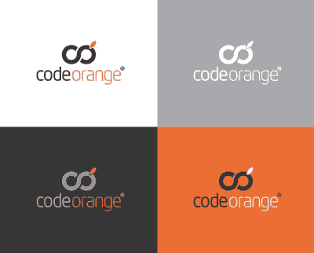
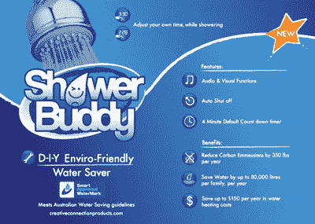
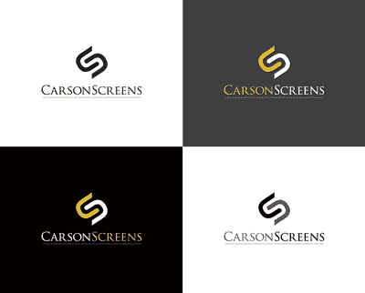

# 设计竞赛让我成为更好的设计师

> 原文：<https://www.sitepoint.com/richard-scott-design-contests/>

设计竞赛是一个两极分化的话题。那些反对他们的人实际上是反对他们的 T2，认为他们剥削设计师，贬低设计行业。[不！规格咒语](http://www.no-spec.com/about/)已经被像 [AGDA](http://www.agda.com.au/) 和 [AIGA](http://www.aiga.org/) 这样的平面设计协会作为一种行为准则，那些同意这种哲学的人认为参加设计竞赛是完全不专业的，是完全错误的。

然而，寻找设计竞赛的支持者并不困难。自然，竞赛举办者喜欢他们，因为当他们众包一项任务时，如设计一个标志，一个网站或一张名片，他们会节省经济成本和各种各样的解决方案。

但是参加这些比赛的设计师呢？Matthew Magain 采访了来自 99designs.com T2 的设计师 Richard Scott，关于自由职业者，为什么他选择无视反对者的请求！SPEC 人群——以及他如何因此成为更好的设计师。

*披露:99designs 是由前 SitePointers 的[团队创立的。我们仍然时不时地让他们使用我们的浓缩咖啡机。](http://99designs.com/help/aboutus)*

SitePoint:感谢您抽出时间与我们交谈，Richard。首先，给我们介绍一下你自己，以及你是如何进入设计行业的。

我出生在澳大利亚，但我在英国长大。我一直热爱艺术和设计，所以我很早就知道这是我想专注的领域。大学两年后，我专攻平面设计和摄影，并在康沃尔郡的法尔茅斯艺术学院(Falmouth College of Arts)攻读了三年学位。我很幸运，有才华横溢的老师，他们真正激励了我；我就是喜欢。

但我从未想过为别人工作。从来没有。

真的吗？从你很小的时候就开始了？

嗯，从永远开始，真的。我从未想过为任何人工作，我一直想自己当老板。我是说，我确实得到了一些设计工作，在工作室工作，但那不是我。从底层开始，一步步往上爬，诸如此类。我知道我可以做得更多，更快。

我对设计有点失望，去旅行了一段时间。当我搬到墨尔本并申请了几份工作后，我开始思考，“为什么我要浪费时间？我宁愿寻找自己的客户，也不愿试图找到一份更好的工作。”

所以我决定从家里开始。我没有计划或任何东西，但我不知何故偶然发现了 99designs.com。

你第一次参加比赛的动机是什么？

我只是想在休假旅行一段时间后重新回到设计中来。我知道我有足够的能力去竞争，但基本上我只是认为我没有什么可失去的。

在我早期赢得一些比赛后，我想，“嗯，我可以在这里赚点钱。也许我真的可以用它来做生意。”所以我决定专注于这些设计竞赛，认为如果我用它们来建立一些联系，那么我可能也会得到后续工作。

这正是所发生的事情——我为之工作的每个人都喜欢我的设计，并希望我做后续工作，而不是举办另一场比赛。这太容易了，我可以看到通过这个渠道建立良好的客户基础的潜力。

那么，你的商业模式是什么？99 设计适合哪里？

基本上我把 99designs.com 作为接触的垫脚石。正因为如此，它真的很棒。我的收入，仅仅是赢得比赛的收入，基本上可以支付我所有的账单。再加上接下来的所有后续工作，你就很棒了。就这么简单。

史迪芬:99designs.com 就像是你们的行销部门？

老实说，这是一切，真的。现在设计师可以列出他们的作品集，这太神奇了。我甚至不再需要推销任何东西。这也是它的美妙之处。这个网站吸引了如此多的观众，所以现在全世界都在看着它！

我都不需要再打广告了。我的意思是，当我自己出去的时候，我真的不知道该怎么去找工作。基本上这是我的救命稻草。太棒了。我知道这在一些设计师中是不受欢迎的观点，因为整个不！规格的东西，对不对？

这绝对是人们热衷的事情。

以下是我对此的看法:我不相信这是黑白分明的。显然有很多人会争论支持和反对双方，直到母牛回家，这永远不会改变。

但对我个人来说，我不想为任何人工作，这非常适合我…我只是不想爬上职业阶梯——从为每个人煮咖啡开始，然后一步步往上爬。我做过一次，我讨厌这样。我只想做我自己，做我自己的事。

和 99designs.com 在一起，我选择我想做的事。当然，回报可能无法保证，因为你必须赢。但是如果你有想法和技能，你就会赢！因此，对于想要选择项目并准备一试身手的人来说，这是一个完美的平台。

你会如何描述你的风格？

我的风格总的来说是相当干净和简约的。当我创作一个标志时，我总是喜欢在设计中嵌入一个聪明的小创意——即使它只是一个文字标记，或者一个图标，它也必须有一些小的创意元素，一些额外的意义层。

通常，当有一份简报时，你需要产生最终解决方案的所有信息都在那里——这只是你如何很好地解释它。我认为我很擅长解释简报，这是我认为我做得很好的一件事。有些人可能参加了一大堆竞赛，却一无所获。对于那些设计师来说，我想说赢得一场设计比赛很大程度上取决于你如何解读设计概要以及如何运用你的创造力。

与赢得比赛后的后续工作相比，你花在参赛上的时间占多大比例？

起初只是所有的比赛。我决定，我只是搅拌通过他们，尽我所能努力工作，赢得尽可能多的比赛。我的计划只是尽早获得尽可能多的奖金，这样我就可以舒服一点，并希望为更多的后续工作做好准备。

现在我真的不再那样做了。那时候，我会一次参加 10 个，也许 15 个比赛，让我的名字出现在那里，并建立一个作品集。现在，我想大概是 50/50。

问题是这些竞赛太容易让人上瘾了。

真的吗？这是为什么呢？

这是真的，它真的会让人上瘾。我向你保证，许多参加竞赛的其他设计师也会说同样的话。

只要知道当你看到一份简报时，你有一个杀手级的想法…很难忽视。我一看到那些内裤，我就想“砰！我知道我能赢！”你可以走了。

我不得不承认，很多时候后续工作并不令人兴奋。如果有人给我一份简报，而且是给我自己的…那就没有获胜的快感了，你知道吗？当然，这是一个更安全的选择，因为你知道你会得到报酬。但对我来说这真的不是钱的问题。它变得更加关于竞争，以及与如此多的其他天才设计师竞争的兴奋。

你是说与其他设计师竞争促使你创造更好的设计吗？

是啊，肯定的。很多时候，我在世界上看到一些东西，我知道“是的，我能赢”，甚至在其他人进入之前。经常发生的情况是，我正在做一个不在 [99designs](http://99designs.com) 之内的客户项目，但是我总是盯着我的浏览器窗口，它是在屏幕的角落打开的。因此，尽管我应该把注意力集中在我实际上会得到报酬的工作上，我仍然会检查是否有任何新的竞赛已经启动。就像我说的，会上瘾的！

我知道工作应该是最重要的，但它似乎经常不像那样工作，因为 99designs 是一种瘾。我相信其他参赛的设计师也会同意我的观点。

当然，我可以在需要的时候管理自己的时间和工作，所以完成客户的工作没有任何问题。我知道我的最后期限，并且管理好我的客户的期望，他们理解时区的不同。

但我还是要说，99designs 是我最关注的东西，其他一切都围绕着它。我不是故意的，我的其他客户工作总是能完成。事情就是这样的。

**SP:其中一个值得关注的问题是没有！SPEC 群众的声音是竞赛剥削设计师，贬低设计行业。你对此有什么看法？**

竞赛有时会被放弃，这很烦人。我知道 99designs 的人正在转向一个新的系统，迫使竞赛举办者预先付费，这肯定是一件好事(*本周刚刚推出了一个“保证竞赛”的功能——Ed*)。显然，我希望看到奖金增加——一个标志 100 美元不值得我花时间，也不会吸引任何更好的设计师，所以这种贬低设计的说法可能有一点点道理。

但就像我说的，我不认为这是黑白分明的。好处是巨大的——例如，对小企业来说。比如爷爷想自己创业。他没有几千美元来支付设计公司。但是他可以举办一场比赛，拿出几百美元，然后从世界上挑选出一些想法。设计师获得一次胜利和一些钱，其他设计师获得一些经验和对他们工作的反馈，这有助于他们的投资组合，爷爷得到他的标志。有些人就是没钱去大的设计机构。

以品牌代理为例。他们可能会向客户收取整个品牌 20 万美元的费用，是吗？这可能是一个相当复杂的过程——许多来回的来回，许多客户的参与。这些品牌代理公司总会有一席之地。这并不是说他们不会倒闭，也不是说 99designs 在抢他们的生意。他们在光谱的一端，在另一端是我们讨论过的例子——已经开始自己做生意的爷爷，开源社区或没有大笔品牌预算的非营利组织。

你参加过的比赛有被放弃的吗？

是的，这种事情发生过几次，比赛主办方可能已经拿走了我的作品。但我认为，因为一小撮不负责任的比赛举办者而玷污整个系统可能是不公平的。这就像说客户-设计师系统是有缺陷的，仅仅因为你处理了一个拒绝付款的坏客户。

一旦比赛被放弃，我就会撤回我所有的参赛作品。我很乐意分享我的知识和想法，但我当然不希望人们剽窃我的作品。然而，事实是，我从其他人那里获得了大量的知识。这就是这个系统的美妙之处——分享和互相帮助。在我看来，这就是整个互联网的意义。

所以尽管这是一场比赛，提交作品的设计师们还是在互相帮助？

你可能认为这不会发生，但它确实发生了！偶尔我会看到类似“你偷了我的设计”之类的评论，但这很少见——我从未真正经历过。更常见的是，有人给我发信息说“嘿，我喜欢你所做的——你有什么建议给我吗？“我喜欢这样！

什么样的项目适合设计师一对一参与，什么样的项目适合设计大赛？

我真的不认为它是特定于一种类型的项目，更可能是一种类型的客户。我们谈到的 20 万美元的品牌推广活动是这个范围的一端，但在 99designs.com 这样的网站出现之前，另一端没有选择。所有那些处于低端甚至中等水平的人，他们别无选择，只能去设计机构，支付数千美元——当然，他们不会这样做，因为他们负担不起。他们可能自己创造了一些看起来很可怕的东西。

从这个角度来看，99 设计对每个人都有好处。现在很多设计师可以靠它谋生，你明白我的意思吗？一些设计师变得疯狂，一次参加一大堆比赛。我想过采取一刀切的方式，一次进 30 个，然后疯掉。但是，如果我一次进入四个或五个，并把我所有的精力集中在这些上面，同时做一些辅助工作，对我来说效果会更好。

你在设计学校的训练对你有什么帮助？

有些人问过我这个问题。我仍然建议人们在参加竞赛之前有一个坚实的设计基础。有时你可能会看到几个条目，你可以告诉设计师没有理解基本原则，因为他们的字距调整是错误的，或者他们的颜色可能会冲突。

我认为这些人真的会从一些正式的训练中受益。如果他们在设计学校花了几年时间把这些东西搞定，获得一些关于品牌、排版、字距调整和基本原理的知识，然后他们就能很好地释放他们的创造力。

当然，竞赛绝对是一次很好的学习经历——看看那个社区中所有令人惊叹的设计师吧。但是我认为经验和设计培训是相辅相成的。

史迪芬:那么对你来说，典型的一天是怎样的？

现在，生活按照我的方式进行——一切都按照我的方式进行，我喜欢这种自由。直到我真正接受了设计竞赛，才开始有这样的感觉。当我朝九晚五的时候，我必须在特定的时间起床。现在我想起床就起床！

所以我的一天基本上就是坐在电脑前吃早餐。我会检查和回复一夜之间收到的电子邮件，比如我赢得了一场比赛。然后直接进入检查新的比赛，阅读简报和设计。

SP:当你的业务集中在远程与人交流时，你会感到孤独吗？

反正我一直喜欢一个人。我在当地有几个客户，我偶尔会出去见见他们，这很好。但是大概我 90%的工作是竞赛和我远程互动的客户。但我一点也不孤独，因为我对它充满热情。

你遵循什么样的设计流程？

其实挺诡异的。我过去常常画整个蜘蛛图——你知道，画出所有的东西，写下公司的名字，头脑风暴，单词联想，诸如此类的事情，让想法继续下去。但是我现在发现整个过程加快了我的创造力。这些天来，我只是阅读简介，看看我想要什么颜色，然后直接进入 Illustrator。没有缩略图草图或任何东西——我想我现在已经做了这么多，有足够的经验，所以我可以简化这个过程。

那么，你会给那些想开始参加竞赛的有抱负的设计师什么建议呢？

除非你试一试，否则你永远也不会知道——你只需要潜入其中。

做了几年，最近六七个月工作肯定有进步。我对自己最近做的一些事情比以往任何时候都感到自豪。我肯定会把这归功于整个社区——我们分享的知识，鼓励和支持。没有什么是真正的原创了，你知道我的意思吗？但是你可以发展一个概念，把事情向前推进，把你自己的想法融入其中，而不需要直接复制。我们都在这里互相激励。

理查德在 99designs.com 的用户名是[design bot](http://99designs.com/users/184078)。

## 分享这篇文章