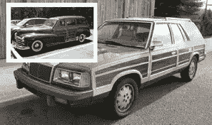
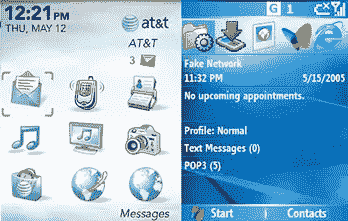
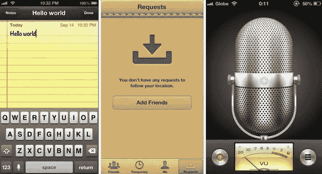
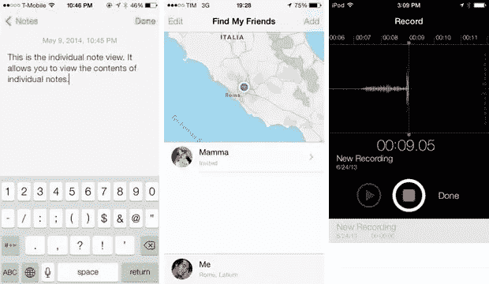
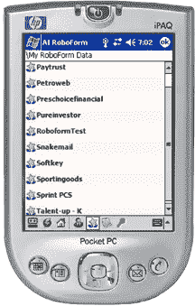
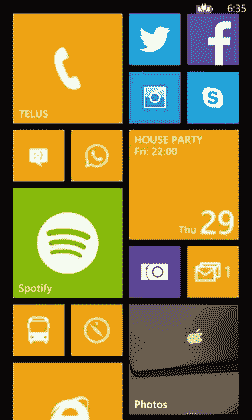
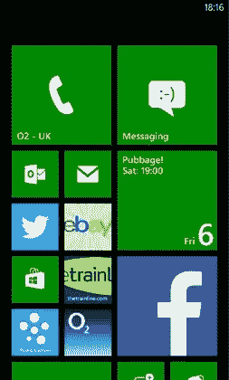
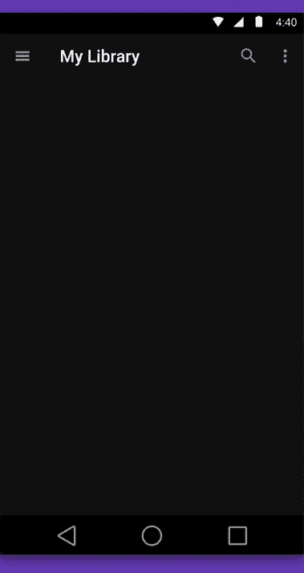
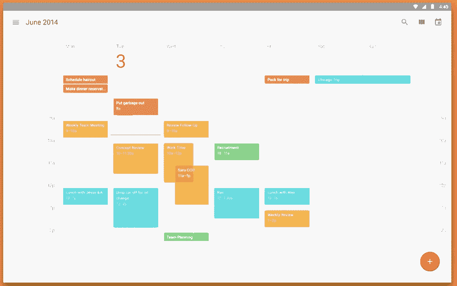

# 谷歌材料设计的漫漫长路

> 原文：<https://www.sitepoint.com/road-google-material-design/>

克莱斯勒仿木纹镶板。
(插图:实木镶板)

在 70 年代和 80 年代，拥有一辆车是非常棒的。如果你有一个很酷的叔叔或表弟，他可能会拥有一辆仿木纹装饰的克莱斯勒。

早在本世纪初，真正的木质镶板在汽车外部相当普遍，但随着金属加工技术变得越来越好、越来越便宜，这种镶板就失宠了。

这个假木纹是一个典型的“外观变形”的例子，或者说一个新的设计倾向于模仿旧设计的外观——即使这些设计没有明显的功能价值。有人喜欢，有人讨厌。

当然，skeuomorphism 并不局限于物理对象——它经常在我们的数字环境中找到一个家。

在本文中，我们将浏览主要移动操作系统的近期历史，然后放大以更近距离地观察谷歌 Android L 的新材料设计如何融入其中。

## 苹果外形:iOS

当史蒂夫·乔布斯推出第一代 iPhone 时，移动操作系统生态系统处于与今天截然不同的状态。iPhone 的 3.5 英寸屏幕被认为是巨大的，怀疑论者甚至认为这是大材小用。

2000 年代中期的黑莓和 Windows Mobile 用户界面

在 2007 年移动用户界面的背景下，iPhone 的到来是一个相当大的冲击。凭借先进的触摸屏，大多数竞争对手的设备都无法提供丰富、详细的用户界面，这对于在“糖果棒诺基亚”和 90 年代黑莓手机上成长起来的移动市场来说是非常合理的。

iOS 的第一个版本有复杂的阴影落在 3d 纹理上，人造金属边缘在人造光下闪闪发光。

2007 年，很少有人知道什么是“skeuomorphism”——更不用说谈论它了。他们只是知道他们迫不及待地想向他们的朋友和同事展示我的 iPhone 上的页面像一本真正的书一样翻转的酷方式？z .O·M·G 组合。”。很难记起 8 年后的事情，但在那个时候，日常生活中的人们——老师、爷爷、公交车司机和护士——真的很喜欢 Youtube 是一个可爱的复古电视，日历有皮革缝线。

当然，像人一样，随着年龄的增长，用户界面很少会变得更简单。

四年后，大型触摸屏智能手机已经成为全球数亿用户的标准，行业标准正在慢慢转向更简单的 UI 设计。

然而，苹果当时的 iOS 主管斯科特·福斯特尔仍然是他们所开创的丰富的异形界面的忠实拥护者。毕竟，谁不想要 iOS6 股票应用程序的假皮革缝线、闪亮的金属渐变、镜面反射和标记感觉字体呢？

三个 iOS 应用程序 ui 分别模仿真实世界的便条纸、缝合皮革和金属麦克风。

显然不是每个人，因为这被认为是一年后斯托尔被“解雇”的主要原因之一。接替他的是当时的高级设计副总裁乔纳森·伊夫，他将领导 iOS7 更扁平、更简单的设计方向。

一段时间以来，伊夫对直线、简单曲线和有限调色板的热爱——在 iPhone 的工业设计中得到了证明——一直是他和福斯特尔之间的争论点。他在 iPhone UI (iOS7.0)上的第一次尝试去除了 Forstall 所有的糖果光泽，代之以平坦的色调、简单的几何形状和超轻的字体。

如果你有鹰眼，你会发现 iOS7 并不是完全平的。例如，检查 notes 应用程序。背景是一种微妙的纸张纹理。低调，但它仍然存在。

键盘按钮也暗示了阴影和圆角，这在纯粹的极简设计中可能不会遇到。但总的来说——考虑到一些初期问题——Ive 的设计革新似乎给了 iOS 可喜的新生。

潮流随着季节来来去去，我怀疑我们会在未来的某个时候看到一个回转回到 skeuomorphism。然而，目前设计界的“反 skeuo”情绪似乎根深蒂固。

## 地铁站:Windows Phone

当然，苹果并不是唯一一家对 UX 进行根本性变革的公司。微软的移动操作系统 Windows Phone(以前被称为 Windows Mobile)自 90 年代末就已经存在，伴随着它的是更长的历史——以及相关的包袱

凭借人们对桌面 Windows 的熟悉，Windows Mobile 试图利用经典的 Windows XP 和 Vista 体验，并针对移动设备进行了重新定制。作为一个概念，尝试是有意义的，即使许多桌面范例不能无缝转移到移动设备。

Windows Phone 的重新发布(2010 年)开启了一个全新的方法，将一个干净的几何形状的盒子布局与单色应用程序图标结合在一起。这个界面维持了一个纯粹的二维世界观。

作为一个界面，Window Phone 界面从第一天起就被认为是一个移动友好的体验。这种设计方法的开端——早期代号为“[Metro](http://en.wikipedia.org/wiki/Metro_(design_language) "Wikipedia: Metro")”——可以在微软的 Zune 播放器和软件中看到。虽然设计蓝图后来发展到了 XBox、Window Media Center、Windows 7 和后来的 Windows 8，但微软已经知道他们有一个在小屏幕上运行良好的用户界面。

由于我们的大脑获取信息的方式，UX 关于界面的讨论并非没有争议。一些用户比纯粹的文本信息更容易识别和记住视觉元素和图像——其他人的工作方式正好相反。

Windows Phone 菜单系统中缺少图标缺乏一致性，因为应用程序抽屉窗口只描绘了*个*应用程序图标，删除了后面的文本信息。

在某些方面，UX 这样做可能会很好，因为微软肯定把他们的优先级做对了，让经常使用的应用菜单在视觉上更加突出(谁会不知道 facebook 的“f”呢？)，但也可以说这个设计在很多地方缺乏一致性。

以这些截图为例。与原生的极简图标相比，图像和渲染标志之间的对比在视觉上是不和谐的。当然，一方面，遵守风格指南的要求是应用发布者的责任，但想要流畅工作流程的普通消费者会发现这是脱节的，不管谁负责。

然而，不得不说微软的 Windows Phone 用户界面的方法是勇敢的，毫无疑问是创新的。

可以说，对某些人来说，这太创新了。这肯定不是长期 Windows 用户所习惯的，大的变化——即使是巨大的改进——对信任的客户来说也是一个挑战。

## 时髦又时髦:安卓

谷歌呢？看起来谷歌已经做了他们的功课。多年来，Android 经历了许多变化，但似乎他们设计了迄今为止最大的更新:他们的新材料设计。

材料设计是谷歌设计副总裁马蒂亚斯·杜阿尔特(Matias Duarte)的创意。杜阿尔特是从 Palm 广受赞誉但命运多舛的 WebOS 的残骸中拯救出来的，WebOS 使用了一个令人印象深刻的基于卡片的用户界面隐喻。有些人可能会称材料设计为“帕尔摩斯之子”。

> "这是一种非常先进的纸张形式，与魔法无异."

马蒂亚斯·杜阿尔特(Matias Duarte)表示，谷歌新设计方向背后的统一隐喻是为软件的外观和行为提供一套统一的物理和规则。

材料设计侧重于为虚拟界面创建一个逻辑，而不是完全复制现实世界中的物理规则。

然而，没有提到的是，Material Design 结合了 Windows Phone 和 iOS 的两大理念，创造出了最终的原创产品。只看它，你既不能称之为极简，也不能称之为复杂。

iOS 的 skeuomorphism 如此臭名昭著的原因之一，可能是因为它专注于仅通过静态视觉传达内容。事情看起来不同，但它们的行为并无不同。

微软从 Windows 早期就明白这一点。该操作系统看起来不像你的办公桌，但它的工作方式很像！你可以像拖动你桌上的文件一样拖动屏幕上的窗口，这取决于你现在需要注意什么。这些用户体验机制变得如此深刻地融入了我们思考和与设备交互的方式，以至于我们可能会认为这是理所当然的。

那时候，这不亚于材料设计对我们今天的意义(或希望如此)。

材料设计采用一种 skeuomorphism 的形式，不是在它的原始视觉效果上，而是在它们被转换和动画的方式上。物品经常以卡片的形式出现，但是它们没有真实卡片的纹理、反射或光线跟踪阴影。

然而，它们在三维空间中运动——在彼此上下俯冲。然而，这是一个平滑、简化的 3d 世界，纸板不再有固定的尺寸，允许它随心所欲地伸展和挤压自己。

不像谷歌采用平面的 Metro 风格的调色板，形状和面板有实质和深度。他们向你走来，又向你退去。你知道他们从哪里来，去哪里。你知道它们下面是什么，接下来会发生什么。这是合乎逻辑的，而且相当漂亮

此外，这个技巧激发了我们对面前三维空间的内在理解——这种理解我们从出生起就一直在琢磨——但它与几乎“儿童读物”的视觉风格融为一体。

重要的界面元素吸引我们的注意力不是因为它们华丽的视觉效果，而是因为它们吸引人的动作。这个动画编排特别让人印象深刻。不是他们穿什么，而是他们跳舞的方式！

谷歌还使用图形表示和形状作为变量，而不是抛光的视觉元素，眼睛感知和处理它。它为用户留下了想象的空间，以便定制它所提供的体验。这是极简主义的一个非常强大的优势，谷歌似乎用得很好。

## 古格拉德姆·勒维奥萨！

对于一家长期以来以近乎前端/UX 不屑一顾而闻名的公司来说，谷歌显然找到了一些用户界面的魔力。材料设计是解决设计难题的一种令人印象深刻且近乎着迷的方法。它甚至能解决环境中的实际问题，而不仅仅是视觉问题。

我很期待事情如何发展。这是令人印象深刻的工作。

## 分享这篇文章