# 漫游研究初学者指南

> 原文：<https://www.sitepoint.com/roam-research-beginners-guide/>

**Roam Research 是一款[无摩擦笔记和知识管理应用](https://roamresearch.com/)。它得到了很多关注，并且使用了“游戏改变者”的标签。您可能正在阅读这篇文章，因为您已经听到了大肆宣传，并想知道它是否是真的，以及它的功能是否很适合您的需求。**

乍一看，它似乎是一个 Workflowy 类型的在线 outliner，但第一印象可能是欺骗性的。在引擎盖下有更多的能力，例如创建一个知识网络的能力，使用链接和反向链接来连接你的想法。

这是一个灵活的工具，可以用于许多任务，包括笔记和知识管理、写作和概述、写日志、 <abbr title="getting things done">GTD</abbr> 、研究等等。开发者用它来[探索想法](https://dev.to/theianjones/roam-research-to-explore-ideas-5cge)，[创建文档](https://www.reddit.com/r/RoamResearch/comments/ip9hzr/roam_research_for_learning_java/)，以及[记录问题](https://medium.com/@bonjarber/how-to-remember-everything-3cf29540b5d5)。

你储存的越多，它就变得越有用。它还不是我的主要工具之一，但它很有可能成为一个工具。也许它也会成为你的一个。

## 个人知识管理正在升温

在过去的几十年里，我对个人知识管理领域已经有点失望了。在个人计算发展的早期，“第二大脑”应用程序提供了查看和处理数据的有趣而独特的方式:

*   [Ecco Pro](https://en.wikipedia.org/wiki/Ecco_Pro) 使用了标签、轮廓和列的组合。每一列都是关系数据库中的一个字段。
*   信息中心让你以一种可以被视为轮廓的方式将人、事和物联系起来。每个连接都允许您精确地定义关系。
*   大信息让你建立即兴领域和分支来描述每个人和物体。每个对象都可能存在于你的知识网络中的多个地方。

不幸的是，他们在 20 世纪 90 年代被切除了脑叶。许多是在办公套件大战期间购买的，由于对普通的非技术用户没有吸引力，它们被降低了质量或被放弃了。有前途的新来者已经出现——例如，Zoot 和 T2 InfoQube，但是他们并没有获得太多的关注……直到最近。Roam Research、黑曜石、Craft 和其他公司通过提供诱人的新功能赢得了忠实的追随者。自动反向链接是一个引人注目的。

## 什么是漫游研究？

像所有好的应用程序一样，Roam Research 是固执己见的，由康纳·怀特-沙利文编写以挠自己的痒痒。这是一个带有链接和反向链接的 outliner，只在网上提供，而且故意定得很贵——让普通用户买不起。

它的不同寻常之处在于，它允许您同时自上而下和自下而上地构建数据。每个页面都是一个大纲视图，允许您在键入、编辑和重新思考时对信息进行结构化。我爱 outliners，并发现漫游非常流畅。

链接独立笔记的能力还允许您自下而上地创建结构，因为随着时间的推移，您会注意到笔记之间的关系。这可能会带来意想不到的发现，也是 Zettelkasten 笔记方法的核心原则，Roam 就是为了封装这一原则而建立的。

这种方法是由社会学家尼克拉斯·卢曼(Niklas Luhmann)创造的，他使用模拟索引卡来探索思想之间的关系。它起了作用，并直接导致他创作了大约 70 本书和 400 篇学术文章。

它建立在用你自己的话写的解剖笔记的想法上，只包含一个想法。结构是一种事后的想法，当你注意到你的思想之间的新关系时，它会有机地发展。您在另一个笔记中引用一个笔记，然后创建原始笔记的反向链接。

你可以通过仔细阅读桑克·阿伦斯的《如何做笔记*[这本书来了解更多。](https://www.amazon.com/How-Take-Smart-Notes-Nonfiction-ebook/dp/B06WVYW33Y/)*

## 漫游研究主要概念

以下是 Roam Research 使用的主要概念。使用它们作为构建模块来设计你自己的信息系统。

**Outliner** :每个页面都是由文本和图像的分层块组成的单窗格 Outliner。这鼓励了解剖学和结构性思维。`Command` + `Shift` + `Up`和`Down`上下移动积木。`Tab`和`Shift` + `Tab`改变缩进。`Command` + `Up`和`Down`展开和收缩轮廓。

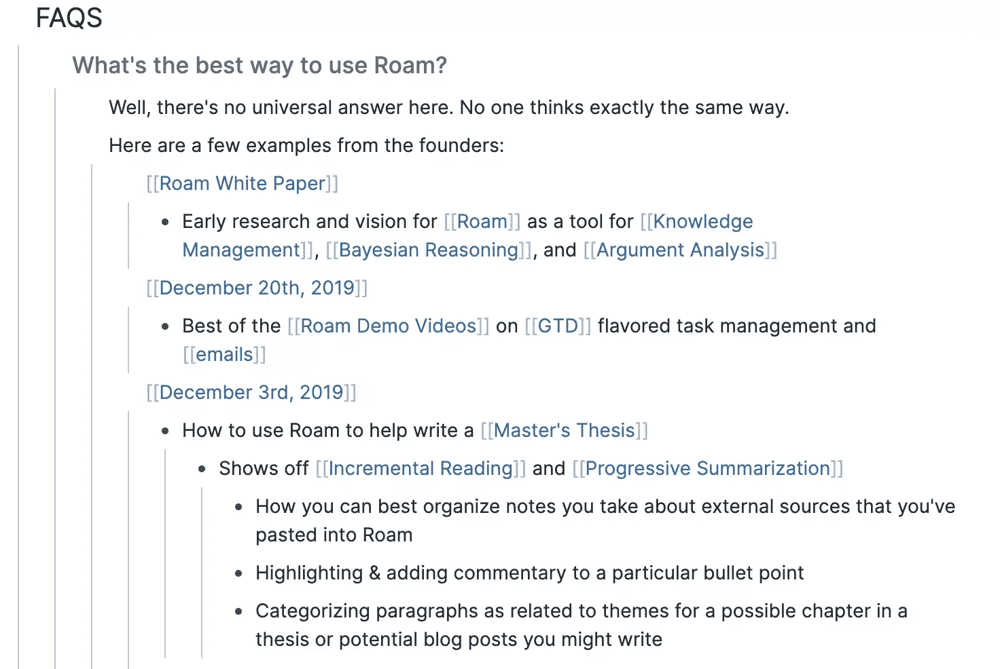

**查找**:页面顶部的查找功能会查找所有包含某个短语的页面。它还允许您创建具有该名称的页面(如果还没有这样的页面的话),类似于 nvAlt 的工作方式。

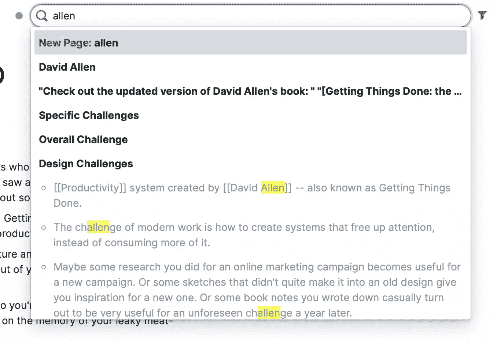

**过滤器**:过滤器图标允许您显示或隐藏页面上包含特定链接的块。

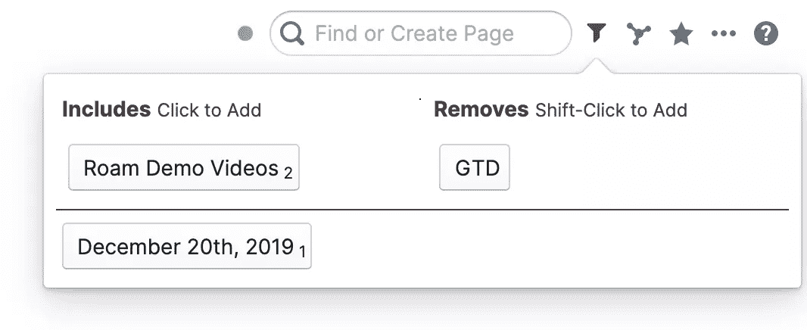

**布尔查询**:查询嵌入在大纲中，是你可以提出漫游研究问题的一种方式。支持逻辑布尔运算符，如“与”、“或”和“非”。匹配的命中被拉入轮廓。

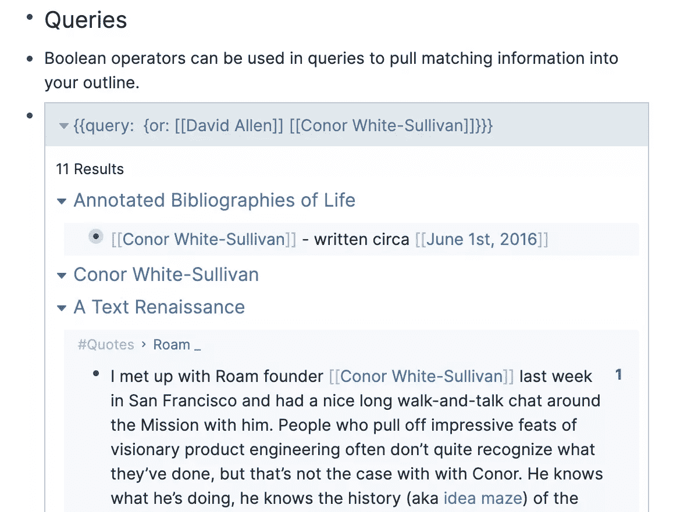

**链接和反向链接**:链接允许你创建一个网络思维系统或个人维基。你使用`[[wikilinks]]`链接到另一个页面，如果它不存在的话，一个新的页面被创建。反向链接是自动生成的，并且包含链接的上下文，为页面添加了有用的信息。

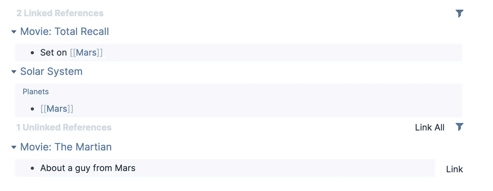

**标签**:在 Roam 中，标签类似于页面，每个标签都会自动获得自己的页面。与页面一样，包含标签的每个页面都作为反向链接列出。

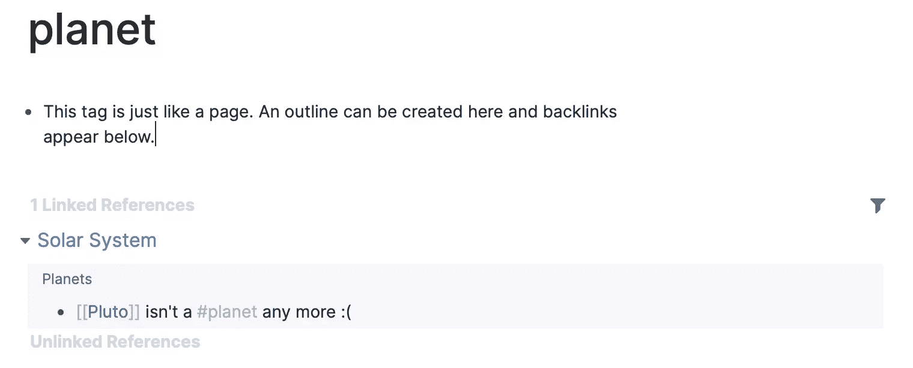

**Embed**:Roam 一部分的块可以被引用或者嵌入到其他地方。还可以嵌入页面、网站、视频等。

**Graph** :页面之间关系的数字表示。点击一个页面会将所有相关页面涂成蓝色。双击一个页面将打开它。

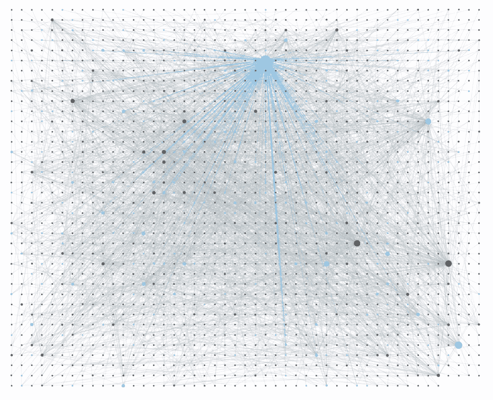

**Markdown** : Markdown 被支持并隐藏，直到你编辑一个块。可惜不太标准。虽然`**bold**`文本是用双星号创建的，但是`__italics__`需要双下划线而不是单下划线或星号。Dynalist 也是这样做的，可能是这里的灵感来源。

**Latex 符号**:通过将 Latex 代码包含在双美元符号中，您可以添加数学符号来漫游。

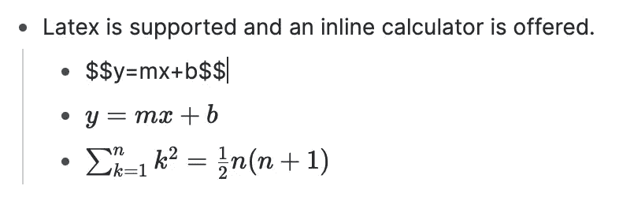

**代码块** : Roam 提供语法高亮的代码块。以三个反勾号开始代码块，单个反勾号用于内联代码。

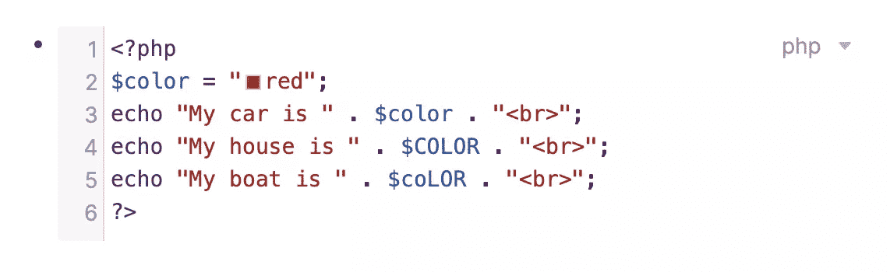

斜线菜单:像概念、Slack 等，Roam 通过斜线菜单提供对功能的快速访问。

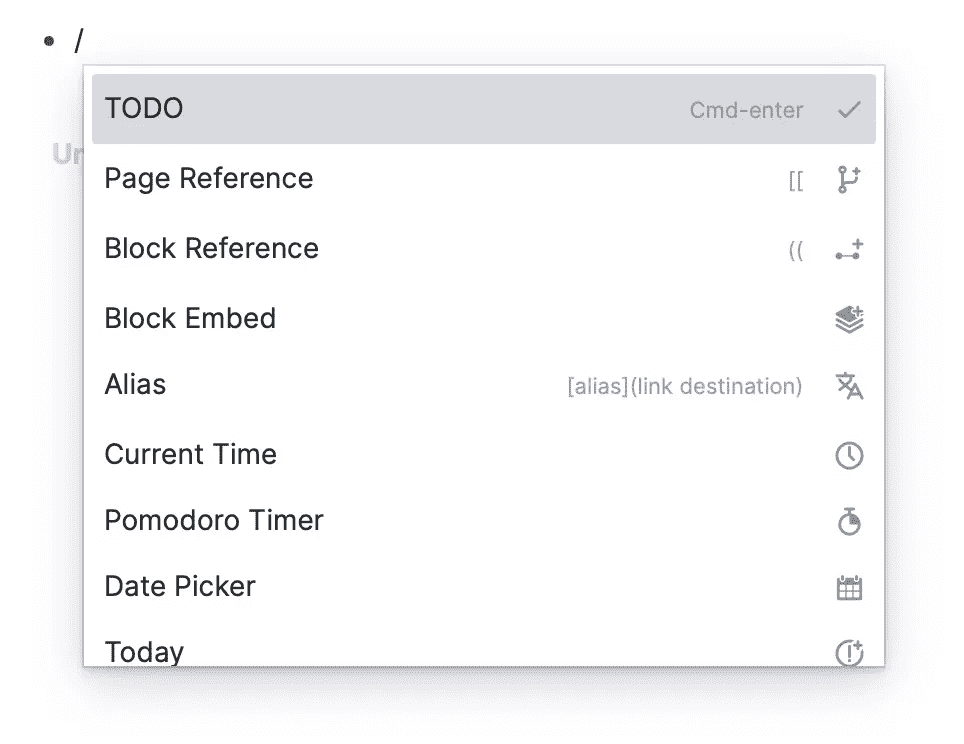

侧边栏:侧边栏让你可以在不丢失位置的情况下访问 Roam 中其他地方的信息。可以分别使用`Command` + `/`和`Command` + `\`显示或隐藏左右窗格。`Shift`——点击打开侧边栏的链接。

**组件** : Roam 的功能可以使用组件进行扩展，目前包括内嵌计算器(`{{calc: 4 + 5}}`)、字数统计、日期选择器、块/页嵌入、PDF 嵌入、视频嵌入、网站嵌入、加密文本、看板、提及、Pomodoro 计时器和表格。

## 入门指南

你的第一步是注册一个漫游研究帐户。没有什么可下载的，因为现阶段它只在网上。注册一个专业账户，给你 31 天的免费试用期，如果你继续，你将被收取 15 美元/月或 165 美元/年。

真正的信徒可以支付 500 美元获得为期五年的许可证，全职学者、22 岁以下的人和经历财务困境的人都有折扣。根据[这条推特帖子](https://twitter.com/RoamResearch/status/1257857549606387712)的说法，优惠 50%。它还提到未来可能会有一个免费增值计划。

**每日笔记**是放置你一天中随意笔记和待办事项的最佳地方。把它当作还没有家的信息的收件箱。请注意，在 Roam 中，所有日期都是您可以链接到的页面。每天都会自动创建一个新的，您可以使用日期选择器提前手动创建它们。

导航侧边栏中的第一个项目会直接将您带到您的每日笔记。还有一些链接可以查看所有笔记的图表或列表。然后，您可以通过快捷方式快速访问任何笔记。您可以通过单击页面右上角的星形图标向快捷方式添加任何注释。

从斜线菜单中选择 **TODO** 将清单添加到您的笔记中。你需要在每一行都这样做；不会自动添加下一个项目的复选框。

待办事项的标记实际上是 TODO 页面的链接。在页面底部有一个反向链接，指向图表中每个未选中的待办事项。选中一个复选框会将标记更改为一个指向完成页面的链接，所有已完成的待办事项都将作为反向链接出现在那里。如果你认为你会经常访问你的待办事项页面，把它添加到你的快捷方式中。

我依靠[番茄工作法](https://francescocirillo.com/pages/pomodoro-technique)来保持专注，我很高兴在 Roam 的组件中找到一个番茄计时器。这些可以使用斜杠菜单内联添加，默认添加 25 分钟的时间。计时器的标记是一个到 POMO 页面的链接，在该页面的底部你会找到所有链接的反向链接。

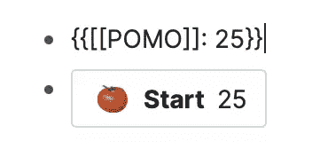

另一个探索 Roam 功能的地方是[帮助数据库](https://roamresearch.com/#/app/help)。这实际上是一个公共漫游图，即使那些没有创建漫游帐户的人也可以访问。它的内容会告诉你关于 Roam 的一切，详细的 changelog 会让你知道它的开发有多活跃。

更有帮助的是，它会给你一个探索用户界面的机会。您甚至可以创建新页面和键入内容，但它不会被永久保存。

## 发展知识网络

开始有意识地使用 Roam，让你的图表自然增长。你用得越多，它就会变得越有用。

将它用于各种目的。链接到其他网页。实验。不要太担心是否做对了；随着知识网络的增长，你可以重新命名和组织。

从选择一两个用例开始。你可以使用每日笔记来记录你每天计划做的事情，并使用清单，这样你所有的待办事项都会被收集到 to do 页面上。或者，为每个项目创建单独的任务页面。

一些用户正在将任务管理提升到一个新的水平(只需浏览这个 [YouTube 搜索](https://www.youtube.com/results?search_query=task+management+roam)中的视频)，将它用于 GTD、子弹日志等等。Todoist 可以[集成](https://github.com/roamhacker/SmartBlocks/issues/37)，Asana 的我的任务[复制](https://www.youtube.com/watch?v=D8lGWF1N0PU)，Roam42 的 SmartBlocks [利用](https://www.youtube.com/watch?v=Juw-wXhlBns)。

使用每日笔记来记录一天中发生的事情——你完成了什么和任何亮点。记下你的随机想法、新想法和你遇到的任何好的引用。如果您引用另一个页面上的日期，请使用日期选择器，以便在该日期页面的反向链接中引用它。

使用 Roam 存储和开发有关您的项目和兴趣的参考信息。尽量保持每个页面合理的简短，并在链接页面中添加相关信息。链接的使用将漫游从一系列独立的笔记转变为一个思想网络。

您可以使用 [Roam-native book](https://www.roambrain.com/roam-native-books/) (rBook)发布您的作品。两本已经在[漫游书籍](https://roam-books.com)上有了，你可以在这次 [YouTube 访谈](https://www.youtube.com/watch?v=0_q2eT_FQbY)中了解更多。或者使用像[数字园丁](https://github.com/MaggieAppleton/digital-gardeners)、[盖茨比数字花园](https://github.com/mathieudutour/gatsby-digital-garden)或[漫游导出](https://github.com/roam-garden/roam-export)这样的工具种植一个数字花园。[漫游花园](https://roam.garden)是一个托管的替代方案。

Roam 也是一个优秀的联系人管理或客户关系应用程序。查看一个人的页面会显示链接到该人的所有其他页面。这些可能包括你和他们的约会，他们参加的会议，你分配的任务，他们报告的错误，或者你为他们做的项目。Roam 的反向链接功能意味着你可以在你期望的地方找到你需要的所有信息。

不要羞于在 30 天的试用期内添加数据。Roam 允许您在一个步骤中导出您的所有信息，作为单独的 Markdown 文件的集合或单个 JSON 或 EDN 文件。

## 扩展和定制漫游

Roam 支持自定义 CSS **主题**，有很多可以选择一些。要知道 Roam 的快速发展可能会留下一些残破。[更好的漫游研究](https://github.com/linuz90/better-roam-research/)流行，积极维护，目前正在工作。它提供系统黑暗和光明模式和强调颜色。

一些主题增加了功能。Azlen 的 Roam 主题在 graph view 上覆盖页面(这些[非官方补丁](https://github.com/sitepoint-editors/js-peers/pull/723)显然有效)，Maggie Appleton 的 [Leyendecker](https://github.com/theianjones/roam-research-themes) 混合了几个主题的功能。如果你对创建自己的主题感兴趣，看看 Maggie 的[绘画漫游和自定义 CSS](https://maggieappleton.com/paintingroam) 指南。

您现在可以在 Roam 中创建**模板**以节省时间，并确保定期创建相同类型的笔记时的一致性。[了解更多](https://nesslabs.com/roam-research-templates-tutorial)。模板的一个创造性用途是在您的每日笔记上创建一个每日任务视图。

有大量的 Roam **扩展和集成**可以探索。这里有几个让你开始:

*   Roam42 是一把瑞士军刀，它使用 SmartBlocks 动态重用文本，支持人类可读的日期，提供有用的导航快捷方式等等。
*   [Readwise](https://readwise.io) 集成、 [Roam 荧光笔](https://chrome.google.com/webstore/detail/roam-highlighter/hponfflfgcjikmehlcdcnpapicnljkkc)和[雄辩](https://eloquent.works)让您轻松地将格式化数据移入 Roam。
*   一个浏览器扩展可以抓取 Markdown 格式的标签链接，标题作为锚文本。
*   [漫游研究降价链接](https://chrome.google.com/webstore/detail/roam-research-markdown-li/idlhfmfbimbonggifafgaenpijapenjf)和[复制为降价](https://chrome.google.com/webstore/detail/copy-as-markdown/fkeaekngjflipcockcnpobkpbbfbhmdn)将格式化链接带入漫游。

最后， **[Roam Depot](http://www.roamdepot.com)** ，一个经过审核的主题、插件和特性的官方仓库，应该已经推出了。通过在 Twitter 上关注@ [RoamDepot](https://twitter.com/roamdepot) 来了解最新消息。

## 最后的想法

漫游研究仍处于早期阶段。

没有桌面应用，没有移动应用，也没有 API。没有本地存储(除非你是一个 500 美元的信徒)，也没有版本控制，尽管现在可以在 Chrome 中或通过 [Roam2Github](https://github.com/everruler12/roam2github) 脚本自动备份，而且你现在可以[就地加密敏感笔记](https://twitter.com/RoamResearch/status/1226658292333568003)。它有一个陡峭的学习曲线，价格昂贵，并且目前没有提供免费增值计划。

但是它有一个光明的未来。我遇到过许多用户，他们觉得目前的价格花得值，因为它比任何替代产品都更能满足他们的需求。

它既强大又实用，大纲、链接和嵌入的结合使它适用于许多任务。它正在快速开发中，我在第一次概述本文时列出的一些缺失的特性已经被添加进来了。

漫游研究适合你吗？这是一个只有你能回答的问题，我希望我已经在你的旅途上帮助了你。

这当然引起了我的注意，我会密切关注它的发展。它的受欢迎程度激励着其他应用程序通过添加反向链接等功能来改进，我将在其他文章中介绍类似的应用程序。

信息管理的未来看起来一片光明。

## 资源

文本:

*   《漫游研究周刊》, Fabrizio rina ldi 酿造，Mailbrew 联合创始人，更好的漫游研究主题作者
*   关注推特标签 [#roamcult](https://twitter.com/search?q=%23roamcult)
*   免费电子邮件课程 Roam Research 的有效笔记
*   [RoamBrain.com](https://www.roambrain.com)，漫游研究的信息枢纽
*   漫游研究中间隔重复的简短(初步)指南
*   [使用以 Roam Research 为特色的数据源扩展我的个人基础设施](https://beepb00p.xyz/myinfra-roam.html)
*   我们如何开发思维的变革工具？

视频:

*   [漫游多部分 YouTube 课程](https://www.youtube.com/playlist?list=PLralmZwl_8jJuJMIebWFqm6K5I20a5Qve)
*   [100 个漫游提示:25 分钟内从初级到高级](https://www.youtube.com/watch?v=4yXK9OMc2OU)
*   [Roam Research 中的下一级功能(待办事项、侧栏、块嵌入)](https://www.youtube.com/watch?v=Eintd95hWjc)
*   [陈山聪教授 Roam 研究中的柔性系统综合](https://www.youtube.com/watch?v=JoCjpTXCklw)
*   [与 Beau Haan 在 Roam Research 中使用块引用实现数字 Zettelkasten】](https://www.youtube.com/watch?v=KoddCmn3eL0)
*   [我在 Roam Research 的创意工作流程](https://www.youtube.com/watch?v=5XriXGX8d5M)
*   [深入了解 Roam Research 中的属性](https://www.youtube.com/watch?v=uWXm85VFOQs)
*   [Nat Elias on 如何使用 Roam](https://www.youtube.com/watch?v=W3AwgW6rLVk)
*   【Rosie Campbell 漫游之旅——数字花园漫游和黑曜石工作流程
*   [Roam 的新页面嵌入，模板&更多](https://www.youtube.com/watch?v=sDK9c-lM-3c)
*   [漫游研究:共享数据库技巧](https://www.youtube.com/watch?v=SZtl7Mi_xkw)
*   [版本:漫游研究基础](https://www.youtube.com/watch?v=ryU0bMAz1zo)
*   [Roam Research&read wise Sync 联合创始人特里斯坦·霍姆西](https://www.youtube.com/watch?v=bV0Wr-l7nU8)
*   [漫游峰会-第一场会议-最大限度地提高您的图表的可发现性](https://www.youtube.com/watch?v=47A0gK7Vo8E)
*   [漫游:有史以来最好的个人 CRM](https://www.youtube.com/watch?v=cRDgrdlfYdE)

## 分享这篇文章