# 卷起袖子，在 WordPress 中了解 I18n 的本质

> 原文：<https://www.sitepoint.com/rolling-up-your-sleeves-and-getting-into-the-nitty-gritty-of-i18n-in-wordpress/>

上周，我在 WordPress 中介绍了 i18n 的[基本组件，以及这些组件是如何组合在一起的。](https://www.sitepoint.com/language-fluency-in-wordpress-understanding-the-basics-of-i18n/)

现在让我们再深入一点，看看一些真正的代码，好吗？

### 在 WordPress 中本地化主题

当你本地化一个主题时，你通常只需要处理出现在主题不同位置的文本字符串。

因此，让我们来看看一些包含一些字符串的基本 HTML 代码:

```
<!DOCTYPE html PUBLIC "-//W3C//DTD XHTML 1.0 Transitional//EN"
  "https://www.w3.org/TR/xhtml1/DTD/xhtml1-transitional.dtd">
<html >
<head>
<meta http-equiv="Content-Type" content="text/html; charset=UTF-8" />
<title>Localization Sample</title>
</head>

<body>
<p>My name is Mick.</p>
<p>I have a dog named Lacie.</p>
<p>My dog's name is Lacie, but we call her Bug.</p>
<p>Sometimes, we call her Buggers.</p>
<p>Lacie has a black coat.</p>

</body>
</html> 
```

这里没什么可看的，真的。我们只是以一种非常通用的方式将五个不同的文本字符串输入到一个 HTML 文档中。然而，我们可以通过简单地用`_e()`函数包装每个字符串来本地化这个页面。

```
<!DOCTYPE html PUBLIC "-//W3C//DTD XHTML 1.0 Transitional//EN" "https://www.w3.org/TR/xhtml1/DTD/xhtml1-transitional.dtd">
<html >
<head>
<meta http-equiv="Content-Type" content="text/html; charset=UTF-8" />
<title>Localization Sample</title>
</head>

<body>
<p><?php _e( 'My name is Mick.', 'our-very-unique-domain' ); ?></p>
<p><?php _e( 'I have a dog named Lacie.', 'our-very-unique-domain' ); ?></p>
<p><?php _e( 'My dog's name is Lacie, but we call her Bug.', 'our-very-unique-domain' ); ?></p>
<p><?php _e( 'Sometimes, we call her Buggers.', 'our-very-unique-domain' ); ?></p>
<p><?php _e( 'Lacie has a black coat.', 'our-very-unique-domain' ); ?></p>

</body>
</html> 
```

现在这个更有趣了。我们已经用`_e()`包装了每个文本字符串，并为本地化设置了 textdomain 常量。请注意，我使用了一个名为`our-very-unique-domain`的常数。当你开始本地化你自己的主题和插件时，只要你意识到你如何称呼这个域并不重要，只要它对你来说是唯一的，并且你用相同的唯一名称初始化关系。我们如何初始化`functions.php`内部的关系？让我们看看代码:

```
<?php
load_theme_textdomain( 'our-very-unique-domain', TEMPLATEPATH.'/languages' );

$locale = get_locale();
$locale_file = TEMPLATEPATH."/languages/$locale.php";
if ( is_readable($locale_file) )
	require_once($locale_file);
?> 
```

如你所见，在第 1 行我们启动了`load_theme_textdomain()`，并指定我们的语言翻译文件将保存在主题的`/languages`文件夹中。到目前为止，一切都很好，但是现在我们看到了很多关于场所的东西。主题本地化依赖于定义区域设置的`wp-config.php`中的`WPLANG`常量。

地区是由 GNU gettext 框架指定的国家和语言代码的组合——您可以在 gettext 手册中查找国家和语言缩写。

打开你的`wp-config.php`文件，看看你是否定义了一个自定义的 WordPress 区域设置……如果你没有，现在就开始定义吧。例如，如果您使用德语作为您站点的主要语言，您会在您的`wp-config.php`文件中看到(或手动添加)这样一行:

`define ( 'WPLANG', 'de_DE');` 

设置好 WordPress 区域设置后，(在本例中是`de_DE`)，我们上面的代码将在主题的`/languages`目录中寻找一个名为`de_DE.mo`的德语本地化文件。因此，我们的示例主题目录中的文件最终可能具有类似如下的结构:

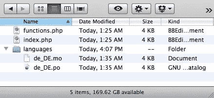

### 在 WordPress 中本地化插件

本地化一个插件和本地化一个主题非常相似。让我们从头开始看一个非常简单的插件，它还没有被本地化。

```
<?php
/*
Plugin Name: Our Sample Plugin
Plugin URI: https://www.sitepoint.com/our-sample-plugin
Description: Sample localization code demonstration
Version: 1
Author: Mick Olinik
Author URI: http://www.sitepoint.com
License: GPL2
*/ 

add_action( 'init', 'olin_osp_init' );
function olin_osp_init() {
	add_action( 'admin_menu', 'olin_osp_menu' );
}

function olin_osp_menu() {
	add_options_page( 'Our Sample Plugin Options', 'Our Sample Plugin', 'manage_options', 'our-sample-plugin', 'olin_osp_settings' );
}

function olin_osp_settings() {
	?>
	<div class='wrapper'>
		<h1>Our Sample Plugin Settings</h1>
		<!-- Imagine that there is some really exciting functionality happening here -->
	</div>
	<?php
}
?> 
```

再说一次，这里没什么可看的。我们只是向 WordPress 注册了我们的插件，为我们的用户创建了一个管理菜单，然后添加了一个管理页面来修改我们的示例插件的设置。

然而，当我们开始本地化插件时，我们需要做一些关键的改变。让我们看一下具有正确本地化代码的同一个插件。

```
<?php
/*
Plugin Name: Our Sample Plugin
Plugin URI: https://www.sitepoint.com/our-sample-plugin
Description: Sample localization code demonstration
Version: 1
Author: Mick Olinik
Author URI: http://www.sitepoint.com
License: GPL2
*/ 

add_action( 'init', 'olin_osp_init' );
function olin_osp_init() {
	add_action( 'admin_menu', 'olin_osp_init' );
	load_plugin_textdomain( 'our-very-unique-domain', false, dirname( plugin_basename( __FILE__ ) ) . '/languages/' );
} 

function olin_osp_menu() {
	add_options_page( sprintf( __( '%s Options', 'our-very-unique-domain' ), 'Our Sample Plugin' ), 'Our Sample Plugin', 'manage_options', 'our-sample-plugin', 'olin_osp_settings' );
} 

function olin_osp_settings() {
	?>
	<div class='wrapper'>
		<h1><?php _e( 'Our Sample Plugin Settings', 'our-very-unique-domain' ); ?></h1>
		<!-- Imagine that there is some really exciting functionality happening here -->
	</div>
	<?php
}
?> 
```

我们需要做的第一件事是初始化本地化，从概念上讲，插件和主题是一样的。在插件中使用的`init`动作中，我们将添加`load_plugin_textdomain()`函数。

如你所见，我们正在识别我们唯一的文本域以及翻译文件的位置，在本例中是插件中的`/languages`文件夹。然后，我们可以像往常一样在代码中准备要本地化的字符串，就像主题一样。

我们的示例插件的文件可能最终看起来像这样:

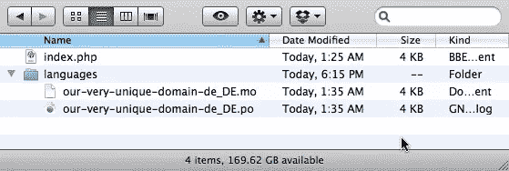

一句话。MO 文件命名法:在查看上面的图像时，您可能会注意到我们的命名法。MO 文件在一个插件中发生了变化，与我们在主题中标注的方式相反。

找编译的时候。MO 翻译文件，WordPress 为主题本地化寻找不同于插件本地化的语法。对于主题本地化，您会希望将您的。`locale.mo`格式的 MO 文件。例如，它把你的主题翻译成德语，你的主题内的`/languages`目录中的主题翻译文件应该被命名为`de_DE.mo`。

另一方面，如果你正在本地化一个插件，WordPress 将在你的插件中指定的`/languages`目录中寻找翻译文件，格式为`pluginname-locale.mo`。在这种情况下，插件名称直接对应于您在插件中分配给本地化的文本域。根据上面的例子，如果我们将插件翻译成德语，我们的翻译文件将被命名为`our-very-unique-domain-de_DE.mo`。

### 让我们做一些翻译:介绍 Poedit！

Poedit 是一个非常流行的开源工具，你可以下载并安装到你的电脑上，帮助你创建和维护你需要的所有文件。

Poedit 会自动对你的插件或主题中的所有源代码进行排序，并返回你通过`_e()`或`__()`函数定义为可本地化的所有字符串。然后，只需要遍历每个字符串并提供特定语言的翻译。让我们从 http://www.poedit.net/download.php[下载并安装 Poedit 开始吧。](http://www.poedit.net/download.php)

### 创建. POT 文件

如果你正在本地化你自己的插件或主题，我们需要做的第一件事就是创建一个. POT 文件。提醒您一下，. POT 文件只是一个没有任何定义的. PO 文件，它仅仅定义了需要翻译的字符串。默认情况下，Poedit 查找。当一个翻译者第一次试图本地化你的代码时，打开和处理 POT 文件，但是因为我们还没有一个，我们需要先做一个。为此，启动 Poedit，点击**文件**，然后选择**新目录**，如下图所示。

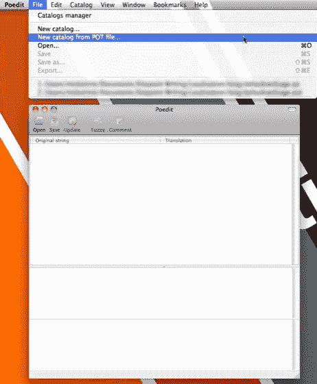

当创建一个新目录时，你首先会看到的是**项目信息**标签。

您可以尽可能完整地填写，但是真正需要做的是给我们的新目录一个项目名称。给它起个名字，然后点击**路径**选项卡。

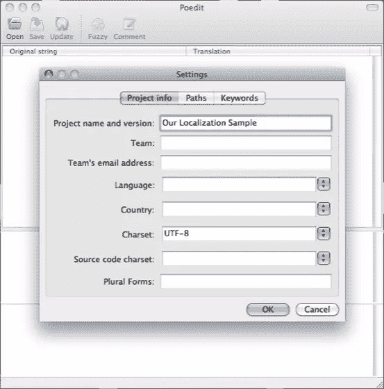

现在我们需要创建翻译文件的路径。此路径相对于正在翻译的一个或多个文件。

因为我认为为你的语言翻译创建一个单独的目录是最好的做法，我更喜欢为路径添加`../`,就像我在下面的截图中所做的那样。

设置好路径后，点击**关键词**选项卡继续。

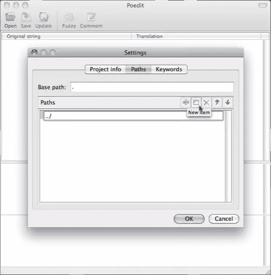

在**关键词**标签中，我们只需要定义 GNU gettext 元素，我们用它来准备我们代码中本地化的字符串。同样，`__`和`_e`是最常用的 gettext 函数，但是如果你碰巧使用了`_n`、`_x`或任何其他 gettext 函数，你需要在这里定义它们。

我喜欢删除我不需要的功能，所以我会删除每个我不使用的功能，如下图所示。

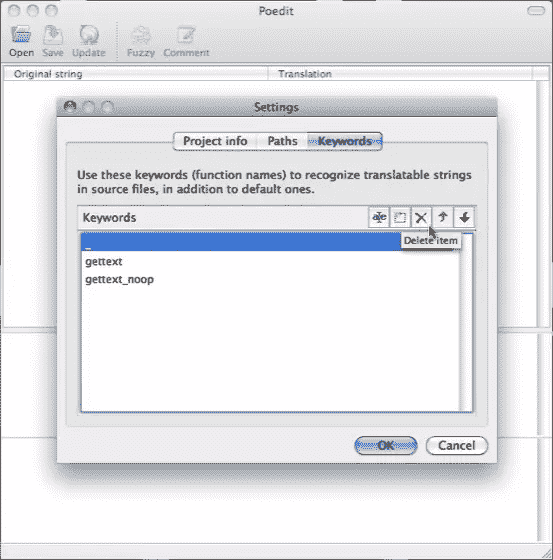

这是一个标准的**关键词**配置，非常适合我们讨论的目的。我们只添加了`__`和`_e`，因为这些是我们的代码中调用的函数。

进行添加，然后点击 **OK** ，如下图所示。

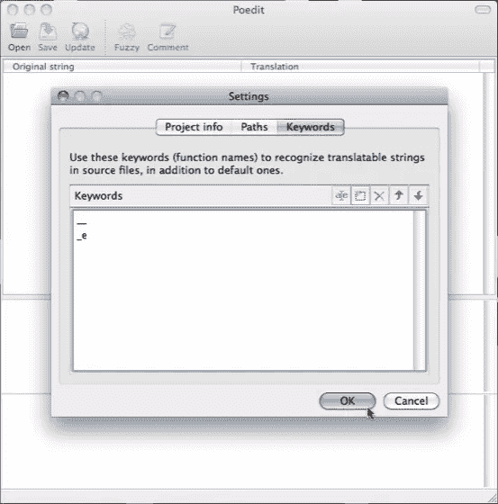

点击 **OK** 后，系统会提示我们将配置保存为新的。采购订单文件。

在保存文件之前，请确保导航到您在目录的**路径**选项卡中设置的正确位置。当 Poedit 搜索您添加了本地化字符串的文件时，它将使用您保存文件的位置作为参考点。

在我们的例子中，我们已经添加了一个路径`../`，所以我们想要保存这个新的。PO 文件放在您的文件所在的子目录中。虽然任何子目录都可以，但你也可以使用一些描述性的东西，比如 `/languages`或`/lang`。保存您的。PO 文件，其名称适合您的目的。

只是为了更有创造性，我使用了`appropriate-name.po`。

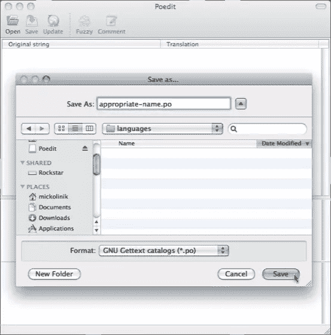

保存文件时，Poedit 使用您设置的 path 参数来查找和索引它看到的任何文件。此时，Poedit 根据您在 **Keywords** 选项卡中定义的 gettext 函数列表检查所有可用的文件，并返回一个可翻译字符串列表给您。

我们下面的例子显示了一个围绕着我和我的狗的字符串列表。点击 **OK** ，你会看到一个空白。带有一些字符串定义的 PO 文件。

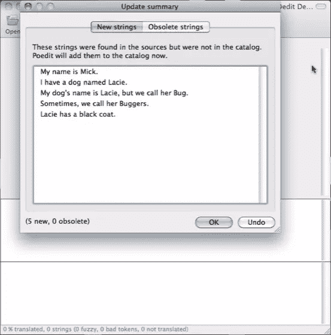

这是棘手的部分——也是用 Poedit 创建. POT 文件的关键。

在这里做任何事情之前，请再次保存该文件。

这是必要的，因为当 Poedit 最初创建。PO 文件，它首先保存文件，然后导入可翻译的字符串。如果你第二次没有保存文件并关闭它，你将会得到一个空白。没有可翻译字符串的 PO 文件，因此违背了目的。

一旦你保存了。第二次打开 PO 文件(添加了可翻译的字符串)，关闭文件并退出 Poedit。别担心，我们马上回来。

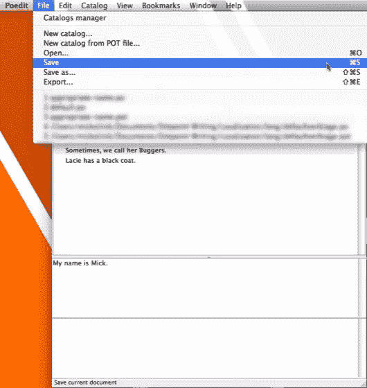

现在导航到您保存的目录结构。采购订单文件。您会注意到您实际上有两个文件可用:一个是您创建的. PO 文件，另一个是当您保存。采购订单文件。

因为我们首先要创建一个模板文件，所以不需要。MO 文件–继续删除它。然后，只需重命名。PO 文件转换为. POT 文件。

当你完成后，你将只剩下一个。POT 文件在您的`/languages`目录下，如下图截图所示。

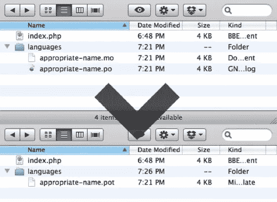

现在我们有了。锅档，所以开始翻译吧！

如果你的目标是设置你的主题或插件，这样其他人就可以很容易地对其进行本地化，那么恭喜你！至此，你一切就绪，你可以继续你的生活了！只要你把你闪亮的新。POT 文件放在正确的目录下，任何人都可以将你的主题或插件翻译成无数种语言。

也就是说，让我们假设你真的想做一些翻译。首先启动 Poedit back，不要选择**新目录**，而是从 POT 文件中选择**新目录。**


往前走，找到。打开刚刚创建的 POT 文件，然后点击 **OK** 进行后续的目录设置(它们与您自己设置的完全相同)。Poedit 随后会询问您想要保存新的。采购订单文件为。

给它一个合适的名字，并保存它，如下图所示。

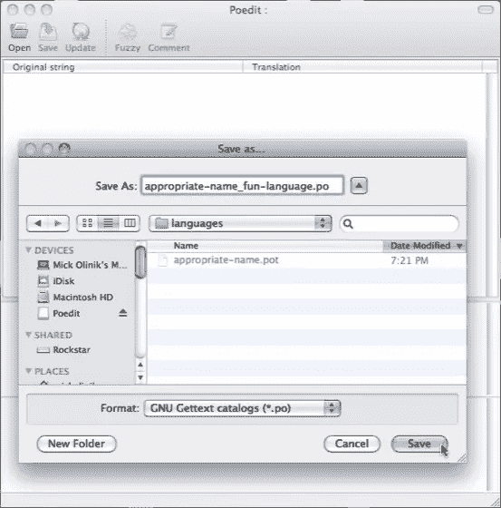

从这里开始航行真的很清楚。

只需点击你想在 Poedit 中翻译的字符串，并在 Poedit 窗口底部的框中键入翻译，如下图所示。

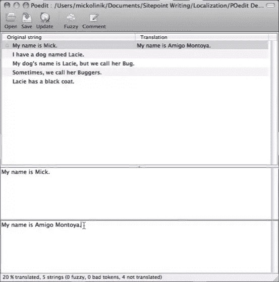

我们将清洗-冲洗-并重复这个过程，直到所有的字符串都被翻译。编辑字符串也很简单…只需点击你想要编辑的字符串并进行修改。

请记住，每次保存. PO 文件时，都会有一个新的。将为您编译 MO 文件。它是。维护对象文件–不是。PO 文件 WordPress 在翻译时实际使用的文件。

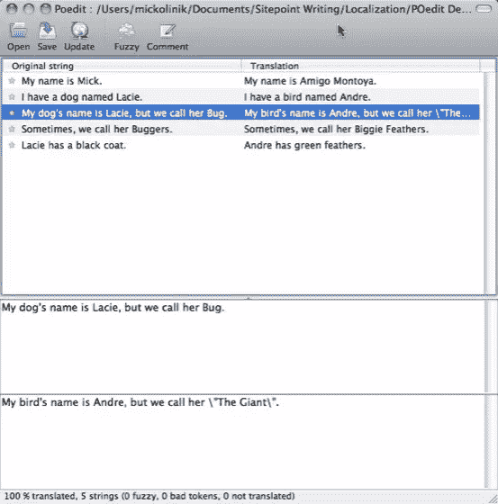

本地化听起来不错，但是没有更简单的方法来实现它，对吗？


你这么问很有趣。有一个非常酷的工具已经开发了一段时间，现在叫做 WPML(在 wpml.org 有售)。这是一个高级插件，非常值得投资。

WPML 大大减少了本地化你的主题或插件所花费的时间和精力，至少在单个网站的环境中是这样。你所需要做的就是在你的插件或者你的主题中正确地识别你的本地化字符串，把它们包装在`__()`或者`_e()`标签中。一旦你做好了字符串标识，WPML 就会接手，免去了设置的麻烦。阿宝，。莫和。盆栽文件，并整理出如何将它们添加到您的文件和主题。

当你第一次在 WordPress 网站上运行 WPML 时，WPML 就像 Poedit 一样扫描你所有的主题和插件文件，寻找可翻译的字符串。在创建字符串列表时，WPML 要求用户定义网站应该翻译成哪些语言，并自动创建必要的语言。阿宝和。支持每一个所需的 MO 文件。

之后，WPML 在 WordPress 后端提供了一个非常漂亮的界面，让你可以选择翻译字符串以及整篇文章和页面。更酷的是，它还创建了独特的、翻译过的永久链接，这样你的帖子和页面就可以默认地以多种语言被索引！

最后，WPML 还集成了一个翻译管理系统。这让你可以雇佣专业的翻译人员直接在你的网站上做翻译工作。或者，你可以使用他们的管理系统来指派你的员工中的特定成员来翻译特定的语言。

## 分享这篇文章