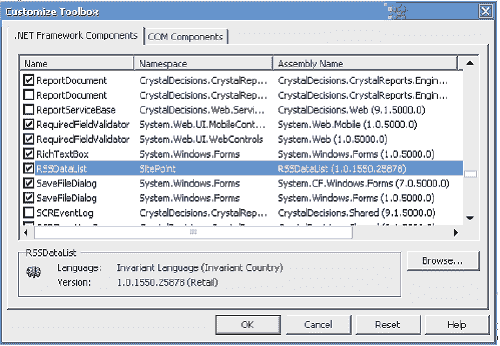
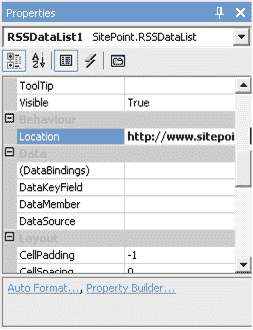
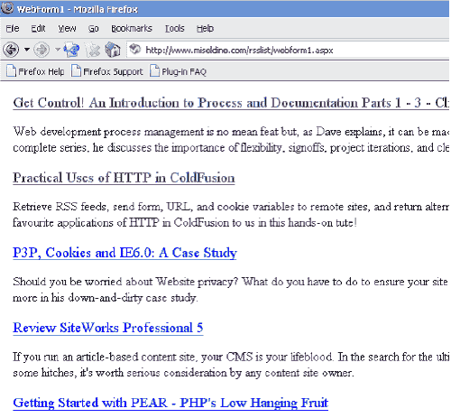

# 在 ASP.NET 创建一个 RSS 数据列表控件

> 原文：<https://www.sitepoint.com/rss-datalist-control-asp-net/>

RSS 终于得到了它应得的认可。SitePoint 现在发布 RSS，BBC、纽约时报和 CNN 等大型新闻机构也发布 RSS 提要。现在，开发人员可以在自己的应用程序中集成来自各种制作者的内容，这给用户带来了更大的回报，并为应用程序开发开辟了新的可能性。

本文将向您展示如何基于`DataList`创建一个服务器控件，以提供一种自包含且可管理的方式在您的 ASP.NET 应用程序中使用 RSS 提要。

##### RSS、RDF、AtomÃ情况如何？

SitePoint 的 Nathan Matias 写了一篇[Get Off Your RSS——RSS 的快速介绍](https://www.sitepoint.com/article/get-off-your-rss),尽管在我们开始开发使用 RSS 提要的应用程序之前还有更多需要了解的。

首先，快速历史课。回想 90 年代末。互联网蓬勃发展，股票期权前景看好，想象力迸发，“推动技术”被吹捧为下一个飞跃。像微软和网景这样的公司都将推送客户端集成到他们的浏览器软件中。像 PointCase 和 Marimba 这样的初创公司在销售将信息推送给客户的优点，而不是让他们自己去寻找。

但是，当活动桌面在各地被关闭时，Userland software 推出了第一种联合格式的内容，即`<scriptingNews>`格式。Netscape 也在开发 RSS，1999 年，两种格式被合并，产生了 RSS 0.91，不久又产生了 0.92。然而，在格式应该如何发展的问题上存在很大的分歧，规范也出现了分歧，RSS 2.0 首先由 Userland 控制，现在由哈佛法学院的 Berkman 中心根据知识共享许可控制。RDF 1.0 目前由一个社区用户组管理。

现在，在 Google(Blogger 的所有者)和 SixApart(可移动字体和打字本的所有者)的支持下，又一个规范 Atom 正在被提出。就在最近，UserLand software 的创始人 David Winer 提出了一项合并，将 Atom 的新功能与 RSS 格式的易用性结合起来，从而简化了编写和使用提要的整个过程，最重要的是，使该技术成为主流技术。

今天，如果我们希望在我们的网站上使用这些提要，开发人员需要支持令人眼花缭乱的规范和格式。出于我们的目的，不同版本的“RSS”(即 0.91、0.92 和 2.0)可以视为一个版本；对规范的修改使得核心特性向后兼容。然而，RDF 文件使用不同的元素和属性来定义联合内容，因此这需要以不同于 RSS 的方式来处理。而且，随着不断变化的 Atom 规范被越来越广泛地采用，我们还需要一种解决方案，让我们将所有规范标准化为一种格式。这必须是一种我们可以在应用程序中处理的格式，但也允许我们轻松地更新解析文件的方式。

使用 XSLT(类似于 XML 的样式表),我们可以解析每种格式，并生成一种更扁平、更简单的格式，用于填充站点上的 DataList 对象以供显示。我们可以在不改变代码的情况下修改 XSLT 文件，这使得模型可以适应未来对规范的任何更改。

##### 创建定制的`DataList`

让我们看看我们的控件将如何工作。我选择了`DataList`作为我们将使用的基本控件，因为它为我们提供了对数据表示的细粒度控制。

首先，我们接收提要，提要的位置在新控件的自定义属性中设置。然后，我们将样式表应用到传入的提要，产生一个通用格式，我们解析该格式来填充 DataList。

与我们希望添加功能的任何控件一样，我们需要创建一个从基本控件继承其行为的类。在我们的例子中，这是`System.Web.UI.WebControls.DataList`类。创建一个名为 RSSDataList.cs 的新 C#类文件，并从以下代码开始:

```
namespace SitePoint 

{ 

    [ToolboxData("<{0}:RSSDataList runat=server></{0}: RSSDataList >")] 

    public class RSSDataList: System.Web.UI.WebControls.DataList 

    {  

    } 

}
```

注意为该类定义的`ToolboxData`属性。这是在我们使用 Visual Studio 时代表我们的控件的代码。NET 将控件放到我们的 ASP.NET 网页上。如果您使用的是 Visual Studio。NET，这是自动添加的。

我们需要一个属性来存储我们希望从控件中查看的提要的 URL:

`private string _location;

   [Bindable(true), Category("Behaviour"), DefaultValue("")]  
   public string Location  
   {
     get
     {
       return _location;
     }`

`     set
     {
       _location = value;
     }
   }`

使用属性访问器(get 和 set)是很好的编程实践。它允许我们控制新变量的设置和检索，同时为我们提供一个我们可以访问的私有变量。例如，为了完整性，我们可以在 set 访问器中包含验证。

目前，我们有一个添加了属性的`DataList`控件 URL 的位置。现在是了解本质和解析 XML 文件的时候了。为此，我们需要定义我们的 XSLT 文件和我们将产生的格式，这将用于与`DataList`绑定。

我们希望从 XML 文件中提取并显示 3 个不同的显示目标:文章的标题、链接和描述。我们如何派生这些项目取决于我们的样式表。例如，使用 RSS，我们可以在文章描述中添加永久链接(指向资源的永久链接)和日期信息。事实上，我们可以在描述中构建对一系列扩展和元素的支持(例如，`slash:comments`)。

因此，我们将解析的扁平化通用格式将具有以下格式:

```
<feed> 

  <item> 

    <title>Title of post</title> 

    <link>Link to post</link> 

    <description>Description of post</description> 

  </item> 

</feed>
```

此外，我们需要善待我们的饲料供应商，善待我们自己。每次我们有请求时下载提要都会降低我们的带宽，并可能促使提供商阻止我们未来的请求。为了控制性能，我们将使用缓存来序列化转换后的提要的内容。默认情况下，对象将在缓存中保留 60 分钟。但是，RSS 中有称为 TTL(生存时间)的元素，它定义了提要的确切生命周期。然而，解析这个值会给我们的设计增加复杂性，但是这是一种将来可以扩展控件的方式。

总结一下，我们转换 RSS 和 RDF 格式的 XSLT 文件如下所示:

```
<?xml version="1.0" encoding="ISO-8859-1"?> 

<xsl:stylesheet version="1.0" xmlns:rss="http://purl.org/rss/1.0/" xmlns:xsl="https://www.w3.org/1999/XSL/Transform" xmlns:rdf="https://www.w3.org/1999/02/22-rdf-syntax-ns#"> 

<xsl:output omit-xml-declaration="yes" /> 

<xsl:template match="rss|/rdf:RDF"> 

<feed> 

  <xsl:apply-templates select="channel/item|/rdf:RDF/rss:item"/> 

</feed> 

</xsl:template> 

<xsl:template match="channel/item|/rdf:RDF/rss:item"> 

  <item> 

    <title> 

      <a href="{link|rss:link}"> 

        <xsl:value-of select="title|rss:title"/> 

      </a> 

    </title> 

    <link> 

      <xsl:value-of select="link|rss:link"/> 

    </link> 

    <description> 

      <p><xsl:value-of select="description|rss:description"/></p> 

      <p><xsl:value-of select="pubDate|rss:pubDate"/></p> 

    </description> 

  </item> 

</xsl:template> 

</xsl:stylesheet>
```

该样式表在 RSS 和 RDF 文件中查找 channel 或 item 元素，并应用一个模板来重新显示它们。注意，在 description 元素中，我们组合了帖子的描述和帖子的发布日期(`pubDate`)。在这里，您可以发挥创造力，添加对所有额外标签的支持，让您的显示器熠熠生辉。

为了处理转换，并将结果 XML 绑定到`DataList`，我们在`RSSDataList`控件中创建了一个名为`bindToRSS()`的新方法:

```
public void bindToRSS() 

{ 

  System.IO.Stream str = new System.IO.MemoryStream(); 

  System.Xml.XPath.XPathDocument doc; 

  // Create the XslTransform. 

  System.Xml.Xsl.XslTransform xslt = new System.Xml.Xsl.XslTransform(); 

  // Load the stylesheet that creates XML Output. 

  xslt.Load(System.Web.HttpContext.Current.Server.MapPath("rss.xsl")); 

  // Load the XML data file into an XPathDocument. 

  // if this is in the cache, grab it from there... 

  if (System.Web.HttpContext.Current.Cache["rss"+_location] == null) 

  { 

    // No cache found. 

    doc = new System.Xml.XPath.XPathDocument(_location); 

    // Add to cache. 

    System.Web.HttpContext.Current.Cache.Add("rss"+_location, doc, null, DateTime.Now.AddMinutes(60), TimeSpan.Zero, CacheItemPriority.High, null); 

  } 

  else 

  { 

    // Cache found. 

    doc = (XPathDocument)System.Web.HttpContext.Current.Cache["rss" + _location]; 

  } 

  // Create an XmlWriter which will output to our stream.   

  System.Xml.XmlWriter xw = new System.Xml.XmlTextWriter(str, System.Text.Encoding.UTF8); 

  // Transform the feed. 

  xslt.Transform(doc, null, xw, null); 

  // Flush the XmlWriter and set the position of the stream to 0 

  xw.Flush(); 

  str.Position = 0; 

  // Create a dataset to bind to the control.     

  DataSet ds = new DataSet(); 

  ds.ReadXml(str); 

  // Select the data source, and bind. 

  this.DataSource = ds.Tables[0].DefaultView; 

  this.DataBind(); 

  // Close the writer and thereby free the memory stream. 

  xw.Close(); 

}
```

我们使用流来存储我们的文档和转换，因为查看不同提要的多个用户很有可能会使用这个控件。如果我们将结果保存到文件中，我们会遇到问题，因为我们试图确保显示请求的提要，而不是覆盖我们输入的其他用户的请求！然而，使用基于内存的流，我们的控件的每个实例在主内存中都有自己的存储，这使得它适合多用户使用。

注意如何使用一个`XmlWriter`为我们的流`str`提供一个适合我们编写 XML 的接口。转换完成后，我们需要将`XmlWriter`的内容保存(或刷新)到我们的流中，因为目前我们的流仍然是空的。在我们写完 XML 数据之后，流中的指针位置将会在数据的末尾。在我们读它之前，我们需要把这个指针设置回流的开始。

一旦我们用扁平格式的 XML 填充了内存流，我们就能明白为什么`DataList`如此适合这个控件。通过从 XML 文件创建一个数据集，并将其直接绑定到`DataList`，我们只用 4 行代码就解析并提供了提要:

`// Create a dataset to bind to the control.    
 DataSet ds = new DataSet();
 ds.ReadXml(str);`

` // Select the data source, and bind.
 this.DataSource = ds.Tables[0].DefaultView;
 this.DataBind();`

##### 贮藏

我们的另一个设计目标是缓存提要以保持良好的性能。缓存保存包含在`Location`变量中指定的提要的`XPathDocument`实例。通过缓存，我们的页面将每小时只下载一次提要，而不是每次请求时都下载。

注意，我们需要获取正在运行的缓存实例，因为我们的控件没有绑定到任何特定的 Web 应用程序。`System.Web.HttpContext.Current`提供了当前运行的`HttpContext`，包括大家熟悉的`Response`和`Request`对象以及`Cache`对象。

给缓存设置 60 分钟的过期时间是个好主意。当我们检查缓存中是否存在条目时，我们还可以检查提要是否过期，因为 60 分钟后，缓存的条目将被删除。因此，这是一种检查和设置缓存的简单方法:

`if (System.Web.HttpContext.Current.Cache["rss"+_location] == null)
 {
   // No cache found.
 }
 else
 {
   // Cache found.
 }`

现在您已经完成了控件的代码，您必须将`RSSDataList.cs`文件编译成. NET 程序集:`RSSDataList.dll`。如果你不知道如何做到这一点，凯文·杨克的文章《面向 ASP.NET 开发者的面向对象 C#的[》中有介绍。](https://www.sitepoint.com/article/c-asp-net-developers)

##### `DataList`模板

我们现在有 3 个元素暴露在我们的`DataList`中:标题、链接和描述。这些元素的显示在`DataList`声明的`Itemtemplate`部分中处理。这个过程很简单。

```
<asp:DataList ... >  

   <ItemTemplate>  

      ... template definition here  

   </ItemTemplate>  

</asp:DataList>
```

在`ItemTemplate`部分，我们可以添加标记和样式。在我们想要显示某个元素(标题、链接或描述)的任何时候，我们添加以下内联代码，告诉 ASP.NET 插入元素的内容:

```
<%# DataBinder.Eval(Container.DataItem, "foo") %>
```

(此处，“foo”被更改以匹配要添加的元素。)

例如，下面是一个完整的项目模板，它以大字体显示文章的标题，并在新的分段符中显示下面的描述:

```
<sitepoint:RSSDataList runat="server">  

  <ItemTemplate>  

    <p><font size="4">  

      <%# DataBinder.Eval(Container.DataItem, "title") %>  

    </font></p>  

    <p>  

      <%# DataBinder.Eval(Container.DataItem, "description") %>  

    </p>  

  </ItemTemplate>  

</sitepoint:RSSDataList>
```

最后，让我们使用这个新的控件来完成使用提要的过程。

##### 将控件添加到 Visual Studio 工具箱中

1.  右键单击控制工具箱并选择“添加/删除项目”
2.  从“自定义工具箱”对话框(如下所示)中，单击“浏览”并选择包含持有控件的`RSSDataList.cs`类的程序集:



4.  从列表中选择`RSSDataList`控件，并确保勾选了复选框。单击“确定”将控件添加到工具箱中。

##### 在`.aspx`页面中定义控件

1.  Either drag the `RSSDataList` control onto your form, or add the following declarations to your `.aspx` page:

    ```
    <%@ Register TagPrefix="sitepoint" Namespace="SitePoint" Assembly="RSSDataList" %>  

    <sitepoint:RSSDataList id="RSSDataList1" runat="server">  

    </sitepoint:RSSDataList>
    ```

4.  Add the ItemTemplate we saw above to the `RSSDataList` tag:

    ```
    <%@ Register TagPrefix="sitepoint" Namespace="SitePoint" Assembly="RSSDataList" %>  

    <sitepoint:RSSDataList id="RSSDataList1" runat="server">  

      <ItemTemplate>  

        <p><font size="4">  

          <%# DataBinder.Eval(Container.DataItem, "title") %>  

        </font></p>  

        <p>  

          <%# DataBinder.Eval(Container.DataItem, "description") %>  

        </p>  

      </ItemTemplate>  

    </sitepoint:RSSDataList>
    ```

7.  Using the property selector in Visual Studio, you can define the feed you whish to associate with the control through the `Location` variable:

    

    或者，您可以提前将此变量添加到标记定义中:

    ```
    <sitepoint:RSSDataList id="RSSDataList1" Location="https://www.sitepoint.com/recent.rdf" runat="server">  

      ...  

    </sitepoint:RSSDataList>
    ```

    或者，当然，通过代码:

    ```
    private void Page_Load(object sender, System.EventArgs e)  

    {  

      RSSDataList1.Location = "https://www.sitepoint.com/recent.rdf";  

    }

    ```

##### 将提要绑定到控件

最后，一旦设置了`Location`属性，您需要调用方法`bindToRSS()`:

```
private void Page_Load(object sender, System.EventArgs e)  

{  

  RSSDataList1.Location = "https://www.sitepoint.com/recent.rdf";  RSSDataList1.bindToRSS();  

}
```

确保将 XSLT 文件`rss.xsl`存储在应用程序目录的根目录下。这就是在你的网站上显示 RSS 和 RDF 文件的全部内容！



## 分享这篇文章