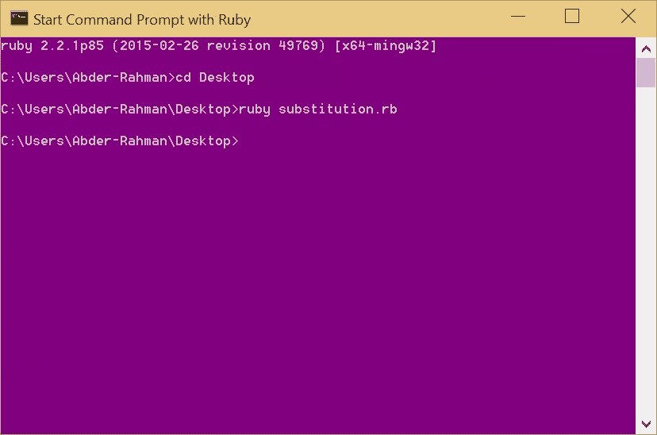

# Ruby on Medicine:多个文件中的替换

> 原文：<https://www.sitepoint.com/ruby-medicine-substitution-multiple-files/>


FDA(美国食品药品监督管理局)是美国卫生与公众服务部的一个机构。它负责通过管理和监督食品安全、烟草制品、膳食补充剂、处方药和非处方药(药物)、疫苗、生物制药、输血、医疗器械、电磁辐射发射装置(ERED)、化妆品、动物食品&饲料[5]和兽医产品来保护和促进公众健康。*呼气*

FDA 提供了一个 [Drugs@FDA](http://www.fda.gov/Drugs/InformationOnDrugs/ucm079750.htm) 数据库的压缩数据文件，其中包含了 FDA 批准的药物的信息。数据文件中的所有字段都由制表符分隔。虽然官方在线药品@FDA 应用程序每天更新，但上面链接中的数据文件每周更新一次，通常在周三。

## 问题是…

你可能会问:“你为什么要告诉我这些？”好问题。

为了说明问题，我希望您做的第一件事是下载数据库 [drugsfda.zip](http://www.fda.gov/downloads/Drugs/InformationOnDrugs/UCM054599.zip) (1.7 MB)，并解压缩该文件。当你解压文件时，你会注意到 9 个文本文件(表格)，如下图所示:


从本文的标题中，您可能已经猜到我们将弄清楚如何同时对所有这些文件进行内容更改。这就是为什么我喜欢你，你是一个猜度者。

假设您决定在 FDA 的一份文件中将单词*药物*替换为*药物*。这很简单，当然，还有高级形式的搜索和替换。事实上，我在[关于寻找基因序列](https://www.sitepoint.com/ruby-medicine-hunting-gene-sequence/)的文章中提到了其中的一些方法。

如果我们只有一个文件，那就简单了。然而，在我们的例子中，我们有 9 个文本文件需要搜索和修改。显然，单词*药物*出现在不止一个文本文件中。事实上，它出现在以下文件中:

*   apploc
*   应用
*   化学类型查找
*   产品

## Ruby 能帮上什么忙？

既然这个系列和 Ruby 有关，那就用“Ruby 的方式”来解决吧。

关键是把我们目录中的文件列表放在一个数组中。之后，打开每个文件，通读一遍，进行所需的替换，然后关闭文件。

为了完成这些步骤，我们将利用 [Dir 类](http://ruby-doc.com/docs/ProgrammingRuby/html/ref_c_dir.html)。使用类的一个示例是:

```
Dir['C:/Users/Abder-Rahman/Desktop/drugsatfda/*.txt']
=> ["C:/Users/Abder-Rahman/Desktop/drugsatfda/AppDoc.txt", "C:/Users/Abder-Rahman/Desktop/drugsatfda/AppDocType_Lookup.txt", "C:/Users/Abder-Rahman/Desktop/drugsatfda/application.txt", "C:/Users/Abder-Rahman/Desktop/drugsatfda/ChemTypeLookup.txt", "C:/Users/Abder-Rahman/Desktop/drugsatfda/DocType_lookup.txt", "C:/Users/Abder-Rahman/Desktop/drugsatfda/Product.txt", "C:/Users/Abder-Rahman/Desktop/drugsatfda/Product_tecode.txt", "C:/Users/Abder-Rahman/Desktop/drugsatfda/RegActionDate.txt", "C:/Users/Abder-Rahman/Desktop/drugsatfda/ReviewClass_Lookup.txt"]
```

`Dir`返回一个字符串数组，这些字符串是与`*.txt` glob 模式匹配的文件名

有了感兴趣的文件名，就可以读取目录中每个文件的内容了。在 Ruby 中，可以使用 [IO.read](http://ruby-doc.org/core-2.0.0/IO.html#method-c-read) 读取文件，它将读取文件并返回其内容:

```
IO.read("C:/Users/Abder-Rahman/Desktop/drugsatfda/AppDoc.txt")
=>...[contents of the file]...
```

阅读完文件后，让我们进行所需的替换。这里，我们感兴趣的是用`medication`代替`drugs`的每个实例。一个派上用场的 Ruby 函数是 [`gsub`](http://ruby-doc.org/core-2.1.4/String.html#method-i-gsub) ，它用第二个参数替换所有出现的第一个参数。第一个参数通常是正则表达式，但也可以是简单的字符串。

例如，对于上面的替换，我们可以写如下:

```
file_content.gsub!(/drugs/,'medication')
```

其中`file_content`是一个变量，保存用`IO.read`读入的文件内容。

不过，我们在这里必须小心。在提供的文本文件中，`drugs`可能在一些文本文件中以大写字母书写，而在另一些文件中以小写字母书写。它在某些地方也可能是大写的。为了以不区分大小写的方式将所有出现的`drugs`替换为`medication`，请将上述替换语句编写如下:

```
file_content.gsub!(/drugs/i,'medication')
```

## 把所有的放在一起

现在，让我们看看我们的 Ruby 脚本是什么样子的。该脚本将遍历`drugsatfda`目录中的所有文本文件，在每个文件中搜索单词`drugs`，并用`medication`替换`drugs`:

```
files = Dir['C:/Users/Abder-Rahman/Desktop/drugsatfda/*.txt']
files.each do |filename|
  file_content = IO.read(filename)
  file_content.gsub!(/drugs/i,'medication')
  output = File.open(filename,'w')
  output.write(file_content)
  output.close
end
exit
```

如您所见，一旦文件被读取并进行替换，通过*写*一个相同名称的文件，文本文件与新内容一起保存。最后，文件需要关闭。

## 运行程序前的最终想法

当我在 *Windows 8.1* 操作系统上运行上述程序时，它没有出现任何问题。然而，当我试图在 *Ubuntu 15.04* 和 *MAC OS X 约塞米蒂*操作系统上运行该程序时，我遇到了一个问题，特别是文件`AppDoc.txt`。如果您使用的是后一种系统，可能会出现以下错误:

`program.rb:4:in` gsub！:UTF-8 中的字节序列无效(ArgumentError)

为了解决这个问题，基于[这个](http://stackoverflow.com/questions/24036821/ruby-2-0-0-stringmatch-argumenterror-invalid-byte-sequence-in-utf-8)线程，您可以简单地在上面的原始程序中的第二行(同时删除第四行)之后插入下面的代码:

```
if ! file_content.valid_encoding?
  file_content = file_content.encode('UTF-16be', :invalid=>:replace, :replace=>'?').encode('UTF-8')
  file_content.gsub!(/drugs/i,'medication')
end
file_content.gsub!(/drugs/i,'medication')
```

另一个想法是，如果你查看`AppDoc.txt`，你会注意到`drugs`是 URL 的一部分，改变它可能会导致文档中无效的 web 链接。所以，我们想告诉我们的程序，无论`drugs`出现在什么时候，以它的所有形式(*即*毒品、毒品、毒品、毒品、… *等*)，除了那些在 URL 中的。这可能有点棘手，正则表达式[在解决这样的问题中扮演着重要的角色。基于`drugs`在 URL 中的出现，我们可以编写以下代码来用`medication`替换`drugs`，可以是任何形式和位置，除了在 URL 中:](https://www.sitepoint.com/ruby-medicine-hunting-gene-sequence/)

```
file_content.gsub!(/(?<!http:\/\/www\.)(?<!http:\/\/www\.accessdata.fda.gov.)[Dd]rugs/i, 'medication')
```

该程序的更新版本现在如下所示:

```
files = Dir['C:/Users/Abder-Rahman/Desktop/drugsatfda/*.txt']
files.each do |filename|
  file_content = IO.read(filename)
  if ! file_content.valid_encoding?
    file_content = file_content.encode('UTF-16be', :invalid=>:replace, :replace=>'?').encode('UTF-8')
    file_content.gsub!(/(?<!http:\/\/www\.)(?<!http:\/\/www\.accessdata.fda.gov.)[Dd]rugs/i, 'medication')
  end
    file_content.gsub!(/(?<!http:\/\/www\.)(?<!http:\/\/www\.accessdata.fda.gov.)[Dd]rugs/i, 'medication')
  output = File.open(filename,'w')
  output.write(file_content)
  output.close
end
exit
```

## 运行程序

我已经将 Ruby 脚本命名为 **substitute.rb** 。我在 Windows 操作系统上运行这个脚本，在 Ruby 上使用*命令提示符，如下所示:*



`application.txt`包含以下内容:

```
HETERO DRUGS LTD
```

运行该脚本后，它现在看起来像这样:

```
HETERO medication LTD
```

## 结论

有时，需要在多个文件中用另一个字符串替换一个特定的字符串。对于非常大的文件，这可能会更加复杂。手动完成这样的任务既乏味又耗时。Ruby 再次证明了它能够用快速、直观的语言轻松处理我们的任务，让开发人员感到满意。

擦屁股快乐！

## 分享这篇文章