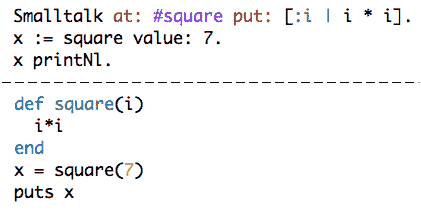
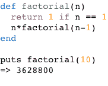
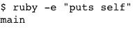
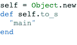
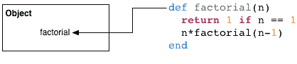
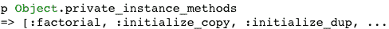
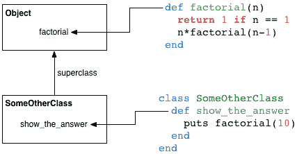

# Ruby 的顶级自我对象

> 原文：<https://www.sitepoint.com/rubys-top-self-object/>

|  |
| 在没有类的情况下创建函数在 Smalltalk 中很笨拙，但在 Ruby 中很简单。 |

Ruby 的大部分对象和类的实现都是模仿 Smalltalk 的，small talk 是最早于 20 世纪 60 年代末建立的面向对象语言之一。就像 Smalltalk 一样，Ruby 的`Object`类是程序的类层次结构的根，所有 Ruby 类都是`Class`类的实例。Smalltalk 块和 Ruby 块都支持使用匿名函数作为闭包。

但是 Ruby 和 Smalltalk 有一个有趣的不同之处。Ruby 允许你在顶层定义简单的函数。这使得 Ruby 可以作为一种脚本语言。使用 Ruby，很容易在一个小脚本中组合几个函数来完成一些简单的命令行任务。同时，Ruby's 已经准备好 Smalltalk 的精密 OO 设计，等着你去用。当你的脚本变得有点复杂时，你可以很容易地把它变成一个更有组织的、面向对象的程序。

Ruby 是如何做到这一点的？在脚本开始运行之前，Ruby 会自动创建一个隐藏对象，称为 top self 对象，这是一个`Object`类的实例。该对象充当顶级方法的默认接收器。今天我们将看到这个对象——我们甚至不知道我们正在使用的对象——如何让我们用面向对象的语言编写简单的函数。

## Ruby 中的函数

使用 Ruby，您可以编写函数，而无需为它们创建类。例如，下面是 Ruby 中阶乘函数的递归定义。

我们能够编写一个简单的函数，而不用考虑方法、接收器、类或实例变量。我们不需要这些概念，因为我们只想进行简单的计算。(当然，*函数式编程*的拥护者会争辩说你永远不需要 OO 概念——你可以并且应该只用简单的函数来编写你的代码。)

在这个例子中，Ruby 不是一种复杂的面向对象的语言，而只是一种简单的脚本语言。对于我们大多数人来说，这就是我们开始使用 Ruby 的方式:在这个层面上，Ruby 的语法非常简单易懂。

## 函数就是方法

然而，Ruby 使用了一个类似于 Smalltalk 的模型。Ruby 中没有函数，只有方法。每个方法都属于一个类。

但是我上面的阶乘例子呢？那不是函数吗？我没有声明类或创建对象。我只是写了一个简单的函数。如果我们在 factorial 中显示`self`的值，我们会看到，事实上，它是一个方法。

在这里您可以看到 Ruby 显示了字符串“main”作为`self`的值。因为 Ruby 在`factorial`内部为`self`定义了一个值，所以它必须是一个方法。`self`包含对当前对象的引用，当前方法的接收者。因为`factorial`有一个接收器，所以它一定是一个方法，而不是一个函数。

## 看到 Ruby 的顶级自我对象

字符串“main”是 Ruby 将顶层 self 对象表示为字符串的方式。Ruby 会在程序启动前自动创建它，以便充当顶级作用域中函数的接收器，比如`factorial`。

事实上，你不需要写一个方法来为`self`获取一个值。例如:

这里我们使用`-e`选项运行一行 Ruby 脚本。您可以看到 puts `self`返回字符串“main”另一个测试显示，顶层 self 对象是 Ruby 的类层次结构的根类`Object`的一个实例(除了内部的`BasicObject`类)。

在创建了顶层 self 对象之后，Ruby 为它分配了一个`to_s`方法，该方法返回字符串“main”。Ruby 在内部使用 C 代码来实现这一点，但它相当于下面的 Ruby 代码片段:

可以看到 self 是`Object`的一个实例。还要注意 Ruby 只为 top self 对象定义了这个特殊版本的`to_s`方法。从技术上来说，Ruby 为`self`创建了一个单例类，并给它分配了新的`to_s`方法。(默认版本的`to_s`，`Object#to_s`，显示类名和编码的对象 id。)

当然，你不能自己写这段代码，因为`self`是一个保留字，是 Ruby 语言的一部分。如果你运行上面的代码，你会得到一个语法错误“不能改变自己的值。”

## Ruby 函数属于哪个类？

如果所有的 Ruby 函数都是方法，那么它们一定属于某个类。但是哪个班呢？正如您可能猜到的，因为顶层 self 对象是`Object`的一个实例，所以 Ruby 在`Object`类中添加了所有顶层函数作为方法。这里有一个例子。

在这里你可以看到 Ruby 的关键字`def`被保存为`Object`类中的方法`factorial`。所有的 Ruby 函数实际上都是`Object`的私有方法。我们可以通过列出`Object`类的私有实例方法来证明这一点，就像这样。

## 调用 Ruby 函数

将函数保存为`Object`方法不仅仅是为了保留 Ruby(或 Smalltalk)优雅的面向对象设计。在内部，它允许 Ruby 在程序调用函数时找到它们。这里有一个例子。

在图的底部，我写了一个名为`SomeOtherClass`的新类。如你所见，它包含了一个调用`factorial`函数的方法`show_the_answer`。

当我调用`factorial`时，Ruby 首先查看`factorial`是否是`SomeOtherClass`的一个方法。因为它不是，Ruby 然后通过`SomeOtherClass`的超类来寻找`factorial`。因为 Ruby 给顶层 self 对象的类`Object`添加了`factorial`函数，Ruby 会找到它，因为`Object`是所有其他类的超类。

## Ruby 的隐藏对象

这看起来有点像语法上的甜言蜜语。为什么 Ruby 用哪个类保存函数很重要？事实上，函数是方法有什么关系吗？他们以同样的方式工作。为什么顶层词汇作用域中的自我价值很重要？

这里的关键点是，这个技巧允许你用 Ruby 编写简单的函数。如果我们不能编写它们，Ruby 将会更难学，更难用。即使是开始使用 Ruby 编写最简单的脚本，你也必须理解面向对象的编程思想。

因为它是隐藏的，因为我们不知道我们在使用它，top self 对象允许我们在没有对象和类的情况下使用 Ruby 作为简单的脚本语言。Ruby 比 Smalltalk 好学多了，因为有了 top self 对象。要了解更多关于 Ruby 的方法查找算法，Ruby 如何实现对象、类、词法范围等等，可以去看看我的书[显微镜下的 Ruby](http://nostarch.com/rum)的更新版本，该书将于 11 月由 No Starch 出版社出版。

## 分享这篇文章