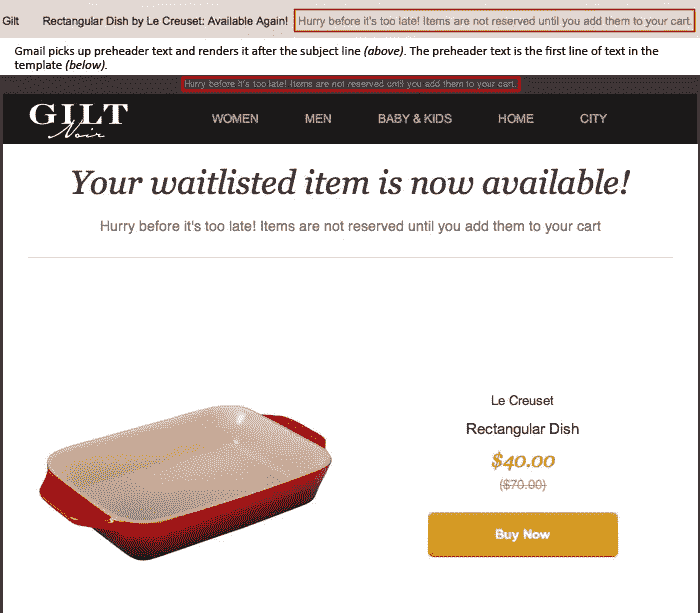
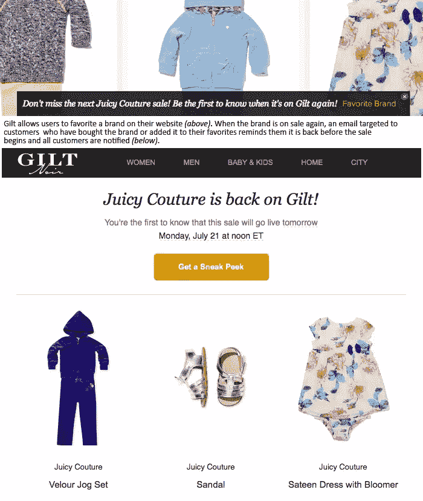
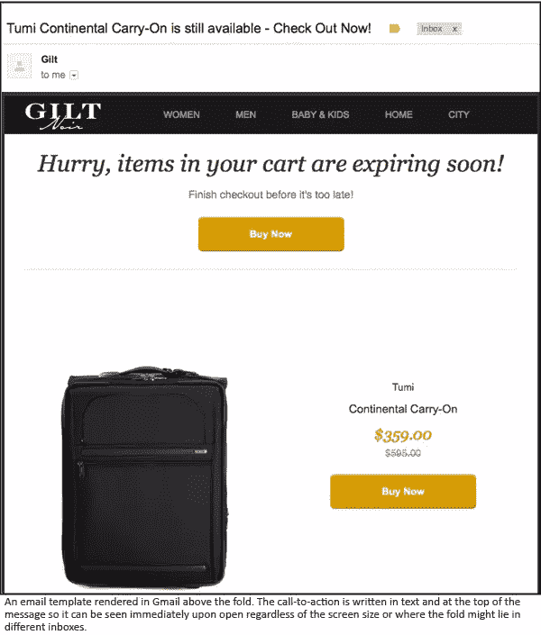
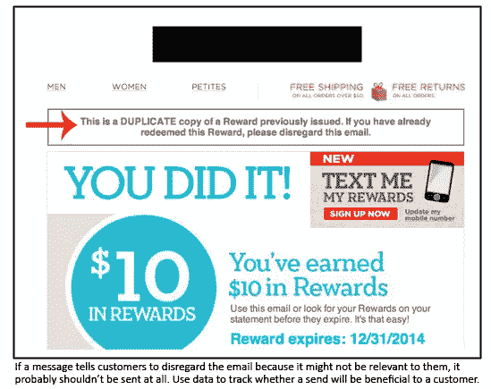

# 电子邮件设计最佳实践规则:内容

> 原文：<https://www.sitepoint.com/rules-best-practice-email-design-content/>

照片:斯文斯托姆

电子邮件最佳实践规则的这一部分[(第一部分)](https://www.sitepoint.com/best-practice-email/ "SitePoint article - part 1")处理每封电子邮件最重要的组成部分:**邮件内容。**

无论你是发布新产品、提供令人难以置信的折扣、向你的订户发送最新消息，还是仅仅通知客户他们的订单已经在路上，你如何展示你的信息会影响你的打开率和点击率，也可能导致那些可怕的退订。

这些建议将确保您有效地传达您的信息，并让您的订户在每次发送时打开并点击。

## 1)使用有效的主题行

如果你的主题行不够清晰和有表现力，你的订阅者可能会绕过打开你的邮件。主题行提供了第一次抓住用户注意力的机会。大多数人的收件箱都塞满了来自更熟悉的来源的信息，比如同事、朋友、家人，甚至是你的竞争对手，所以要确保主题引人入胜、直接，并且不要太长(最多 50 个字符左右)。

主题行越长，在收件箱和移动设备上就越有可能被截断。

在写主题行时，尽量避免使用可能会触发垃圾邮件过滤器的词语。这些通常包括明显的“免费”、“有限时间”和“保存”，以及全大写的单词。测试不同的选项，看看哪种效果最好，只要你的措辞符合品牌，并能很好地配合信息，就不要害怕大胆。

## 2)考虑一个预头

前置标题位于电子邮件的顶部，是邮件中的第一段文字。一些电子邮件客户端和移动设备会在主题行之后的邮件预览中找到它。我建议使用前置标题作为主题行的延续。

你也可以把它作为你邮件的总结；这适用于在不能很好地呈现 HTML 的设备上查看大量图形信息(是的，仍然有一些老式黑莓设备的用户！).ExactTarget 和其他电子邮件服务提供商有一个内置功能，可以添加前置标题和主题行。

如果你想在你的主题中说很多，坚持上面提到的 50 字规则，并使用前置标题来支持或补充。前置标题也应该简短:我建议最多 85-100 个字符。

## 3)个性化

电子邮件中的个性化可以像称呼客户的名字一样简单。这可能看起来没什么大不了的，也不足以产生显著的提升，但这首歌听起来很真实:有时你想去每个人都知道你名字的地方，营销人员永远会很高兴你来了。

个性化的电子邮件促进了与消费者更直接的联系。个性化并不仅仅局限于直呼其名。如果您正在收集有关客户的数据，这些数据揭示了他们的地理位置、品味和兴趣，以及/或者过去的购买和搜索行为，您可以创建反映他们独特特征的定制信息。

个性化可能会越界——您的客户很可能会对任何侵犯其隐私的行为采取…嗯… *个人的*。权力越大，责任越大，所以要让你的信息有品位，像保守秘密一样保护用户的信息。

## 4)抓住要点，使其高于折叠

你发邮件的目的是什么？客户收到后应该采取什么措施？当你的收件人打开邮件时，这些问题的答案应该马上就清楚了。一个让你的信息清晰可见的方法是把它放在文件夹的上方，这样当你打开邮件的时候就可以看到了。

每个电子邮件收件箱的文件夹可能不同，所以最佳做法是将邮件放在顶部，导航或徽标的正下方。

当用户进行交易时，电子邮件服务提供商提供大量工具来触发消息。收集这些数据使您能够根据需要确定更有效的与消费者沟通的方式。

没有人喜欢收到一封与他们无关的邮件，所以如果你没有重要的信息要传达，或者没有发送邮件的好理由，就不要发送。

我经常把电子邮件营销比作上门销售。就像销售人员敲开客户的门，希望被允许进去推销并卖出去一样(而不是当着他们的面把门关上)，电子邮件营销人员也会不请自来地(通过电子邮件)出现在客户的收件箱中，并希望他们的信息会导致购买(而不是“删除”或更糟的“退订”)。

销售人员敲门的声音有多大，可以决定一个潜在客户是否开门的区别；同样，一个强有力的主题可以让一封打开的邮件和一封垃圾邮件完全不同。

## 分享这篇文章