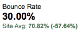
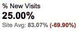
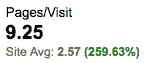
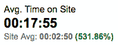
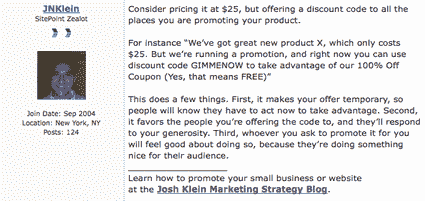

# 使用论坛驱动流量的 10 条规则

> 原文：<https://www.sitepoint.com/rules-driving-traffic-forums/>

通过论坛访问你的网站的访客价值是普通访客的两到六倍。为什么？嗯，我发现论坛访问者是积极主动的信息寻求者、有社区意识的参与者和积极参与的用户。他们做更多的事情。

证据:我自己博客的流量。

在这篇文章中，我将向你展示为什么你应该使用论坛来增加你的网站的流量，然后给你十条规则来指导你如何去做。例如，我将讨论一个我参与并主持的论坛——[SitePoint 论坛](https://www.sitepoint.com/forums/)。

我使用这个论坛有三个原因:

1.  这是一个主要面向 web 开发人员的论坛，我在这个领域有经验，所以我可以与我的同行进行深思熟虑的讨论。

3.  我作为一名在线营销人员的专业知识补充了典型的论坛成员:网页设计者和开发者。

5.  我的网站的目标受众与论坛的受众重叠。

虽然 SitePoint 论坛不会每个月给我的博客带来成千上万的访问者，但是论坛的流量是最高质量的。他们读得更多，参与得更多，并且会回来看更多。

##### 证据

这是我过去两个月的一些分析数据。我们将比较来自 SitePoint 论坛的访问者的平均指标和所有站点访问者的平均指标。

注意:这是一个有用的练习，您可以在自己的站点上进行。一旦你建立了哪些网站是指最高质量的交通，加倍努力在这些网站上。

通常，我的访问者中有 71%没有看第二页就离开了。只有 **30%** 的论坛访客会立即离开。

我 83%的访问者都是第一次访问这个网站。但是当他们从论坛回来时， **75%的人会第二次(或更多次)回到**。

普通访问者在我的网站上只看 **2.5 页**。论坛访客看**超过 9** 。

当来自论坛的人来到我的网站时，他们平均在我的网站上停留 18 分钟。这是我所有访客平均值的 532% ，他们平均在**停留 3 分钟**。

这些数字表明，来自 SitePoint 的访问者更关注我的网站，对我要说的更感兴趣，也更有可能再次访问。来自论坛的普通访问者的价值似乎是普通访问者的 2 到 6 倍。

无论你的访问者的意图是阅读你的内容还是购买你的产品，这都是很重要的。参与的访问者更容易获得你的信息。

##### 为什么论坛用户有资格

论坛访问者对自我教育和与志同道合的人联系感兴趣。他们已经对你的一些文章进行了取样，因为他们跟踪了一个与你在论坛上说的话相关的链接。点击那个链接，这些访问者会说，“告诉我更多！”

即使看起来不可能给你的网站带来流量，你也应该参与进来。论坛是一个了解你感兴趣的话题的好地方，你也可以用它来建立人际网络——职业的和个人的。

论坛的这种内在价值正是它们产生高质量访问者的原因。点击的人已经是合格的访问者了。

##### 论坛是给人类的，不是给搜索引擎的

重要的是，我的网站不是访问者已经知道的信息论坛的翻版。大多数 SitePoint 的读者首先是网页设计者和开发者，其次是营销人员，所以我有一些东西可以提供给他们。

记住，论坛是为了给你的网站带来*人流量*，而不是为了提高你在搜索引擎中的排名。一些 SEO 博客建议在论坛上发帖，作为建立指向你的域名的链接的一种方式。在你的签名中创建一个链接意味着你在论坛上发表的每一篇文章都会提到你的网站。

然而，这些链接对 SEO 并不像你想象的那么有用。论坛线程很少被引擎认为是权威的，因为它们不被用来链接到。论坛页面也有数百个出站链接，远远超过谷歌官方指南推荐的数量。大量的链接削弱了网页的权威性。

但是不要搞错:签名链接是最佳实践。这是一种以一种有价值的方式提升你自己而又不显得鲁莽的方式。阅读你的评论的人需要一种方式来更多地了解你是谁和你做什么，所以你的网站链接是增值内容。

签名链接不是为搜索引擎准备的，而是为人们准备的。任何搜索引擎优化的好处都是次要的。

##### 十大法则

好吧，你明白了:你应该在论坛上发帖。现在怎么办？

***1。建立你的档案***

当你注册一个论坛时，你应该尽可能多的填写信息。大多数论坛都有你的用户信息页面。当人们想更多地了解您或向您发送私人消息时，他们会访问此页面。描述你做什么和你的网站是关于什么的。

头像是你个人资料的重要组成部分。由于论坛页面上的大量文本，头像是人们识别海报的方式。确保你的头像是独一无二的，一眼就能认出来——你要确保人们把你和你的想法联系在一起。如果你在多个论坛和社交网络上使用一个头像，使用同一个。

最重要的是，写一个强有力的签名。这是你写的每篇文章底部都会出现的文字，所以要花点心思。就像电子邮件的签名一样，你的论坛签名表明你是谁。使用您的签名链接到您的网站。

***2。遵循*规则**

仔细阅读论坛的规则，并遵守它们。花点时间通读讨论，了解人们是如何交谈的。你必须留意隐含的社会规范。
如果你遵守了我的十条规则，你大概不会违反任何论坛规则，但是不要心存侥幸。

***3。开始回应*T3**

论坛是关于对话和社区的。一个人开始一个话题，或者是一个问题或者一个评论，然后其他人回应，或者是答案或者他们自己的评论。

人们在论坛上免费提供建议，但代价是他们的时间和精力。他们理所当然地期望恩惠会得到回报，所以他们避开那些只索取不付出的人。

你可能不想成为社区的漏网之鱼，但参与者会自动对新来者保持警惕。在你自己问任何问题之前，花时间回答别人。在你开始自己的帖子之前，在其他用户的帖子中发帖。

大多数论坛会在每个评论旁边显示作者的帖子数量。在你开始自己的帖子之前，先发 50 个帖子。你可能对社区有一个重要的问题，但是最好先建立一些社会资本。否则，你的问题可能会被忽略。

***4。贡献你的专长***

不要退缩。如果你有专家意见，那就论证一下。不要给一个不成熟的回答，告诉会员如果他们跟随你的页面链接，他们可以学到更多。立即提供大量高度相关的信息。除非被要求，否则你不必证明你的专长。这就是你的个人资料的作用。

***5。不要做“我也是”海报***

如果有人已经说过了，就不要再重复了。你所做的一切都是在浪费你的精力和别人的时间。这并不是说你不应该陈述你和其他人的观点，而是要确保你为他们的观点提供额外的支持。

如果另一个发帖者不同意你支持的某个帖子，利用这个机会，用你自己的专业知识为这个论点贡献一个新的角度。

***6。不要自我推销***

即使在论坛规则允许的范围内，也不要发布关于你自己的网站和产品的信息，除非是为了直接回应一个信息请求。如果你想提升自己，你的签名就是这样做的地方。

另一方面，告诉人们你没有参与的伟大产品。分享信息是论坛存在的原因。

***7。解释自己，但要简短***

不要假设人们在某个问题上和你有相同的知识水平，但是也不要想象他们有时间或者倾向于成为其中任何一个。直截了当地表明你的观点，然后用支持来支持它。对你最初的想法感兴趣的人会读得更多；那些不是的人会跳过你的评论，进入下一个话题。

确保你是在为网络写作。保持句子和段落简短，留有大量空白。少即是多。

***8。如果你错了，就说***

论坛讨论往往取决于观点，所以没有什么比在互联网论坛上张贴承认自己错了的海报更能吸引眼球了！

如果你正在激烈的讨论中，有人劝你改变主意，说出来。这是件大事，而且，你应该感谢那个人。

请记住，论坛不是肥皂盒——它们是对话的平台和交流的机会。

***9。写得聪明又正确***

不必对每一个论坛帖子都仔细修改雕琢，但每一件事都要求证一次。如果你不是一个完美的拼写者，考虑使用拼写检查。

虽然大多数论坛没有对语法和标点符号设置具体的规则，但你应该考虑到这一点:你说的每一句话，每一篇帖子，每一个智慧的金块，都是你个人品牌的代表。像一个聪明的成年人一样写作相当于在工作场所保持适当的卫生和体面的外表；如果你不注意它，它会破坏你做的其他事情。

然而，请注意，互联网是一种全球现象，你与之互动的一些人将是非英语母语者。你不需要指出你的海报同伴犯的任何错误。

***10。消极是禁忌***

不言而喻，仅仅因为你有一定程度的匿名，从你的办公桌的安全交流，并不意味着你可以骚扰其他发帖人。当你试图建立网上声誉，吸引用户访问你的网站时，尤其如此。论坛帖子可能会从主页上掉下来，但它们永远不会消失。

如果有人不同意你的观点，用深思熟虑的反驳来回应，或者感谢他们的意见——例如，“听到不同的观点总是很有趣的。”如果有人攻击你，要么像他们不同意那样感谢他们，要么完全无视他们。

所有的论坛都有“巨魔”——那些为了娱乐而主动骚扰你的人。你能做的最糟糕的事情就是与他们接触。

##### 论坛主题示例

现在让我们来看看我最近在 SitePoint 论坛上发表的一篇文章，这篇文章展示了这些规则的实践。我在推广技巧论坛上遇到了一个定价问题，我想我可以回答这个问题。

**吕克·迪库写道:**

*大家好，*

 *很快，我们将推出一个我们在过去一年中一直在努力的项目，最初的价格是每月 25 美元或更多。然而，在过去的一周左右，我对它进行了进一步的思考，并决定免费发布它。

我做出这个决定是因为我想试一试，看看公众是否像我们期望的那样喜欢它。我们认为，如果我们在当前版本的基础上创建一个高级版本，并只对该版本定价，最终会是一个更好的举措。

你同意我们的决定吗？以这种方式处理它的利弊是什么？你以前做过吗，如果做过，效果如何？* 

*提前感谢，
吕克*

**我回应:**

考虑把它定价为 25 美元，但是在你推销产品的所有地方提供一个折扣代码。

 *例如,“我们有很棒的新产品 X，只需 25 美元。但我们正在开展促销活动，现在您可以使用折扣代码 GIMMENOW 来享受我们的 100%优惠券(是的，这意味着免费)”* 

这有几个作用。首先，它使你的提议是暂时的，所以人们会知道他们必须现在就采取行动来利用。第二，它有利于你提供代码的人，他们会对你的慷慨做出回应。第三，无论你让谁帮你宣传，他们都会觉得这样做很好，因为他们为他们的观众做了一些好事。

以下是截图:

请注意签名中我可识别的头像和我博客的链接。卢克很感激这个建议，并决定试试我的想法。我希望他会让我们知道进展如何。

##### 结论

在这篇文章中，我提出了 10 条增加网站流量的规则，这些规则取决于你是否参与了在线论坛。我的经验是，通过遵循这些规则，你的网站将会看到高质量流量的增加。然而，当你在网上互动时，它们也是一个很好的规则清单——礼貌、乐于助人、尊重和慷慨，每个人都是赢家。

## 分享这篇文章