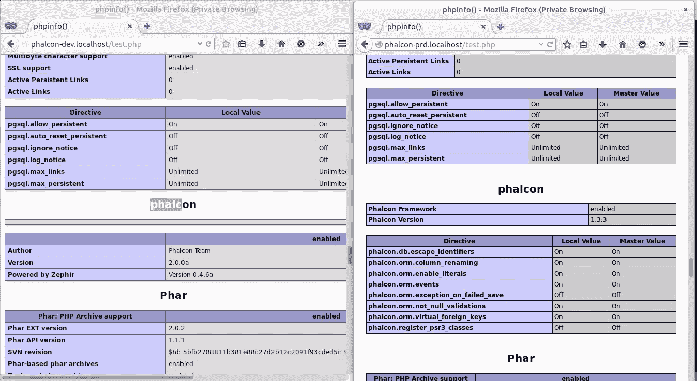

# 如何在一台服务器上运行多个版本的 PHP

> 原文：<https://www.sitepoint.com/run-multiple-versions-php-one-server/>

在这篇特别的文章中，我们将演示一个安装多个版本的 Phalcon 和 PHP 并在一台 web 服务器上运行它们的解决方案。这里会用到 PHP 5.5.x 和 5.6.x，但是你可以用其他版本代替。任何支持 PHP-FPM 的服务器应该足够了，但我们建议使用 Nginx。本教程中使用的环境是 Fedora OS——一个 Linux 系统，但是对于任何其他*nix OS，指令几乎是相同的。

### 初步说明

本教程将介绍 PHP 5.5.x 与 Phalcon 1.3.x 的安装，以及 PHP 5.6.x 与 Phalcon 2.0.0 的安装。我们还将构建一些额外的 PHP 扩展，如 APC、memcache、memcached 和 ioncube。

### 安装 Nginx

Nginx 是 Fedora OS 中的一个可用包，我们可以按如下方式安装它:

```
sudo yum install nginx
```

然后，我们为 Nginx 创建系统启动链接并启动它

```
sudo chkconfig nginx on
  sudo service nginx start
```

### 构建 PHP

在开始使用 PHP 之前，我们需要安装构建 PHP5 的先决条件:

*   gcc 或其他一些编译器套件。
*   libc-dev，提供 C 标准库，包括头文件。
*   make，这是 PHP 使用的构建管理工具。
*   用于生成配置脚本的 autoconf (2.59 或更高版本)。
*   automake (1.4 或更高版本)，生成 Makefile.in 文件。
*   libtool，帮助我们管理共享库。
*   bison (2.4 或更高版本)，用于生成 PHP 解析器。
*   (可选)re2c，用于生成 PHP lexer。由于 git 存储库已经包含了一个生成的 lexer，如果您想对它进行修改，只需要 re2c。

在 Centos/Fedora 上，您可以使用以下命令安装所有这些组件:

```
sudo yum install gcc libxml2-devel libXpm-devel gmp-devel libicu-devel t1lib-devel aspell-devel openssl-devel bzip2-devel libcurl-devel libjpeg-devel libvpx-devel libpng-devel freetype-devel readline-devel libtidy-devel libxslt-devel libmcrypt-devel pcre-devel curl-devel mysql-devel ncurses-devel gettext-devel net-snmp-devel libevent-devel libtool-ltdl-devel libc-client-devel postgresql-devel bison gcc make
```

然后我们需要得到它的源代码。有两种方法可以做到这一点:你可以从 [PHP 的下载页面](http://php.net/downloads.php)下载一个档案，或者从 [Github](https://github.com/php/php-src) 克隆 git 库。

我们建议从 git 查看源代码，因为它为您提供了一种简单的方法来保持您的安装是最新的，并尝试使用不同版本的代码。如果您想提交 PHP 的补丁或请求，还需要 git checkout。

要克隆存储库，请在终端中运行以下命令:

```
sudo mkdir /opt/source && cd /opt/source
  git clone git@github.com:php/php-src.git && cd php-src
```

默认情况下，您将在主分支上，所以如果您想要转移到开发版本，您需要签出稳定分支。比如说。

```
 PHP 5.3: git checkout PHP-5.3 PHP 5.4: git checkout PHP-5.4 PHP 5.6: git checkout PHP-5.6 PHP HEAD: git checkout master 
```

在进入各个构建步骤之前，我们必须执行一些“默认”PHP 构建的命令。这只是从 git 构建时需要的。

```
sudo ./buildconf
```

`./buildconf`生成配置脚本。这可能需要几分钟时间。

在我看来，将整个 web 服务器存储在单个目录中是最好的，所以我在这里使用`/opt`。打开终端，键入以下命令。

```
sudo mkdir -p /opt/php-5.6
  sudo mkdir -p /opt/php-5.5
```

一旦通过上面的步骤生成了`./configure`脚本，您就可以使用它来定制您的 PHP 构建。您可以使用–help 列出所有支持的选项:

```
./configure --help
```

上面的命令将列出各种通用选项，所有基于 autoconf 的配置脚本都支持这些选项。其中一个已经提到了——prefix = DIR，它改变了`make install`使用的安装目录。另一个有用的选项是-C，它将在 config.cache 文件中缓存各种测试的结果，并加速后续的`./configure`调用。只有当您已经有了一个可工作的构建，并且想要在不同的配置之间快速切换时，使用这个选项才有意义。

以下是一些有用的设置:

```
[...]

  Usage: ./configure [OPTION]... [VAR=VALUE]...

  To assign environment variables (e.g., CC, CFLAGS...), specify them as
  VAR=VALUE.  See below for descriptions of some of the useful variables.

  Defaults for the options are specified in brackets.

  Configuration:
    -h, --help              display this help and exit
        --help=short        display options specific to this package
        --help=recursive    display the short help of all the included packages
    -V, --version           display version information and exit
    -q, --quiet, --silent   do not print `checking ...' messages
        --cache-file=FILE   cache test results in FILE [disabled]
    -C, --config-cache      alias for `--cache-file=config.cache'
    -n, --no-create         do not create output files
        --srcdir=DIR        find the sources in DIR [configure dir or `..']

  Installation directories:
    --prefix=PREFIX         install architecture-independent files in PREFIX
                            [/usr/local]
    --exec-prefix=EPREFIX   install architecture-dependent files in EPREFIX
                            [PREFIX]

  By default, `make install' will install all the files in
  `/usr/local/bin', `/usr/local/lib' etc.  You can specify
  an installation prefix other than `/usr/local' using `--prefix',
  for instance `--prefix=$HOME'.

  For better control, use the options below.

  Fine tuning of the installation directories:
    --bindir=DIR            user executables [EPREFIX/bin]
    --sbindir=DIR           system admin executables [EPREFIX/sbin]
    --libexecdir=DIR        program executables [EPREFIX/libexec]
    --sysconfdir=DIR        read-only single-machine data [PREFIX/etc]
    --sharedstatedir=DIR    modifiable architecture-independent data [PREFIX/com]
    --localstatedir=DIR     modifiable single-machine data [PREFIX/var]
    --libdir=DIR            object code libraries [EPREFIX/lib]
    --includedir=DIR        C header files [PREFIX/include]
    --oldincludedir=DIR     C header files for non-gcc [/usr/include]
    --datarootdir=DIR       read-only arch.-independent data root [PREFIX/share]
    --datadir=DIR           read-only architecture-independent data [DATAROOTDIR]
    --infodir=DIR           info documentation [DATAROOTDIR/info]
    --localedir=DIR         locale-dependent data [DATAROOTDIR/locale]
    --mandir=DIR            man documentation [DATAROOTDIR/man]
    --docdir=DIR            documentation root [DATAROOTDIR/doc/PACKAGE]
    --htmldir=DIR           html documentation [DOCDIR]
    --dvidir=DIR            dvi documentation [DOCDIR]
    --pdfdir=DIR            pdf documentation [DOCDIR]
    --psdir=DIR             ps documentation [DOCDIR]

  [...]
```

完成准备后，我们安装 PHP 5.6 版。运行以下命令:

```
./configure \
--prefix=/opt/php-5.6 \
--with-pdo-pgsql \
--with-zlib-dir \
--with-freetype-dir \
--enable-mbstring \
--with-libxml-dir=/usr \
--enable-soap \
--enable-calendar \
--with-curl \
--with-mcrypt \
--with-zlib \
--with-gd \
--with-pgsql \
--disable-rpath \
--enable-inline-optimization \
--with-bz2 \
--with-zlib \
--enable-sockets \
--enable-sysvsem \
--enable-sysvshm \
--enable-pcntl \
--enable-mbregex \
--with-mhash \
--enable-zip \
--with-pcre-regex \
--with-mysql \
--with-pdo-mysql \
--with-mysqli \
--with-png-dir=/usr \
--enable-gd-native-ttf \
--with-openssl \
--with-fpm-user=nginx \
--with-fpm-group=nginx \
--with-libdir=lib64 \
--enable-ftp \
--with-imap \
--with-imap-ssl \
--with-kerberos \
--with-gettext \
--with-gd \
--with-jpeg-dir=/usr/lib/
--enable-fpm
```

最后一个开关(–enable-fpm)使这个 PHP 版本可以与 PHP-FPM 一起工作。如果你想在 Apache 上使用这个 PHP-FPM 版本，请使用`--with-fpm-user=apache`和`--with-fpm-group=apache`。另一方面，如果你想在 nginx 上使用这个 PHP-FPM 版本，请使用`--with-fpm-user=nginx`和`--with-fpm-group=nginx`。

一条成功的消息应该像这样打印在终端中:

```
[...]

creating libtool
appending configuration tag "CXX" to libtool

Generating files
configure: creating ./config.status
creating main/internal_functions.c
creating main/internal_functions_cli.c
+--------------------------------------------------------------------+
| License:                                                           |
| This software is subject to the PHP License, available in this     |
| distribution in the file LICENSE.  By continuing this installation |
| process, you are bound by the terms of this license agreement.     |
| If you do not agree with the terms of this license, you must abort |
| the installation process at this point.                            |
+--------------------------------------------------------------------+

Thank you for using PHP.

config.status: creating php5.spec
config.status: creating main/build-defs.h
config.status: creating scripts/phpize
config.status: creating scripts/man1/phpize.1
config.status: creating scripts/php-config
config.status: creating scripts/man1/php-config.1
config.status: creating sapi/cli/php.1
config.status: creating sapi/fpm/php-fpm.conf
config.status: creating sapi/fpm/init.d.php-fpm
config.status: creating sapi/fpm/php-fpm.service
config.status: creating sapi/fpm/php-fpm.8
config.status: creating sapi/fpm/status.html
config.status: creating sapi/cgi/php-cgi.1
config.status: creating ext/phar/phar.1
config.status: creating ext/phar/phar.phar.1
config.status: creating main/php_config.h
config.status: executing default commands
```

现在，您可以使用 make 来执行实际的编译:

```
make
```

此操作的主要结果将是启用的 sapi 的 PHP 二进制文件(默认为 sapi/cli/php 和 sapi/cgi/php-cgi)，以及模块/目录中的共享扩展。

现在您可以运行“make install ”,通过使用`--prefix`配置将 PHP 安装到/usr/local(默认)或其他目录中。在这种情况下，它是`/opt/php-5.6`

```
sudo make install
```

请注意`make install`不会创建 ini 文件。

```
/opt/php-5.6/bin/php --ini
Configuration File (php.ini) Path: /opt/php-5.6/lib
Loaded Configuration File:         (none)
Scan for additional .ini files in: (none)
Additional .ini files parsed:      (none)
```

将 php.ini 和 php-fpm.conf 复制到正确的目录:

```
sudo cp /opt/source/php-src/php-fpm.conf.default /opt/php-5.6/etc/php-fpm.conf
sudo cp /opt/source/php-src/php.ini-production /opt/php-5.6/lib/php.ini
```

我们再次验证和检查 php 版本。

```
/opt/php-5.6/bin/php --ini
  Configuration File (php.ini) Path: /opt/php-5.6/lib
  Loaded Configuration File:         /opt/php-5.6/lib/php.ini
  Scan for additional .ini files in: (none)
  Additional .ini files parsed:      (none)

  ### Checking php
  /opt/php-5.6/bin/php --version
  PHP 5.6.2-dev (cli) (built: Oct  2 2014 17:20:23) 
  Copyright (c) 1997-2014 The PHP Group
  Zend Engine v2.6.0, Copyright (c) 1998-2014 Zend Technologies
```

打开`/opt/php-5.6/etc/php-fpm.conf`并调整监听线中的设置。您必须切换到未使用的端口(例如 9001；端口 9000 可能正在被 Fedora 使用)

```
vi /opt/php-5.6/etc/php-fpm.conf
```

```
[...]
  pid = run/php-fpm.pid
  [...]
  user = nginx
  group = nginx
  [...]
  listen = 127.0.0.1:9001
  [...]
  #include=/opt/php-5.6/etc/pool.d/*.conf
```

### 初始化脚本设置

您可能想要为您的新 php-fpm 创建一个 init 脚本。幸运的是，PHP 5.3+已经为您提供了它，只需将 init 脚本复制到您的目录并更改权限:

```
sudo cp /opt/source/php-src/sapi/fpm/init.d.php-fpm /etc/init.d/php5.6-fpm
  sudo chmod 755 /etc/init.d/php5.6-fpm
```

你的初始化脚本已经准备好了。现在，您可以启动、停止和重新加载 php-fpm 了:

```
sudo /etc/init.d/php5.6-fpm start
  sudo /etc/init.d/php5.6-fpm stop
  sudo /etc/init.d/php5.6-fpm reload
```

### 构建第二个 PHP (5.5.x)

我们打开终端，键入以下命令。

```
git checkout PHP-5.5
sudo ./buildconf 
./configure \
--prefix=/opt/php-5.5 \
--with-pdo-pgsql \
--with-zlib-dir \
--with-freetype-dir \
--enable-mbstring \
--with-libxml-dir=/usr \
--enable-soap \
--enable-calendar \
--with-curl \
--with-mcrypt \
--with-zlib \
--with-gd \
--with-pgsql \
--disable-rpath \
--enable-inline-optimization \
--with-bz2 \
--with-zlib \
--enable-sockets \
--enable-sysvsem \
--enable-sysvshm \
--enable-pcntl \
--enable-mbregex \
--with-mhash \
--enable-zip \
--with-pcre-regex \
--with-mysql \
--with-pdo-mysql \
--with-mysqli \
--with-png-dir=/usr \
--enable-gd-native-ttf \
--with-openssl \
--with-fpm-user=nginx \
--with-fpm-group=nginx \
--with-libdir=lib64 \
--enable-ftp \
--with-imap \
--with-imap-ssl \
--with-kerberos \
--with-gettext \
--with-gd \
--with-jpeg-dir=/usr/lib/ \
--enable-fpm

make && sudo make install
```

### 构建 PHP Phalcon 扩展

要安装包括 Phalcon 2.0 在内的多个版本的 Phalcon，我们需要安装 Zephir

```
git clone https://github.com/json-c/json-c.git
  cd json-c
  sh autogen.sh
  ./configure
  make && sudo make install

  git clone https://github.com/phalcon/zephir
  cd zephir
  sudo ./install -c
```

安装 PHP 扩展有很多方法。我们将使用 phpize 构建它。

Phpize 扮演的角色类似于用于 PHP 构建的`./buildconf`脚本:首先，它将通过从`$PREFIX/lib/php/build`复制文件来将 PHP 构建系统导入到您的扩展中。这些文件中有`acinclude.m4` (PHP 的 M4 宏)、`phpize.m4`(在你的扩展中将被重命名为 configure.in，包含主要的构建指令)和`run-tests.php`。

然后，phpize 将调用`autoconf`来生成一个`./configure`文件，该文件可用于定制扩展构建。比如安装 memcached 你必须添加 `--enable-memcache` 。

**记住！**在构建扩展时，必须指定`--with-php-config`选项(除非您只有一个 PHP 的全局安装)。否则`./configure`将无法正确确定 PHP 版本和标志。此外，php-config 脚本还确保“make install”命令将生成的`*.so`文件移动到正确的扩展目录。

### 构建第一个 PHP Phalcon (2.0)

```
git clone http://github.com/phalcon/cphalcon
  cd cphalcon && git checkout 2.0.0
  zephir compile
  cd ext && /opt/php-5.6/bin/phpize
  ./configure --with-php-config=/opt/php-5.6/bin/php-config
  make && sudo make install
  Installing shared extensions:     /opt/php-5.6/lib/php/extensions/no-debug-non-zts-20131226/
```

请检查它是否成功

```
ls /opt/php-5.6/lib/php/extensions/no-debug-non-zts-20131226/
```

安装扩展后。您仍然需要通过在 php.ini 文件中包含它来激活它。

```
sudo su
  echo "extension=phalcon.so" >> /opt/php-5.6/lib/php.ini
  exit
```

### 构建第二个 PHP Phalcon (1.3.x)

```
git clone http://github.com/phalcon/cphalcon
  cd cphalcon && git checkout master
  cd ext && /opt/php-5.5/bin/phpize
  ./configure --with-php-config=/opt/php-5.5/bin/php-config
  make && sudo make install
  Installing shared extensions:     /opt/php-5.5/lib/php/extensions/no-debug-non-zts-20121212/
```

我们再次检查以确保安装成功

```
ls /opt/php-5.6/lib/php/extensions/no-debug-non-zts-20131226/
  sudo su
  echo "extension=phalcon.so" >> /opt/php-5.5/lib/php.ini
  exit
```

### 配置 Nginx

```
sudo vi /etc/nginx/nginx.conf
```

下面的配置将创建两个服务器:运行在 PHP 5.5.x 上的 phalcon-prd.localhost 和运行在 PHP 5.6.x 上的 phalcon-dev.localhost

```
[...]
http {
  include       mime.types;
  default_type  application/octet-stream;
  sendfile        on;
  keepalive_timeout  65;
  #gzip  on;
  include /etc/nginx/conf.d/*.conf;

  index index.php index.html index.htm;

  #Prodution environment Phalcon
  server {
    listen       80;
    server_name  phalcon-prd.localhost;

    root   /usr/share/nginx/html/phalcon-prd;

    location / {
      index  index.php;
    }

    location ~ \.php$ {
      fastcgi_pass   127.0.0.1:9001;
      fastcgi_index  index.php;
      fastcgi_param  SCRIPT_FILENAME  $document_root$fastcgi_script_name;
      include        fastcgi_params;
    }
  }
  #Development environment Phalcon
  server {
    listen       80;
    server_name  phalcon-dev.localhost;

    root   /usr/share/nginx/html/phalcon-prd;

    location / {
      index  index.php;
    }

    location ~ \.php$ {
      fastcgi_pass   127.0.0.1:9002;
      fastcgi_index  index.php;
      fastcgi_param  SCRIPT_FILENAME  $document_root$fastcgi_script_name;
      include        fastcgi_params;
    }
  }
}
[...]
```

### 设置本地主机文件

如果您使用的是 Linux 系统，您可以编辑主机文件:

```
sudo vi /etc/hosts
```

新的主机文件将如下所示。

```
[...]
127.0.0 localhost phalcon-dev.localhost phalcon-prd.localhost
::1   localhost6.localdomain6 localhost6
[...]
```

这个拦截所有对`phalcon-dev.localhost`和`phalcon-prd.localhost`的请求，然后将它们发送到你的服务器。

### 测试它

为了测试，我们创建了一个名为 test.php 的新文件，并将其放入与 Nginx 的上述配置相对应的文件夹中。在每个文件中，我们添加以下命令。

```
<?php phpinfo(); ?>
```

现在，在每个服务器中运行`test.php`文件，我们看到在[http://phancon-prd.localhost/test.php](http://phancon-prd.localhost/test.php)有一个 Phalcon 1.3.x `phpinfo()`，而在[http://phancon-dev.localhost/test.php](http://phancon-dev.localhost/test.php)应该有一个 Phalcon 2.0.x 的`phpinfo()`



### 最后

在本教程中，我们已经了解了如何在我们的服务器上轻松拥有多个正在运行的 PHP 版本，如果需要的话，每个版本都有自己不同的扩展。例如，如果您正在进行共享托管，或者如果您需要支持古老的遗留应用程序，同时能够在尖端版本上开发和部署，这将非常方便。

请在下面的评论中留下您的反馈，如果您喜欢这篇文章，请一如既往地分享它！

## 分享这篇文章