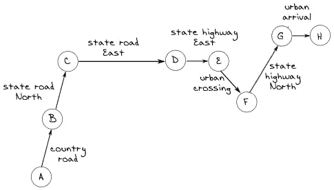
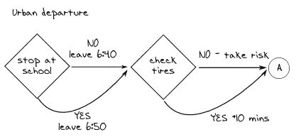
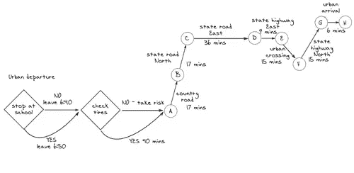

# 在 PHP 中运行蒙特卡罗模拟

> 原文：<https://www.sitepoint.com/running-monte-carlo-simulations-in-php/>

20 世纪 80 年代令人兴奋的事情之一是编程模拟来解决复杂的分析问题，其中最有用的技术之一是运行蒙特卡罗模拟。该方法反复运行模拟多次，以计算最可能的结果。

尽管 PHP 并不被认为是一种科学或研究编程语言，但蒙特卡罗模拟可以很容易地在 PHP web 应用程序中编写。在本文中，我将向您展示如何实现。

## 现实世界的问题

前天上午 9 点，我在离我家大约 100 英里的地方参加了一个会议。6:30 我醒了，穿好衣服，一边吃早餐，一边在记事本上开始计划接下来的几个小时。很明显，我想安全准时地到达会场，所以我开始将行车路线划分为八个阶段:市区出发、乡村公路、州公路北行、州公路东行、州公路东行、市区穿越、州公路北行和市区到达。草图大致是这样的:



我妻子前一天晚上已经把油箱加满了，理想情况下，我可以直接开到乡间小路上去。当我看着轮胎的时候，它们看起来还不错，但是我怀疑是否要绕道 10 分钟来检查它们的压力。如果我停下来检查轮胎，我就能确定它们的压力。否则，我将不得不带着不确定性旅行。轮胎气压不足会影响我的驾驶稳定性和速度。

我可以早在 6:40 离开，但是那样我的妻子就必须送我们的女儿去学校，而不是直接去上班。如果我再等 10 分钟，我就可以在学校早上开门的时候赶到学校，这样我妻子就不用麻烦了。学校在我出城的路上，所以不会有明显的额外旅行时间。

我回到我的图纸，添加了以下内容:



我啜饮着第二杯咖啡，站在窗前。晴朗的黄昏天空和轻快的晨风与我智能手机上的完美天气预报一致，这让我相信开车会很快。为了完成我的计划，我根据以往的经验，写下了预计的驾驶时间:



路上的预计时间是 115 分钟(1 小时 55 分钟)，我可以不停地跑。如果我直接上路，我的预计到达时间是 8:35，如果我决定带女儿去学校检查轮胎，我的预计到达时间是 8:55。

但是没有一个计划能在第一次遭遇敌人后存活下来！出于某种神秘的原因，许多其他家长决定比平时更早地把他们的孩子送到学校，而我已经在计划的快速绕道上浪费了 5 分多钟。知道我的基线已经被破坏，我决定跳过轮胎检查，直接开车去乡村公路。

我实际上比最初最坏的情况估计提前了五分钟到达了公路，行驶得很顺利，直到在里程碑 B 和 C 之间的某个地方，我遇到了浓雾，降低了我的能见度。这降低了我的平均速度，使我更难超越那些缓慢但很长的卡车。

我不得不穿越的城镇的交通比平时要少得多，我没有花超过 10 分钟就穿越了。在往南的国道上行驶了几英里后，雾消散了，所以我可以全速行驶了。但当我接近目的地时，我意识到一些正在进行的道路工程挡住了我计划走的出口。这又增加了我 10 分钟的旅行时间，不用说我迟到了。

## 用 PHP 为旅行建模

我相信大部分 PHP 编码都是致力于盈利和非盈利的商业网站。但是 PHP 可以成为科学研究的一个很好的工具，并且可能比其他语言(比如我喜欢的 Python)更容易教授非专业程序员，比如工程师和科学家。

让我们编写基本代码，它将帮助我理解如果我的计划的一个或多个阶段与他们的基线估计相差很大，我可以提前或推迟多长时间到达会议。我们可以开始模拟旅行，如下所示:

```
<?php 
class MyTrip 
{ 
    protected $departureTime; 
    protected $meetingTime; 
    protected $travelTimes; 

    public function __construct() { 
        $this->setDepartureTime('0640'); 
        $this->setMeetingTime('0900'); 

        // travel times in minutes between milestones 
        $this->setTravelTimes(array( 
            'AB' => 17, 
            'BC' => 17, 
            'CD' => 36, 
            'DE' => 9, 
            'EF' => 15, 
            'FG' => 15, 
            'GH' => 6 
        )); 
    } 

    // for convenience convert time string to minutes past
    // midnight 
    protected static function convertToMinutes($timeStr) { 
        return substr($timeStr, 0, 2) * 60 +
            substr($timeStr, 2, 2); 
    } 

    public function setDepartureTime($timeStr) { 
        $this->departureTime = self::convertToMinutes($timeStr); 
    } 

    public function setMeetingTime($timeStr) { 
        $this->meetingTime = self::convertToMinutes($timeStr); 
    } 

    public function setTravelTimes(array $travelTimes) { 
        $this->travelTimes = $travelTimes; 
    } 

    public checkPlan($stopAtSchool = true, $checkTires = true) {
        // ...
    }
}
```

计划必须可行，判断这个计划的合适标准是所有时间加上最早出发时间的总和是否小于或等于会议时间。这就是`checkPlan()`方法所确定的:

```
<?php
public checkPlan($stopAtSchool = true, $checkTires = true) {
    // calculate the sum of travel times between milestones
    $travelTime = array_sum($this->travelTimes);

    // add delay if dropping kid off at school
    $schoolDelay = ($stopAtSchool) ? 10 : 0;

    // add delay if checking tire pressure
    $tiresDelay = ($checkTires) ? 10 : 0;

    // find the total schedule baseline
    $meetingArriveTime = $this->departureTime + $travelTime +
        $schoolDelay + $tiresDelay;

    // does the traveller make the meeting on time?
    $arriveOnTime = $meetingArriveTime <= $this->meetingTime;

    return array($meetingArriveTime, $this->meetingTime,
        $arriveOnTime);
}
```

现在我们要做的就是创建该类的一个实例，并让它检查我的计划:

```
<?php
$trip = new MyTrip();
print_r($trip->checkPlan());
```

给定默认值，上面将输出我的原始计划是没问题的:

```
Array
(
    [0] => 535
    [1] => 540
    [2] => 1
)
```

我应该在午夜后 535 分钟到达那里，而会议在午夜后 540 分钟举行。根据基线，我将在早上 8:45 到达会场，比预定时间提前了 5 分钟！

但是不可避免的变化呢？我们如何解释不确定的因素？

## 蒙特卡罗和增加随机性

以一种非常简单的方式，我们可以为每个事件定义一个安全裕度，并说它可能比预定时间早发生 10%，晚发生 25%。通过将每个系数乘以`rand(90,125)/100`，可以将这些裕量随机添加到出发延误和里程碑之间的每次旅行时间中。

我们还可以为送女儿上学和检查轮胎这两个决定分配 50%的概率。再次，`rand()`功能可以帮助我们:

```
$this->checkTires = rand(1, 100) > 50;
```

综上所述，我们可以定义一种方法`checkPlanRisk()`来计算我是否能准时到达，因为有许多不确定因素阻碍着我:

```
<?php
public function checkPlanRisk() {
    // adjust and sum travel times between milestones
    $travelTime = 0;
    foreach ($this->travelTimes as $t) {
        $travelTime += $t * rand(90, 125) / 100;
    }

    // decide whether to drop kid off at school and randomly set
    // the delay time
    $schoolDelay = 0;
    if (rand(1, 100) > 50) {
        $schoolDelay = 10 * rand(90, 125) / 100;
    }

    // ditto for checking tires
    $tiresDelay = 0;
    if (rand(1, 100) > 50) {
        $tiresDelay = 10 * rand(90, 125) / 100;
    }

    // find the total schedule baseline
    $meetingArriveTime = $this->departureTime + $travelTime +
        $schoolDelay + $tiresDelay;

    // does the traveller make the meeting on time?
    $arriveOnTime = $meetingArriveTime <= $this->meetingTime;

    return array($schoolDelay, $tiresDelay, $meetingArriveTime,
        $this->meetingTime, $arriveOnTime);
}
```

现在的问题是，给定初始条件和假定的不确定性，旅行者准时到达的可能性有多大？蒙特卡洛模拟通过运行大量时间并计算“置信水平”来回答这个问题，置信水平被定义为准时到达与总试验次数的比率。

如果我们运行这种方法足够多次，并记录旅行者准时到达的频率，我们就可以建立某种程度的置信度，确定旅行是否按计划可行。

```
<?php
public function runCheckPlanRisk($numTrials) {
    $arriveOnTime = 0;
    for ($i = 1; $i <= $numTrials; $i++) {
        $result = $this->checkPlanRisk();
        if ($result[4]) {
            $arriveOnTime++;
        }

        echo "Trial: " . $i;
        echo " School delay: " . $result[0];
        echo " Tire delay: " . $result[1];
        echo " Enroute time: " . $result[2];

        if ($result[4]) {
            echo " -- Arrive ON TIME";
        }
        else {
            echo " -- Arrive late";
        }

        $confidence = $arriveOnTime / $i;
        echo "nConfidence level: $confidencenn";
    }
}
```

创建一个新的`MyTrip`实例，并让它计算 1000 次试验的置信水平，这很简单:

```
<?php
$trip = new MyTrip();
$trip->runCheckPlanRisk(1000);
```

输出将是 1000 个条目的屏幕打印输出，如下所示:

```
Trial: 1000 School delay: 0 Delay tires: 11.3 Enroute time: 530.44 -- Arrive ON TIME
Confidence level: 0.716
```

使用上面的参数，置信水平似乎收敛到 0.72，这大致表明旅行者有 72%的机会准时到达会议。

蒙特卡洛依赖于一系列相同实验的平均结果的收敛。平均结果也称为期望值，可以认为是期望结果发生的概率。当然，这是一个非常古老的概念，在数字计算机出现之前很久就已经进行了这样的模拟。

## 结论

今天，我们有非常强大的资源供我们使用，还有像 PHP 这样非常方便的语言，可以用来创建模拟逻辑和用户友好的网络界面。通过几行代码，我们创建了一个模型并应用蒙特卡罗模拟，产生了一个对商业决策有用的可理解的结果。这是一个值得探索的领域，很高兴看到一些科学计算功能被添加到 PHP 中，这样科学家和工程师就可以利用这种多功能的非废话语言。

本文的代码可以在 GitHub 上找到。

图片 via[Fotolia](http://us.fotolia.com/?utm_source=sitepoint&utm_medium=website_link&utm=campaign=sitepoint "Royalty Free Stock Photos at Fotolia.com")

## 分享这篇文章