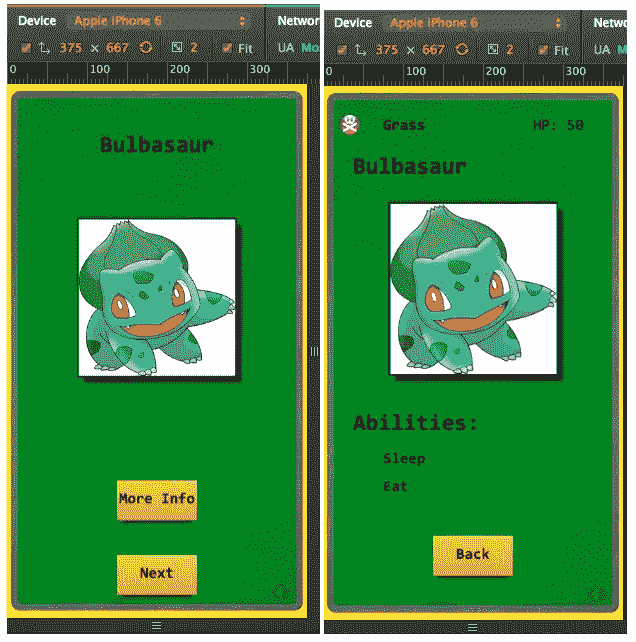

# 示例项目:使用 Famo.us 和 Angular 创建一个移动应用程序

> 原文：<https://www.sitepoint.com/sample-project-use-famo-us-and-angular-to-create-a-mobile-application/>

本文是微软网站开发系列的一部分。感谢您对使 SitePoint 成为可能的合作伙伴的支持。

我喜欢高性能的 JavaScript，我喜欢分享我认为它真正的潜力。在本教程中，我想重点介绍 famo . us——它可以让你保持每秒 60 帧的流畅，同时在屏幕上显示流畅的动画。Famo.us 通过利用 CSS3 原语-webkit-transform: matrix3d 来实现这一点，它让框架计算复合矩阵并跳过浏览器的渲染器。没有插件，没有下载，没有黑客。通过将它附加到每个 DIV，开发人员可以渲染复合矩阵并直接进入 GPU。

在这篇博文中，我会更深入地讨论 Famo.us 的来龙去脉。再次感谢[扎克·布朗](https://twitter.com/zackaboo)在这方面给予的所有帮助！让我们开始吧:

本项目结束时，您将能够:

*   了解 Angular 在 Famo.us 应用程序的上下文中是如何工作的
*   利用 JavaScript 的真正力量和 HTML5 的优点
*   创建流畅的动画

我这个项目的目标是说明你可以多么容易地创建 HTML5 / JS 项目，在移动应用程序上以接近本地的速度工作。

### 特征

*   移动应用程序通过 Cordova 在 iOS 和 Android 上运行
*   Windows 10 通用应用程序可以在 Windows 10 上正常运行
*   这个项目也可以作为一个托管网站运行，虽然我有它最适合移动设备

### 要求

*   PC 或 Mac
*   网络服务器
*   跨平台测试矩阵(如 BrowserStack，IDE，或用于 EdgeHTML 的免费虚拟机，用于 Windows 10 上微软 Edge 和托管 web 应用内容的渲染引擎)。

## 设置

1.  1.从 GitHub 下载源代码
2.  2.下载并安装一个网络服务器[(我在 OS X 上使用 MAMP，或者在 Windows 上使用内置的 IIS 服务器和 Visual Studio)](https://www.mamp.info/en/)

### 打开项目

1.  1.启动您的 web 服务器
2.  2.导航至**名角口袋妖怪/app/**

该项目旨在移动设备上工作，因此使用浏览器中的移动模拟器来获得正确的视图。下面是 iPhone 6 通过 Chrome 桌面浏览器(375×667)在模拟器中的样子:



## 它是如何工作的

### 进入数据库

我从 [PokeAPI](http://pokeapi.co/) 中提取所有信息，它有一个记录良好的 API，但是它缺少每个神奇宝贝的图像。对于图片，我只需将当前选择的口袋妖怪的名字添加到这个 URL 的末尾:【http://img.pokemondb.net/artwork/】*。例如:[http://img.pokemondb.net/artwork/venusaur.jpg](http://img.pokemondb.net/artwork/venusaur.jpg)会带你去瓦诺瑟的图像。很漂亮，对吧？遗憾的是，他们没有可用的 API。*

每次用户按下**下一个**按钮，就会在我定义的最小/最大值(比如 1-20)之间产生一个随机数，它会从数据库中取出一个与该数字匹配的神奇宝贝。它看起来是这样的:

[](http://pokeapi.co/api/v1/pokemon/1/)*为妙蛙种子返回一个 JSON 对象。[你可以在这里玩他们的 API。](http://pokeapi.co/)*

 *### 遍历数据

然后，我遍历 JSON 对象，并使用$Scope 对象将在那里找到的属性设置为 Angular 中的变量。

这里有一个例子:

```
/*
 * Grab Pokemon from the DB
 */
$scope.getPokemon = function () {  

  // Generate a random num and use it for the next pokemon
  getRandomInt($scope.minVal, $scope.maxVal);

  // Retrieve data from DB and draw it to screen
  $http.get($scope.dbURL + $scope.pokemonNum + "/")
    .success(function(data) {
      $scope.name       = data.name;
      $scope.imageUrl   = $scope.imgDbURL + $scope.name.toLowerCase() + '.jpg';

      /* 1) Empty out the current array to store the new items in there
       * 2) Capitalize the first character for each ability from the database
       * 3) Store that ability in a new abilityObj & add it into the abilities array
       */
      $scope.abilities.length = 0;
      for (var i = 0; i < data.abilities.length; i++){
       var capitalizedString = capitalizeFirstLetter(data.abilities[i].name);
       var abilityObj        = {name: capitalizedString };
        $scope.abilities.push(abilityObj);
      }

      $scope.hitPoints  = data. hp;
      var firstType     = data.types[0].name;
      $scope.types.name = capitalizeFirstLetter(firstType);
      determineNewBgColor();
    })
    .error(function(status){
      console.log(status);
      $scope.name = "Couldn't get Pokemon from the DB";
    });
}; 
```

您可能会注意到，我在这里也有一些其他的函数，比如`capitalizeFirstLetter`，它就是这样做的。我希望能力和类型(例如:毒药，草，飞行)的第一个字母大写，因为它从数据库中返回的所有小写字符。

我还循环遍历这些能力，并将它们推送到一个能力对象，如下所示:

```
 $scope.abilities       = [
    { name: "Sleep"},
    { name: "Eat"  }
  ]; 
```

该数据库还会返回某些神奇宝贝的多种类型，例如会飞也会火的 Charizard。为了简单起见，我只想从数据库中返回一个。

```
 $scope.types      = { name: "Grass" };   
  var firstType     = data.types[0].name; 
```

### 把它画到屏幕上

Famo.us 通过创建“表面”将两种内容绘制到屏幕上，这些表面是包含文本、图像等的元素。：

1.  1.Java Script 语言
2.  2.FA 指令(HTML)

我没有使用 JavaScript 在这个应用程序中绘制表面，而是选择只使用 FA(著名的角度)指令，例如:

```
<!-- Name-->
    <fa-modifier
        fa-origin    ="origin.center"
        fa-align     ="align.frontName"
        fa-size      ="size.frontName"
        fa-translate ="trans.topLayer">
        <fa-surface
            class    ="front-name-text">
            {{name}}
        </fa-surface>
    </fa-modifier> 
```

正面屏幕上口袋妖怪上方的名字。

你会注意到表面被一个**fa-修改器**包裹着。[你可以在这里读到这些](https://famo.us/integrations/angular/docs/unstable/api/directive/faModifier/)，但它们本质上是调整一个表面的属性，如对齐、大小和原点。我花了一段时间来理解对齐和原点之间的区别，所以我是这样理解的:

**原点**任何表面上的参考点。如果我想画一个矩形并在屏幕上移动它，我需要决定矩形上的哪个点将是我的起点。 [Famo.us docs](https://famo.us/guides/layout) 解释的很好。这些值的布局如下:

```
 $scope.origin          = {
                         // X    Y 
   topLeft:                [0,   0  ],
   topRight:               [1,   0  ],
   center:                 [0.5, 0.5],
   bottomLeft:             [0,   1  ],
   bottomRight:            [1,   1  ]
  }; 
```

**对准**屏幕上一个表面的位置。当您对路线进行更改时，它会使用原点作为起点的参考点。

```
 $scope.align          =  {
                          // X        Y 
    frontName:             [0.50,    0.10],
    frontImg:              [0.50,    0.40],
    backImg:               [0.5,     0.38],
    center:                [0.50,    0.50]
  }; 
```

### Angular 终于出现了

现在，您可以将所有的角度技能和数据绑定用于角度实现。如果你已经有了 Angular 的经验，那么它在这里没有根本的不同。

```
 <!-- Next button -->
    <fa-modifier
        fa-origin    ="origin.center"
        fa-align     ="align.nextBtn"
        fa-size      ="size.btn"
        fa-scale     ="scale.nextBtn.get()"
        fa-translate ="trans.topLayer">
        <fa-surface
            class    ="one-edge-shadow center-align next-btn"
            ng-click ="getPokemon(); nextBtnPressAnim(); frontImgAnim()">
            {{nextBtn}}
        </fa-surface>
    </fa-modifier> 
```

这个按钮出现在第一个屏幕上，只是从数据库中拉出另一个神奇宝贝。所有你熟悉的 ng (angular)指令都在这里，比如 *ng-click。*这里我有多个函数(注意:它们不是用逗号分隔的)。

我还在 HTML 中将 *$scope.nextBtn* 的值绑定到 *{{nextBTn}}* 。

为了让 Famo.us 和 Angular 一起工作，我们需要在 JavaScript 文件的顶部包含$Famo.us。你可以这样做:

angular . module(' famousAngularStarter ')
。控制器(' PokemonCtrl '，['  http '，' scope， 名家){

```
/* Inject famo.us to DOM */
var View           = $famous['famous/core/View'                 ];
var Modifier       = $famous['famous/core/Modifier'             ];
var Surface        = $famous['famous/core/Surface'              ];
var Transform      = $famous['famous/core/Transform'            ];
var Transitionable = $famous['famous/transitions/Transitionable'];
var Timer          = $famous['famous/utilities/Timer'           ]; 
```

### 动画片

如果没有动画，一个高性能的应用程序会是什么样的？Famo.us 里挤满了他们，很容易上手。这里有一个为前面的图像制作动画。

```
 /*
   * @OnClick: Sets the opacity and scale for the front image when user clicks "Next" btn
   * 1) Turns opacity invisible quickly before returning to original opacity, revealing new Pokemon
   * 2) Turns scale down before quickly turning it back up to original size
   */
  $scope.frontImgAnim = function() {
    var hideDuration   =  200;
    var returnDuration = 1300;

    $scope.opac.imgFront.    set(0,           {duration: hideDuration,   curve: "easeIn"},
      function returnToOrigOpacity() {
        $scope.opac.imgFront.set(1,           {duration: returnDuration, curve: "easeIn"})
      }
    );
    $scope.scale.imgFront    .set([0.5, 0.5], {duration: hideDuration,   curve: "easeIn"},
      function returnToOrigSize() {
        $scope.scale.imgFront.set([0.8, 0.8], {duration: returnDuration, curve: "easeIn"})
      }
    )
  }; 
```

这里有几种曲线类型可以使用。查看文档了解更多信息。我还使用了一个回调函数， *returnToOrigSize* 让图像变大，然后缩小到原来的大小。

### 令人沮丧的地方

在此过程中，我遇到了一些问题。

*   **FA 方向将其属性设置为字符串**

    ```
    fa-origin    ="origin.center" 
    ```

如果有拼写错误，应用程序将只使用该属性的默认值。这让我困惑了好几次，这就是为什么你会看到我把我所有的属性都设置为一个对象，比如`align.frontName`，以便于阅读。

*   **添加类别**

在 FA 指令中，你以字符串的形式添加多个类，并且它们之间没有逗号分隔。

```
<fa-surface
                class    ="one-edge-shadow center-align next-btn"
                ng-click ="infoBtnPressAnim(); flip()">
                {{infoBtnText}}
</fa-surface> 
```

如果您试图通过在 JavaScript 中创建表面来添加类，您会传入一个字符串数组:

```
var logo = new Surface({
    properties: {
         ...
    },
    classes: ['backfaceVisibility, class-two'] 
}); 
```

我花了一段时间才明白，因为我只在这个帖子里找到了解决方案。

*   **Famo.us + Angular 好像贬值了(暂时)**

在这个项目进行到一半的时候，我看到 Famo.us 正在开发一个改进版本的框架，其中包括了混合模式。名+角至少没有利用这些加成(还没有)。这并不意味着 FA 会去任何地方，因为它工作得非常好，只是你不会得到最新的功能。

## 资源

*   [出名。us Slackchat](http://famous.org/support/)
*   [BizSpark，免费 MSFT 开发许可证和虚拟主机](http://davevoyles.azurewebsites.net/bizspark-free-software-cloud-services-o/?WT.mc_id=13415-DEV-sitepoint-article39)
*   [通过电子邮件向我发送问题](mailto:Dvoyles@microsoft.com)
*   [了解如何将它变成一款面向移动平台的 Cordova 应用](https://github.com/DaveVoyles/famous-angular-Pokemon)

【JavaScript 的更多实践

这篇文章是微软技术倡导者的 web 开发系列的一部分，内容涉及实用的 JavaScript 学习、开源项目和互操作性最佳实践，包括[微软 Edge](http://blogs.windows.com/msedgedev/2015/05/06/a-break-from-the-past-part-2-saying-goodbye-to-activex-vbscript-attachevent/?WT.mc_id=13415-DEV-sitepoint-article39) 浏览器和新的 [EdgeHTML 渲染引擎](http://blogs.windows.com/msedgedev/2015/02/26/a-break-from-the-past-the-birth-of-microsofts-new-web-rendering-engine/?WT.mc_id=13415-DEV-sitepoint-article39)。

我们鼓励您使用 [dev.modern.IE](http://dev.modern.ie/tools/?utm_source=SitePoint&utm_medium=article39&utm_campaign=SitePoint) 上的免费工具跨浏览器和设备进行测试，包括 Windows 10 的默认浏览器 Microsoft Edge:

*   [扫描你的网站，寻找过时的库、布局问题和可访问性](http://dev.modern.ie/tools/staticscan/?utm_source=SitePoint&utm_medium=article39&utm_campaign=SitePoint)
*   [在 Mac、Linux 和 Windows 上使用虚拟机](http://dev.modern.ie/tools/vms/windows/?utm_source=SitePoint&utm_medium=article39&utm_campaign=SitePoint)
*   [在您自己的设备上远程测试 Microsoft Edge](https://remote.modern.ie/?utm_source=SitePoint&utm_medium=article39&utm_campaign=SitePoint)
*   [GitHub 编码实验室:跨浏览器测试和最佳实践](https://github.com/deltakosh/interoperable-web-development)

来自我们的工程师和布道者的关于 Microsoft Edge 和 Web 平台的深入技术学习:

*   【2015 年微软 Edge 网络峰会(对新浏览器、新支持的网络平台标准以及来自 JavaScript 社区的演讲嘉宾有何期待)
*   哇，我可以在 Mac 电脑上测试 Edge & IE 浏览器& Linux！(来自雷伊·班戈)
*   [在不破坏网络的情况下推进 JavaScript】(来自 Christian Heilmann)](http://channel9.msdn.com/Events/WebPlatformSummit/2015/Advancing-JavaScript-without-breaking-the-web/?WT.mc_id=13415-DEV-sitepoint-article39)
*   使网络正常工作的边缘渲染引擎(Jacob Rossi)
*   [用 WebGL 释放 3D 渲染](https://channel9.msdn.com/Events/WebPlatformSummit/2015/Unleash-3D-rendering-with-WebGL-and-Microsoft-Edge/?WT.mc_id=13415-DEV-sitepoint-article39)(来自大卫·卡图赫，包括[伏龙。JS](http://vorlonjs.com) 和 [babylonJS](http://babylonjs.com) 项目)
*   [托管网络应用和网络平台创新](https://channel9.msdn.com/Events/WebPlatformSummit/2015/Hosted-web-apps-and-web-platform-innovations/?WT.mc_id=13415-DEV-sitepoint-article39)(来自律师奶爸和基里尔·赛克谢诺夫，包括[流形。JS](http://manifold.js.com) 项目)

更多面向网络平台的免费跨平台工具和资源:

*   [适用于 Linux、MacOS 和 Windows 的 Visual Studio 代码](https://code.visualstudio.com/?WT.mc_id=13415-DEV-sitepoint-article39)
*   [用节点编码。JS](https://www.microsoftvirtualacademy.com/en-US/training-courses/building-apps-with-node-js-jump-start-8422/?WT.mc_id=13415-DEV-sitepoint-article39) 和[在 Azure 上免费试用](https://azure.microsoft.com/en-us/pricing/free-trial/?WT.mc_id=13415-DEV-sitepoint-article39)* 

## *分享这篇文章*