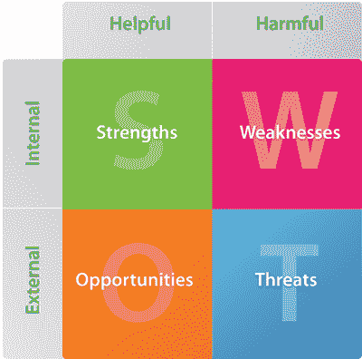

# 成功自由职业者的原则

> 原文：<https://www.sitepoint.com/sample-successful-freelancing/>

你将如何称呼你的企业？你会全职工作还是兼职工作？你将如何布置你的办公室？作为一名自由职业者，你最大的优势是什么？在迈尔斯·伯克的新书《成功自由职业者的原则的样本章节中，我们将了解一些你在开始新的冒险之前需要问和回答的问题。

自由职业最激动人心和最令人期待的阶段发生在所有的计划之后，而我们还没有完全实现它！有很好的理由在我们确切知道我们要去哪里之前踩刹车——一个已经建立了坚实的计划基础的自由职业者比一个没有准备好冒险的自由职业者有更好的生存机会。

在这一章中，我们将走过自由职业道路上的几个选项，我们将通过查看一些基本工具开始计划，我们将建立所有重要的目标和里程碑。

然后，我们会考虑你的交易名称，创建你的创业购物清单，并考虑你的业务结构。我们将通过讨论如何选择供应商以及您是否应该考虑外包任何簿记和额外的法律工作来总结这一切。

##### 决定跳多远

既然你已经决定成为一名自由职业者，我们已经到了短期、中期和长期准备的时候了。如果你和我一样，你会想尽可能快的跑起来。然而，事实一再证明，为了确保最大的成功机会，你应该在计划和准备上花费大量的精力。这就引出了一个问题，你的自由职业生活应该从哪种工作模式开始:全职还是兼职。

如果你是一名即将结束学业的学生，你有明确的时间去努力。(也就是说，我建议，除非你以前经营过企业，否则不要在毕业后直接去做自由职业者——先在你选择的领域工作一段时间，磨练这些技能。)这也适用于你目前的工作即将结束的情况——你可能签订了定期合同，或者你之前工作的公司即将倒闭。然而，对许多人来说，从事自由职业是在全职工作和准备退出激烈竞争之间权衡。

这两种情况各有利弊，你需要仔细权衡。让我们花点时间来看看其中的一些。

***兼职***

自由职业“兼职”有很多好处，至少在开始时是这样的:

*   这是一个测试水域的好方法，不用做太大的跳跃。
*   你可以根据需要在工作之余花尽可能多的时间来规划你的业务。
*   在冒险进入未知领域之前，只要你感觉舒适，你就可以存下以防万一的钱。
*   你可以对你所承担的工作更加挑剔，因为你的工资仍然可以帮助你降低成本。
*   如果你最近没有什么好的作品可以展示，兼职自由职业可以让你在转为全职之前建立一个很好的投资组合。
*   一旦你迈出这一步，你现在培养的客户很可能会和你在一起，帮助你获得即时的现金流。
*   它允许你花时间来装修家庭办公室，而不会超出你的预算。
*   下班后做兼职自由职业者，同时拥有一份全职工作，让你体会到作为自由职业者忙碌一周的真实滋味。这可以帮助你确定自己在任何特定时间处理大量工作的能力。

不过，这种做法也有一些缺点:

*   根据您的雇佣合同，您可能会被限制从事与雇主提供的服务直接竞争的工作。最好去找你的老板讨论这件事。
*   大多数客户会希望在他们的工作时间联系你，这往往是你忙于全职工作的时候。
*   你失去了晚上和周末最重要的休息时间。如果你吸引了很多工作，你可能会因为试图做两份工作而筋疲力尽。
*   鉴于你的工作时间有限，你会小心成长过快。想要让每个人都开心会变得很棘手，为了不让现有客户失望，你可能不得不拒绝新的工作。

***自由职业全职***

双脚并用有一些令人信服的优势:

*   你将有自由建立你的自由职业生活，而不是和一份全职工作周旋。
*   全职创业模式意味着你有足够的时间来建立关系网，进行重要的接触，并会见潜在客户。
*   你的雇主不会因为你兼职做自由职业者而愤愤不平，你会毫不犹豫地尽可能多地接受新客户和新项目。

然而，全职自由职业者也有一些缺点:

*   没有什么比头几周没有工作更让人自我怀疑的了。
*   当你四处奔波建立联系和争取业务时，现金流失真的会伤害你的口袋。
*   当这些项目进来时，最重要的规划往往是第一个受害者——可以理解，你会更有兴趣抓住机会赚一些急需的钱，而不是制定你的法律业务结构。

##### 花时间计划

畅销书作家和商业励志演说家哈维·麦凯说:“失败不是计划失败，而是没有计划”。

如果你打算开始兼职做自由职业者，你应该有时间把所有的计划放在一起，开始存钱以防万一。另一方面，如果你打算直接成为全职自由职业者，请记住，一旦你接手项目，你就会面临迫在眉睫的最后期限。即便如此，也不代表你要忽略规划或者准备。

对大多数人来说，商业规划的概念可能会引起下巴错位的哈欠。然而，更有成效的是，把这当成一个激动人心的时刻，在这个时刻，你开始明白在这条自由职业道路上你真正想去哪里。这个世界真的是你的了——你已经做出了情感承诺，也许你已经有了一些潜在的客户，而且你可能已经在脑海中做了很多这方面的规划工作。花一点时间把这些想法和计划写下来是非常宝贵的，可以作为未来的参考，也是提炼和整理你的想法的一种方式。

许多自由职业者和小企业在最初几年都失败了，专家们普遍认为这种失败的首要原因是因为这些企业很少或没有任何形式的规划。这份规划文件不需要是一本由数字和文字组成的大部头书；它实际上是你一直在思考的总结，写在纸上。

这份文件是你开始列出计划中已知和未知领域的地方，这样你就可以随着时间的推移详细阐述它们。一个好的商业计划是一个不断发展的计划，所以不要认为它是一个在一个小时内完成的琐事，然后卡在桌子的抽屉里被遗忘。

有无数的网站致力于分享他们认为的伟大商业计划的模板和想法。也许商业计划最重要的元素是你积极参与其中。经常检查它，在需要的地方调整和编辑它——尤其是在最初的几个月。

你的计划可能只有几页，也可能有几十页，但除非你有宏伟的计划让投资者或金融机构阅读，否则要避免使用流行词汇和大量无用的数字。这个计划只是给你看的，所以要简明扼要，并且对你的计划的“谁、什么、什么时候和如何”进行诚实的评估。

有许多精心制作的方法来写一份可靠的商业计划，但是让我们从创建一个文本文档开始，从例子 1“商业计划问题”的列表中回答我们可以回答的问题。对于那些你还不知道答案的问题，只需写下问题，提醒自己边写边添加材料。

记住，计划是变化的，所以在这个阶段你的努力可能更多的是水晶球凝视而不是事实。你将扩展这个计划，在你阅读这本书的过程中更详细地填写它，并在自由职业的最初几周和几个月里取得进展。除了这里包含的问题之外，添加其他注释也是很好的——即使它们是粗略的点，注释越多越好！

***打造 SWOT***

规划术语 SWOT 最早出现在 20 世纪 60 年代。SWOT 分析实际上只是一个简单的战略规划方法，有助于评估项目和业务。它基于一个四方形网格，如图 1 所示，“SWOT 网格解释”，其中包括优势，劣势，机会和威胁。我曾多次使用它来帮助我对正在考虑的新产品或服务做出决策，它同样适用于商业模式。

***例 1。商业策划问题***

**总结**

*   最初的概念是什么？
*   你现在的情况是怎样的？
*   你成功的关键因素是什么？
*   你更长远的愿景和目标是什么？

**市场分析**

*   现在的市场是什么样子的？
*   你的目标市场是什么？
*   你的完美客户有什么特点？
*   你的目标客户需要什么？

**竞争概况**

*   你所在的行业是什么样的？
*   竞争对手多吗？
*   谁是你最接近的五个竞争对手？
*   他们提供什么产品或服务？
*   你有哪些独一无二的机会？(你能填补一个空缺或者在某些方面与你的竞争对手不同吗？)
*   有哪些风险和威胁？

**销售和营销**

*   你将如何吸引客户？
*   潜在客户如何找到你？
*   你会考虑什么营销活动？

**行动计划**

*   为了开始工作，你需要做些什么？
*   中期应该怎么做？
*   有哪些较长期的计划？

图一。SWOT 格解释道

开始你自己的 SWOT 分析，列出你所有的优势和劣势——这些可以被认为是内部因素，你可以在一定程度上控制它们。继续尽你所能识别所有的机会和威胁——这些通常是外部力量，比如竞争对手和整个行业。然后，想办法利用你的优势，改进你的弱点，利用你可以利用的机会，抵御威胁。

SWOT 分析当然不需要像听起来那样冗长；我发现一些最有用的 SWOT 分析可以放在一页纸上。举例来说，让我们看看我们自己的雅各布和艾米丽。

Jacob 整理了 SWOT 的开端，如下所示:

<caption>Table 1 – Jacob’s SWOT Analysis</caption> <colgroup><col width="25%"> <col width="25%"> <col width="25%"> <col width="25%"></colgroup> 
| 强项 | 弱点 | 机会 | 威胁 |
| --- | --- | --- | --- |
| 天生的交际者(善于与人交往) | 积蓄不多，而且从来没有经营过企业 | 了解行业，对市场有很好的理解 | 许多自由职业者在附近工作 |
| 奇妙的作品组合 | 不精通代码 | 有许多可能成为潜在客户的联系人 | 提供类似服务的大公司 |

另一方面，艾米丽做了一个更像这样的 SWOT 分析:

<caption>Table 2 – Emily’s SWOT analysis</caption> <colgroup><col width="25%"> <col width="25%"> <col width="25%"> <col width="25%"></colgroup> 
| 强项 | 弱点 | 机会 | 威胁 |
| --- | --- | --- | --- |
| 拥有广泛的技能 | 不太擅长计划 | 她所在地区唯一的网络开发自由职业者 | 其他人成为自由职业者 |
| 非常努力 | 完美主义者；有时完成项目花费的时间比她预期的要多 | 已经有一两个合同了 | 小城市缺乏客户 |

这些示例只有几行，但是您可以轻松地将它们扩展到一页或更多。这个概念确实是一个简洁而有用的方法来建立你的优点和缺点。

***确立目标和里程碑***

所有这些关于商业规划文件和 SWOT 分析的谈话可能会让你头晕，如果你发现自己在匆忙为自己的生意做一个切实的开始时忽略了它们，这是可以原谅的。然而，我强烈建议你花点时间写下一些简单的目标，然后定义一些里程碑。

设定目标有助于将你的数以千计的想法和主意过滤到一个更容易管理的列表中。从体育到商业各个领域的成功人士都一致认为，设定目标是过程中非常重要的一部分。目标可以帮助你定义你的目标，帮助你理解什么对你来说是重要的，激励你取得成就，并建立你的自信。

我发现设定目标最有助于区分什么是重要的，什么是不相关的。这有助于我专注于对我来说真正重要的事情，并给我自由花更少的时间在其他事情上。

许多人在制定目标时，以及在其他项目管理方法中使用 SMART 这个缩写词。SMART 代表:

*   具体:对目标的描述是否精确？
*   你能解释一下你将如何衡量结果吗？
*   不可实现的:通过努力有可能实现吗？
*   你有能力控制结果吗？
*   imely:你的目标有最后期限吗？

SMART 背后的推理认为，模糊的目标几乎是无用的目标。举个例子，假设我需要赢得更多的项目；我可以将目标定义为，“获得更多的网站项目。”当然，这总比什么都没有好，但是如果我把它改成“本季度再赢得五个网站项目”会更鼓舞人心

看出区别了吗？我已经很明确了(我想赢得更多的项目)；我已经是可衡量的了(未来三个月我还想要五个)；我的目标是可以达到的(谁三个月拿不到五个项目？);我的目标很现实(我知道我可以在这段时间内交付五个项目)；而且很及时(有三个月的期限)。

设定一个伟大的目标应该挑战和激励你。如果我把目标缩小到在接下来的两个月里赢得一个项目，我更有可能偷懒。然而，它也需要是现实的，所以在三个月内完成十个项目的一些不可能的期望几乎会导致失败。将自己限制在几个短期和中期目标是一个好主意——写一份你想在死前完成的所有事情的详尽清单是一种肯定会让你失去动力的方法。

***提示:目标设定帮助***
*你可能听说过流行的 Web 2.0 应用， [43 件事](http://www.43things.com/)。这个网站提供了一个在工作中设定目标的很好的例子——试着在 43 件事情上列出你的目标，或者简单地使用文本文件或白板，然后看看你怎么做！*

现在，当我们想到里程碑时，我们通常会想起我们参与的一个大型网络项目。把一个里程碑看作是你实现长期目标的里程碑。

一个典型的里程碑是意识到你在单干一年内的收入超过了你现在的工资。在前进的道路上，你可以设置一些小的里程碑，看看你的进步如何。

第一个里程碑是有能力支付自己足够的生活费用。假设这大约是你今天收入的一半。根据你认为达到这一点需要多长时间来设定一个里程碑——根据你的情况，可能是一个月，也可能是三个月。

现在，让我们考虑一下你的投资回报，最初是收回你过渡到自由职业生活的所有启动成本。当然，这些因人而异，但是你应该知道这需要多长时间。

第三个里程碑是拿回和你现在一样的薪水。这需要六个月，或者九个月，甚至更长时间吗？

写下你的里程碑，并在接下来的几个月里参考它们——你会惊讶地发现你这么快就达到了它们，超越了它们，并发现自己为未来的成功设定了更多的目标！

***策划启动购物清单***

这个大计划阶段的一个重要因素是你需要在之前(或同时！)你开始从事自由职业是为了开始为你头几个月将要面临的一些开销做准备。

现在，我想说不会有任何成本，但这根本不是真的。然而，我可以说，当你在这个阶段只想赚点小钱的时候，货比三家，寻找最佳交易，寻找与供应商交换服务的机会，以及调整你的支出肯定会减轻花钱的痛苦。

有眼前的成本，取决于你目前的情况，然后有你可以推迟一段时间的成本。考虑这些成本的最佳方法是创建一个清单，根据你的当前情况，优先考虑你需要的东西，然后期待价格范围的高端。这样，当这些成本比预期的要低时，这对你的底线是一个额外的奖励。

“必须具备”的成本包括:

*   名片印刷
*   域名注册
*   网站托管
*   电话费用
*   五金器具
*   软件许可
*   法律或许可费用

“应该有的”成本包括:

*   办公室物品保险
*   收入保险或业务连续性保险(如果您能够投保)
*   办公设备(桌子、椅子、灯、文件柜、打印机等)

理想情况下，你应该在必须拥有的同时支付这些费用，但现实是大多数人在自由职业的第一个月无法承受这样的预算打击，所以他们可以稍微推迟。

***提示:节俭抄底！***
*别忘了寻找二手办公家具和设备要便宜得多——你可以通过当地的交易站[易贝](http://ebay.com)或二手家具店找到便宜货。你可以用全新闪亮家具的零头，为自己添置功能齐全的装饰品。*

“值得拥有”的成本包括以下项目:

*   新硬件
*   专用服务器
*   杂志订阅
*   行业协会会员资格

如果你有资金，这些会很好，但是如果情况需要，它们很容易被推迟。

通过良好的规划和对现金流的仔细关注，这些成本不会像现在看起来那样有太大的影响。我们将在下一章更详细地讨论财政问题。

***注:租赁与购买***
*对于您可能需要的任何高投资设备，租赁是一种众所周知的改善现金流的方法，在租赁期内每月支付的金额要少得多。*

虽然最终结果是你要为设备支付比直接购买更多的钱，但是手头有更多现金的好处是一个很好的折衷。您经常会对最终数字的微小差异感到惊讶，并意识到能够在租期结束时交还设备或升级设备的好处。

##### 创建你的品牌:准备工作

我们将在后面的章节中更多地讨论如何打造自己的品牌；然而，当你第一次开始你的自由职业生涯时，仔细考虑你打算使用的公司名称是非常重要的。有两种典型的方法:使用你的个人名字，或者创造一个全新的交易名称。

让我们更详细地看看这些选项。

***用自己的名字***

使用自己的名字是建立个人品牌的绝佳方式。采取这种选择取决于你对未来的愿景——如果你计划在以后雇佣员工，你可能希望避免使用自己的全名，但即使你这样做，仍然有其他选择；比如伯克设计&开发；另一方面，如果你打算继续独角戏，给自己起一个像“XYZ 公司”这样的名字会被认为是误导，因为你的客户很快就会意识到你是一个单干者。

***注:一切皆有可能！***
*许多人一开始从未想过要雇用员工。除非你强烈反对，否则不要排除这种可能性。我曾经无法想象自己会雇佣员工…而在我写这篇文章的时候，我已经有 16 个了！*

这个理论假设你的名字足够独特，容易记忆，而且你的客户很容易读出来。如果你的名字是鲍勃·史密斯，你可能会发现它在商业注册和其他注册中太常见了，比如域名或知识产权。

概括地说，使用个人姓名的好处包括:

*   它会在你周围建立声誉
*   通常更容易回忆起来，因为客户已经知道你的名字
*   如果你打算一个人呆着，这可以避免误导客户
*   它看起来更加个性化，而且(取决于你名字的独特性)可以让你更容易在网上找到

使用自己名字的缺点包括:

*   如果有一天你到了那一步，它会限制你雇佣员工，甚至可能卖掉公司
*   如果你的名字很常见，在搜索引擎上排名会变得更难
*   如果你的名字很少见，可能很难发音

***使用假名***

不管企业结构如何，拥有一个与你的个人姓名无关的企业名称需要考虑很多因素。

一个企业名称，当它在发音上读起来仍然是正确的，这是完美的。辉瑞可能是一个挑战；适马相当明确。不要太聪明地创造疯狂的商业名称——大多数人很快就会后悔不得不接电话时打招呼说“臭鞋子设计”。

将您的主要服务作为名称的一部分也是有意义的，尽管要注意不要太具体。例如，也许你是一名设计师，他的短期计划只是设计网站。你需要考虑将来是否打算扩展到其他形式的设计。当你在推销一个标志设计项目时，有一个像“XYZ 网页设计”这样的名字可能不会帮助你击败你的竞争对手，所以要小心暗示你只能提供一种服务。

一个好的企业名称应该易于回忆、唤起、发音清晰，并且独一无二。你需要注册域名，所以在你的候选名单上运行一个 WHOIS 来排除那些已经注册的域名。不要只考虑你自己的国家扩展-注册尽可能多的扩展(包括顶级域名，。com 和。net)越好。

***警告:意想不到的域名***
*退一步，仔细看看你的域名！已经有不止一家公司想出了一个很棒的商标名，并购买了与之匹配的域名:*

*   *专家交流:expertsexchange.com*
*   治疗师发现者:therapistfinder.com
*   意大利电力公司:powergenitalia.com

为您的企业创建新名称的优势在于:

*   这让你的个人生活和工作生活更加分离。
*   它允许无限选择企业名称。
*   它允许您根据域名的可用性来定制名称。
*   将来更容易推销你的业务或客户群。

使用自定义名称的缺点包括:

*   你需要花费一些精力来获得一个新的名字。
*   你可能很难找到一件让你感到舒适和合身的衣服。
*   这不是一个简单的过程来改变名称。

如果您决定使用一个已创建的名称，首先创建一个选项列表，然后创建一个电子表格。通过 WHOIS 搜索填充第一列，并找到哪些域名仍然可用(包括地理域名和顶级域名)。

<caption>Table 3 – Business domain name matrix</caption> <colgroup><col width="25%"> <col width="25%"> <col width="25%"> <col width="25%"></colgroup> 
| 名字 | 。com | 。网 | 。我们 |
| --- | --- | --- | --- |
| XYZ 设计工厂 | 有空的 | 有空的 | 有空的 |
| XYZ | 拿 | 拿 | 有空的 |
| XYZ 网络工程公司 | 有空的 | 有空的 | 有空的 |

然后，启动你最喜欢的搜索引擎，搜索那些企业名称。结果如何？你不会是第一个走到这一步，却发现另一个产品或企业使用相同名称的初创企业。最好现在就做这项研究，而不是等到名片打印出来之后…也试试可以预测的拼写错误——通常一个公司名称可能只有一个字母不同，所以一定要先检查一下！

第三，查阅你当地的商标数据库，看看是否有你需要注意的商标。甚至非常相似的单词也可能值得避免。

你也应该和一些朋友和同事谈谈。询问他们对你的候选名单中的每个名字的看法，并进一步缩小名单。最好面对面地观察他们的即时反应，而不是通过电子邮件或电话，他们可能会有更长的时间来考虑——你需要他们的直觉反应。

最后，跟着你的直觉走。毕竟是你的创作，你得喜欢。如果经过长时间的自我反省，你还是不满意你的选择，再试一次或者考虑用你自己的名字。

*例二。Bam 创意*
当我考虑自己的企业名称时，我有多种选择。我喜欢将我的名字融入企业形象的想法；然而，我确实想保留我的选择，以防我雇佣员工。

尽管我的名字(Miles Burke)相当不寻常，但 milesburke.com 这个域名当时已经被占用了，无论如何我都不想把它和我紧密地联系在一起。

我的首字母缩写是 MB 或 MAB，我不相信这些真的很突出。然而，当你反转它们时，你最终会得到“砰”的一声，我觉得这是暗示的影响。不过，我知道 Bam 是一个非常流行的词，所以我认为不可能让这些域名单独使用它。

虽然我当时的大部分工作是网站设计和开发，但我偶尔也会参与企业形象设计或咨询项目。我已经决定要坚持创造性的工作，所以我最终选择了 Bam Creative 这个企业名称。

这使得我的公司可以做任何事情，从网站到商标，以及任何可以被广泛认为是创造性的事情，并且仍然名副其实。Bam 这个词太普通了，大多数人都不会联想到它是某人的首字母，当然也不会是某人首字母的反义词！

有趣的是，我确实注册了域名[bam.com.au](http://bam.com.au)，但是我没有机会获得任何顶级域名。com，。net 或者。org)。幸运的是，我得到了 bamcreative 商业名称的完整版本。

##### 考虑到您的业务结构

当你开始创业时，你应该考虑不同业务结构的含义。如果你打算在头几年里雇佣员工，你可能希望成立一个公司。如果你打算继续单干，把一切都设置成独资可能是最好的解决方案。

话虽如此，还是考虑和会计师或者律师谈谈，就你的特殊情况寻求建议。你也可以和当地的商业机构(如 [SCORE](http://www.score.org/) )或协会交流。他们会考虑你目前的个人和财务状况，以及你的司法管辖权。不同企业和公司注册的要求将根据您所在的位置而有所不同。

每种不同的结构都会对你的税收利益、许可和政府成本以及你未来发展业务的能力产生相当大的影响。

有限责任公司(LLC)和独资经营者安排的主要区别在于可能的税收优惠、法律保护、获得融资的能力和您的法律要求的不同水平。

建立有限责任公司结构有利也有弊。优点包括:

*   **更大的法律保护**–如果客户起诉公司，只有公司资产可以被扣押以支付任何判决，而不是你自己的汽车或房子。
*   **获得信贷的能力更强**–许多金融机构和贷款人更倾向于企业融资，而不是个人。
*   **税收优惠**–在某些州和地区，公司比个人享受更多的税收优惠。

当然，这种选择也不是完全没有缺点。有限责任公司的成立需要资金，而且还有与公司相关的费用。此外，财务报告通常比个人报告更复杂。

处于独资企业结构有其合理的好处，主要与成本有关。与有限责任公司相比，大多数情况下的财务报告更少，启动管理成本更低，许可或业务成本也更低。

尽管有缺点，但很容易识别为 LLC 优点的另一面:

*   **零法律保护**——如果客户起诉你，法院可以命令你的资产用于支付任何法律判决。
*   **获得信贷的机会更少**——与有限责任公司相比，独资企业可能更难获得商业贷款。
*   **税收负担**–你可能会比你是一家公司时被征收更多的税。

理想情况下，无论你现在创建什么样的结构，都意味着你不会支付超出所需的费用和成本，同时让你有足够的灵活性来适应业务和发展方向的变化。

不管你是什么结构，为你的自由职业者开一个独立于你个人的银行账户也是一个非常好的主意。通过这种方式，你可以像雇员一样支付自己的工资，并在那平静的几个月里允许企业账户中有一小笔储蓄。

这个账户也将用于支付你所有的运营成本，使你的新企业的簿记方面更容易管理。

与尽可能多的其他自由职业者和小企业主交谈，询问他们如何建立自己的结构——人们很快就会告诉你他们的决定的利弊，这可以在未来的重组中为你节省一大笔钱。

##### 参与协助

在你自己创业的早期，你会想要结盟，为那些你自己不提供的服务或产品选择供应商。

智者的一句话:选择供应商时要非常小心。在客户项目中使用第三方产品或服务类似于对它们的大力支持，所以在做出决定之前考虑你的选择是很重要的。

随着你的自由职业业务的增长，你会发现自己在使用大量的供应商。你会发现你的业务的所有领域都依赖于他们，反过来他们也会从你带给他们的业务中受益。

你需要一个域名注册商、一家托管公司、一家办公文具供应商、一台名片或其他印刷品的打印机，还可能需要一名会计师或律师——或者两者兼而有之。毫无疑问，在这个过程中还会有其他供应商。当然，还有外包的大问题——正如我们将看到的，举个常见的例子，花时间努力满足全面记账的复杂要求是一种虚假的经济。当你把你的时间投入到你擅长的工作中并为你赚钱的时候，会有专家快速而轻松地做这件事。

在自由职业者经常光顾的网络论坛上花上任何时间，你都会不可避免地发现关于自由职业者悲惨故事的讨论线索——自由职业者因为使用他们能找到的最便宜的托管公司而丢失了他们所有的数据，或者让供应商直接联系他们所有的客户，提出降低他们最好的交易。

***注意:吸取的教训***
*不要把备份留给你的主机提供商。定期备份客户网站，以防万一-这可能会在未来拯救你！*

如果你打算转售第三方服务或产品，确保你有一份书面合同，说明什么是可接受的，什么是不可接受的。你最不希望的就是你的托管公司直接去找你的客户群，给他们提供一个很好的条件，把你踢出局。

做一些网上调查，阅读其他自由职业者与你正在考虑的供应商之间的经验。像[虚拟主机论坛](http://www.webhostingtalk.com/)(见经销商论坛)和 [SitePoint 论坛](https://www.sitepoint.com/forums/)(见[虚拟主机论坛](https://www.sitepoint.com/forums/forumdisplay.php?f=96))这样的论坛有大量的帖子，关于哪些主机公司善待他们的经销商，哪些不善待。

同样的方法也适用于你所需要的大多数供应商——有域名注册审查、印刷公司审查，以及大量其他网站和论坛。

一旦你选择了一个供应商，我鼓励你与他们建立一个真正的融洽关系——在危机时刻，或者当你需要做一些事情的时候，与供应商的良好关系可能是一笔财富——现在就做。

***求教***

自由职业生活的一个缺点是独自工作。你身边没有团队，有时你会觉得自己是地球上最后一个人。

当你意识到你可能没有人给你建议时，这一点就更加明显了。当然，你的伴侣或家人可以在一定程度上提供帮助，但他们无法详细回答关于你所选择的职业的问题，除非你的家人精通网络。

查看你的联系人，看看你是否认识能够或愿意担当非正式指导角色的人。当你在社交网站或通讯录中查找你的联系人时，你可能会惊讶地发现谁能帮你一把；人们乐于助人的程度往往更令人惊讶。

寻找有会面的自由职业者或网络行业团体。还有类似于 [Refresh](http://refreshingcities.org) 、 [Port80](http://port-80.net) 、 [BarCamp](http://barcamp.org) 、[网页设计 meetups](http://webdesign.meetup.com/) 等群组，在这里你可以和志同道合的自由职业者打成一片，分享故事，寻求建议。

如果在你的联系人中没有明显的候选人，也没有当地的团体，那么通过论坛和你的扩展网络建立联系，或者甚至考虑建立你自己的团体。其他自由职业者之间的伙伴系统，或者与已经做了几年自由职业或小生意的导师的伙伴系统，可以提供一个无价的共鸣板和信息来源。

***重要:记得玩得开心！***

然而，确保你花时间看看你的成就，你已经跨过的障碍，以及仍然在你面前的令人兴奋的道路。自由职业是一个有回报的职业选择，并且允许一定程度的灵活性，这无疑是你梦寐以求的。

花点时间享受乐趣，经常拍拍自己的背，要知道创业阶段是最难的——随着你沿着这条路走下去，它会变得更容易、更愉快。

***小贴士:提神清单***
*把你最近完成的目标列在一张纸上，贴在你的办公桌旁。在那些黑暗的日子里，当你觉得什么都不管用的时候，读一读清单，重申你迄今为止的进步。*

##### 个案研究

***艾米莉***

在过去的几周里，Emily 大多数晚上都会花几个小时阅读商业规划，并抓住她认为自己在商业管理知识方面的发展领域。艾米丽不仅疯狂地阅读关于这个主题的博客和论坛，还设法在当地图书馆搜寻相关书籍，以便在火车上阅读。

Emily 写了一个计划的外壳，当她做决定时，她将它们添加到这个文件中。虽然她有一些积蓄，但 Emily 正在使用电子表格来记录前三个月会出现的费用，并努力尽快考虑到这些费用。

经过深思熟虑，她已经决定，因为她的大部分工作实际上将来自其他网络公司和自由职业者，她确信她永远不会有任何员工为她工作，她将使用她的名字作为她的交易名称。Emily 有一个朋友是平面设计师，她请他设计她的文具，以换取他的一个客户的一些网站开发工作。

***雅各布***

Jacob 有宏伟的计划，希望在第一年内租一间办公室并雇佣员工。自从和朋友们试了几个名字后，雅各布只剩下两个候选人，他决定花几周时间权衡一下，然后再做决定。

与此同时，他已经调查了几个朋友，了解他们的主机供应商，并已经联系了当地的一家印刷商，准备好了就联系他们。一位同事提出为雅各布的网站做开发，以换取现金。

Jacob 渴望开始告诉他所有的联系人他的计划，但他也知道他需要先提交辞呈，并整理好一切——他担心当他找到一些线索时，他甚至没有准备好名片来交给他们。

##### 摘要

当你为自由职业者的复杂生活做准备的时候，这真是一场旋风，涵盖了这一章所有广泛的主题！开始行动的方法很简单，只要把你的想法记在一份简单的商业计划中，并写下一份未来几个月要努力实现的目标和里程碑的简短列表。

我们讨论了认真考虑命名你的自由职业企业，并准备花一些钱购买一些主食。你还需要考虑你的业务结构；现在做出错误的决定可能会对未来产生长期且可能代价高昂的影响。

我们努力寻找你可以信任的供应商，并考虑了将痛苦的文书工作交给比你做得更好的专业人员的好处，而且可能也更便宜。寻找可以成为你非正式教练或导师的人也是值得的——他们的建议对你来说是无价的。

最后，记得认可自己最近的成绩，玩得开心！

现在谈谈所有企业背后的棘手问题！在下一章，我们将看看棒棒糖、斯邦杜利克、moolah、greenbacks、cash OLA——换句话说，就是钱。

**上钩了？如果你喜欢这一章，你也会喜欢这本书的其余部分。在迈尔斯的新书《成功自由职业者的原则中，你将学会如何开始你的自由职业生涯。今天就抢一个[免费预览](https://www.sitepoint.com/books/freelancer1)！**

## 分享这篇文章