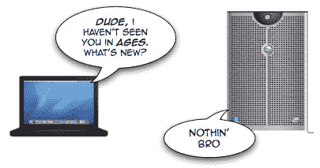
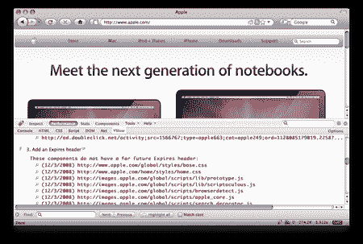

# 节省一些现金:优化您的浏览器缓存

> 原文：<https://www.sitepoint.com/save-cash-optimize-cache/>

优化网页下载时间时，有许多因素需要考虑。然而，一个黄金法则是尽量减少浏览器发出的 HTTP 网络请求的数量。那些 HTTP 请求(和响应)是资源密集型的，所以你的网页使用的越少，你的网页加载的就越快。

在本文中，我们将了解如何利用浏览器缓存来减少 HTTP 请求的数量。我们还将通过限制您的 web 服务器发送的完整响应的数量来降低您的网站的网络带宽要求。老实说，网页优化可能有点枯燥。但是，请继续关注我，您将对客户端缓存有一个深入的了解，并获得一些提高网站性能的实用技巧。我们开始吧！


##### 那么什么是浏览器缓存呢？

网络浏览器将通过网络下载的对象(例如，图像、HTML 文档、样式表)存储在一个名为*浏览器缓存*的特殊区域。缓存的工作方式很简单:当用户导航到一个页面时，web 浏览器将首先检查浏览器缓存是否已经包含该页面的内容。如果缓存中的内容仍然是新的，则不需要再次下载。很简单，对吧？

对您来说可能是新闻的是， [HTTP/1.1 协议](http://www.ietf.org/rfc/rfc2616.txt)-网络上常用的通信协议-允许您指定哪些内容可缓存，以及下载的内容在多长时间内可被浏览器缓存视为新鲜。该信息在 web 服务器返回的**响应头**中指定。响应头是描述被发送的页面(以及发送它的服务器)的文本行。如果你使用火狐浏览器并且安装了 [Live HTTP Headers 扩展](https://addons.mozilla.org/en-US/firefox/addon/3829)，你就可以查看这些信息。

毫不奇怪，响应报头中与高速缓存控制相关的部分被称为**高速缓存控制指令**。

##### 好的，那么我们如何指定可缓存的东西呢？

在服务器响应中使用以下任一标头都会告诉浏览器内容是可缓存的:

```
Cache-Control: max-age=*specify a duration in seconds*
```

或者

`Expires: *a GMT date in the format specified by RFC 1123*`

只需要其中一个，但是如果由于某种原因两个头都出现在服务器响应中，`Cache-Control`头优先于`Expires`头。

*   如果您使用`Cache-Control`头，缓存条目将被认为是新的，直到您指定的持续时间(以秒为单位)过去。
*   另一方面，如果使用`Expires`头，缓存条目被认为是新鲜的，直到过期日期到来。[RFC 1123 标准规定了以下日期时间格式](http://www.hackcraft.net/web/datetime/#rfc822) : `Thu, 01 Jan 2008 13:37:41 GMT`。

要指定近期的到期时间，最好在`Cache-Control`头中使用`max-age`指令，以避免浏览器和服务器之间的时钟同步错误。对于很久以后的到期时间，`Expires`标题是一个更安全的赌注——它对人类来说更可读，更不容易出错。

##### 缓存条目过期时会发生什么？

如果浏览器请求一个在浏览器缓存中但已过期的对象，该对象可能仍然有效。然后，浏览器可以再次检查服务器，查看缓存的条目是否仍然可用。这是通过在请求中包含一个`If-Modified-Since`头来实现的。这被称为*验证*缓存条目。如果浏览器中缓存的条目仍然相同，服务器就没有必要重新发送未更改的条目。如果服务器发现内容已经改变，也就是说，内容不再有效，就会向浏览器返回一个完整的响应或刷新的页面。

条件请求的事件序列示例如下所示:

1.  浏览器导航到一个页面并发出 HTTP 请求。
2.  服务器返回一个成功的响应，在响应中带有`Cache-Control`报头和`Last-Modified`。
3.  浏览器将内容存储在缓存中。
4.  时间流逝；浏览器再次导航到同一页面，发现其缓存中的内容已经过期。
5.  浏览器用一个`If-Modified-Since`缓存验证器向服务器发出一个条件请求。与原始响应的`Last-Modified`报头相同的 GMT 时间(第 2 点。)用在这里的条件请求中。
6.  如果服务器发现内容是相同的，它用状态码 304 响应，表明内容没有被修改。然后，浏览器可以重用缓存的项目，节省下载能量。

使用条件请求时会有一点开销:在浏览器的请求中使用`If-Modified-Since`头，在服务器的响应中使用带有`Last-Modified`头的`Cache-Control`指令。但是当您将这与发送整个响应进行比较时，您会看到网络流量的显著节省。



##### 浏览器什么时候提出条件请求？

在浏览器发出条件请求之前，需要满足两个条件。

首先，资源应该已经在缓存中，即使它可能已经过期。其次，根据 HTTP 1.1 规范的[第 13.3 节，服务器对资源的响应必须有一个缓存验证器，比如`Last-Modified`头。如果这些条件都存在，那么浏览器可能会发出一个条件请求。](https://www.w3.org/Protocols/rfc2616/rfc2616-sec13.html#sec13.3)

##### 怎样才能获得最佳表现？

对于静态组件，比如 CSS、JavaScript 和很少改变的图像，最好使用日期在很远的将来的`Expires`缓存控件头——尽管不要太远！根据 HTTP 1.1 协议，HTTP 服务器不应该发送超过一年的`Expires`报头。

当然，这些静态组件可能会不时更新——例如，如果您进行一些 CSS 修复或上传一些新图像。确保浏览器直接获取更新资源的一种方法是添加静态组件的版本号，就像它是一个 GET 变量一样。只需将版本号放在标记中项目 URL 的末尾。

这里有一个例子。假设一个文档的 HTML 标记引用了样式表的版本 1，我们称之为`special.css`。我们可以在 HTML 文档中引用如下的`special.css`:

```
<head> 

    <link href="special.css?v=1" rel="stylesheet" type="text/css" /> 

</head>
```

以后，当设计发生变化时，相应的 HTML 标记可能是:

```
<head> 

    <link href="special.css?v=2" rel="stylesheet" type="text/css" /> 

</head>
```

浏览器将看到新的 GET 变量，将该文件视为新文件，并下载新的样式表。

对于经常变化的内容，我们应该确保浏览器发出有条件的请求，以便它可以获得最新的内容，但只有当内容发生变化时。为了做到这一点，我们应该在服务器响应中包含`Last Modified`和`Cache-Control: max-age=0, must-revalidate`头。这样，当组件在 HTML 标记中被引用时，浏览器将总是发出条件请求。如果组件未改变，则服务器可以返回具有 **304 未修改**状态的响应，以指示内容未改变，而不是发送完整的响应。

##### 付诸实践

到目前为止，你应该已经掌握了一些技巧，来保证你的访问者在浏览你的站点时获得愉快的体验，同时节省一些网络流量(直接结果是为你自己节省一些钱)。如果你对你网站的性能感到好奇，雅虎的 Firefox 插件 [YSlow](http://developer.yahoo.com/yslow/) 会评估页面上的每个组件，并在各种优化技术上给它打 A 到 F 的分数。



要开始配置你的头，查看一下 [Apache 的 mod_expires](http://httpd.apache.org/docs/2.0/mod/mod_expires.html) 和[IIS content expires](http://www.microsoft.com/technet/prodtechnol/WindowsServer2003/Library/IIS/0fc16fe7-be45-4033-a5aa-d7fda3c993ff.mspx?mfr=true)文档，了解如何在你最喜欢的 web 服务器上进行配置。

现在，走出去，节省一些字节！

## 分享这篇文章