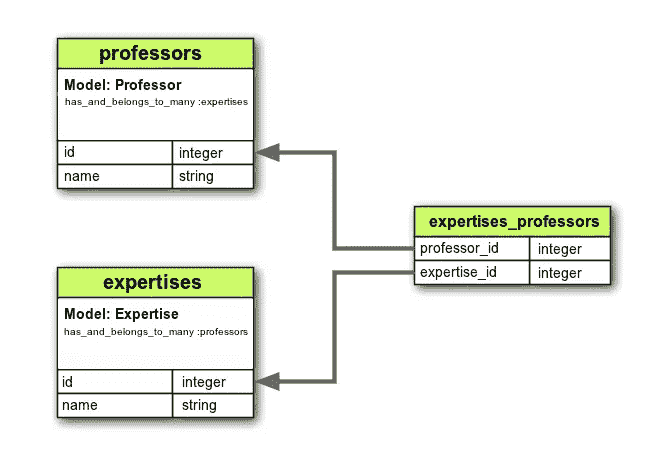

# 如何在 Rails 中将多个复选框值保存到数据库中

> 原文：<https://www.sitepoint.com/save-multiple-checkbox-values-database-rails/>

假设您的 Rails 应用程序中有一个由 ActiveRecord 模型支持的表单。在这个表单中有许多复选框，您希望将它们的值保存到数据库中。你如何着手处理这种情况？

和以往一样，本文的代码可以在我们的 GitHub repo 上找到。

## 反模式

最初的反应可能是在数据库中创建一个字符串列来保存所有的复选框数据。然后，您可以在模型中使用一个`before_save`钩子来构建字符串，并在视图中使用`check_box_tag`助手来显示复选框。

让我们快速看一下这可能是什么样子。为此，我们将创建一个演示应用程序，您可以在其中输入教授的姓名，并选择他们的各个专业领域。

```
rails new cb-demo && cd cb-demo
rails g scaffold professor name:string expertise:string
rake db:migrate 
```

之后，打开`/app/views/professors/_form.html.erb`并更换:

```
<%= f.label :expertise %><br>
<%= f.text_field :expertise %> 
```

使用:

```
<%= label_tag 'expertise_physics', 'Physics' %>
<%= check_box_tag 'professor[expertise][]', 'Physics', checked('Physics'), id: 'expertise_physics' %>

<%= label_tag 'expertise_maths', 'Maths' %>
<%= check_box_tag 'professor[expertise][]', 'Maths', checked('Maths'), id: 'expertise_maths' %> 
```

在`/app/controllers/professors_controller.rb` alter:

```
params.require(:professor).permit(:name, :expertise) 
```

收件人:

```
params.require(:professor).permit(:name, expertise:[]) 
```

然后在`/app/models/professor.rb`中添加:

```
before_save do
  self.expertise.gsub!(/[\[\]\"]/, "") if attribute_present?("expertise")
end 
```

并在`/app/helpers/professors_helper.rb`中添加:

```
def checked(area)
  @professor.expertise.nil? ? false : @professor.expertise.match(area)
end 
```

最后，运行`rails s`并导航到[http://localhost:3000/professors](http://localhost:3000/professors)

如你所见，这很有效。但不幸的是，这就是它的全部功能。以这种方式将复选框数据保存到数据库只会导致以后的问题。例如，随着教授数量和专业领域数量的增长，查找哪些教授与哪些领域相关联的查询将变得非常混乱。

另外，如果你想删除或重命名某个专业领域，该怎么办？在这种情况下，您必须直接操作数据库，这几乎不是一件好事(更不用说耗时且容易出错)。

## 正确的方式

幸运的是，有一个更好的方法来实现这一点——即通过将`Expertise`移动到它自己的模型中，并在`Expertise`和`Professor`之间声明一个`has_and_belongs_to_many`关联。这将在模型之间创建一个直接的多对多的连接(通过一个[连接表](https://en.wikipedia.org/wiki/Junction_table)——一个通过引用每个数据表的主键将两个或多个表映射在一起的数据库表)。

如[所示，导轨状态为](http://guides.rubyonrails.org/association_basics.html#the-has-and-belongs-to-many-association):

> has _ and _ owners _ to _ many 关联创建了与另一个模型的直接多对多连接，没有中间模型。例如，如果您的应用程序包括组件和部件，每个组件有许多部件，每个部件出现在许多组件中，您可以这样声明模型:

您可以这样想象(其中`expertises_professors`是连接表):



连接表没有与之关联的主键或模型，必须手动生成。

为了演示这一点，我们将重新创建与之前相同的小项目:

```
rails new cb-demo-1 && cd cb-demo-1
rails g scaffold professor name:string
rails g scaffold expertise name:string
rails g migration CreateJoinTableExpertiseProfessor expertise professor
rake db:migrate 
```

这将创建必要的模型和数据库表。您可能还会注意到为我们生成连接表的生成器(假设`JoinTable`是名称的一部分)。漂亮吧。

接下来，我们需要在各自的模型中声明关联:

在`/app/models/professor.rb`中添加:

```
has_and_belongs_to_many :expertises 
```

在`/app/models/expertise.rb`中添加:

```
has_and_belongs_to_many :professors 
```

声明`has_and_belongs_to_many`关联让一堆新方法触手可及，比如:`Professor#expertises`、`Professor#expertises.find(id)`、`Professor#expertises<<`、`Professor#expertises.delete`。你可以在 api 文档中读到更多关于这些[的内容。](http://apidock.com/rails/ActiveRecord/Associations/ClassMethods/has_and_belongs_to_many)

之后，我们需要将`/app/controllers/professors_controller.rb`中的`expertise_ids`加入白名单:

```
params.require(:professor).permit(:name, expertise_ids:[]) 
```

最后将以下内容添加到`/app/views/professors/_form.html.erb`:

```
<div class="field">
  <%= f.label "Area of Expertise" %><br />
  <%= f.collection_check_boxes :expertise_ids, Expertise.all, :id, :name do |b| %>
    <div class="collection-check-box">
      <%= b.check_box %>
      <%= b.label %>
    </div>
  <% end %>
</div> 
```

这里我们使用了一个特殊的表单选项助手，它是在 Rails 4 中引入的，叫做 [collection_check_boxes](http://apidock.com/rails/v4.0.2/ActionView/Helpers/FormOptionsHelper/collection_check_boxes) 。它的行为类似于`collection_select`，但是它为集合中的每一项呈现一个复选框和一个标签，而不是一个单一的选择字段。

您还可以通过向它传递一个块来定制输出(就像我们在这里做的那样)。将使用一个特殊的 builder 对象调用该块，该对象本身具有一些特殊的方法。

这就是它的全部内容。如果你启动 WEBrick 并导航到[http://localhost:3000/expertises](http://localhost:3000/expertises)，你将能够输入一些专业领域并将它们保存到数据库中。在那之后，你可以前往[http://localhost:3000/professors](http://localhost:3000/professors)，一切都应该像预期的那样工作——也就是说，你将能够创建教授，并将他们分配到你之前创建的任何专业领域。之后，如果你试着编辑一个教授，你会看到专业领域被保留了下来。

## 每个人都是赢家，宝贝！

通过这种方式，确定哪些教授与哪些专业领域相关联是轻而易举的事情:

```
rails c
e = Expertise.first

e.professors
=> #<ActiveRecord::Associations::CollectionProxy [#<Professor id: 1, name: "Jim", created_at: "2015-08-20 20:04:51", updated_at: "2015-08-20 20:04:51">]>

e.professors.count
=> 1 
```

分类了！

通过我们简单的网络界面，添加、重命名或删除专业领域非常简单。这让我想到了最后一点:如果你删除了一个专业领域，那么你可能不再希望任何教授与它有关联。使用我们最初的方法，这将很难实现，但是使用这种方法，我们需要做的就是在关联上设置`dependent: :destroy`:

在`/app/models/expertise.rb`中添加:

```
has_and_belongs_to_many :professors, dependent: :destroy 
```

现在，如果你删除一个专业领域，没有教授会与它相关联。显然，反过来也是一样的道理。

## 更进一步

为了进一步展示这种方法的灵活性，让我们以一个演示来结束，展示如何使用我们的复选框来过滤数据库搜索结果。为此，我们需要某种搜索功能，为此我们将使用[搜索宝石](https://github.com/activerecord-hackery/ransack)。这个 gem 为处理模型搜索提供了优秀的助手和构建者。要了解更多关于洗劫的信息，请查看:[高级搜索与洗劫](https://www.sitepoint.com/advanced-search-ransack/)

这个演示建立在上一个演示的代码之上。

首先添加搜索到你的 gem 文件:

```
gem 'ransack' 
```

并运行:

```
bundle install 
```

完成后，我们需要修改`ProfessorsController`中的`index`动作，这是我们想要添加搜索功能的地方。我们可以在这里创建一个搜索对象，方法是调用`Professor.search`并传入`q`参数，它将包含用户提交的搜索参数的散列。要获得与我们的搜索匹配的教授，我们只需对这个对象调用`result`。指定`distinct: true`可以避免返回重复的行。

在`/app/controllers/professors_controller.rb`中:

```
def index
  @search = Professor.search(params[:q])
  @professors = @search.result(distinct: true)
end 
```

接下来，我们需要制作搜索表单。sorack 为此提供了一个名为`search_form_for`的表单生成器。就像 Rails `form_for`一样，这个方法使用一个块，我们可以在其中定义我们想要搜索的字段。以`:name_cont`的形式命名文本字段意味着搜索包含输入到该字段中的值的教授。

```
<%= search_form_for @search do |f| %>
  <%= f.label :name_cont, "Name contains" %>
  <%= f.text_field :name_cont %>
<% end %> 
```

接下来，我们需要添加按专业领域过滤的功能:

```
<%= f.label "Area of Expertise" %><br />
<%= f.collection_check_boxes :expertises_id_in_any, Expertise.all, :id, :name do |b| %>
  <div class="collection-check-box">
    <%= b.check_box %>
    <%= b.label %>
  </div>
<% end %> 
```

你可以看到我们再次使用了[collection _ check _ boxes form helper](http://apidock.com/rails/v4.0.2/ActionView/Helpers/FormOptionsHelper/collection_check_boxes)，但是这次我们将`:expertises_id_in_any`作为第二个参数传入。这就是搜搜所说的*谓词*，它将在搜索查询中使用它来确定匹配什么信息。你可以在搜索维基中读到更多关于谓词的内容。

这是完整的表格。将此添加到`/app/views/professors/index.html.erb`:

```
<fieldset class="search-field">
  <legend>Search Our Database</legend>
  <%= search_form_for @search do |f| %>
    <div class="field">
      <%= f.label :name_cont, "Name contains" %>
      <%= f.text_field :name_cont %>
    </div>

    <div class="field">
      <%= f.label "Area of Expertise" %><br />
      <%= f.collection_check_boxes :expertises_id_in_any, Expertise.all, :id, :name do |b| %>
        <div class="collection-check-box">
          <%= b.check_box %>
          <%= b.label %>
        </div>
      <% end %>
    </div>

    <div class="actions"><%= f.submit "Search" %></div>
  <% end %>
</fieldset> 
```

在此过程中，我们还可以修改表格(在同一个文件中),以包含教授的专业领域:

```
<table>
  <thead>
    <tr>
      <th>Name</th>
      <th>Expertises</th>
      <th colspan="3"></th>
    </tr>
  </thead>

  <tbody>
    <% @professors.each do |professor| %>
      <tr>
        <td><%= professor.name %></td>
        <td><%= professor.expertises.map(&:name).sort.join(", ") %></td>
        <td><%= link_to 'Show', professor %></td>
        <td><%= link_to 'Edit', edit_professor_path(professor) %></td>
        <td><%= link_to 'Destroy', professor, method: :delete, data: { confirm: 'Are you sure?' } %></td>
      </tr>
    <% end %>
  </tbody>
</table> 
```

现在，我们可以通过名字搜索教授，并根据他们的专业领域进行筛选。您能想象如果将复选框值存储在数据库的字符串列中会有多复杂吗？

**注意**:有一点需要注意的是，搜索不会为 HABTM 关联上的`_all`查询产生正确的结果。在上面的例子中,`expertises_id_in_all`将返回一个空的结果集(意味着您不能只匹配那些专业领域与您选中的框完全对应的教授)。关于这方面的更多信息，你可以在项目主页上阅读[这个 Stackoverflow 线程](http://stackoverflow.com/questions/11619246/rails-3-1-ransack-habtm)和[这个问题。](https://github.com/activerecord-hackery/ransack/issues/112)

## 结论

至此，我希望我已经展示了如何在 Rails 的数据库中正确地存储复选框值，以及这种方法带来的众多优势。

如果你有任何问题或评论，我很高兴在下面听到它们，别忘了，这篇文章的代码可以在我们的 GitHub repo 上找到。

## 分享这篇文章