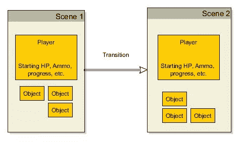
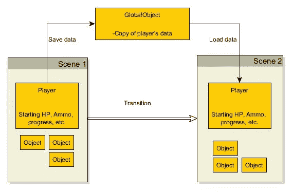
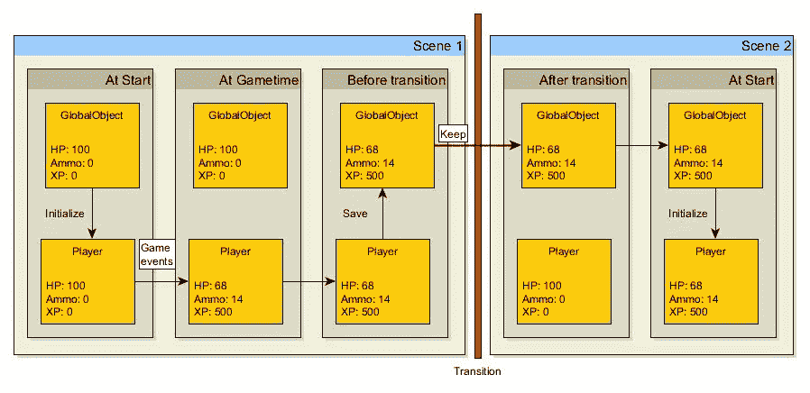

# 在 Unity 中保存场景之间的数据

> 原文：<https://www.sitepoint.com/saving-data-between-scenes-in-unity/>

本教程假设 Unity 引擎的基本知识。如果没有自己的项目设置，可以自由抓取此处链接的项目实例。您还可以在本文末尾找到完整项目的下载。

如果你正在努力保存两个场景之间的数据，这是给你的教程。


* * *

## 出发点

下载示例项目:

[【GitHub 资源库链接】](https://github.com/Eudaimonium/SitepointExample_SavingData/tree/411fba957b02011b2690c5b3b0521d109486677c)
[【ZIP 下载】](https://github.com/Eudaimonium/SitepointExample_SavingData/archive/411fba957b02011b2690c5b3b0521d109486677c.zip)

## 逻辑

Unity 是一个游戏引擎，有自己的哲学。尽管有相当多的选择，但它处理任何游戏的构建模块的方式都是独一无二的——游戏对象、场景、代码、场景图。我说的独特是指理解它有多容易。

如果你因为 Unity 可以免费下载而试运行过它，你可能已经了解了它的脚本是如何实现的。用 C#、JavaScript(或 Unity 5 以后的 UnityScript)或 Boo 语言编写的“脚本”是附加到任何游戏对象的组件。在脚本中，您可以自由地访问和操纵脚本附加到的对象或任何链接的对象。它非常直观，易于使用，构建起来也很有趣。

据说，然后你试图建立第二层；假设你的第一层是房子的内部，然后你的第二层是房子的外部。*转场*是用门加载下一个场景。

这是我们今天要解决的核心问题。Unity 引擎中的每个级别称为一个“场景”。您可以使用图形编辑器随意编辑场景。你可以使用一行代码来转换场景(这可能是由玩家触摸门或者使用一个物体等触发的)。每个场景都有对象，这些对象有“组件”。



一般的“对象”代表构成你的级别的任何其他东西(网格、触发器、粒子等)

每个场景都是在其初始状态下构建的。将场景转换到另一个场景意味着新场景将在其初始状态下加载(自然)。但是玩家的统计数据呢，比如他的弹药数量，或者经验，或者库存？

当我们只能在“脚本”(游戏对象的组成部分)中编写代码，而这些代码在场景转换过程中会被破坏时，我们如何保存数据呢？

这就是我们变得有点狡猾的地方。有一种方法可以通过场景转换来保存游戏对象，有效地构建一个**游戏范围的**对象，而不是一个场景范围的对象，它将保存我们的数据。

下面是使用这样一个对象的游戏的基本工作流程:



我们需要保存数据，转换场景，然后加载数据。

下面是我们将使用的逻辑的基本分类:

*   不管我们在哪个场景(哪怕是场景 1)，先用起始数据初始化播放器。
*   然后，从全局对象复制数据。

全局对象初始化逻辑:

*   用起始数据初始化，并通过场景转换保存我们的实例。

这个流程的作用是确保场景 1 总是用起始数据初始化播放器。然后，如果您在任何场景转换之前将数据保存到全局对象中，您就确保了该数据将总是被加载到下一个级别的玩家对象中。

这假设你已经在每个场景中放置了相同的玩家对象(最好是一个预设的对象)。请注意,“玩家对象的初始化逻辑”适用于任何需要“通过场景保存”的幻觉的对象；我们只用播放器作为最明显的例子。

## 代码

好了，图表和抽象思维到此为止。让我们开始编码吧。

我假设到目前为止，你已经有了两个场景，以及在它们之间转换的实现——参考本文顶部的起始项目。你在两个游戏中都扮演同一个玩家角色，你只需要保存他们之间的玩家数据，就能产生同一个“玩家对象”的错觉。

让我们首先创建游戏范围的全局对象。重要的是我们要把这个做好，所以让我们弄清楚我们需要它做什么:

*   我们需要能够从任何其他脚本，从游戏的任何部分访问它。一个合理的选择是单体设计概念。如果你不知道那是什么，很好，你将会学到一些新的东西。
*   我们需要它只被初始化一次，并通过场景转换继续。
*   我们需要它来保存我们可能需要结转的任何数据。我们知道需要保存的变量，所以我们只需输入它们。

首先，转到第一个场景，创建一个新的空游戏对象。将其重命名为合适的名称，如“游戏大师”或“全球对象”。

接下来，创建一个新的 C#脚本(最好在一个新的文件夹中——记住要保持有序)。给它一个合适的名字。我的脚本的名字是“全球控制”。

将新的空 C#脚本附加到新的游戏对象，并在您选择的编辑器中打开脚本。Unity 自带的 MonoDevelop 不错，但是也可以用 Visual Studio。

将此代码放入 GlobalControl 脚本中:

```
public class GlobalControl : MonoBehaviour 
{
    public static GlobalControl Instance;

    void Awake ()   
       {
        if (Instance == null)
        {
            DontDestroyOnLoad(gameObject);
            Instance = this;
        }
        else if (Instance != this)
        {
            Destroy (gameObject);
        }
      }
}
```

单体设计模式的基本前提是一个类只有一个公共静态实例。在 awake 方法(当对象应该被加载时调用的方法)中，我们通过说“如果有另一个实例，销毁那个实例并确保该实例是这个实例”来确保这一点。

注意在`Awake`方法中一个非常特殊的函数调用，“不要在加载时销毁”。这是我们解决跨场景持续问题的一部分。这将保持游戏对象这个脚本是活着的，并把它带到其他场景。单体概念的其余部分确保了如果有附加了相同脚本的对象的另一个副本(将会有，您需要将该对象放入每个场景)，那么另一个对象将被销毁，而这个(原始的)对象将被保存。

如果你愿意，你现在可以测试这个。将 GameMaster 或 GlobalObject(或任何携带这个脚本的东西)放入你拥有的每个场景中，并尝试在运行时转换场景。您会注意到，在任何给定的时间，场景中只有一个这样的全局对象。

如果我们现在向其中写入数据，它将被保存！

现在，进入问题的另一部分:我们需要保存什么？

出于本教程的目的，假设你的玩家有三个统计数据:

*   **HP** ，起始值 100，
*   **弹药**，起始值为 0，
*   **XP** ，起始值为 0。

这些被保存在你的*玩家*对象中的某个地方。具体是哪个剧本，并不重要。我们还需要在我们的 GlobalObject 中有相同的变量，所以将它们添加到您的代码中:

```
public class GlobalControl : MonoBehaviour 
{
//[...]
    public float HP;
    public float Ammo;
    public float XP;
//[...]
```

现在我们准备保存数据。我们只需要在转换场景时保存数据，在开始场景时加载数据。

以下是如何从保存玩家变量的脚本中保存数据:

```
public class PlayerState : MonoBehaviour 
{
//[...]

    public float HP;
    public float Ammo;
    public float XP;

//[...]

//Save data to global control 
    public void SavePlayer()
    {
        GlobalControl.Instance.HP = HP;
        GlobalControl.Instance.Ammo = Ammo;
        GlobalControl.Instance.XP = XP;
        }
//[...]
```

明智的做法是构建一个专用函数来将玩家数据保存到实例中。现在只差一步了:从全局控件加载。您可以在玩家状态脚本的启动函数中轻松调用它:

```
public class PlayerState : MonoBehaviour 
{
//[...]

    public float HP;
    public float Ammo;
    public float XP;

//[...]

    //At start, load data from GlobalControl.
    void Start () 
    {   
        HP = GlobalControl.Instance.HP;
        Ammo = GlobalControl.Instance.Ammo;
        XP = GlobalControl.Instance.XP;
    }
//[...]
```

有了这段代码，我们的数据流看起来会像这样:



普遍来说，这适用于每一个场景转换。即使从场景 2 过渡回场景 1，现在也会保留玩家的统计数据！

当然，还有一些问题需要解决。例如，如果你退出到主菜单并开始一个新游戏(没有完全退出游戏)，你需要重置保存的数据，否则你将从上一个会话开始一个新游戏的玩家统计数据！

#### 为什么不是公共静态类？

此时，如果你熟悉 C#和。NET 编程，你可能会想为什么我们不简单地使用这样的东西:

```
public static class GlobalObject
```

与你直觉上的想法相反，公共静态类*实际上并不*在整个游戏中持续存在。因为任何类(也就是说，任何脚本)都被附加到一个游戏对象上，所以当你加载一个新的场景时，它会被销毁。即使另一个场景中有一个新的公共静态类，其中的数据也将被重置，也就是说，静态类将在场景加载时重新初始化。

这就是为什么我们必须使用 DontDestroyOnLoad 方法，以及多一点代码来确保我们只有一个希望跨级别传递的类实例。

## 打磨和准备下一个教程

您可能已经注意到，在这个示例中，手动将三个所需的值输入到 GlobalData 并返回并不难。但是，如果我们有一个更大、更复杂的游戏，有几十个、甚至几百个玩家变量需要跟踪，那该怎么办呢？

下面，我们将润色我们的代码，不仅是为了更漂亮，还为了提供我们将在后续教程中解释的附加功能，以及处理保存和加载机制。

首先，让我们在项目中创建新的脚本。这将是一个有点不同类型的脚本，因为它不会扩展 MonoBehavior 类，也不会附加到任何对象。

我们称之为“可序列化的”,它看起来像这样:

```
using UnityEngine;
using System.Collections;
using System;
using System.Collections.Generic;

public class PlayerStatistics
{
    public float HP;
    public float Ammo;
    public float XP;
}
```

如您所见，没有函数，没有名称空间，只有一个没有构造函数的类，包含我们已知的三个变量。我们为什么要这么做？

因此，在我们的全局对象中，我们可以将单个统计数据转换为单个类来包含它们:

```
public class GlobalControl : MonoBehaviour 
{
//[...]
    public float HP;
    public float Ammo;
    public float XP;
//[...]
```

…像这样:

```
public class GlobalControl : MonoBehaviour 
{
//[...]
    public PlayerStatistics savedPlayerData = new PlayerStatistics();
//[...]
```

玩家的变量也是如此:

```
public class PlayerState : MonoBehaviour 
{
//[...]

    public float HP;
    public float Ammo;
    public float XP;

//[...]
```

这为我们增加了一层安全保障。我们不能不小心把玩家变量错写到保存的变量里(比如 XP = HP):

```
public class PlayerState : MonoBehaviour 
{
//[...]
    public PlayerStatistics localPlayerData = new PlayerStatistics();
//[...]
```

现在，当我们想要保存数据时，我们只需删除它:

```
//Save data to global control 
    public void SavePlayer()
    {
        GlobalControl.Instance.HP = HP;
        GlobalControl.Instance.Ammo = Ammo;
        GlobalControl.Instance.XP = XP;
    }
```

…相反，将引用复制到包含我们数据的类。里面的所有值都将保留在它们应该在的地方:

```
//Save data to global control 
    public void SavePlayer()
    {
                GlobalControl.Instance.savedPlayerData = localPlayerData;        
    }
```

在播放器的开始功能中加载播放器数据也是一样的！

现在，我们将所有玩家的统计数据放在一个类中，该类只表示玩家的数据，没有任何额外的内容。在你的游戏开发过程中，当你需要保存和加载更多的玩家变量时，只需将它们添加到类中——玩家数据的保存和检索保持不变。

## 结论

在下一篇文章中，我们将通过使用序列化将整个类(不仅仅是一个全局对象)保存和加载到硬盘上。

如果您在任何时候遇到困难，或者只是想看看完成的项目是什么样子，您可以在这里下载:

[【GitHub 资源库】](https://github.com/Eudaimonium/SitepointExample_SavingData/tree/57e166c65e0d435db7fbc7d79bab078b829b402e)
[【ZIP 下载】](https://github.com/Eudaimonium/SitepointExample_SavingData/archive/57e166c65e0d435db7fbc7d79bab078b829b402e.zip)

有问题吗？评论？在下面的区域让我们知道！

* * *

## 分享这篇文章