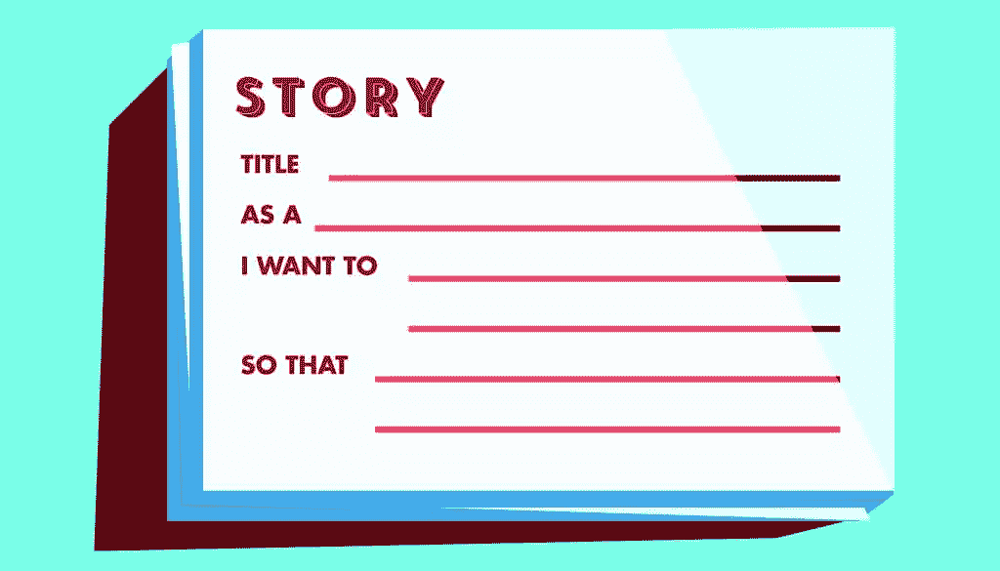

# Scrum 工件:故事

> 原文：<https://www.sitepoint.com/scrum-artifacts/>

以下是摘自我们的书《Scrum:新手到忍者，作者是 M. David Green。世界各地的商店都有出售，或者你可以在这里买到电子书。

**工件** 是 scrum 的工具，允许团队管理他们的 scrum 过程。他们帮助团队成员交流他们正在做的工作，并提供团队同意做什么和他们已经完成什么的记录。任何人都可以指向 scrum 团队的工件，向人们展示他们正在做什么，他们已经完成了什么，以及他们期望能够实现什么。

作为 scrum 工作过程的一部分，有许多工件可以帮助团队准备和管理。熟悉 scrum 语言意味着理解每个工件的用途，以及如何使用它。在这一章中，我们将回顾一些最常见的 scrum 工件，比如:

*   故事

*   产品积压

*   冲刺积压

*   scrum 板

*   “完成”的定义

*   速度图表

*   燃尽图

*   产品增量

不同的团队有不同的方法来创建和维护他们所使用的工件，但是对于 web 和移动开发，有些方法是值得记住的。

## 工件概述

尽管正式的 scrum 并不知道过程的工件到底是如何被使用的，我们将会介绍一些构建和维护工件的方法，这些方法对于 web 和移动团队所从事的工作类型是有用的。

用于 web 和移动工作的 scrum 的最基本的工件之一是描述要处理的特性的故事。故事是在积压工作中开发和管理的。为产品所有者维护单独的积压工作，以跟踪产品的整体愿景，并为团队参与当前正在进行的 sprint 维护单独的积压工作。两个 backlog 都描述了需要发生什么来推进产品，但是产品 backlog 上的项目看起来不像 sprint backlog 上的故事。Scrum 团队使用 scrum 板来跟踪 sprint 中故事的进展，我们将讨论这些是如何一起工作的。

Scum 还提供了许多收集统计数据的工具，这些工具有助于跟踪团队的表现，并向 scrum 团队内外的人传达产品开发的进展。其中，我们将涵盖跨越多个冲刺阶段的速度图，以及跟踪单个冲刺阶段进度的燃尽图。

败类团队会发现的其他有用的工件包括产品所有者和团队在 scrum master 的监督下同意的 done 的定义，以及实际的产品增量，或者产品在 sprint 结束时的当前状态。

## 故事

**故事** 是产品负责人如何向开发团队传达需要开发的内容。故事在产品待办事项列表中孵化，然后以标准格式表达，这样它们可以作为 sprint 计划会议的一部分提交给团队进行评估、估计，然后包含在 sprint 待办事项列表中。

### 注意:使用故事的起源

使用一个故事来封装工作的离散部分的概念来自于[极限编程(XP)](http://www.exremeprogramming.org) ，这是敏捷的一个专门变体，倡导许多优秀的开发实践，如结对编程和编写专题故事。当使用 scrum 进行 web 和移动开发时，故事非常方便，在这种情况下，从后端到前端，整个功能的工作通常包括许多相同的组件。团队经常会看到具有相同组成部分的故事，将一个故事与团队以前处理过的其他故事进行比较，可以使新的故事更容易分解和相对评估。出于这个原因，对于我们正在讨论的工作类型，我们将把故事视为 scrum 的一个基本工件。

一个故事应该包含完整的功能。每个故事都应该是独立的，这样开发人员就不必在完成一个故事后再开始另一个故事。一个故事应该是一个功能的一小部分，可以在一个 sprint 的过程中完成。

故事有助于捕捉特性的本质，并给予团队以有意义和相对的方式讨论参数和接受标准的能力。通过围绕团队在 sprint 中能完成什么来确定特征故事的大小来评估工作是一个有用的练习。

每一个故事都应该增加产品的价值，并使其更接近产品所有者的愿景。每个故事都应该明确产品负责人将如何测试最终产品，以验证故事已经完成。

### 注意:故事不是技术规范

尽管具有工程或产品管理背景的新产品所有者有时倾向于解决所有的技术问题，并提出静态的解决方案，为每个功能提供完整的详细规范，但重要的是要记住 scrum 故事不是技术规范。它们是在产品所有者和工程师之间展开讨论的机会，讨论如何实现一个特性，以及需要付出多少努力。这也是故事遵循简短一致的格式的原因之一。它削弱了包含更详细规范的诱惑。

撰写故事的责任属于产品负责人。编写能够抓住客户全部意图和期望的故事是一项可能需要时间来培养的技能，但是它对于有效的 scrum 过程是至关重要的。一个好的 scrum 大师应该能够帮助指导产品负责人如何写大小合适的故事，表达适当的接受标准，并开启对话而不是关闭对话。

有一个简单的公式非常适合写故事。多年来，人们已经尝试了许多变化。通过迭代和反思，不同的团队可能最终会发展出适合他们的不同方法，但是这是一个很好的起点:

名称: *简单易懂的特征名称*

*   作为 *类型的用户*

*   我要 *行为*

*   从而使 *行为正当化*

验收标准:

*   给出了 *定义的状态*

*   当一组 *条件或事件*

*   然后是 *一致且可测试的结果*

### 注:什么是好故事？

一个好的故事简短明了。许多 scrum 团队遵循这样的惯例，一个故事应该可以写在一张 3 英寸乘 5 英寸的索引卡的一面，验收标准写在同一张卡片的背面。如果写下故事需要更多的信息，说明可能太详细，或者故事可能太复杂，可能需要分解成多个故事。

例如，考虑一个开发图库应用程序的团队。画廊的访问者可能希望对正在显示的图像进行评级，这样他们就可以跟踪他们最喜欢的图像。画廊可以在有或没有评级功能的情况下运行，因此作品可以作为完整的功能片段进行隔离。根据工程师的说法，添加评级小部件的工作可以在一次冲刺中完成。

这就是如何编写一个故事，以便团队可以评估它，估计它，并在 sprint backlog 中提交它:

名称:评级库图像

*   作为画廊的观众

*   我想评价这些图像

*   这样我就可以跟踪和排列我评价过的图片

验收标准:

*   假设登录的用户正在查看图库

*   当用户点击图像评级窗口小部件中的星时

*   那么该星的值应该被记录为该用户对该图像的评级

和

*   假设登录的用户正在查看图库

*   当显示用户已经评级的图像时

*   那么评级小部件应该反映用户先前输入的评级

和

*   假设登录的用户正在查看图库

*   当“收藏夹”开关被打开时

*   然后，只有图像的用户已经评级应显示，在评级降序排列

对于这样的一个故事，团队可能有一个标准，关于线框或设计如何附加到故事和交流。例如，如果这是一个新的小部件，设计者可能已经准备了一个模型和一组工程师实现该特性所需的资产。还可能有需要更新相关信息的产品风格指南或其他文档。

这个故事与工程决策无关，比如 API 是如何设计的，或者代码中使用了什么命名约定。虽然对团队来说“完成”的定义可能包括需要创建这样的技术方面的文档，但是产品负责人展示的故事通常不需要在这些方面有自己的观点。

当一个故事在 sprint planning 中呈现时，工程师应该验证他们需要的所有必要的资产和信息都已经被捕获并且是可用的。在即将到来的 sprint 中要做的实际工作是由故事卡上的描述和它激发的产品负责人和团队之间的对话来定义的。

## 分享这篇文章