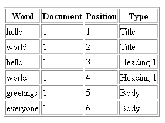
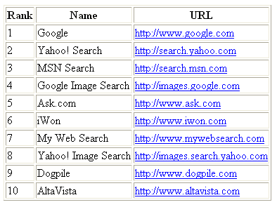
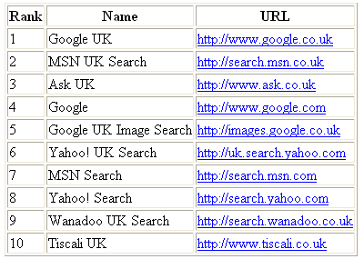
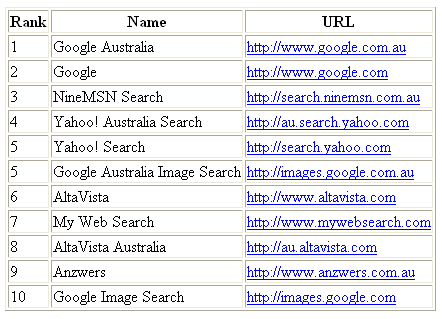
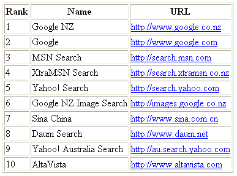
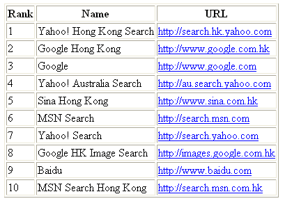
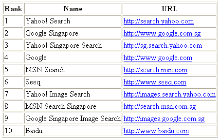

# 搜索引擎营销套件-第 1 章

> 原文：<https://www.sitepoint.com/search-engine-marketing-kit/>

每天，数百万人打开他们的电脑，在网上寻找信息。而且，更多的时候，他们使用搜索引擎来查找信息。据估计，每天有超过 3.5 亿次英语网络搜索！

***搜索引擎营销工具包***

本文是 SitePoint 的 [*搜索引擎营销套件*](https://www.sitepoint.com/books/sem1/) 的一部分。

该工具包包括 300 页的前沿见解，战略，研究和战术，以帮助网站所有者和开发者在搜索游戏中取得领先。光盘提供了易于使用的工具，帮助您简化 SEM 策略。每个工具包都带有价值 150 美元的广告积分，用于三个主要的 PPC 播放器:Google Adwords、Overture 和 Findwhat。

该套件的八个详细章节都相当深入，解释了基本关键字策略，链接建设和页面优化，搜索引擎友好设计问题，搜索营销策略，避免搜索引擎垃圾邮件和其他秘密技术，按点击付费和其他付费包含服务等主题的复杂性。

该工具包还包括对顶级行业专家的坦诚采访，以及提供优质资源信息的参考资料(在线和离线)，供搜索引擎营销人员使用。该工具包附带的光盘提供了一系列工具，这些工具对于严肃的搜索营销人员或 SEM 服务提供商来说是无价的，从关键词排名工具到商业文档。谷歌 Adwords、Overture 和 FindWhat 广告积分将帮助初学者入门，并给那些已经在游戏中的人更多一点的操作空间。

显然，这一章只提供了工具包中所有可用信息的一个快照。如果你想离线阅读这些信息，请随意[下载 PDF 格式的第一章](https://www.sitepoint.com/show-modal-popup-after-time-delay/)。

你准备好迈出搜索引擎营销成功的第一步了吗？我们开始吧！

##### 第 1 章-了解搜索引擎

在这一章，我将提供搜索引擎的简史，解释搜索门户的不同组成部分，以及人们如何使用它们。我们将深入主要爬行搜索引擎的内部工作原理。最后，我们将总结今天的搜索引擎前景，以及对搜索引擎技术未来的一些想法。

你可能很想跳过这一章直接去了解细节，但是，相信我:这是必读的。如果你想在现在和将来做出成功的搜索引擎营销决策，了解搜索结果的来源、搜索引擎的工作方式以及行业的发展方向是必不可少的。

注意:在搜索引擎优化行业，业余爱好者和专业人士之间的一个关键区别是，专业人士真正理解系统是如何工作的，以及为什么。一个业余爱好者可能会学习调整一个页面的内容，称之为“优化”，但一个专业人士能够解释他们每一个行动背后的基本原理，并适应不断变化的行业条件，而不从根本上改变他们的方法。

##### 搜索引擎的简史

1990 年 11 月，随着位于瑞士的欧洲粒子物理研究所的第一台网络服务器(和网页)的推出，万维网诞生了。毫不奇怪，第一个网页的目的是描述万维网项目。当时，不需要搜索引擎——你可以在不到一个小时的时间内阅读万维网的全部内容。

到 1993 年初，网络爆炸的舞台已经搭好。当年 2 月，NCSA Mosaic 图形浏览器的第一个(alpha)版本提供了一个客户端应用程序，到年底，该应用程序可在所有主要的桌面计算平台上使用。基于 Mosaic 的网景浏览器于 1994 年发布。此时，拨号上网已经变得很容易获得，而且很便宜。网络正在起飞！

##### 网络搜索的早期

尽管廉价的拨号上网和马赛克浏览器的结合使网络变得半流行，但仍然没有办法搜索网上越来越多的超文本文档。大多数网页基本上是链接的集合，网络用户的一个流行消遣是共享他们的书签文件。

这并不是说没有尝试给迅速增长的混乱带来秩序。第一个自动网络爬虫或机器人是由麻省理工学院学生马修·格雷创造的万维网漫游者。这个爬虫除了收集 URL 之外什么也没做，并且在很大程度上被 Web 服务器的操作者视为麻烦。Martjin Koster 在 1993 年末创建了第一个网络目录 ALIWeb，但是它和漫游者一样，只获得了有限的成功。

1993 年 2 月，六名斯坦福大学的研究生开始从事一项名为 Architext 的研究项目，利用词的关系来搜索文献集。到那年中期，他们的软件已经可以进行网站搜索了。到 1993 年底，更多的机器人出现在舞台上，但直到 1994 年初，搜索才真正发挥作用。

##### 搜索引擎大爆炸

1994 年是网络搜索历史上的重要一年。第一个分层目录 Galaxy 于 1 月推出，4 月，斯坦福大学的学生 David Filo 和 Jerry Yang 创建了另一个分层的多管闲事的 Oracle，更广为人知的名称是 Yahoo！。

同月，华盛顿大学的布莱恩·平克顿发布了网络爬虫。这是第一个真正的网络搜索引擎，索引了网页的全部内容，而以前的爬虫只索引了页面标题和 URL。Lycos 在几个月后推出。

到 1995 年底，将近 12 个主要的搜索引擎已经上线。像 MetaCrawler(第一个元搜索引擎)、Magellan、Infoseek 和 Excite(脱胎于 Architext project)这样的名字在这一年中被发布到网络空间。AltaVista 于去年 12 月推出，带来了惊人的大型数据库和许多高级功能，Inktomi 于次年首次亮相。

在接下来的几年里，每隔几个月就会有新的搜索引擎出现，但其中许多搜索引擎与它们的竞争对手只略有不同。然而，偶尔的便利创新会找到实际应用的方法。以下是当时一些最成功的想法:

*   GoTo(现在的 Overture)在 1997 年引入了点击付费(PPC)列表的概念。GoTo 没有根据一些晦涩难懂的公式对网站进行排名，而是允许对关键词进行公开竞价，最高出价者将获得最高位置。所有主要的搜索门户网站现在都依赖 PPC 列表来获得大部分收入。
*   元搜索引擎结合了其他几个搜索引擎的结果，由于点击付费系统的兴起和主要搜索引擎之间结果的不一致性，元搜索引擎一度激增。今天，新的元搜索引擎很少出现，但是那些仍然存在的拥有忠实的追随者。当前的元搜索引擎大多显示点击付费列表。
*   这家矿业公司(现在大约)于 1997 年 2 月推出，利用人类专家创建了一个更具排他性的目录。许多特定主题的(垂直)目录和资源站点已经被创建，但是 About 仍然是一个领先的资源。
*   DirectHit 在 1998 年引入了用户反馈的概念，给那些列表被用户点击的网站分配一个较高的排名。DirectHit 的数据在很长一段时间内影响了许多门户网站的搜索结果，但是，由于系统容易受到操纵，今天没有一个搜索门户网站公开使用这种形式的反馈。DirectHit 后来被 Ask Jeeves(现在的 Ask)收购，用户行为很可能被纳入我们今天看到的 Ask/Teoma 搜索结果中。
*   随着搜索引擎和目录寻求利用他们的编辑列表的价值，付费播放被引入。LookSmart 和雅虎！目录开始对商业网站的审核和收录收费。Inktomi 推出了“付费收录”和“可信订阅源”，允许网站所有者确保他们的收录(根据编辑标准)在 Inktomi 搜索引擎中。
*   随着 AltaVista 和其他搜索引擎将“链接流行度”添加到它们的排名算法中，对页面之间链接关系的检查开始认真起来。在斯坦福大学，一个研究项目创造了 Backrub 搜索引擎，它采用了一种新颖的方法对网页进行排序。

##### 谷歌占主导地位，领域缩小

Backrub 搜索引擎最终以谷歌的名字进入了公众的视野。当这个搜索引擎在 1998 年 9 月以谷歌的名字正式推出时，它已经成为一个非常受欢迎的玩家。

从那时起，搜索引擎的发展受到了谷歌崛起的巨大影响。与其他任何搜索门户相比，谷歌更注重用户体验和搜索结果的质量。甚至在推出之初，谷歌就为用户提供了几项重大改进，其中一些与提供的搜索结果毫无关系。

谷歌最吸引人的一个方面是其超简单的用户界面。谷歌主页上明显没有广告——在一个主要参与者通常用多个横幅装饰其页面的市场上，这是一个很大的优势——即使在慢速拨号连接下，门户网站也只需几秒钟就能加载。用户可以选择正常搜索，但第二个选项名为“我感觉很幸运”，直接将用户带到搜索结果中排名靠前的页面。

像它的主页一样，谷歌的搜索结果很快就出现了，而且没有广告。当谷歌在 2000 年末开始通过 AdWords 服务展示一些付费列表时，用户并不介意:谷歌已经成功地确立了自己作为领先搜索门户的地位，而且与许多其他搜索引擎不同，它没有试图在常规网络搜索结果中隐藏付费广告。

许多其他搜索门户认识到了谷歌搜索结果的优越性，以及质量带来的忠诚度。美国在线和雅虎！安排在他们自己的页面上显示谷歌的搜索结果，许多小的搜索门户也是如此。到 2003 年底，据估计四分之三的网络搜索返回了谷歌搜索结果。

几年之内，谷歌在 2003 年实现的近乎垄断的地位将被公认为一个高水位标志，但这一搜索引擎的发展绝不是终结。

2001-2003 年见证了一系列的收购，这些收购迅速将搜索行业整合为少数几个主要的参与者。雅虎！2003 年 3 月收购 Inktomi 搜索引擎；Overture 一个月后收购了 AltaVista 和 AllTheWeb 雅虎！2003 年 8 月宣布收购 Overture。

2004 年，一种新的权力平衡形成了:

*   雅虎！发布了自己的搜索引擎，融合了 AltaVista、Inktomi 和他们在 2003 年收购的所有网络技术。雅虎！2004 年 1 月停止返回谷歌搜索结果。
*   谷歌的 AdWords 和 AdSense 系统分别向搜索门户和网站提供点击付费列表，增长迅速。谷歌申请了首次公开募股(IPO)。
*   由创新的 Teoma 搜索引擎驱动的 Ask 搜索门户的受欢迎程度稳步上升。像大多数门户网站一样，雅虎！不拥有，Ask 使用谷歌的 AdWords 进行付费列表。
*   800 磅重的计算机界巨擘微软宣布了自己的搜索引擎计划，于 2004 年 1 月和 6 月发布了供公众使用的测试版，并于 2005 年 2 月正式推出这项服务。微软现在在 MSN 门户上提供 MSN 搜索结果。

这是足够的历史了。在这一章的稍后部分，我们将更仔细地看一下当前的搜索引擎格局，那时我将向你介绍主要的参与者，并解释所有这些将如何影响你的搜索引擎策略。
剖析网络搜索门户

今天，我们所说的搜索引擎通常是一个复杂得多的网络搜索门户。搜索门户是为需要在 Web 上查找信息的用户设计的起点。在搜索门户上，单个站点提供许多不同的搜索选项和服务:

*   AOL 的用户界面为用户提供了各种各样的服务，包括电子邮件、网上购物、聊天室等等。搜索网络只是众多选择之一。
*   MSN 具有网络搜索功能，但也显示新闻、天气、MSN 网络上几十个网站的链接，以及 Expedia、ESPN 等附属网站的报价。
*   雅虎！仍然在其主页上突出显示网络搜索，但也提供令人眼花缭乱的其他服务，从新闻和股票报价到个人电子邮件和互动游戏。
*   甚至最专注于搜索的门户网站谷歌也提供了突发新闻、新闻组讨论组、Froogle 购物搜索、专有图片搜索系统以及许多其他选项的链接。

在这一节中，我们将研究一个典型的搜索引擎结果页面(SERP)的组成。每个门户都提供来自不同数据源的搜索结果。将这些资源组合并呈现给用户的方式赋予了每个 Web 搜索门户自己独特的风格。

一个主要门户网站呈现搜索结果的方式的改变会对你为你的网站设计的搜索引擎策略产生重大影响。当我们查看搜索结果的不同来源，以及各个门户处理这些结果的方式时，我将提供一些例子来说明这一点。

典型的搜索引擎结果页面有三个主要部分:基于爬虫的列表、赞助列表和目录列表。并非所有 SERPs 都包含所有三个元素；根据所使用的搜索词，一些门户网站会包含额外的数据源。图 1.1，来自雅虎！显示了一个典型的 SERP:

图 1.1。典型的 SERP。

##### 基于爬虫的(有机)列表

大多数搜索门户都将基于爬虫的搜索结果作为其 SERPs 的主要元素。这些也称为编辑、免费、自然或有机列表。在本工具包的其余部分，我们将把基于爬虫的列表称为有机列表。

基于爬虫的搜索引擎依赖于称为机器人或蜘蛛的特殊程序。这些蜘蛛沿着一个接一个的链接在网上爬行，建立一个巨大的网页数据库。在整个工具包中，我们将使用“蜘蛛”、“爬虫”或“机器人”来指代这些程序。

每个基于爬虫的搜索引擎使用它自己独特的算法或公式来确定搜索结果的顺序。驱动有机搜索结果的数据库主要包含由网络爬行蜘蛛找到的页面。一些搜索引擎提供付费收录和可信 feed 程序，保证数据库中包含某些页面。

付费收录是搜索引擎开始模糊有机结果和付费结果之间界限的众多方式之一。可信提要程序允许网站所有者向搜索引擎提供相关页面的优化摘要；页面可以基于它们的内容摘要而不是它们的实际内容来排名。

尽管所有的搜索引擎都声称付费收录不会给他们的客户带来排名上的好处，但是付费收录的使用确实给 SEO 顾问提供了一个更频繁地调整和测试网页文案的机会。我们将在第 2 章“搜索引擎优化基础”中了解更多。

有机搜索列表当然是搜索引擎营销人员和顾问的主要关注点，但他们不是唯一的关注点。在许多情况下，使用点击付费对于一个全面的策略是必不可少的。

今天的大多数搜索门户都没有自己的基于爬虫的搜索引擎；相反，他们从一个主要的有机搜索公司获取结果。有机搜索列表的主要提供商是 Google 和 Yahoo！他们除了运营自己的流行搜索门户之外，还向各种不同的门户提供搜索结果。

除了谷歌和雅虎！，只有少数几个主要的玩家操作爬行搜索引擎。Ask 使用自己的 Teoma 搜索引擎，LookSmart 拥有 Wisenut，Lycos 也有自己的基于爬虫的引擎，微软的 MSN 搜索也在其中。总共有六个基于爬虫的搜索引擎，占了几乎所有可用英语的有机搜索结果。

注意:为了有一个有意义的机会从有机搜索列表中获得流量，网页必须出现在搜索结果的第一页或第二页。不同的搜索门户在第一页显示不同数量的结果:谷歌显示十个，雅虎！显示 15，MSN 的搜索呈现 8。一个主要的搜索门户对列表布局的任何改变都会影响你的搜索引擎列表吸引的流量。

##### 赞助(点击付费)列表

运营一个搜索门户要花很多钱。基于爬虫的搜索引擎的运行花费巨大——这是大多数门户网站无法承受的。不运营自己的基于爬虫的搜索引擎的门户网站必须付费才能从那些运营的人那里获得基于爬虫的搜索结果。

无论哪种方式，无偏见的有机搜索结果的交付是昂贵的，必须有人买单。在遥远的过去，搜索门户网站赔钱赚吆喝，但今天，即使是非常小的搜索门户网站也可以通过赞助列表产生收入。元搜索引擎通常使用赞助列表作为他们的主要搜索结果。

除了帮助搜索门户网站保持运转，赞助列表还通过将搜索者与广告商联系起来，提供了对有机搜索结果的极好补充，否则广告商的网站可能不会出现在搜索结果中。

大多数门户网站没有自己的点击付费(PPC)广告服务。相反，他们展示来自一个或多个合作伙伴的赞助结果，并从这些广告客户的费用中赚取一定比例。主要的 PPC 提供商是谷歌 AdWords 和雅虎提供的 Overture 服务。(请注意，在撰写本文时，Overture 预计将于 2005 年在 Q2 宣布更名，届时它将采用“Yahoo！搜索营销解决方案。”)其他重要的 PPC 提供商包括 Findwhat 和 LookSmart。

PPC 广告模式很简单。广告商对特定的搜索项进行竞价。当用户搜索这些术语时，广告商的广告会随搜索结果一起返回。而且，每次搜索者点击这些广告中的一个，广告客户就要为他或她对该项的每次点击付费。这些年来，PPC 提供商对这种模式做了一些改进，我们将在第 4 章《付费游戏:点击付费和付费收录》中看到。

不同的 PPC 提供商使用不同的方法来排列他们的赞助列表。所有的方法都是从广告客户互相竞价开始，让他们的广告出现在各种搜索项返回的结果旁边，但每种方法都有自己广泛的匹配选项，允许一次竞价覆盖多个搜索项。

*注意:对非常受欢迎的搜索词的竞价可能会非常激烈:广告商为出现在赞助列表顶部的特权每次点击出价 10 美元甚至更多的情况并不罕见。审查投标人愿意为赞助列表的点击支付的金额可以让 SEO 从业者对特定搜索词的受欢迎程度有一个非常好的了解——这些词也可能适合有机优化。*

此外，竞价排名系统不再是把最高的位置分配给出价最高的人那么简单。例如，谷歌的方法将广告客户列表的点击率(点击次数除以显示次数)与广告客户的出价相结合，以评估 PPC 广告的位置。谷歌的方法倾向于优化每次搜索产生的收入，这也是其 AdWords 服务在 Overture 上获得显著收益的原因之一。

*注意:在上面显示的示例 SERP(图 1.1)中，Yahoo！在自然结果上方的显著位置显示前两个赞助列表。了解哪些赞助结果将最显著地显示将有助于您确定不同搜索项的出价。例如，为了进入最有针对性的搜索项的#1 或#2 位置，出价更高可能是值得的，因为这些位置将从 Yahoo！。*

##### 目录(人工编辑)列表

目录列表来自人工编辑的网络目录，如 LookSmart、[Open Directory](http://dmoz.org/)和 Yahoo！目录。大多数搜索门户提供目录结果作为可选搜索，要求用户点击链接来查看它们。

因为目录通常只列出网站的单个页面(主页)，所以搜索者很难通过目录搜索找到特定的信息。随着有机搜索结果质量的提高，搜索门户逐渐减少了对目录列表的重视。

目前，只有 Lycos 显示了大量的目录列表(来自 LookSmart)，随着 LookSmart 从其旧的商业模式(付费目录)转变为标准的 PPC 服务，这种情况可能会发生变化。

搜索结果中目录列表的减少并没有减少目录列表在获得有机搜索引擎排名中的重要性。所有基于爬虫的搜索引擎在他们的排名中考虑链接，并且来自目录的链接仍然是极其重要的。

*注:雅虎向用户提供目录结果应该是帮助网站所有者决定是否为目录中的列表付费的一个重要因素。以每年 299 美元的价格，在 Yahoo！对于小企业来说，目录是一笔相当大的开支。然而，尽管任何链接都有价值，但目录本身不再产生大量流量。*

此外，在网站的有机搜索结果列表下显示目录类别链接是否会提高该列表的点击率，这一点也不清楚。事实上，用户可能点击这个目录链接并到达目录类别页面，在那里给定的列表可能被隐藏在一长串竞争网站的底部。

与其他广告选择相比，支付 299 美元购买一个深埋在 Yahoo！网站不再像以前那样吸引人了。此外，在雅虎网站上列出的。目录会自动在有机搜索结果中的每个列表旁边显示一个标题和描述。这种类型的列表实际上比普通列表在有机结果中产生更低的点击率。

不管你现在有没有雅虎！目录清单，你欠你自己讨论其他方式来利用这些资金。例如，平均每次点击 20 美分，你可以通过 PPC 广告每年带来近 1500 名访客。

##### 其他列表

除了三种主要类型的搜索结果之外，大多数搜索门户现在还提供其他类型的搜索列表。其中最常见的是:

*   多媒体搜索，帮助用户查找图像、声音、音乐等。
*   购物搜索帮助那些搜索特定产品和服务的人。
*   本地搜索，查找本地商业和信息资源。
*   人员搜索，包括白页，黄页，反向电话号码查找。
*   专业搜索，涵盖政府信息、大学、科学论文、地图等。

##### 搜索引擎营销定义

在整个工具包中，我将使用*搜索引擎营销(SEM)* 来描述许多不同的任务。我们会经常讨论这个概念，所以有一个可行的定义会很有帮助。出于这些讨论的目的，我们将搜索引擎营销定义如下:

搜索引擎营销是任何旨在将流量从一个搜索门户网站带到另一个网站的合法活动。

术语搜索引擎营销，因此，涵盖了很多领域。无论人们在哪里搜索网络，无论他们搜索什么，无论搜索结果来自哪里，如果你试图接触目标访问者，你就在进行搜索引擎营销。SEM 的目标是增加网站的高质量、有针对性的流量。在本工具包中，我们将重点介绍 SEM 的两个主要领域，即:

*   *搜索引擎优化(SEO)SEO 的功能是提高网站在特定搜索词的有机搜索结果中的位置，并增加网站从基于爬虫的搜索引擎获得的整体流量。这是通过结合页面内容和页面外推广(如目录提交)来实现的。*
**   ***【点击付费广告(PPC)***
    PPC 涉及通过一个或多个 PPC 服务提供商，如 Google 的 AdWords，或 Yahoo！。广告商的目标是增加他或她的网站从搜索门户获得的定向流量。*

 *除了这两个主要学科，还有其他方面的搜索引擎营销，我们将讨论一个较小的程度，包括:

*   ***情境广告***

，这是由许多 PPC 服务提供商提供的。上下文广告根据载有广告的每个网页的内容投放有针对性的广告。使用 PPC 来锁定搜索钓鱼的人的广告商也可以将他们的广告分布在许多讨论钓鱼的网站上。这是一个快速增长的市场，随着时间的推移，它肯定会成为 SEM 非常重要的一部分。

*   ***目录投稿***

，包括将网站提交到通用和垂直(特定主题)目录，或 vortals。我们将主要在 SEO 的背景下讨论这个问题，但是许多目录(通用的和垂直的)为他们列出的网站提供搜索驱动的流量。许多运营付费广告或点击付费的基础上。随着像威瑞森的 SuperPages 和已经建立的 Business.com 这样的可搜索商业目录的增长，搜索引擎营销领域也将增长。

搜索引擎营销是一个快速增长和快速变化的领域。不过，在我们走得太远之前，让我们仔细看看有机搜索结果来自哪里:爬行搜索引擎。

##### 爬行搜索引擎

在这次讨论中，我们将探索爬虫搜索引擎的主要组成部分，并且理解他们如何工作。典型的网络用户认为，当他们搜索时，搜索引擎实际上是在网上四处寻找。事实上，搜索网页的工作要比这复杂得多，需要大量的硬件、软件和带宽。

为了让您了解运行一个大规模的现代搜索引擎需要多少硬件，这里有一个惊人的数字:Google 运行着据信是世界上最大的 Linux 服务器集群，目前有超过 10，000 台服务器，并且还在不断增加(2000 年 6 月“只有”4，000 台)。

搜索一小部分结构良好的文档(如科学研究论文)是相当困难的，但与搜索网络相比，这项任务相对容易。网络是巨大的和移动的，由超过 100 种语言的数十亿个文档组成，其中许多文档每天都在变化或消失。更糟糕的是，在如何在网络上组织和呈现信息方面，很少有一致性。

##### 搜索引擎处理的主要任务

每个爬行搜索引擎必须处理五个主要任务，并且每个任务都有大量的计算资源。这些任务是:

1.  ***查找网页并下载其内容。***
    这个任务的大部分由两个组件处理:爬虫*和调度器*。爬虫的工作是与网络服务器交互以下载网页和/或其他内容。调度器决定哪些 URL 将被爬行，以什么顺序，以及由哪个爬行器。大型爬行搜索引擎可能有多种类型的爬行器和调度器，每一种都被分配给不同的任务。**

**   ***存储网页文档内容，提取文本内容。***
    这个阶段的主要组件是*数据库/储存库*和*解析器模块*。数据库/存储库从爬虫接收每个 URL 的内容，然后存储它。解析器模块分析存储的文档，以提取关于其中的文本内容和超链接的信息。根据搜索引擎的不同，可能有多个解析器模块来处理不同类型的文件，包括 HTML、PDF、Flash、Microsoft Word 等等。*   ***对文档内容进行分析和索引。***
    这是由*文档索引器*处理的。文本内容由索引器分析，并存储在一组称为索引的数据库中。为了简单起见，我将这些索引简称为“索引”索引过程包括初步分析文档中的超链接，将 URL 反馈给调度程序，并建立单独的链接索引。这个阶段的主要焦点是 Web 文档的页面内容。*   ***链接分析，揭开网页之间的关系。***
    这是*链接分析器*组件的工作。所有主要的爬行搜索引擎都分析文档之间的链接关系，以帮助它们确定与给定搜索查询最相关的结果。每个搜索引擎处理这个问题的方式不同，但是他们都有相同的基本目标。根据搜索引擎的不同，可能会有多种类型的链接分析器在使用。*   ***查询处理并对网页进行排名以交付搜索结果。***
    *查询处理器*和*排序/检索模块*负责这项重要任务。查询处理器必须确定用户正在进行什么类型的搜索，包括用户调用的任何特定操作。排名/检索模块确定匹配文档的排名顺序，检索关于这些文档的信息，并返回结果以呈现给用户。

##### 爬行阶段:蜘蛛如何工作

如上所述，爬行搜索引擎的最大工作之一是找到 Web 文档，下载它们，并存储它们以供进一步分析。为了简化问题，我们将上面任务 1 和 2 的工作合并到一个活动中，我们称之为爬行阶段。

每个爬行搜索引擎在这个阶段都被分配了不同的优先级，这取决于他们的资源和业务关系，以及他们试图向用户提供什么。然而，所有的搜索引擎都必须解决同样的问题。

##### 搜索引擎如何查找文档

网络上的每个文档都与一个 URL(统一资源定位器)相关联。在这种情况下，我们将互换使用术语“文档”和“URL”。这是一种过于简单化的做法，因为一些 URL 根据位置、浏览器类型、表单输入等因素向用户返回不同的文档。，但是这个术语现在适合我们的目的。

在网上找到每一份文件比在网上找到每一个网址更有意义。出于这个原因，搜索引擎目前并不试图定位每一个可能的唯一文档，尽管这一领域的研究一直在进行中。相反，爬行搜索引擎将注意力集中在唯一的网址上；尽管一些动态站点可能在同一个 URL 上显示不同的内容(通过表单输入或其他动态变量)，但搜索引擎会将该 URL 视为一个单独的页面。

典型的爬行搜索引擎使用三种主要资源来构建要爬行的 URL 列表。不是所有的搜索引擎都使用这些:

*   ***现有网页上的超链接***
    在大多数爬行搜索引擎的数据库中找到的大部分 URL 包括在蜘蛛已经爬行过的网页上找到的链接。在一个页面上找到一个指向文档的链接意味着某人发现这个链接非常重要，足以将它添加到他们的页面上。
*   ***提交的网址***
    所有的抓取搜索引擎都有某种流程，允许用户或网站所有者提交要抓取的网址。过去，所有的搜索引擎都提供免费的手动提交过程，但现在，许多只接受付费提交。谷歌是一个明显的例外，没有停止接受免费提交的明显计划，尽管提交是否真的有什么作用还有很大的疑问。
*   ***XML 数据提要***
    付费收录程序，如 Yahoo！站点匹配系统，包括可信提要程序，允许站点提交基于 XML 的内容摘要，以便进行搜索和收录。随着语义网的出现，越来越多的站点开始提供 RSS (RDF 站点摘要)新闻提要文件，一些搜索引擎已经开始阅读这些文件，以便找到新鲜的内容。

搜索引擎运行多个爬虫程序，并且每个爬虫程序(或蜘蛛)从调度器接收关于接下来获取哪个 URL(或 URL 集合)的指令。我们将很快看到搜索引擎如何管理调度过程，但首先，让我们看看搜索引擎的爬虫程序是如何工作的。

##### 机器人排除协议

第一批搜索蜘蛛很快就声名狼藉了。1993 年和 1994 年的 Web 服务器不像今天这样强大，一个攻击性的蜘蛛可以通过一个接一个地抓取页面来使一个能力不足的 Web 服务器崩溃，或者耗尽服务器有限的带宽。

显然，需要规则来控制这种新型的自动化用户，而且规则已经随着时间的推移而发展。蜘蛛应该每分钟从一个给定的网络主机获取不超过一个文档(这个速度可能比需要的慢得多)，并且它们应该遵守[机器人排除协议](http://www.robotstxt.org/wc/exclusion.html)。

简而言之，机器人排除协议允许网站运营商将一个名为 robots.txt 的文本文件放入其 Web 服务器的根目录中，该文件标识搜索蜘蛛拒绝访问的任何 URL。我们稍后将讨论这个文件的格式；这里重要的一点是，蜘蛛在访问任何其他资源之前，将首先尝试从网站读取 robots.txt 文件。

当一个蜘蛛被指派从一个网站获取一个 URL 时，它会读取`robots.txt`文件来确定是否允许它获取该 URL。假设`robots.txt`允许访问，爬虫将向 Web 服务器请求该 URL。如果不存在 robots.txt 文件，蜘蛛将表现得好像它被授权获取站点上的任何 URL。

关于这一点没有具体的规则，每个搜索引擎会以不同的方式实现它，但是对于一个搜索引擎来说，依赖于`robots.txt`文件的缓存副本而不确认它是否仍然有效被认为是不良行为。为了节省资源，调度程序可以为爬虫程序分配一组来自同一个站点的 URL，在它移动到另一个站点之前按顺序获取。这允许爬虫检查`robots.txt`一次，并在单个会话中获取多个页面。

##### 爬行会话中会发生什么？

为了清楚起见，让我们来看一个蜘蛛和网站之间的典型爬行会话。在这个特定的场景中，我们将假设一切都很完美，所以蜘蛛不必处理任何不寻常的问题。

假设蜘蛛有一个它想从我们的网站获取的 URL，并且这个 URL 以前已经被获取过。调度程序将向蜘蛛提供 URL，以及获取的最新版本的日期和时间。它还将提供从该站点获取的 robots.txt 最新版本的日期和时间。

用户代理(比如您的 Web 浏览器或我们假设的蜘蛛)和 Web 服务器之间的通信是通过 HTTP 协议进行的。用户代理发送请求，服务器发送响应，这种通信来回进行。

一旦从 Web 服务器下载了文档，爬虫的工作就差不多完成了。它将文档交给数据库/存储库模块，并通知调度程序它已经完成了任务。调度程序会用另一个任务来响应，然后它又开始为蜘蛛工作。

##### 爬行的实践方面

如果事情总是像我们上面假设的那样简单就好了！事实上，在爬行搜索引擎的日常操作中，有大量的实际问题必须被克服。

***处理域名系统***

爬虫要克服的第一个问题在于互联网上把域名映射成数字地址的域名系统。每个顶级域名或 TLD 的根域名服务器(例如。com，。网络等。)，保存处理每个二级域名(如 example.com)地址的域名服务器(DNS 服务器)的记录。

互联网上成千上万的二级和三级域名服务器定期与这些根域名服务器同步它们的 DNS 记录。当域名的 DNS 服务器发生变化时，域名注册机构会记录这一变化，并将其提供给 TLD 的根域名服务器。

不幸的是，这一变化并没有立即反映在全世界所有的域名服务器上。事实上，更改从一个名称服务器传播到下一个名称服务器可能需要 48-72 小时，直到整个互联网都能够识别该更改。

搜索引擎蜘蛛，像任何其他用户一样，必须依靠 DNS 来找到它被发送来获取的资源。虽然主要的搜索引擎都有相当快的 DNS 记录更新，但当 DNS 服务器改变时，有可能会发送一个蜘蛛来获取使用错误 DNS 服务器地址的页面。发生这种情况时，有三种可能性:

*   爬行器向其请求网站 Web 服务器地址的 DNS 服务器不再有所提供域名的记录。在这种情况下，蜘蛛可能会将 URL 返回给调度程序，稍后再重试。
*   DNS 服务器确实有域名的记录，并且尽职尽责地给了蜘蛛一个错误的 Web 服务器的地址。在这种情况下，蜘蛛可能会获取错误的页面，或者根本没有页面。它也可能接收到错误状态代码。
*   即使它不再是所提供域名的权威名称服务器，DNS 服务器仍然为蜘蛛提供 Web 服务器的正确地址。在这种情况下，蜘蛛可能会获取正确的页面。

搜索引擎也有可能使用缓存的域名 DNS 记录，并在不检查记录是否是最新的情况下寻找 Web 服务器。这曾经是谷歌偶尔出现的问题，但很可能再也不会出现了。对于任何一个主要的搜索引擎来说，这个问题已经很久没有出现了。

我们将在第三章《高级搜索引擎优化和搜索引擎友好设计》中讨论如何将网站从一个服务器转移到另一个服务器，从一个主机提供商转移到另一个主机提供商，以及从一个 DNS 服务器转移到另一个服务器。目前，关键的一点是 DNS 的错误处理会导致搜索引擎的问题，而这反过来会给你带来很大的麻烦。

***处理服务器***

蜘蛛必须处理的下一个挑战是 HTTP 错误消息、无法找到的服务器以及无法响应 HTTP 请求的服务器。还有许多其他的服务器响应，为了避免问题，必须特别小心地处理。

我不会提供一个可能发生的所有问题的完整列表，我将简单地列出几个大的类别，并指出搜索引擎可能如何处理它们。我们将在第 3 章《高级搜索引擎优化和搜索引擎友好设计》中更深入地探讨服务器问题。

那台服务器在哪里？

如果找不到服务器，或者服务器没有响应，这可能是暂时的情况。爬虫将通知调度器这个错误，并继续前进。如果这种情况持续存在，搜索引擎可能会从索引中删除有问题的 URL，甚至可能会停止对其进行爬网。然而，这通常需要一个长期的问题，或者一个非常不可靠的服务器，才能引起如此激烈的反应。如果一个 URL(或整个域)由于服务器问题而被删除，可能需要手动提交，以便让搜索引擎再次抓取它。

那一页在哪里？

如果请求的 URL 上不存在页面，服务器将返回一个`404 Not Found`错误。有时，这意味着一个页面已经被永久删除；有时候，页面根本就不存在；偶尔，丢失的页面稍后会重新出现。搜索引擎通常会迅速删除返回 404 错误的 URL，尽管大多数搜索引擎在放弃之前会尝试多次获取该 URL。与服务器问题一样，可能需要重新提交因返回 404 错误而被删除的页面。在第三章，高级搜索引擎优化和搜索引擎友好设计，我们将讨论使用自定义 404 错误页面的正确(和错误)方法。

哎哟，数据库没了！

数据库错误是动态网站的祸根。除非驱动网站的代码具有强大的错误处理能力，否则大多数数据库错误都会导致 Web 服务器返回一个`200 OK`状态代码，同时提供一个除了数据库错误消息之外什么也不包含的页面。当这种情况发生时，错误消息将被蜘蛛存储，就像它是页面的内容一样。假设下次蜘蛛访问时数据库问题已经被纠正，那么就没有必要重新提交页面。第三章，高级搜索引擎优化和搜索引擎友好的设计将包括一些关于如何最好地管理数据库错误的建议。

抱歉，我们移动了它……是吗？

网络服务器的重定向对搜索引擎来说是一个挑战。服务器响应`301 Moved Permanently`将导致搜索引擎访问新的 URL，并调整其数据库以反映这一变化。对蜘蛛来说更棘手的是`302 Found`响应代码，它被许多应用程序和脚本用来重定向 Web 浏览器。搜索引擎目前对基于服务器的重定向有不同的响应。在某些情况下，如果蜘蛛被允许跟踪 302 重定向，会发生非常糟糕的事情，我们将在第 3 章高级 SEO 和搜索引擎友好设计中看到。

***处理动态站点***

当今爬虫面临的最大挑战之一是动态或数据库驱动网站的激增。根据网站的配置方式，蜘蛛可能会陷入生成更多页面的无限循环中，这些页面具有永无止境的唯一 URL 序列，提供相同(或略有不同)的内容。

为了避免陷入这种蜘蛛陷阱，今天的爬虫会仔细检查 URL，并避免抓取任何包含会话 id、引用 URL 或其他与内容交付无关的变量的链接。他们还寻找重复内容的线索，包括相同的页面标题、空白页面和基本相似的内容。这些陷阱中的任何一个都可以阻止蜘蛛完全抓取动态站点。我们将在第 3 章高级搜索引擎优化和搜索引擎友好设计中回顾动态网站的爬虫友好搜索引擎优化策略。

##### 时间安排:搜索引擎如何设置优先级

除了在爬取网络中必须克服的挑战之外，还有大量的问题是搜索引擎必须解决的，以便正确地管理它们的爬取资源。如前所述，每个搜索引擎的优先级是不同的。

五年前，搜索引擎之间的主要竞争是建立最大的文档索引。像 CNN 这样的新闻网络大肆渲染被称为新的“最大的搜索引擎”的每一个后续公告，这无疑让许多网络投资者感到高兴，即使一些搜索引擎在谈到数字时播放得有点快和松散。

今天，总索引大小不再被视为搜索引擎质量的关键指标。尽管如此，任何搜索引擎都必须索引网络的大部分，以便提供相关的搜索结果。谷歌目前拥有最大的索引，这对于那些搜索详细技术信息的人来说尤其明显，因为相关页面可能被深埋在一个网站中。

爬虫活动的调度必须由搜索引擎在四个特定领域中的单独优先级来指导:

*   ***【新鲜度:***
    为了交付尽可能好的结果，每个搜索引擎都必须索引大量的新内容。没有这个，就不可能返回当前事件的搜索结果。大多数调度算法都包含一个重要网站的列表，应该定期检查这些网站是否有新内容。索引 XML 数据源有助于一些搜索引擎跟上 Web 的发展。
*   ***深度 vs 广度:***
    对于任何搜索引擎来说，一个关键的战略决策都涉及到要抓取多少个站点(广度)以及每个站点要抓取多深(深度)。对于大多数搜索引擎来说，对一个给定的网站进行深度和广度的决策将取决于该网站与其他网站的链接关系:更受欢迎的网站更有可能被深度抓取，特别是如果一些入站链接指向内部页面。一个链接到一个网站通常足以让该网站的主页被抓取。
*   ***提交的页面:***
    Google 等允许人工提交页面的搜索引擎，必须决定如何处理那些人工提交的页面，以及如何处理同一 URL 的重复提交。这样的网页可能非常新鲜或重要，也可能只是垃圾邮件。
*   ***付费收录:***
    提供付费收录程序的搜索引擎一般保证每 24-72 小时重新访问付费网址。

就优先级而言，提供付费收录程序的搜索引擎必须首先访问那些付费的 URL。付费收录后，大多数搜索引擎可能会将资源集中在任何重要的网址上，帮助他们维护一个新的索引。只有在这两个关键组的网址被抓取后，他们才会追求额外的网址。通过免费提交页面提交的 URL 可能是列表中的最后一个，特别是如果它们被重复提交的话。

##### 解析和缓存

一旦获取了 URL 的内容，就将它们移交给数据库/存储库并进行存储。每个 URL 都与一个唯一的 ID 相关联，该 ID 将在搜索引擎的所有操作中使用。根据内容的类型，接下来会发生两种情况。

如果文档已经是 HTML 格式的，它可以被立即存储，完全按照原样。附加的*元数据*，例如最后修改日期和页面标题，可以与文档一起存储。(注意元数据不要和`<meta>`标签混淆。元数据是“关于数据的数据”对于搜索引擎来说，数据的主要单位是网页，所以描述网页的任何东西(除了它的内容)都是元数据。这可能包括页面的标题、URL 和其他信息，如网站的目录描述。在其搜索结果中使用。)

一些搜索引擎使用 HTML 代码的存储副本为用户提供页面的快照视图，或者访问缓存版本。

对于以 HTML 以外的格式显示的文档，如 Adobe 的流行 Acrobat (PDF)或 Microsoft Word，需要进一步处理。通常，试图索引这些类型的文档的搜索引擎首先用专门的解析器将文档翻译成 HTML 格式。

将非 HTML 文档转换为 HTML 表示允许搜索引擎为用户提供对 HTML 格式文档内容的访问(如 Google 所做的)，并对 HTML 版本进行所有进一步的处理。当文档包含结构化信息时，例如使用标题样式的 Microsoft Word 文件，搜索引擎可以在 HTML 翻译中使用这些元素。Adobe 的 PDF 明显缺乏结构元素，因此搜索引擎必须依靠字体和大小来确定最重要的文本元素。

至此，所有已经完成的工作就是存储文档的 HTML 版本。大多数搜索引擎会在这个阶段执行进一步的解析，提取页面的文本内容，并对各种元素(标题、链接等)进行分类。)供索引和链接分析组件进行分析。他们中的一些人可能会将所有这些处理留给索引器。

##### 爬行阶段的结果

在爬行阶段结束时，搜索引擎知道在 URL 上有有效的内容，并且已经将该内容(可能翻译成 HTML)添加到它的数据库中。

甚至在搜索引擎抓取一个页面之前，它必须“知道”这个页面的一些信息。它知道 URL 存在，并且如果 URL 是通过链接找到的，搜索引擎也可能已经在这些链接中找到了一些文本，告诉它关于 URL 的一些信息。

一旦搜索引擎知道某个 URL 存在，这个 URL 就有可能出现在搜索结果中。在 Google 中，一个尚未被抓取的页面可能会作为补充搜索结果出现，这是基于指向该页面的超链接中包含的关键字。此时，页面的标题是未知的，因此清单将显示页面的 URL 来代替标题。

爬行阶段完成后，搜索引擎知道文档的标题、最后修改日期和大小。根据页面标题和链接中出现的关键词，这类页面可以作为补充搜索结果出现在谷歌的搜索结果中。在爬行阶段之后，页面标题也可以出现在搜索结果中。

提示:谷歌搜索引擎为其过程和结果提供了不同寻常的透明度。例如，有可能让 Google 返回它在某个特定站点中找到的所有 URL 的列表。该搜索的语法是 site:example.com.

如果为站点:域搜索列出的一些 URL 不包括页面标题或页面大小信息，这意味着这些 URL 尚未被爬网。如果这种情况持续存在，就像动态站点经常发生的情况一样，可能存在重复内容、会话 id、空页面等问题，或者其他导致蜘蛛停止对站点进行爬行的问题。我们将在第 3 章，高级搜索引擎优化和搜索引擎友好设计中讨论这些问题。

##### 索引:如何分析内容

在网页的内容(或者非 HTML 文档的 HTML 表示)被存储在数据库中之后，索引器接管，一段一段地分解页面，并在搜索引擎的索引中创建它的数学表示。

这一过程的复杂性，不同搜索引擎之间的极端差异，以及这一部分过程是一个严密保守的秘密(搜索引擎的算法必须保密，以防止优化者不公平地操纵搜索结果，当然，也防止竞争对手“借用”有用的想法)，使得全面的解释成为不可能。然而，我们可以用适用于所有爬行搜索引擎的通用术语来谈论这个过程。

##### 索引在实践中意味着什么

当搜索引擎的索引器分析一个文档时，它将文档中出现的每个单词作为一个匹配项存储在一个索引中。索引可以按字母顺序排序，也可以设计为允许更快地访问更常用的单词。

索引的格式很像表格。表中的每一行都记录了单词、它出现的 URL 的 ID、它在文档中的位置以及其他信息，这些信息在不同的搜索引擎之间会有所不同。这些附加信息可以包括单词出现的结构元素(页面标题、标题、超链接等)。)和应用的格式(粗体、斜体等)。).

表 1.1 显示了一个假想的(并且非常无聊的)文档的假想的(并且简化的)搜索引擎索引条目。页面的标题是“你好，世界！”文档本身在一个大标题中包含相同的单词，后面是“大家好！”作为正文的第一段。

每个索引包含不同单词组的命中结果。因此，文档的假设索引条目将分布在多个索引中。整个文档可能保持完整的唯一地方是在搜索引擎的存储库中，它保留了每个页面的完整缓存副本，就像 Google 所做的那样。

表 1.1。某搜索引擎索引条目

您将注意到的第一件事是标点符号没有存储在索引中。这是因为搜索引擎忽略了标点符号——如果它们中的任何一个考虑过标点符号，那对我来说都是新闻。当我们后面谈到 SEO 文案的时候，你会看到这个事实的重要性。

目前，你需要明白搜索引擎不看网页；他们查看将单词与文档匹配的索引。当我们在本章后面讨论向量空间模型和排序/检索过程时，你可能需要参考这个表来刷新你的记忆。

在我们继续之前，我应该注意一件事。尽管搜索引擎对出现在更突出位置(如标题)的单词应用不同的“权重”，但它们不一定试图将这些值存储在索引记录中。当我们马上讨论算法变化和术语权重时，你就会明白为什么了。

##### 链接(URL)发现和索引

在文档中找到的 URL 被反馈给调度器进行爬行。关于源文档的信息可能会影响 URL 在搜索队列中的优先级。例如，在一个重要页面(如 Yahoo！主页)可以优先于在较小页面上找到的链接。

当在正在编制索引的文档中找到超链接时，超链接中的单词将作为命中记录在索引中，就像任何其他单词一样，同时记录这些单词出现在超链接中的事实。

然而，每一个环节都有两端。源文档(被索引的文档)链接到目标文档，一些搜索引擎在索引页面时也会考虑到这一点。超链接中包含的单词也可以被索引为目标文档的命中。

以这种方式，从未被爬取的 URL 仍然可以出现在搜索结果中，因为索引仍然包含关于该 URL 的信息。这肯定适用于谷歌，也可能适用于其他搜索引擎。只有谷歌为我们提供了足够多的公开信息。

即使有了谷歌，也不清楚这样的点击是存储在主索引中，还是存储在链接相关点击的单独索引中。例如，有迹象表明，锚文本中单词的排序和接近度是确定链接文本对给定搜索查询的页面整体排名的影响程度的一个因素。

##### 索引阶段的结果

在索引阶段结束时，搜索引擎能够在搜索结果中返回索引的 URL。如果搜索引擎在其排名算法中大量使用链接分析，URL 对于竞争性搜索项的排名可能不好，但它至少在搜索结果中是可见的。

注意:我们用 Google 的另一个例子来结束这个阶段的讨论。正如我们在爬行阶段的检查中提到的，Google 的 site:domain 搜索显示了一个域的所有已知 URL，包括那些还没有被爬行和索引的 URL。为了从一个域中找到所有索引页面，需要一种不同的方法。大多数网站都会有一些出现在所有页面上的签名文本，如版权声明等。

通过将 site:domain search 与这个签名文本结合起来，就有可能获得一个站点的索引饱和度的真实测量值，或者站点中已经被索引的页面的数量。例如，查询 site:example.com copyright 将返回 example.com 的所有索引页面，假设作品“copyright”出现在所有页面上。

##### 链分析

文档的内容很容易被操纵或优化，因此可能有大量的网页乍看起来与给定的关键字相关。事实上，可能有数百万个页面在某种程度上与搜索者的查询相匹配。相反，一些高度相关的页面可能不会被优化。因此，搜索引擎不能简单地依赖文档的内容作为评估它们的手段——这样做会阻止搜索引擎显示最好的搜索结果。

搜索引擎可以通过多种方式从页面之间的链接关系中获取信息，每个搜索引擎都采用不同的方法来获取信息。在这个简短的总结中，我们将看到链接如何暗示主题关系，并帮助搜索引擎找到对其索引最重要的网页。首先，让我们看几个非常小的*网络图*来理解搜索引擎如何解释网页之间的链接关系。网络图只是一组页面之间链接关系的图表。

图 1.2。简单的网络图:一个页面为另外两个页面“投票”。

在图 1.2 中，我们看到三页(A、B 和 C)。A 链接到 B 和 C。这意味着 B 和 C 的内容可能与 A 页上讨论的主题相关。这也意味着 A 页的作者认为 B 和 C 有用——实际上，A 的作者是在为 B 和 C“投票”。

图 1.3。简单的网络图:两个页面为一个页面“投票”。

在图 1.3 中，A 和 B 都链接到了页面 C。这意味着 A 和 B 覆盖了与页面 C 相同的主题，并且 A 和 B 的作者正在为页面 C 投票。A 和 B 之间的隐含主题关系与上一个示例一样强，甚至更强，因为链接到相同资源的两个页面很可能与相同的主题相关。

图 1.4。简单的网络图:两个相互链接的页面；第三个链接到两者。

在图 1.4 中，我们看到了一个更复杂的关系。页面 A 和 B 相互链接，这意味着它们可能涉及同一个主题。从 C 到 A 和 B 的链接的存在验证了这种相互联系，并且提供了一个强烈的指示，即页面 A 和 B 提到了相同的主题。

***枢纽和机关***

第一个真正有趣的利用页面间链接关系的尝试是由康乃尔大学的乔恩·克莱因伯格开发的 HITS(超文本诱导主题选择)算法。克莱恩伯格的伟大发现是，网络上的社区往往聚集在特定的*中心*和*当局*周围。

hub 是一个页面，它包含了许多相同主题的其他页面的链接。一个很好的枢纽的例子是来自雅虎的网页！或者包含关于单个主题的页面列表的开放目录。权威是一个链接了许多其他页面的页面。一个页面被列在许多目录的适当类别中，或者在相关页面的社区中有良好的链接，就被认为是权威。

虽然这个概念很简单，但它的实际实现涉及许多细微差别。人们已经做了许多尝试来改进 HITS 的基本概念，毫无疑问，其中一些概念今天已经在搜索引擎中使用。一个这样的想法主张，更集中的中心页面是那些链接到特定页面的页面，而不是每个网站的主页，从而意味着更多的编辑工作投入到创建中心页面中。

***谷歌的 PageRank***

由于谷歌在今天的搜索引擎领域扮演的主导角色，也由于它对其内部工作的惊人洞察力，这个搜索引擎使用的 PageRank 算法在 SEO 从业者中几乎占据了一个神话般的地位。

网页上有很多关于 PageRank 的详细解释。谷歌创始人拉里·佩奇(Larry P age)和谢尔盖·布林(Sergey Brin)撰写的原始论文名为[*《Page rank 引文:给网络带来秩序*](http://newdbpubs.stanford.edu:8090/pub/1999-66) ，在网上有多种格式。

除了斯坦福和谷歌研究人员发表的许多论文之外，搜索引擎优化顾问还准备了许多相互竞争(有时甚至相互冲突)的报告。我列举了很多权威论文，并在附录 A，参考资料中提供了对 PageRank 的解释；现在，让我们简单讨论一下 PageRank 是如何工作的，不要陷入数学细节。

PageRank 的概念非常类似于计算机科学许多领域中使用的“游荡的醉汉”算法，也非常类似于众所周知的成千上万只猴子，它们最终打字的时间足以复制莎士比亚的*哈姆雷特*。

为了理解这个概念，让我们考虑一个随机的网络冲浪者。我们会让他成为男性，叫他鲍勃。为了让 Bob 开始，我们将让他坐下来，打开浏览器，打开从我们的索引中随机选择的一个网页。如果我们的索引中有 100 万页，Bob 从其中任何一页开始的可能性只有百万分之一。

Bob 的工作是在他访问的每个页面上随机选择一个链接，并继续链接到他访问的任何地方。在 Bob 访问的每一页上，包括第一页，都有可能他会感到厌烦，并随机要求不同的网页。所以，当他感到无聊时，我们完全随机地选择另一页，这个过程又开始了。在佩奇和布林的论文中，有 15%的几率鲍勃会对任何一页感到厌烦。

如果我们让 Bob 以这种方式浏览我们索引中的页面十年左右，他最终会访问每一页。一旦 Bob 查看了每个页面至少一次，我们就可以计算他访问索引中每个页面的次数。Bob 访问次数最多的页面将被分配最高的 PageRank。换句话说，给定网页的 PageRank 分数是一个随机冲浪者如果按照 Bob 遵循的过程找到该网页的概率的估计。

现在，如果 Bob 从一个 PageRank 非常高的页面开始冲浪，我们可以假设它链接到的任何页面都有很高的概率被 Bob 找到。因此，你可能认为来自高 PageRank 页面的链接是最有价值的。

然而，事实并非如此。页面上的链接越多，随机浏览者选择某个特定链接的可能性就越小。这让我们想到了 PageRank 真相#1:

对于网页上的每个附加链接，来自该网页的任何链接的价值都成比例地减少。

这就是为什么来自像开放目录这样的纯目录的链接实际上可能比来自碰巧包含目录的门户网站的链接更有价值。在纯目录中，几乎所有归属于主页的 PageRank 都流向了类别列表。

相比之下，雅虎每一页上出现的大量链接中。网站，只有一定比例的链接到目录页。雅虎上出现了 200 多个链接！主页，其中大部分导致远离目录。甚至目录页面本身也显示许多列表和其他链接。

同样，来自高选择性目录的链接可能比同等大小的低选择性目录更有价值，因为每个类别页面上的链接(或列表)更少。

同样的逻辑适用于所有链接。如果你对最大化你网站上的网页排名感兴趣，简单地寻找高排名的网页可能不是最好的方法。链接位置(即哪个页面包含链接)比一般网站所有者意识到的要重要得多。在这个工具包的后面，我们会有更多关于 PageRank 和链接策略的内容。但是现在，让我们把注意力转向链接分析难题的最后一块。

***话题和社区***

搜索引擎知道，许多超链接的存在仅仅是为了提高网站的知名度，从而提高其在搜索结果中的排名。PageRank 容易受到这种操纵，就像基于链接*流行度*(对特定页面或网站的链接数量的简单计数)的旧链接分析方案一样。

因此，链接分析的前沿是对网页之间的主题关系进行更深入的探索。例如，Teoma 搜索引擎将网络视为一组主题社区，并在一个主题中寻找最相关和最权威的页面。这实际上是 HITS 研究的基础，但 HITS 涉及人工选择页面。主题驱动的链接分析方案的任何实际实现都需要某种在给定网页上执行“主题提取”的自动化方法。

附录 A，参考资料包含了许多处理主题提炼和链接分析的参考资料，包括 PageRank 上的一个主题敏感变体，以及一个称为 LocalRank 的方案。LocalRank 包括在 Web 搜索返回的页面集内计算内部 PageRank 分数，以便可以根据主题权威重新排列结果。

链接分析和话题提炼是很吸引人的话题。它们对 SEO 顾问的意义将在下一章详细解释。

##### 如何处理查询

今天的搜索引擎处理许多不同类型的搜索查询。搜索范围从联邦快递包裹跟踪、电话号码和字典定义查找，到最初的基于文本的普通搜索。

在检索搜索结果之前，搜索引擎需要解释用户的查询。这种解释需要提取用户调用的任何特殊语法或搜索选项，例如特定站点搜索、反向电话目录查找或其他选项。假设需要基于文本的搜索(这并不像联邦快递编号那样简单)，那么根据所使用的搜索引擎，所发生的过程会有所不同。

所有主要的搜索引擎都试图根据搜索者输入的搜索词来解释搜索者的意图。某些单词或单词类型可能会提供线索，帮助搜索引擎提供最满意的结果。举个简单的例子，一个搜索刹车维修的人，很可能是在找资料。在这种情况下，对于大多数用户来说，信息和操作网站的组合，以及一些全国性的连锁网站，将是一组很好的搜索结果。相比之下，在芝加哥搜索刹车修理的人显然只有一个想法:找人修理他们的刹车。一旦搜索者像这样清楚地表达了他或她的意图，搜索引擎就更容易帮助他们找到他们要找的东西。

不过，你应该清楚的是，不同的搜索引擎会以不同的方式解释不同的搜索词。虽然语义分析(试图确定搜索中使用的单词的含义的艺术)刚刚进入它自己的领域，但它已经在搜索过程中发挥了重要作用。很可能，许多搜索引擎用来确定搜索结果和排名的算法的至少一些元素已经被修改，以解决所执行的搜索查询的类型。

搜索引擎也有一组所谓的停用词——非常常见的词，如 a、and 和 the。虽然这些词应该被搜索引擎忽略，但它们确实对搜索结果有影响。几乎在任何搜索引擎上搜索“观看”和“等待”都会返回与搜索“观看等待”不同的结果，尽管搜索引擎声称忽略了“和”这个词。很可能搜索引擎用通配符替换了停用词，这样任何位于观察和等待之间的词都可以作为匹配短语。

我们将在下一章讨论人们如何搜索，不同类型的搜索如何指示不同的购买模式，以及这对你的策略意味着什么。

***信息检索理论***

基于文本的信息检索的教父是杰拉尔德·索尔顿(1927-1995)，康奈尔大学的教授。康奈尔大学的索尔顿小组开发了智能信息检索系统。这个系统开创了*向量空间模型*,现在被所有的爬行搜索引擎以某种形式使用。

向量空间模型在概念上很简单:获取一组文档的内容，为每个文档中出现的每个单词创建一个索引，然后组合这些信息，在多维向量空间中创建每个文档的数学表示。一旦你完成了这些，你需要做的就是创建一个代表你的搜索查询的向量，并在向量空间中显示最接近它的文档。

好吧…也许事情终究没那么简单！

如果你认为向量空间模型听起来很复杂，你并不孤单。我甚至没有解释它如何计算查询向量和文档向量的大小的点积，计算它们之间角度的余弦，并比较查询向量和不同文档向量的点积的余弦，以便找到与查询最相关的文档！

好消息是，这个概念的复杂数学解释对搜索引擎营销并不重要。也就是说，关于信息检索理论和向量空间模型领域，您需要了解一些事情:

*   在被搜索的文档集合中更频繁出现的单词在文档检索中被视为不太重要。相反，在文档集合中出现频率较低的单词被认为在文档检索中更重要。因此，如果您搜索“解除隔离政策指南”,不常用的词“解除隔离”将对检索过程产生更大的影响。
*   文档中单词的接近度和顺序非常重要。如果您搜索 red monkey shoes，包含该短语的文档会被认为比包含不同顺序或非常接近的单词的文档更相关，而这两种情况都会被认为比只包含所有三个单词的文档更相关。
*   搜索引擎利用超文本的结构和表现元素。出现在关键结构元素(页面标题、标题、超链接等)中的单词。)、应用了重要格式(粗体、斜体、大字体)或出现在文档顶部附近的单词比出现在该文档中其他地方的单词更相关。换句话说，给定单词的出现可以根据它们在文档中出现的位置和方式进行不同的加权。

***向量空间模型在行动***

万一你有兴趣更深入地研究向量空间，我想我应该在这里花点时间更详细地探索它。

正如我们已经看到的，搜索引擎不看文档；它使用倒排索引，将单词映射到它们在索引文档中的特定外观。这很重要，所以尽你所能把这个概念锁进你的大脑。

当您执行搜索时，搜索引擎的排名/检索组件为索引中的匹配文档构造一组向量，并为搜索查询本身构造一个单独的向量。不要纠结于向量这个术语——向量只是与特定项目相关的变量的集合。

一个单词在文档中的每一次出现都有不同的权重，这取决于许多因素，包括该单词出现的位置(例如，它是标题还是粗体文本？).如果在索引过程中考虑到这些因素，搜索引擎可能会在搜索过程中节省一些时间，但也会丧失根据特定搜索查询来改变元素权重的灵活性。

将文档中的加权项出现与该词在整个文档集合中以及在文档本身中出现的总频率相结合，以产生该文档的一组“项权重”。查询中所有单词的术语权重集合表示该文档的向量。

查询向量是查询中单词的术语权重的理想化集合。为了在其索引中找到最相关的文档，搜索引擎应用了一点数学来识别向量空间中最接近的文档匹配。我甚至不想解释这其中涉及的数学问题——详见加西亚博士的网站。

##### 排名和检索策略

在某些时候，搜索引擎必须将结果返回给搜索者。至此，所有的工作都让搜索引擎对用户的查询有了一定的理解，并获得了关于每个页面内容的大量信息。

现在我应该澄清一下关于搜索结果交付的一个误解。一个典型的 SERP 将包括一些类似于“843，000 的结果 1-10”的消息这意味着总共有大约 843，000 页可能与该查询相关。搜索引擎并没有真正检查所有的 843，000 条来提供搜索结果。

事实上，没有一个主要的搜索引擎提供超过 1000 个匹配，大概是因为用户在真正点击到搜索结果的第 100 页之前就已经累了。此外，由于搜索引擎不必提供超过 1，000 个匹配项，它们可以使用预选过程从 843，000 个候选项中筛选出更少的返回结果。对于选择过程中的任何特定因素，不在前 1000 个结果中的页面都没有机会出现在搜索结果中。

选择过程中涉及的因素非常依赖于搜索查询本身，这是不太常用的词(如 defenestration)可能比常用词(如免费或便宜)具有更大影响的实例之一。

一旦进行了预先选择，搜索引擎就将其排名算法应用于进行了切割的页面，并将选择作为搜索结果呈现给用户。

***依赖查询的排名策略***

输入的搜索查询类型会影响搜索引擎处理结果的方式。每个搜索引擎都有自己独特的算法，但结果总是来自于页面上因素(包括内容、格式和结构)和页面外因素(如链接分析和主题提炼)的某种组合。

对于更短、更通用的查询，初始结果集将非常大，基于页面内容的向量空间模型很有可能无法提供令人满意的结果。对于这样的查询，基于链接分析的排名因素必须在预先选择过程中以及在确定最终结果中发挥重要作用。

对于更长、更具体的查询，初始结果集会更小，因此基于内容的策略(如向量空间模型)可能更合适。这并不意味着所有的搜索引擎都会以不同的方式处理这些查询，但这是一种明确的可能性。

***题目进场了吗？***

尽管一些搜索引擎(特别是 Teoma)肯定会使用话题因素，但它们的影响程度还不得而知。搜索引擎在应用主题提取和主题链接分析时面临的困难之一是，这些算法需要知道查询的主题才能工作。

对于非常长的搜索查询，这可能很容易确定，但是向量空间模型对于长查询已经表现得很好了。在这种情况下，主题算法可能会矫枉过正，甚至可能导致与特定查询的相关性低于与相关主题的相关性。

对于向量空间模型需要帮助的非常短的查询，很难确定合适的主题。我最喜欢的这类查询的例子是理发店。这可能是一个理发的地方，但它也是一部受欢迎的喜剧电影系列的名称，也是一种由四个穿着条纹衬衫的男人表演的无伴奏合唱音乐。

因为主题算法的重要性是不确定的，我们对主题因素的许多讨论在今天可能并不完全相关。然而，搜索引擎优化在很大程度上是一个长期的游戏，主题提炼和主题链接分析的趋势太强大了，不容忽视。

如果你喜欢的话，可以称之为面向未来，但是在整个工具包中，我会鼓励你在内容、文案和链接策略中采用主题策略。

##### 其他考虑

除了我们刚刚描述的负责创建搜索结果和排名的基本过程之外，搜索引擎还有许多并行的活动，值得快速浏览一下。

几乎所有的搜索引擎都对搜索质量进行某种形式的自动监控。谷歌和雅虎！两者都使用跟踪链接，让他们知道哪个搜索列表被点击了。如果一个非常流行的搜索短语没有为排名靠前的页面产生可接受的点击量，搜索引擎可以考虑调整其算法以提供更令人满意的搜索结果。不过，请注意，这与直接点击技术不同，在直接点击技术中，用户点击会直接影响搜索结果。

搜索质量团队除了寻找搜索结果中需要改进的地方，还负责审查和删除试图发送“垃圾邮件”或欺骗搜索引擎的网站。在大多数情况下，搜索引擎不能对单个垃圾邮件报告采取行动，而是必须识别垃圾邮件发送者使用的技术。当一种新技术被发现时，软件工程师试图找到一种自动的方法来从搜索结果中检测和过滤这种形式的垃圾邮件。

从无数惊慌失措的网站所有者每天在网上论坛发帖来看，许多人认为“垃圾邮件罚款”是网站或页面从搜索结果中掉出的最常见原因。事实上，这样的惩罚是非常罕见的，而且在大多数情况下，解释要平凡得多。

任何一个网站经营者，如果他们的页面突然从搜索引擎中消失了，都会感到不安，但问题几乎总是出在他们这一边。如上所述，并不是所有的网站都准备好回答蜘蛛的呼叫，这可能会导致搜索引擎停止爬行一段时间。服务器和 DNS 错误是页面从搜索引擎索引中删除的最常见原因。

除了可能删除页面的自动化过程之外，搜索引擎还必须遵守版权法，例如在美国适用的《数字千年版权法》(DMCA)。DMCA 通知对搜索引擎和其他在线服务提供商来说是一个巨大的负担。

与虚拟主机公司不同，搜索引擎通常没有办法快速联系网站所有者以允许上诉，并且页面可能会以侵犯版权为由被删除，而网站所有者从未意识到这一行动。当 Google 因为这个原因从其索引中删除一个页面时，一些搜索结果上可能会显示一个链接，表明该页面已被删除。

所有主要的搜索引擎都必须处理来自用户的大量搜索请求，以及高峰时间的需求，这些需求很容易是其安静时间的五倍。为了快速提供搜索结果，无论流量水平如何，今天的搜索引擎在全球多个数据中心使用负载平衡技术。

运行一个搜索引擎并不容易，这个事实很大程度上解释了为什么今天市场上的搜索引擎如此之少。

##### 搜索引擎想要什么

为任何网站制定长期搜索引擎策略的关键之一是理解搜索引擎想要什么。回头客推动收入，所以任何搜索引擎的主要目标是让用户满意。从过去吸取一些教训有助于对未来有所启发。

新鲜感很关键。曾经强大的 AltaVista 搜索引擎(现在是雅虎！property)的用户流失到了谷歌和 Inktomi 驱动的搜索门户网站，一个主要原因是:它不再积极地搜索网页，也没有定期更新索引。AltaVista 搜索结果缺乏新鲜感，这意味着许多 SERPs 包含的大部分都是断开的链接。不要指望今天运行的任何搜索引擎会犯同样的错误。

##### 搜索市场的快照

搜索引擎的使用因国家而异。以下是 2004 年 12 月某一周各国十大搜索引擎的快照。这些数据是由 Hitwise 公司提供的，对于希望在这些领域开展营销活动的 SEM 从业者来说，应该是有价值的。

截至 2004 年 12 月 18 日的一周，美国互联网用户访问的最受欢迎的搜索引擎如表 1.2 所示。

表 1.2。热门搜索引擎:美国

截至 2004 年 12 月 18 日，英国互联网用户访问的最受欢迎的搜索引擎如表 1.3 所示。

表 1.3。热门搜索引擎:英国

截至 2004 年 12 月 18 日，澳大利亚互联网用户访问的最受欢迎的搜索引擎如表 1.4 所示。

表 1.4。热门搜索引擎:澳大利亚

新西兰互联网用户在同一周访问的最受欢迎的搜索引擎如表 1.5 所示。

表 1.5。热门搜索引擎:新西兰

截至 2004 年 12 月 18 日的一周内，香港互联网用户最常用的搜寻引擎如表 1.6 所示。

表 1.6。热门搜索引擎:香港

截至 2004 年 12 月 18 日，新加坡互联网用户访问的最受欢迎的搜索引擎如下表 1.7 所示。

表 1.7。热门搜索引擎:新加坡

##### 搜索的未来

尽管毫无疑问，今天的搜索引擎已经达到了非常有用的地步，但在用户可以信任它们进行各种类型的搜索之前，还有很多工作要做。此外，就搜索成功而言，很大程度上仍取决于用户对各个系统的了解。

搜索技术的预期改进在于三个主要领域:本地化、上下文和所谓的语义网。前两个主要是为了更好地了解用户的需求；第三，提供了提高索引效率和搜索结果质量的机会。

##### 本地化

许多搜索引擎提供本地搜索选项，无论是显式的，如谷歌的本地搜索，目前处于测试阶段，还是隐式的。例如，在 Google 或 Yahoo！上的任何搜索中添加邮政编码。将本地搜索元素付诸行动。不幸的是，用户在搜索时不习惯输入邮政编码。

世界上最著名的城市之一是斯普林菲尔德，这里是广受欢迎的《辛普森一家》卡通系列的背景。这是系列中的一个笑话，没人知道他们在谈论哪个斯普林菲尔德——在美国有很多叫这个名字的城镇——尽管在现实中，辛普森一家生活在一个纯粹虚构的城市里。这反映了隐式本地搜索固有的一个主要挑战:许多城市有相同的名称。

如果隐式本地搜索是不可能的(比如对房地产 Springfield 的搜索)，搜索引擎可以提示用户澄清他们正在寻找的城市——前提是它可以被识别为一个城市。但是，如果有人搜索营销智慧呢？你知道他们是想要营销建议，还是蒙大拿州智慧市的营销公司吗？

部分解决方案在于新兴的地理定位技术，该技术试图根据用户的 IP 地址来识别用户的位置。这项技术已经被 Google AdWords 和 Overture 使用，让 PPC 广告商瞄准特定位置，排除其他人。

地理定位可能是整体定位解决方案的一部分，但是当前的方法存在两个不容易克服的问题。首先是一些网络用户使用代理服务器，尤其是那些在公司网络上的用户。这些用户用来访问网络的防火墙可能远离他们的物理位置。这成为 PPC 广告活动中地理定位的一个重要问题，特别是在主要的企业对企业市场。

第二个问题是，并非所有的本地搜索都针对用户的当前位置。如果我坐在德克萨斯州旧金山的办公桌前，搜索克利夫兰的酒店，地理定位系统可能会认为我在寻找德克萨斯州克利夫兰的酒店，而不是俄亥俄州克利夫兰的酒店。

考虑到所有主要搜索引擎发布的浏览器工具栏附件的流行，一些用户档案信息可能最终被合并到搜索结果的交付中。这将照顾到用户来自哪里。一个更大的问题是计算出一个网站的地理范围。例如，埃克森-美孚公司的世界总部在德克萨斯州的达拉斯，但是在芝加哥搜索埃克森的人可能只是在寻找离家更近的加油站。

确定一个网站属于哪个国家也很棘手。对于像谷歌这样提供特定国家搜索选项的搜索引擎来说，这是一个非常现实的问题。很容易包括所有使用相应国家顶级域名的网站(如。au 代表澳大利亚)，但世界各地的许多网站都使用。com，。网，。商业。信息和其他全球顶级域名。例如，SitePoint.com 总部位于澳大利亚，但服务于全球受众。谷歌的解决方案是使用基于 IP 的查找来确定域名的 DNS 服务器的位置，但这已经引起了不少问题，这基本上是一个“聊胜于无”的解决方案。

尽管有这些挑战，我们可以期待搜索引擎继续努力使他们的搜索服务本地化。本地化有希望带来更相关的结果(这有助于保持用户的忠诚度)，并为那些使用 PPC 广告计划的人提供可观的利润。

##### 上下文和个性化

如果有一件事注定要打破搜索引擎优化的旧幻想，那就是即将到来的上下文和个性化的崛起。谷歌和微软已经展示了个性化搜索产品，其结果实在是太引人注目了，不容忽视。

谷歌的[个性化搜索](http://labs.google.com/personalized)系统邀请用户从列表中选择一个或多个主题，然后返回稍微偏向这些主题的搜索结果。根据所选主题的组合，可能会产生非常不同的结果。这个系统显示了谷歌在实现主题提炼方面的进展。

微软的系统还不是一个产品——它仍然是一个研究项目——但它提供了一些非常有用的见解，说明该公司的产品可能与其他主要参与者的产品有所不同。名为“我看过的东西”，它旨在将用户的搜索限制在他们已经看过的网站或文件上。

当你把这两个想法放在一起时——有人肯定会这样做——你会得到一个对每个用户都不同的搜索，这取决于他们的浏览和搜索历史。各大搜索引擎提供的作为浏览器插件的搜索工具栏已经非常流行；为了扩展这些服务，他们所需要的只是用户允许收集和使用他们的浏览和搜索数据。

不是每个人都会加入个性化搜索的行列(隐私问题需要得到缓解)，但你可以期待搜索引擎在未来几年努力推广这种服务。我敢打赌，大多数用户会很乐意分享一些半匿名的信息，如果这有助于他们找到他们想要的东西。

在一些搜索引擎上，许多查询的搜索结果已经因地点而异。考虑到个性化搜索所创造的引人注目的机会，我们今天所知道的搜索引擎排名在 2006 年还会存在吗？

##### 结构和语义网

万维网的发明者蒂姆·伯纳斯·李对网络的未来有一个计划，或者至少是它的下一个版本。从某种意义上说，语义网是建立在现有的互联网结构之上的，因为它并不真的涉及根除旧的网络。语义网就是通过提供更多关于不同在线资源的数据来创建结构。

正如我在本章前面提到的，一些搜索引擎已经从一些网站接受了基于 XML 的可信提要，并且/或者在 RDF 站点摘要(RSS)文件可用时读取它们。雅虎！在这一领域特别活跃。

RSS 和谷歌支持的替代 Atom，旨在让网站所有者提供关于其网站上可用资源的更详细和结构化的数据。在当前的实践中，这主要用于为博客、新闻网站和类似的内容门户提供新闻提要。其他网站可以处理这些新闻提要，并向访问者提供标题和其他信息。

语义网刚刚开始站稳脚跟，但是随着越来越多的网站提供摘要和结构化数据，搜索引擎将不可避免地找到利用这种新信息源的方法。它不会改变明天的世界，但它肯定会改变未来。

##### 摘要

这一章的主要目标是提供搜索引擎如何工作的详细描述，以及搜索结果的来源。为了防止你睡着，我混合了一些你可以马上使用的小花絮和见解。

给搜索引擎营销顾问的提示:当你开始认为自己是一名专业的 SEO 或 SEM 顾问时(也许你已经这样做了)，我相信你可以看到这种知识将如何帮助你在客户眼中定位自己。人们信任专家，如果你能详细回答问题，并消除客户对搜索引擎的误解，你肯定会被视为专家。

下一章将更深入地挖掘搜索引擎优化的过程，并向你介绍你刚刚学到的许多实用的方面。

这就是这个搜索引擎营销工具包的例子。下一步是什么？

[下载 PDF 格式的本章内容](https://www.sitepoint.com/show-modal-popup-after-time-delay/)，您将拥有一份可以随时参考的副本。

[查看套件目录](https://www.sitepoint.com/books/sem1/toc.php)以了解具体包括哪些内容。

[现在就在 SitePoint.com 购买你自己的工具包](https://www.sitepoint.com/books/sem1/)。

我们希望你喜欢 [*搜索引擎营销套件*](https://www.sitepoint.com/books/sem1/) 。

## 分享这篇文章**