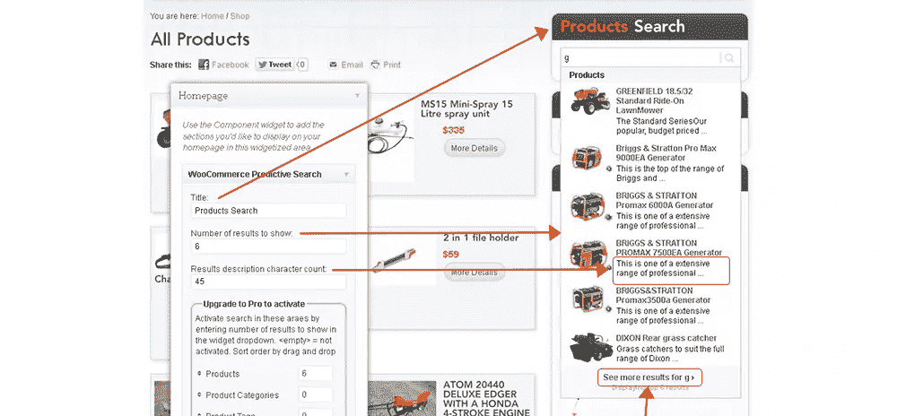
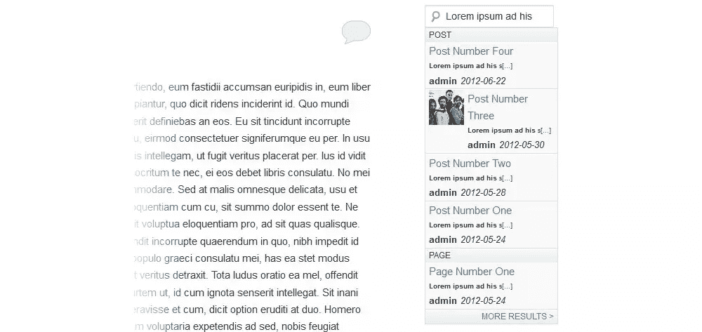
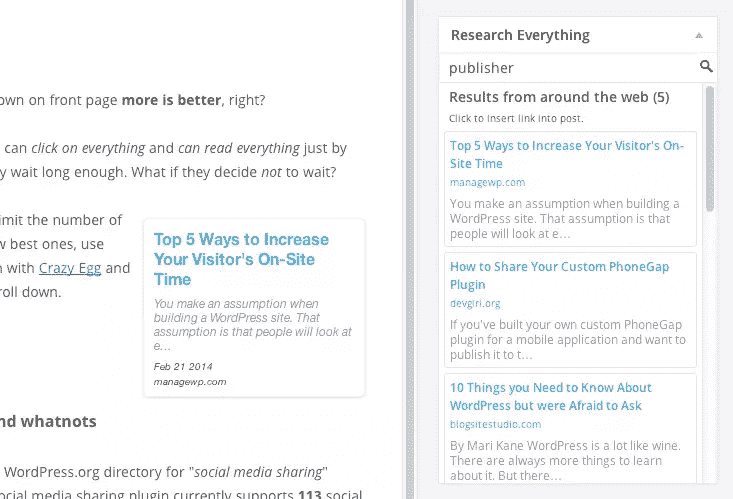

# 搜索 WordPress 的替换内容

> 原文：<https://www.sitepoint.com/search-replacements-for-wordpress/>

大多数 WordPress 主题都有一个内置的搜索功能，让访问者很容易找到他们感兴趣的主题的帖子。这特别方便，因为文章是按时间顺序显示的。他们可以键入关键词或类别，直接跳转到与该主题相关的每一篇文章，而不是让访问者一个接一个地筛选分页的档案。当你想在你的 WordPress 网站上有一个定制的搜索功能时会发生什么？有哪些选项可用，它们有什么作用？我们将看看 WordPress 的不同搜索替代品。

## WordPress 默认搜索功能的主要问题是

默认情况下，WordPress 会寻找符合搜索条件的最近的条目，而不是最相关的条目。这可能会令人沮丧，尤其是当你就某个特定主题写了一篇轰动一时的帖子，而它却被埋没在你自己的搜索结果中。这导致了主要的可用性问题，从长远来看，实际上会损害你的网站。如果访问者找不到他们要找的东西，可能只是你写的那篇轰动一时的文章，他们可能不会再来你的网站，认为它与主题的相关性不如实际的那样高。基本上，你的默认搜索功能可能会搬起石头砸自己的脚。

## [增强型搜索表单](https://wordpress.org/plugins/enhanced-search-form/)

当在任何网站上进行搜索时，尤其是有许多帖子的大型网站，可能会有数百个结果，分布在不同的类别和子主题中。仅仅进行一般性搜索是不够的，因为你必须筛选大量的结果，不管它们是否相关。

增强型搜索表单扩展了普通的 WordPress 搜索表单，增加了按类别、日期甚至标签过滤搜索的能力。这有助于网站访问者完善他们的搜索，这样他们就不会浏览 5 年前可能已经过时的帖子。

链接:[https://wordpress.org/plugins/enhanced-search-form/](https://wordpress.org/plugins/enhanced-search-form/)

## [相关性](https://wordpress.org/plugins/relevanssi/)

还记得我们讨论过 WordPress 搜索是按照日期而不是相关性来排序结果的吗？Relevanssi 取代了您的默认搜索，按相关性对结果进行排序。此外，你的搜索结果往往看起来更好。

Relevanssi 有很多选项可供选择。您可以设置模糊匹配，用部分单词匹配结果。你也可以在搜索结果中突出显示搜索词，帮助访问者更容易地确定搜索结果的相关性。它给出了每个搜索结果的上下文，让读者不必从头到尾浏览每一个结果。另一个好处是，您可以设置它，使搜索结果包括评论、类别、标签和自定义字段。这真的很方便，特别是如果你的读者非常活跃，一个回访者想要跳回到一个特定的评论，这个评论可能有他们正在寻找的有用信息。此外，如果有人拼错了他们的搜索，Relevanssi 会使用谷歌风格的建议“你的意思是……”这使得用户不必从头开始。如果您需要更深入地了解，还可以使用高级定制功能。Relevanssi 与 WPML 或 BuddyPress 不兼容。

链接:[https://wordpress.org/plugins/relevanssi/](https://wordpress.org/plugins/relevanssi/)

## [WooCommerce 预测搜索](https://wordpress.org/plugins/woocommerce-predictive-search/)

WooCommerce 是创建自己在线商店的首选插件。你可以跟踪库存，通过 CSV 文件批量上传产品，它还有很多其他很棒的功能。任何网上商店最重要的一个方面就是你的顾客应该能够快速方便地找到他们想要的产品。

WooCommerce 预测搜索根据访问者在搜索栏中输入的内容，为他们提供快速的搜索结果。它不仅是即时的，而且很漂亮，有产品的迷你预览，标题和简要描述。从管理区，你可以完全控制一次显示多少产品，以及在哪里显示。它适用于你的网站上任何有宽化区域的地方。你可以把它放在网站的页眉、页脚和侧边栏中。

另一个很棒的特性是能够拥有一个显示所有搜索结果的页面。每个结果仍然有预览图像和标题。该页面甚至包括无限滚动，因此当您向下滚动时，会加载更多的结果。

链接:[https://WordPress . org/plugins/woo commerce-predictive-search/](https://wordpress.org/plugins/woocommerce-predictive-search/)

## [原地搜索](https://wordpress.org/plugins/search-in-place/)

与其说是替代品，不如说是附加功能，当用户输入搜索词时，Search in Place 会实时显示结果。就地搜索的突出之处在于其丰富的定制功能。您可以将搜索与电子商务解决方案集成在一起，例如 WooCommerce、WP 电子商务、Jigoshop 和 the Ready！电子商务购物车。如果你想要一个产品、文章和页面的一体化插件，这是非常好的。

您甚至可以自定义搜索结果的外观，以及显示的内容，如文章标题、缩略图、日期和摘要。您可以自定义搜索框的外观以匹配您的网站的外观，这样它就不会仅仅为了功能而显得格格不入。

就地搜索会在显示的结果中突出显示搜索词，还会告诉你文章类型。凭借其内置的集成、特性和定制，这可能是我推荐的一款。

链接:[https://wordpress.org/plugins/search-in-place/](https://wordpress.org/plugins/search-in-place/)

## [搜索一切](https://wordpress.org/plugins/search-everything/)

Search Everything 是一个简单的插件，可以在你的 WordPress 网站上设置和增加你的搜索功能。你可以很好地控制这个搜索插件如何产生搜索结果。您可以自定义搜索功能中包含的所有内容。这个插件的一个突出特点是，你可以阻止它搜索有密码保护的页面。这使得受密码保护的会员页面不会出现在搜索结果中。如果你在运营一个会员制网站，这是必不可少的，因为没有什么比点击链接后被重定向到其他地方更令人失望的了。

这个插件，像我们提到的其他几个插件一样，在结果中突出显示搜索词。你也可以自定义这个插件是否搜索每个页面，每个标签，每个类别，评论和摘录。您甚至可以在搜索结果中包含自定义字段和元数据。正如您可以在搜索结果中包含所有这些元素一样，您也可以排除它们。

这个插件的主要突出特点是一个写作助手，允许你在写作时搜索你的文章并链接到它们。这是一个很棒的功能，因为在你自己的站点内链接与这个主题相关的以前的文章对 SEO 有好处。当你正在写一篇文章的时候，能够做到这一点，对任何文章作者或博客作者来说都是一个极好的特性。

链接:[https://wordpress.org/plugins/search-everything/](https://wordpress.org/plugins/search-everything/)

## 结论

WordPress 如此受欢迎的最大原因之一，是因为你有能力定制你的网站，只需点击一个按钮就可以添加难以置信的功能。有了合适的搜索替换插件，你可以给你的 WordPress 站点添加强大的搜索功能，让访问者更容易尽快找到他们想要的东西。

## 分享这篇文章