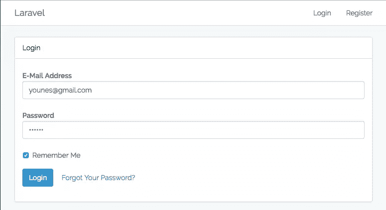
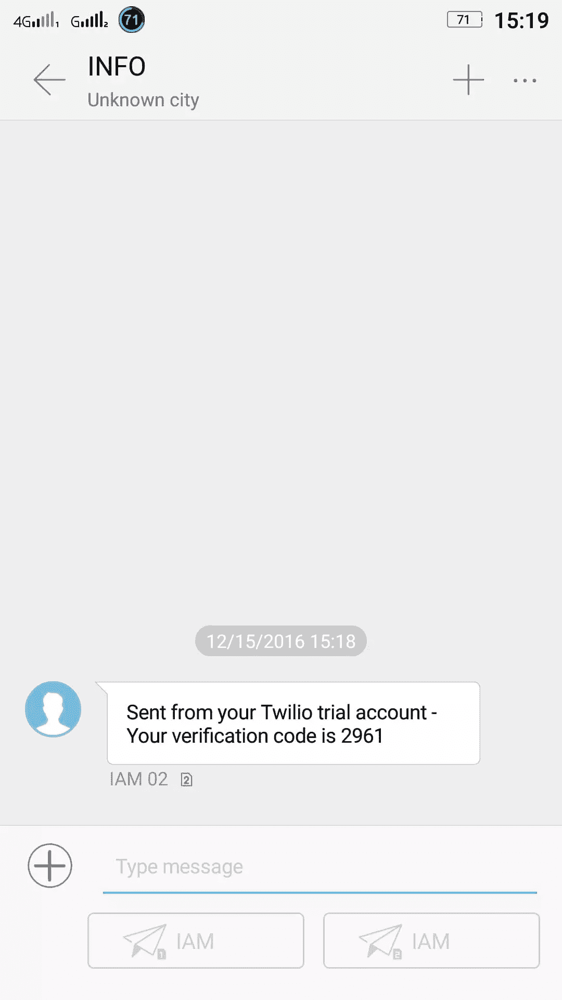
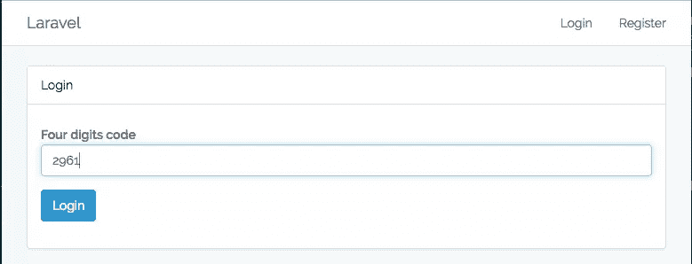
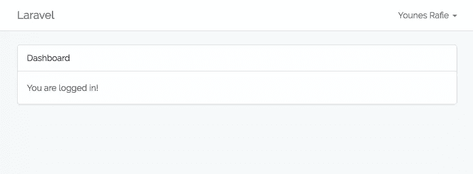
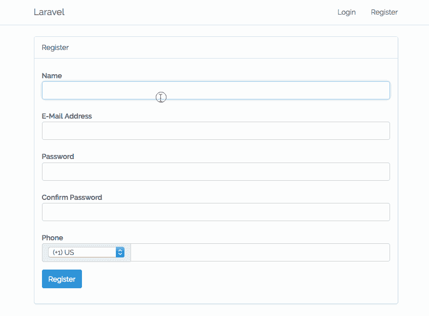

# 如何通过短信使用 2FA 保护 Laravel 应用程序

> 原文：<https://www.sitepoint.com/secure-laravel-apps-2fa-via-sms/>

*这篇文章由 [Christopher Thomas](https://www.sitepoint.com/author/cthomas/) 进行了同行评审。感谢 SitePoint 的所有同行评审员使 SitePoint 的内容尽可能做到最好！*

* * *

虽然每个人都关心他们的应用程序的安全性，但很少有人认真对待它并采取行动。了解到这一点后，您会注意到的第一件事是，[双因素身份认证](https://en.wikipedia.org/wiki/Multi-factor_authentication) (2FA)是首选解决方案。

虽然使用短信作为第二个因素存在一些严重的问题，但它肯定比简单的用户名和密码组合更安全，因为许多用户倾向于使用[流行且容易猜到的密码](http://www.passwordrandom.com/most-popular-passwords)来进行支付、聊天、电子邮件等关键服务。在本文中，我们将使用 [Twilio SMS](https://www.twilio.com/messaging) 作为第二个因素，将双因素认证构建到 Laravel 应用程序中。


## 我们正在建造的东西

您很有可能已经熟悉了 2FA 流程:

*   用户访问登录页面。

*   他输入电子邮件和密码。

    

*   我们使用电话号码发送验证码。

    

*   用户必须输入收到的代码。

    

*   如果密码正确，我们就让他们登录。否则，我们再给他们一次尝试登录的机会。

    

最终的演示应用在 GitHub 上发布。

## 装置

我假设您已经建立了开发环境。如果没有，我们推荐[家园改良](https://www.sitepoint.com/quick-tip-get-homestead-vagrant-vm-running/)轻松起步。

继续使用 Laravel 安装程序或通过 Composer 创建一个新的 Laravel 项目。

```
laravel new demo 
```

或者

```
composer create-project --prefer-dist laravel/laravel demo 
```

编辑`.env`文件并添加您的数据库凭证。

```
DB_CONNECTION=mysql
DB_HOST=127.0.0.1
DB_PORT=3306
DB_DATABASE=homestead
DB_USERNAME=root
DB_PASSWORD=root 
```

## 脚手架认证

在创建迁移之前，请记住 Laravel 有一个命令可以帮助我们搭建认证流程。它会生成以下内容:

*   登录、注册和重置密码视图和控制器。
*   必要的路线。

继续从命令行运行`php artisan make:auth`。

## 创建迁移

更新`users`迁移类并添加一个`country_code`和`phone`字段。

```
// database/migrations/2014_10_12_000000_create_users_table.php

class CreateUsersTable extends Migration
{
    /**
     * Run the migrations.
     *
     * @return void
     */
    public function up()
    {
        Schema::create('users', function (Blueprint $table) {
            $table->increments('id');
            $table->string('name');
            $table->string('email')->unique();
            $table->string('password');
            $table->string('country_code', 4)->nullable();
            $table->string('phone')->nullable();
            $table->rememberToken();
            $table->timestamps();
        });
    }

    /**
     * Reverse the migrations.
     *
     * @return void
     */
    public function down()
    {
        Schema::dropIfExists('users');
    }
} 
```

每个用户都有一个他们生成的令牌(验证码)列表。运行`php artisan make:model Token -m`命令来生成模型和迁移文件。表模式将如下所示:

```
// database/migrations/2016_12_14_105000_create_tokens_table.php

class CreateTokensTable extends Migration
{
    /**
     * Run the migrations.
     *
     * @return void
     */
    public function up()
    {
        Schema::create('tokens', function (Blueprint $table) {
            $table->increments('id');
            $table->string('code', 4);
            $table->integer('user_id')->unsigned();
            $table->boolean('used')->default(false);
            $table->timestamps();
        });
    }

    /**
     * Reverse the migrations.
     *
     * @return void
     */
    public function down()
    {
        Schema::dropIfExists('tokens');
    }
} 
```

我将验证码限制在四位数字，但你可以通过增加它来增加猜测的难度。我们稍后将回到这一点。让我们运行`php artisan migrate`来创建数据库。

## 更新模型

模型已经存在，只需相应更新:

```
// app/User.php

class User extends Authenticatable
{
    use Notifiable;

    /**
     * The attributes that are mass assignable.
     *
     * @var array
     */
    protected $fillable = [
        'name',
        'email',
        'password',
        'country_code',
        'phone'
    ];

    /**
     * The attributes that should be hidden for arrays.
     *
     * @var array
     */
    protected $hidden = [
        'password',
        'remember_token',
    ];

    /**
     * User tokens relation
     *
     * @return \Illuminate\Database\Eloquent\Relations\HasMany
     */
    public function tokens()
    {
        return $this->hasMany(Token::class);
    }

    /**
     * Return the country code and phone number concatenated
     *
     * @return string
     */
    public function getPhoneNumber()
    {
        return $this->country_code.$this->phone;
    }
} 
```

这里没有什么特别的，我们只是添加了`users -> tokens`关系和`getPhoneNumber` helper 方法来获取用户的完整电话号码。

```
// app/Token.php

class Token extends Model
{
    const EXPIRATION_TIME = 15; // minutes

    protected $fillable = [
        'code',
        'user_id',
        'used'
    ];

    public function __construct(array $attributes = [])
    {
        if (! isset($attributes['code'])) {
            $attributes['code'] = $this->generateCode();
        }

        parent::__construct($attributes);
    }

    /**
     * Generate a six digits code
     *
     * @param int $codeLength
     * @return string
     */
    public function generateCode($codeLength = 4)
    {
        $min = pow(10, $codeLength);
        $max = $min * 10 - 1;
        $code = mt_rand($min, $max);

        return $code;
    }

    /**
     * User tokens relation
     *
     * @return \Illuminate\Database\Eloquent\Relations\BelongsTo
     */
    public function user()
    {
        return $this->belongsTo(User::class);
    }

    /**
     * True if the token is not used nor expired
     *
     * @return bool
     */
    public function isValid()
    {
        return ! $this->isUsed() && ! $this->isExpired();
    }

    /**
     * Is the current token used
     *
     * @return bool
     */
    public function isUsed()
    {
        return $this->used;
    }

    /**
     * Is the current token expired
     *
     * @return bool
     */
    public function isExpired()
    {
        return $this->created_at->diffInMinutes(Carbon::now()) > static::EXPIRATION_TIME;
    }
} 
```

除了设置关系方法和更新可填充属性之外，我们还添加了:

*   创建时设置代码属性的构造函数。
*   根据代码长度参数生成随机数的`generateCode`方法。
*   使用`EXPIRATION_TIME`常量查看链接是否过期的`isExpired`方法。
*   查看链接是否既未过期也未使用的`isValid`方法。

## 创建视图

应该更新视图文件，使其包含国家代码和电话字段。

```
// resources/views/auth/register.blade.php

@extends('layouts.app')

@section('content')
<div class="container">
    <div class="row">
        <div class="col-md-8 col-md-offset-2">
            <div class="panel panel-default">
                <div class="panel-heading">Register</div>
                <div class="panel-body">
                    @include("partials.errors")

                    <form class="form-horizontal" role="form" method="POST" action="{{ url('/register') }}">
                        // ...

                        <div class="form-group">
                            <label for="phone" class="col-md-4 control-label">Phone</label>

                            <div class="col-md-6">

                                <div class="input-group">
                                    <div class="input-group-addon">
                                        <select name="country_code" style="width: 150px;">
                                            <option value="+1">(+1) US</option>
                                            <option value="+212">(+212) Morocco</option>
                                        </select>
                                    </div>
                                    <input id="phone" type="text" class="form-control" name="phone" required>

                                    @if ($errors->has('country_code'))
                                        <span class="help-block">
                                        <strong>{{ $errors->first('country_code') }}</strong>
                                    </span>
                                    @endif
                                    @if ($errors->has('phone'))
                                        <span class="help-block">
                                        <strong>{{ $errors->first('phone') }}</strong>
                                    </span>
                                    @endif
                                </div>
                            </div>
                        </div>

                        // ...
                    </form>
                </div>
            </div>
        </div>
    </div>
</div>
@endsection 
```

然后，我们为用户创建一个新的视图来输入验证码。

```
// resources/views/auth/code.blade.php

@extends('layouts.app')

@section('content')
    <div class="container">
        <div class="row">
            <div class="col-md-8 col-md-offset-2">
                <div class="panel panel-default">
                    <div class="panel-heading">Login</div>
                    <div class="panel-body">
                        @include("partials.errors")

                        <form class="form-horizontal" role="form" method="POST" action="{{ url('/code') }}">
                            {{ csrf_field() }}

                            <div class="form-group">
                                <label for="code" class="col-md-4 control-label">Four digits code</label>

                                <div class="col-md-6">
                                    <input id="code" type="text" class="form-control" name="code" value="{{ old('code') }}" required autofocus>

                                    @if ($errors->has('code'))
                                        <span class="help-block">
                                        <strong>{{ $errors->first('code') }}</strong>
                                    </span>
                                    @endif
                                </div>
                            </div>

                            <div class="form-group">
                                <div class="col-md-8 col-md-offset-4">
                                    <button type="submit" class="btn btn-primary">
                                        Login
                                    </button>
                                </div>
                            </div>
                        </form>
                    </div>
                </div>
            </div>
        </div>
    </div>
@endsection 
```

`errors.blade.php`部分将打印验证错误列表。

```
// resources/views/errors.blade.php

@if (count($errors) > 0)
    <div class="alert alert-danger ">
        <button type="button" class="close" data-dismiss="alert" aria-label="Close">
            <span aria-hidden="true">&times;</span></button>
        <ul>
            @foreach ($errors->all() as $error)
                <li>{{ $error }}</li>
            @endforeach
        </ul>
    </div>
@endif 
```

## 创建控制器

与其创建新的控制器，为什么不重用授权控制器呢？毕竟没什么可补充的！

当用户发布表单时会调用`RegisterController@register`方法，如果打开文件，您会发现在用户创建后它会调用一个`registered`方法。

```
// app/Http/Controllers/RegisterController.php

class RegisterController extends Controller
{

    // ...
    protected function registered(Request $request, $user)
    {
        $user->country_code = $request->country_code;
        $user->phone = $request->phone;
        $user->save();
    }
} 
```

我们还需要更新请求验证，并使国家代码和电话字段成为必填字段。

```
// app/Http/Controllers/RegisterController.php

class RegisterController extends Controller
{

    // ...
    protected function validator(array $data)
    {
        return Validator::make($data, [
            'name'         => 'required|max:255',
            'email'        => 'required|email|max:255|unique:users',
            'password'     => 'required|min:6|confirmed',
            'country_code' => 'required',
            'phone'        => 'required'
        ]);
    }
} 
```

现在我们需要更新`LoginController`并覆盖`login`方法。

```
// app/Http/Controllers/LoginController.php

class LoginController extends Controller
{

    // ...
    public function login(Request $request)
    {
        $this->validateLogin($request);

        //retrieveByCredentials
        if ($user = app('auth')->getProvider()->retrieveByCredentials($request->only('email', 'password'))) {
            $token = Token::create([
                'user_id' => $user->id
            ]);

            if ($token->sendCode()) {
                session()->set("token_id", $token->id);
                session()->set("user_id", $user->id);
                session()->set("remember", $request->get('remember'));

                return redirect("code");
            }

            $token->delete();// delete token because it can't be sent
            return redirect('/login')->withErrors([
                "Unable to send verification code"
            ]);
        }

        return redirect()->back()
            ->withInputs()
            ->withErrors([
                $this->username() => Lang::get('auth.failed')
            ]);
    }
} 
```

验证请求后，我们尝试使用电子邮件和密码检索用户。如果用户存在，我们为这个用户创建一个新的令牌，然后发送代码，设置必要的会话细节，并重定向到代码页。

哦等等！我们没有在`Token`模型内部定义一个`sendCode`方法？

### 添加 Twilio

在通过 SMS 将代码发送给用户之前，我们需要为这项工作配置 Twilio。我们需要创建一个新的试用账户。

之后，转到 [Twilio 控制台](https://www.twilio.com/console)页面，复制您的帐户 ID 和身份验证令牌。最后一部分是创建一个发送短信的新电话号码。转到[控制台的电话号码页面](https://www.twilio.com/console/phone-numbers/incoming)并创建一个新的。

```
TWILIO_SID=XXXXXXXXXXX
TWILIO_TOKEN=XXXXXXXXXXXX
TWILIO_NUMBER=+XXXXXXXXXX 
```

Twilio 有一个我们可以使用的官方 PHP 包。

```
composer require twilio/sdk 
```

为了使用 Twilio 包，我们将创建一个新的提供者并将其绑定到容器:

```
pgp artisan make:provider TwilioProvider 
```

```
// app/Providers/TwilioProvider.php

use Illuminate\Support\ServiceProvider;
use Twilio\Rest\Client;

class TwilioProvider extends ServiceProvider
{
    /**
     * Bootstrap the application services.
     *
     * @return void
     */
    public function boot()
    {}

    /**
     * Register the application services.
     *
     * @return void
     */
    public function register()
    {
        $this->app->bind('twilio', function() {
            return new Client(env('TWILIO_SID'), env('TWILIO_TOKEN'));
        });
    }
} 
```

现在，我们终于可以回到我们的`sendCode`方法了:

```
// app/Token.php

class Token extends Model
{
    //...
    public function sendCode()
    {
        if (! $this->user) {
            throw new \Exception("No user attached to this token.");
        }

        if (! $this->code) {
            $this->code = $this->generateCode();
        }

        try {
            app('twilio')->messages->create($this->user->getPhoneNumber(),
                ['from' => env('TWILIO_NUMBER'), 'body' => "Your verification code is {$this->code}"]);
        } catch (\Exception $ex) {
            return false; //enable to send SMS
        }

        return true;
    }
} 
```

如果当前令牌没有附加到用户，该函数将抛出一个异常。否则，它会尝试向他们发送短信。

最后，应用程序准备就绪。我们通过注册一个新用户并尝试登录来进行测试。下面是一个快速演示:



## 有用的 2FA 相关链接

*   [https://www . wired . com/2016/06/hey-stop-using-texts-two-factor-authentic ation/](https://www.wired.com/2016/06/hey-stop-using-texts-two-factor-authentication/)
*   [https://TechCrunch . com/2016/06/10/how-activity-deray-mckessons-Twitter-account-was-hacked/](https://techcrunch.com/2016/06/10/how-activist-deray-mckessons-twitter-account-was-hacked/)
*   [https://www . twilio . com/blog/2015/01/mobile-passless-SMS-authentic ation-part-1-building-the-API-with-laravel-and-twilio . html](https://www.twilio.com/blog/2015/01/mobile-passwordless-sms-authentication-part-1-building-the-api-with-laravel-and-twilio.html)
*   [https://www.twilio.com/docs/libraries/php](https://www.twilio.com/docs/libraries/php)
*   [https://www.twilio.com/docs/quickstart/php/sms](https://www.twilio.com/docs/quickstart/php/sms)
*   [https://www . site point . com/2fa-in-laravel-with-Google-authenticator-get-secure/](https://www.sitepoint.com/2fa-in-laravel-with-google-authenticator-get-secure/)

## 结论

本文简要介绍了如何将 Twilio 与 Laravel 应用程序集成在一起。您还可以通过让用户能够启用和禁用双因素身份认证来进一步演示，并且您可能还想提供呼叫而不是 SMS！

你曾经为一个应用程序实现过 2FA 吗？你面临的挑战是什么？这对你的用户来说是一次好的体验吗？

如果你对 2FA 或 Laravel 有任何问题或意见，可以在下面发表！

## 分享这篇文章