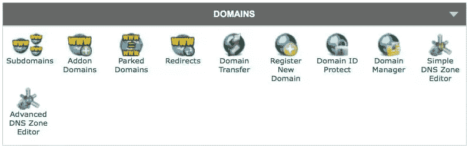
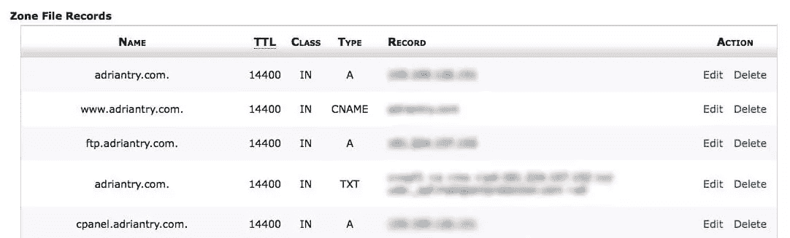
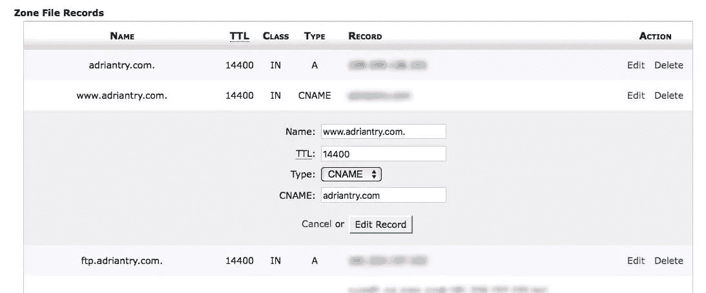
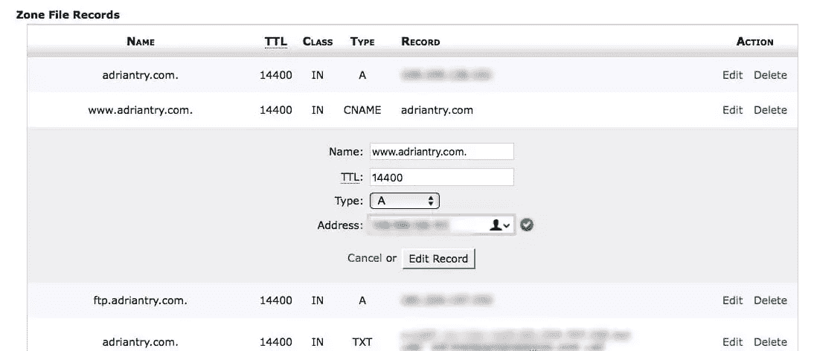

# 如何保护你的 WordPress 网站免受 DDoS 攻击

> 原文：<https://www.sitepoint.com/secure-your-wordpress-site-from-the-growing-ddos-onslaught/>

*本文由 [Incapsula](http://synd.co/2unWEi0) 赞助。感谢您对使 SitePoint 成为可能的合作伙伴的支持。*

分布式拒绝服务(DDoS)攻击的规模正在迅速扩大。至少从 2000 年开始，他们就已经在雷达上了，2017 年可能是他们成为你最大的安全问题的一年。如果你还没有 DDoS 策略，是时候选择一个了。

根据目前的趋势，行业专家预测，这可能是一个危机年。这反映在最近的头条新闻中，比如:

*   **2017 年 DDoS:系好安全带开始颠簸之旅**，[收银台](https://www.theregister.co.uk/2016/12/16/ddos_in_2017_strap_yourself_in_for_a_bumpy_ride/)。
*   **Q1 2017 年 DDoS 攻击上升 380%**， [CIO 下潜](http://www.ciodive.com/news/ddos-attacks-up-380-in-q1-2017/444507/)
*   **2017 年的 DDoS 海啸将使公司损失数百万**、 [TechRepublic](http://www.techrepublic.com/article/the-2017-ddos-tsunami-will-cost-companies-millions/)
*   **黑客不休假:2017 年 DDoS 攻击上升五倍**， [SiliconANGLE](https://siliconangle.com/blog/2017/06/06/nexusguard-report-hackers-dont-take-holidays-2017-ddos-attacks-rise/)
*   **预计 2017 年勒索软件和 DDoS 攻击组合将会增加**、[企业创新](https://www.enterpriseinnovation.net/article/expect-increase-ransomware-and-ddos-attack-combos-2017-145803210)
*   **2017 年可能是 DDoS 攻击的危机年**，[计算机周刊](http://www.computerweekly.com/news/450411183/2017-may-be-crisis-year-for-DDoS-attacks-warns-Deloitte)。

一个平台越受欢迎，就越有可能成为攻击的目标，WordPress 是互联网上最受欢迎的平台。在之前的一篇文章中，我们概述了保证你的 WordPress 网站安全的 48 种方法。尽一切办法保持你的 WordPress 补丁和更新，但这不会保护你免受僵尸囤积。您需要一个可以信赖的定向 DDoS 解决方案。

DDoS 攻击是如何工作的？保护你的 WordPress 站点最有效的方法是什么？

## DDoS 威胁的快速增长

DDoS 攻击利用你网站的带宽限制来攻击你。它一次能接待多少游客？太多了，就会变得不知所措，反应迟钝，就像几百个顾客同时走进一家实体店一样。DDoS 攻击正是模拟了这一点。

> 一次 DDoS 攻击相当于几十万假冒顾客同时汇聚到一家传统店铺。商店很快变得不堪重负。真正的顾客进不去，商店也不能交易，因为它不能为他们服务。([德勤预测 2017](http://www.deloitte.co.uk/tmtpredictions/assets/pdf/Deloitte-TMT-Predictions-2017.pdf) )

对于一个在线商店或网站来说，这些假冒的访问者通常是僵尸网络的成员，僵尸网络是由第三方控制的成千上万台受损设备组成的网络。这些设备可能包括:

*   运行不太安全、未打补丁的操作系统(如 Windows XP)的旧电脑
*   受损的智能手机和其他移动互联网连接设备
*   智能设备，如恒温器、电视、冰箱、相机甚至灯泡——通常称为物联网(“物联网”)
*   和被入侵服务器欺骗的假 IP 地址。

结合起来，这些设备每秒钟可以向您的服务器发送千兆位的垃圾数据，现在攻击的规模正在爆炸。去年年底，黑客新闻网站报道了由 150，000 台被黑的物联网设备发起的第一次 1 Tbps DDoS 攻击，而[德勤](http://www.deloitte.co.uk/tmtpredictions/assets/pdf/Deloitte-TMT-Predictions-2017.pdf)预测今年将会有十次类似的攻击。

为什么 2017 年是这样一个转折点？几个趋势汇聚成了完美风暴:

1.  物联网设备比以往任何时候都多，而且它们很容易整合到僵尸网络中。
2.  现在可用的带宽比以往任何时候都多，它可以用来在你的网站上发送垃圾数据。
3.  新的 DDoS 策略通过攻击 web 应用程序，用更少的带宽造成更多的破坏，而且数量比以往任何时候都多。
4.  像 [Mirai 未来组合](http://www.computerweekly.com/news/450404326/More-than-2000-TalkTalk-routers-hijacked-by-Mirai-botnet-variant)这样的恶意软件工具比以往任何时候都更容易使用，DDoS 出租服务也比以往任何时候都更容易获得，成本低至 5 美元。

> DDoS 出租将会增加。物联网僵尸网络，加上一个简单的赚钱机会，将在 2017 年带来更多这类事情。怀疑？嗯，已经有 40 万强的物联网僵尸大军在出租，使用 Mirai 未来组合恶意软件。([注册处](https://www.theregister.co.uk/2016/12/16/ddos_in_2017_strap_yourself_in_for_a_bumpy_ride/))

你如何保护你的网站免受不速之客的攻击？从夜总会吸取教训，叫一个保镖。关键是在威胁到达你家门口之前处理好它。

## 防御 DDoS 攻击的最佳方法

在 DDoS 攻击袭击您的站点之前，您如何阻止它的影响？使用反向代理。将你所有的流量发送给那些能够在威胁进来之前清除掉它们的人，并且只转发真正的访问者到你的网站。就像保镖一样，他们需要比你高大强壮。他们需要能够抵抗攻击者而不被打倒。

因此，请选择使用以下功能的解决方案:

*   由高性能服务器组成的全球网络，能够在攻击升级时投入更多资源，确保合法流量仍然可以通过；和
*   一种 WAF，可以实时智能地分析传入流量，确保阻止所有威胁。

哪里可以找到这样的解决方案？Incapsula 可以做到所有这些，甚至更多。你可以在任何有自己域名的网站上使用它，不管它用的是 WordPress 还是其他什么平台。

Incapsula 通过阻止来自输入流量的威胁和加速输出流量来优化你的站点的加载时间，从而增强你的 WordPress 站点的安全性和性能。其全球网络能够挫败每秒数十万千兆字节的 DDoS 攻击。这种保护不会影响你的速度——事实上，它的全球 CDN 会让你的网站加载速度更快。

## 如何用 Incapsula 保护你的网站

设置 Incapsula 并不难——通常只需三个步骤，无需安装软件。它们需要几分钟才能完成，可能需要几天才能生效。

### 1.注册并选择一个计划

Incapsula 提供了一系列计划，每个计划都从免费试用开始。要获得网络应用防火墙，你需要 59 美元/月的 Pro 计划，要获得全面的 DDoS 保护，你需要 299 美元/月的商业计划。一旦你选择了对你的网站有意义的计划，你就开一个账户并提交你的信用卡信息。

### 2.提交您的域名 URL

Incapsula 将询问您想要保护的网站的域名 URL，然后为您提供如何进行下一步所需更改的说明。如果您的网站支持安全 HTTPS 流量，您将被引导通过几个额外的步骤来激活 SSL 支持。SSL 支持适用于专业版、商业版和企业版帐户。

首选方法是将您的域添加到 Incapsula 的 Globalsign 共享证书之一。这可以通过电子邮件或 DNS 完成:

*   电子邮件:您(域名所有者)将收到两封来自 Globalsign 的电子邮件。在邮件正文中回答“是”。
*   DNS:用提供的字符串创建一个 TXT 记录。

这将要求批准该网站的域名的裸域名和通配符，从而简化流程。如果您只想批准特定的网站名称，您需要发送一张支持票。在 [Incapsula 博客](https://www.incapsula.com/blog/add-ssl-support-to-incapsula-protected-site.html)上阅读更多内容。

### 3.更改您的 DNS 设置

您的 DNS 设置通常会将访问者直接定向到您的网站。您需要更改它们，将流量导向 Incapsula 的服务器。

这包括在 cPanel 的高级 DNS 区域编辑器中进行以下更改:

*   更改您的 A 记录以指向 Incapsula 的 IP 地址
*   添加第二个 A 记录以指向另一个封装 IP 地址
*   更新(或创建)一个 **www** CNAME 记录也指向 Incapsula。

所需的具体变化将会给你，以及一个教程的链接。

DNS 更改可能需要 48 小时来传播，但您的网站将在转换期间保持活动。在那之后，你网站的流量将通过 Incapsula 的网络进行路由，你将免受 DDoS 攻击。

### 进一步的步骤

设置 Incapsula 时还有其他考虑吗？可能不会，尽管一些用户发现他们还必须确保他们的电子邮件不是通过 Incapsula 发送的，否则就会超时。如果你使用你的主机提供商的电子邮件解决方案，这可能会发生。如果你用的是 G Suite 或 Exchange 之类的第三方选项，应该不会有什么问题。

如果你的**mail.domain.com**记录是一个指向**domain.com**的 CNAME(它被重定向到 Incapsula)，你的电子邮件可能会陷入黑洞。相反，把它改成一个指向你的托管账户的 IP 地址的 A 记录。

以下是我如何从我的网站 cPanel 的高级 DNS 区域编辑器中进行更改的一些截图。[你可以在这里找到更详细的说明](https://technicallyeasy.net/how-to-setup-incapsula-through-cpanel/)。

## 不要等到为时已晚

到目前为止，也许你还没有考虑过 DDoS 攻击。是时候改变这种态度了。

保护你的 WordPress 站点免受暴力攻击不是你自己能做到的。您需要外部帮助—一种可以在威胁到达您的站点之前就应对威胁的解决方案。你的主机提供商可能会提供一个解决方案，这是值得研究的。

但是如果你的网站不能被迫关闭，那就雇佣你能负担得起的最好的保镖。Incapsula 是个不错的选择。它易于设置，可以应对大型攻击，并动态清除威胁。每个计划都可以免费试用，你不会有任何损失。

## 分享这篇文章