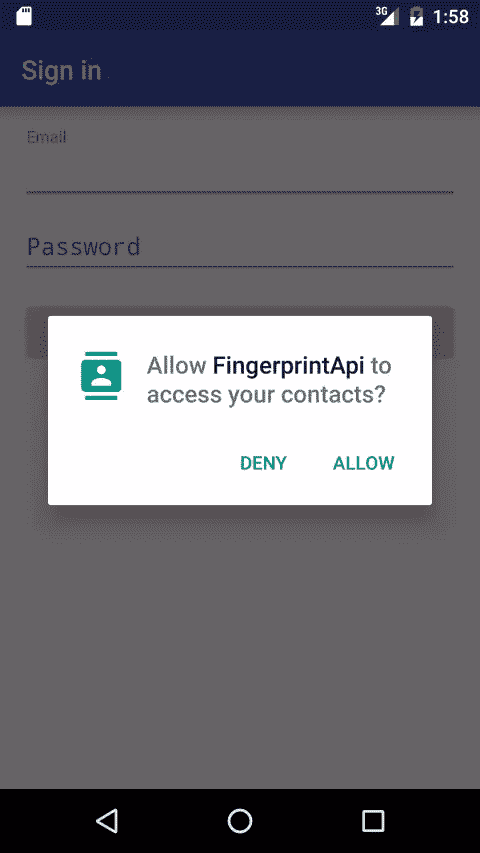
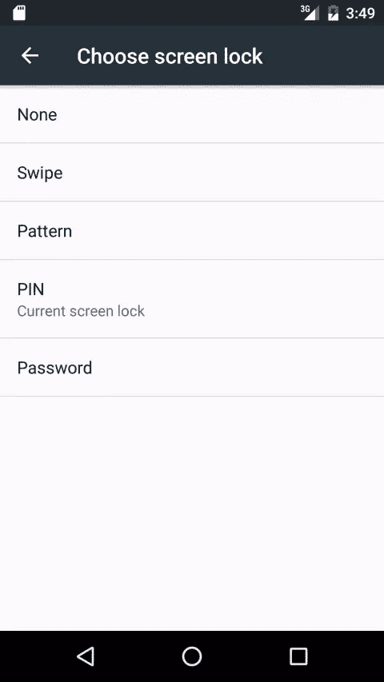
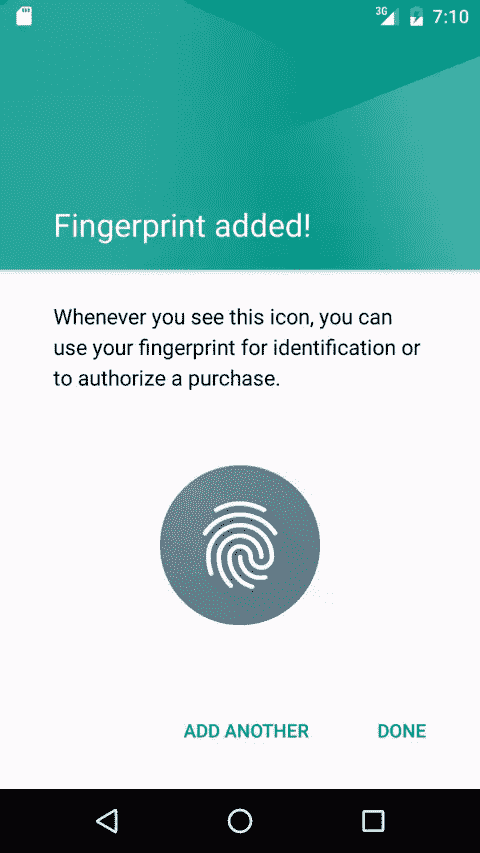
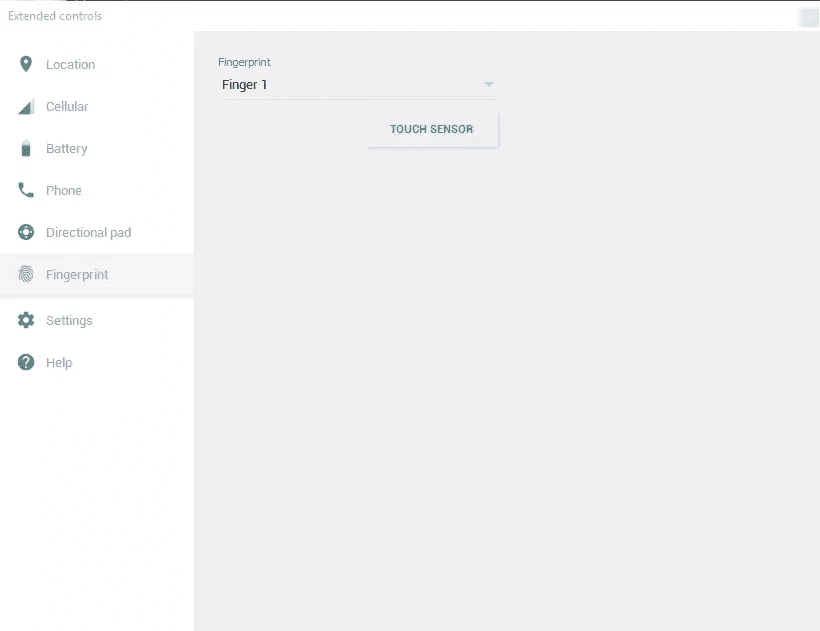
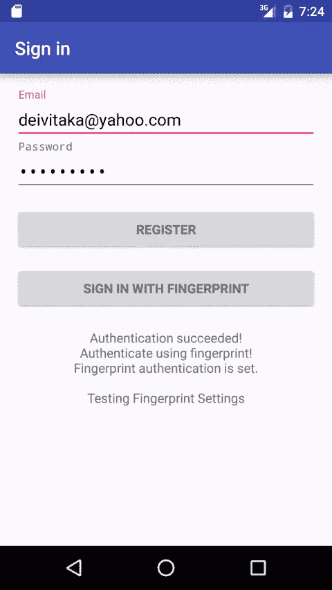
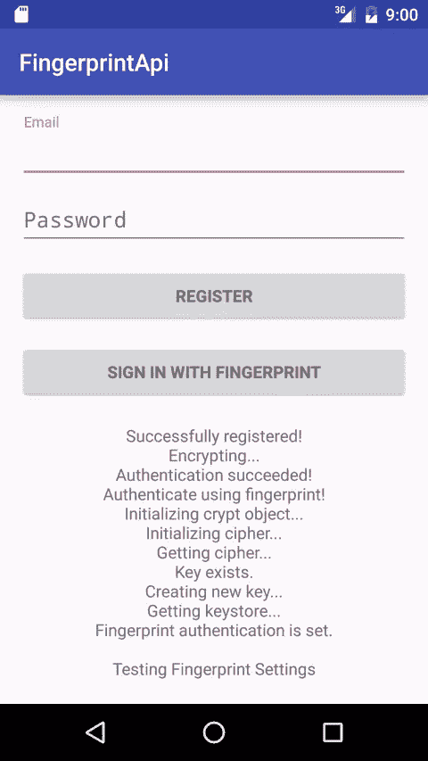
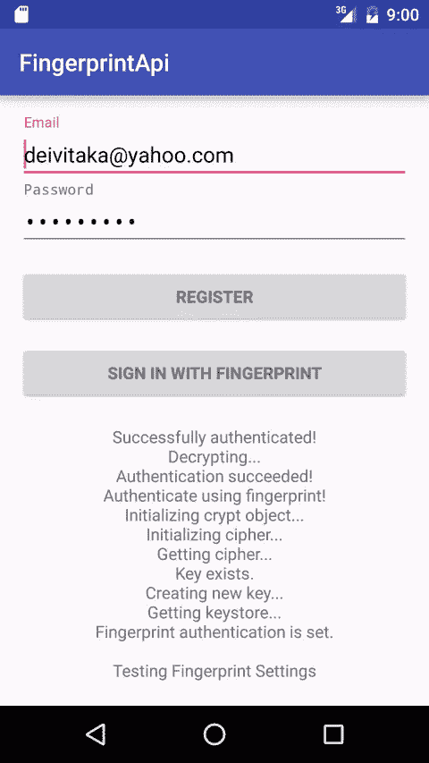
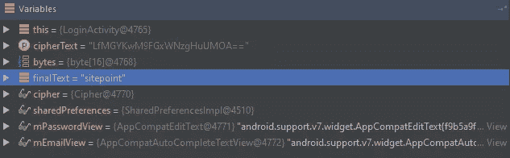

# 使用指纹 API 保护您的 Android 应用

> 原文：<https://www.sitepoint.com/securing-your-android-apps-with-the-fingerprint-api/>

密码已经过时，软件供应商和硬件制造商鼓励用户尝试其他保护数据的方法。自从 Marshmallow 引入了新的指纹 API 以来，指纹读取器在 Android 设备上越来越常见，在本教程中，我将向您展示如何在您的应用程序中实现它们。

你可以从 [GitHub](https://github.com/sitepoint-editors/AndroidFingerprintAPI) 下载完整的项目。

## 入门指南

这是一个示例应用程序，在用户体验方面有所限制，并将重点放在“如何做”上。

首先，创建一个新项目，并将其命名为“FingerprintApi”。设置 API level 15 为*最小 SDK* ，增加一个*登录活动*。点击*完成*，Android Studio 将开始创建所需的文件。


`LoginActivity`将有助于更快地开始，但仍然需要改变。

在 *activity_login.xml* 中，将*签到或注册*按钮标签改为*注册*，并添加另一个标签为*的按钮使用指纹*签到。在这个下面，添加一个名为`noteTextView`的`TextView`。调试信息将打印在这里，而不是使用对话。

```
<Button
    style="?android:textAppearanceSmall"
    android:id="@+id/fingerprint_sign_in_button"
    android:layout_width="match_parent"
    android:layout_height="wrap_content"
    android:layout_marginTop="16dp"
    android:text="Sign in using Fingerprint"
    android:textStyle="bold" />

<TextView
    android:layout_width="match_parent"
    android:layout_height="match_parent"
    android:id="@+id/noteTextView"
    android:layout_gravity="center_horizontal"
    android:layout_margin="20dp"
    android:textAlignment="center" /> 
```

在*LoginActivity.java*中，用下面的变量替换现有的变量，您稍后会用到。

```
private static final int REQUEST_READ_CONTACTS = 0;

private AutoCompleteTextView mEmailView;
private EditText mPasswordView;
private View mProgressView;
private View mLoginFormView;
private TextView mNoteTextView;

private UserLoginTask mAuthTask;

private static final String KEY_ALIAS = "sitepoint";
private static final String KEYSTORE = "AndroidKeyStore";
private static final String PREFERENCES_KEY_EMAIL = "email";
private static final String PREFERENCES_KEY_PASS = "pass";
private static final String PREFERENCES_KEY_IV = "iv";

private KeyStore keyStore;
private KeyGenerator generator;
private Cipher cipher;
private FingerprintManager fingerprintManager;
private KeyguardManager keyguardManager;
private FingerprintManager.CryptoObject cryptoObject;
private SharedPreferences sharedPreferences;

private boolean encrypting; 
```

用下面的方法替换`onCreate`方法。

```
@Override
protected void onCreate(Bundle savedInstanceState) {
    super.onCreate(savedInstanceState);
    setContentView(R.layout.activity_login);
    // Set up the login form.
    mEmailView = (AutoCompleteTextView) findViewById(R.id.email);
    populateAutoComplete();

    mPasswordView = (EditText) findViewById(R.id.password);
    mPasswordView.setOnEditorActionListener(new TextView.OnEditorActionListener() {
        @Override
        public boolean onEditorAction(TextView textView, int id, KeyEvent keyEvent) {
            if (id == R.id.login || id == EditorInfo.IME_NULL) {
                //attemptRegister();
                return true;
            }
            return false;
        }
    });

    Button mRegisterButton = (Button) findViewById(R.id.email_sign_in_button);
    mRegisterButton.setOnClickListener(new OnClickListener() {
        @Override
        public void onClick(View view) {
            //attemptRegister();
        }
    });
    Button mFingerprintSignInButton = (Button) findViewById(R.id.fingerprint_sign_in_button);
    mFingerprintSignInButton.setOnClickListener(new OnClickListener() {
        @Override
        public void onClick(View view) {
            //attemptFingerprintLogin();
        }
    });

    mLoginFormView = findViewById(R.id.login_form);
    mProgressView = findViewById(R.id.login_progress);

    mNoteTextView = (TextView)findViewById(R.id.noteTextView);

    sharedPreferences = PreferenceManager.getDefaultSharedPreferences(this);
} 
```

这将把`attemptLogin()`方法重命名为`attemptRegister()`，为`fingerprintSignInButton`和`noteTextView`声明并初始化变量。初始化`sharedPreferences`，在这里保存用户的凭证，包括加密的密码。

要向`noteTextView`添加文本，请添加这两个方法。文本作为参数传递，并添加到`TextView`的顶部。

```
public void print(String text) {
    mNoteTextView.setText(text + "\n" + mNoteTextView.getText());
}

public void print(int id) {
    print(getString(id));
} 
```

在`UserLoginTask`类中，删除`doInBackground`和`onPostExecute`方法中的代码，留下下面的代码。

```
@Override
protected Boolean doInBackground(Void... params) {
    return true;
}

@Override
protected void onPostExecute(final Boolean success) {
    onCancelled();
} 
```

第一次运行时，该应用程序需要访问联系人的权限，但这无关紧要。它包含在默认的`LoginActivity`实现中，在这种情况下您可以删除它。



## If 语句

要使用指纹 API，您必须请求权限。将这一行添加到应用程序标签顶部的 *AndroidManifest.xml* 中。

```
<uses-permission android:name="android.permission.USE_FINGERPRINT" /> 
```

当然，并不是每个设备都有指纹传感器，或者安卓 6.0 以上。因此，您应该在尝试使用 API 方法之前检查硬件/软件支持，这可能会引发异常。

```
@SuppressLint("NewApi") private boolean testFingerPrintSettings() { print("Testing Fingerprint Settings");

if (Build.VERSION.SDK_INT < Build.VERSION_CODES.M)
{
    print("This Android version does not support fingerprint authentication.");
    return false;
}

keyguardManager = (KeyguardManager) getSystemService(KEYGUARD_SERVICE);
fingerprintManager = (FingerprintManager) getSystemService(FINGERPRINT_SERVICE);

if (Build.VERSION.SDK_INT >= Build.VERSION_CODES.JELLY_BEAN) {
    if (!keyguardManager.isKeyguardSecure()) {
        print("User hasn't enabled Lock Screen");
        return false;
    }
}

if (ActivityCompat.checkSelfPermission(this, Manifest.permission.USE_FINGERPRINT) != PackageManager.PERMISSION_GRANTED) {
    print("User hasn't granted permission to use Fingerprint");
    return false;
}

if (!fingerprintManager.hasEnrolledFingerprints()) {
    print("User hasn't registered any fingerprints");
    return false;
}

print("Fingerprint authentication is set.\n");

return true;

} 
```

这首先检查 Android M 的最低版本，然后检查用户是否使用`isKeyguardSecure()`方法启用了模式、PIN 或密码的屏幕锁定。



除了启用屏幕锁定，用户必须在设备上注册指纹，您可以使用`hasEnrolledFingerprints`方法来检查这一点，但它要求明确检查使用指纹认证的权限。



如果所有检查都通过，该方法返回 true。

另一件要检查的事情是注册用户是否试图登录。首先要看的是 SharedPreferences。

```
private boolean usersRegistered() {
    if (sharedPreferences.getString(PREFERENCES_KEY_EMAIL, null) == null) {
        print("No user is registered");
        return false;
    }

    return true;
} 
```

## 助手类

接下来，您需要一个助手类来处理指纹 API 方法。*在当前包上右击*，然后点击*新建- > Java 类*。将新类命名为`FingerprintHelper`，并让它扩展`FingerprintManager.AuthenticationCallback`。该类需要一个大于或等于 Android M 的 API，通过在类的顶部添加`@TargetApi(Build.VERSION_CODES.M)`来实现:

```
@TargetApi(Build.VERSION_CODES.M)
public class FingerprintHelper extends FingerprintManager.AuthenticationCallback {
  ...
} 
```

用下面的方法声明一个内部接口。

```
interface FingerprintHelperListener {
    public void authenticationFailed(String error);
    public void authenticationSucceeded(FingerprintManager.AuthenticationResult result);
} 
```

所有使用`FingerprintHelper`的类都必须实现这个接口来通知认证的状态。为了能够调用这些方法，您需要调用类的一个实例，作为构造函数中的一个参数。

```
private FingerprintHelperListener listener;

public FingerprintHelper(FingerprintHelperListener listener) {
    this.listener = listener;
} 
```

为了让指纹扫描仪开始监听输入，调用`FingerprintManager`方法`authenticate`。当用户取消认证，或者当应用程序进入后台时，你使用`CancellationSignal`来停止监听。

此方法允许其他类取消调用:

```
private CancellationSignal cancellationSignal;

public void startAuth(FingerprintManager manager, FingerprintManager.CryptoObject cryptoObject) {
    cancellationSignal = new CancellationSignal();

    try {
        manager.authenticate(cryptoObject, cancellationSignal, 0, this, null);
    } catch (SecurityException ex) {
        listener.authenticationFailed("An error occurred:\n" + ex.getMessage());
    } catch (Exception ex) {
        listener.authenticationFailed("An error occurred\n" + ex.getMessage());
    }
}

public void cancel() {
    if (cancellationSignal != null)
        cancellationSignal.cancel();
} 
```

方法`authenticate`使用了一个`CryptoObject`对象，这是一个由`FingerprintManager`支持的加密对象的包装类。它包含像密码和签名这样的对象，对于本教程，我将使用密码来处理加密和解密。

最后，覆盖`AuthenticationCallback`方法来通知`FingerprintHelperListener`。

```
@Override
public void onAuthenticationError(int errMsgId, CharSequence errString) {
    listener.authenticationFailed("Authentication error\n" + errString);
}

@Override
public void onAuthenticationHelp(int helpMsgId, CharSequence helpString) {
    listener.authenticationFailed("Authentication help\n" + helpString);
}

@Override
public void onAuthenticationFailed() {
    listener.authenticationFailed("Authentication failed.");
}

@Override
public void onAuthenticationSucceeded(FingerprintManager.AuthenticationResult result) {
    listener.authenticationSucceeded(result);
} 
```

当我谈到测试用例时，我会提到这些方法，但是现在助手类已经可以使用了。

## 测试认证

在保存凭证之前，还有几个步骤要做。回到`LoginActivity`，在`implements LoaderCallbacks<Cursor>`后面加上`FingerprintHelper.FingerprintHelperListener`，实现接口的两个方法。

```
@Override
public void authenticationFailed(String error) {
    print(error);
}

@TargetApi(Build.VERSION_CODES.M)
@Override
public void authenticationSucceeded(FingerprintManager.AuthenticationResult result) {
    print("Authentication succeeded!");
} 
```

`TargetApi`指定了将在`authenticationSucceeded`中调用的方法的最低 Android 版本。取消对`onCreate`中的`attemptRegister()`方法的调用的注释，并将这些行添加到该方法中。

```
if (!testFingerPrintSettings())
    return; 
```

在类变量中声明一个类型为`FingerprintHelper`的变量。

```
private FingerprintHelper fingerprintHelper; 
```

如果由于某种原因活动进入这种情况，重写`onPause`方法来停止任务。

```
@Override
protected void onPause() {
    super.onPause();

    if (fingerprintHelper != null)
        fingerprintHelper.cancel();

    if (mAuthTask != null)
        mAuthTask.cancel(true);
} 
```

更新`UserLoginTask`构造函数并添加另一个变量，如下所示。

```
private final Boolean mRegister; // if false, authenticate instead

UserLoginTask(String email, String password) {
    mEmail = email;
    mPassword = password;
    mRegister = true;
    fingerprintHelper = new FingerprintHelper(LoginActivity.this);
} 
```

除了初始化`fingerprintHelper`对象之外，使用一个布尔值来判断指纹 api 是用于注册还是认证。

更新`onPostExecute`方法，以便它要求用户进行身份验证。

```
@Override
protected void onPostExecute(final Boolean success) {
    onCancelled();

    if (!success) {
        if (mRegister)
            print(R.string.register_fail);
        else
            print(R.string.fingerprint_authenticate_fail);
    } else {
        fingerprintHelper.startAuth(LoginActivity.this.fingerprintManager, cryptoObject);
        print("Authenticate using fingerprint!");
    }
} 
```

将这些资源添加到 *string.xml* 文件中。

```
<string name="fingerprint_authenticate_success">Successfully authenticated!</string>
<string name="register_success">Successfully registered!</string>
<string name="fingerprint_authenticate_fail">Authentication failed!</string>
<string name="register_fail">Registration failed!</string> 
```

至此，指纹认证就可以试一试了。运行应用程序，输入凭据，然后单击注册。该应用程序将显示“使用指纹认证！”如果一切都在你的设备或模拟器上设置好了。要在 android 模拟器中模拟指纹，通过点击右侧面板上的*更多*打开*扩展工具*，然后从菜单中选择*指纹*。窗口将如下所示。



成功认证后，视图将如下所示。



现在让我们保存这些凭据。

## 保存凭据

我将逐步更新`doInBackground`方法，调用新的函数。如果这些调用中的任何一个失败，该过程就会中断。

```
if (!getKeyStore())
    return false;

private boolean getKeyStore() {
    print("Getting keystore...");
    try {
        keyStore = KeyStore.getInstance(KEYSTORE);
        keyStore.load(null); // Create empty keystore
        return true;
    } catch (KeyStoreException e) {
        print(e.getMessage());
    } catch (CertificateException e) {
        print(e.getMessage());
    } catch (NoSuchAlgorithmException e) {
        print(e.getMessage());
    } catch (IOException e) {
        print(e.getMessage());
    }

    return false;
} 
```

密钥库是类似数据库的密钥和证书存储。每个条目都由一个名为“alias”的字符串标识，但是要访问它，您必须首先加载一个特定的密钥库。我将我的命名为“AndroidKeyStore”。

```
if (!createNewKey(false))
    return false;

@TargetApi(Build.VERSION_CODES.M)
public boolean createNewKey(boolean forceCreate) {
  print("Creating new key...");
  try {
  if (forceCreate)
          keyStore.deleteEntry(KEY_ALIAS);

      if (!keyStore.containsAlias(KEY_ALIAS)) {
          generator = KeyGenerator.getInstance(KeyProperties.KEY_ALGORITHM_AES, KEYSTORE);

          generator.init(new KeyGenParameterSpec.Builder (KEY_ALIAS,
                  KeyProperties.PURPOSE_ENCRYPT | KeyProperties.PURPOSE_DECRYPT)
                  .setBlockModes(KeyProperties.BLOCK_MODE_CBC)
                  .setEncryptionPaddings(KeyProperties.ENCRYPTION_PADDING_PKCS7)
                  .setUserAuthenticationRequired(true)
                  .build()
          );

          generator.generateKey();
          print("Key created.");
      } else
          print("Key exists.");

      return true;
  } catch (Exception e) {
      print(e.getMessage());
  }

  return false;
} 
```

因为密钥库是刚刚创建的，所以它不包含别名。这个方法创建一个，以防它还不存在。用给定的属性生成一个新的密钥。当初始化 KeyGenerator 时，调用`.setUserAuthenticationRequired(true)`方法，如果用户已经被识别，该方法使密钥可用。

```
if (!getCipher())
    return false;

private boolean getCipher() {
    print("Getting cipher...");
    try {
        cipher = Cipher.getInstance(
                KeyProperties.KEY_ALGORITHM_AES + "/"
                + KeyProperties.BLOCK_MODE_CBC + "/"
                + KeyProperties.ENCRYPTION_PADDING_PKCS7);

        return true;
    } catch (NoSuchAlgorithmException e) {
        print(e.getMessage());
    } catch (NoSuchPaddingException e) {
        print(e.getMessage());
    }

    return false;
} 
```

密码负责加密和解密，因此期望算法将用作参数。

```
if (mRegister) {
    SharedPreferences.Editor editor = sharedPreferences.edit();
    editor.putString(PREFERENCES_KEY_EMAIL, mEmail);
    editor.commit();

    encrypting = true;

    if (!initCipher(Cipher.ENCRYPT_MODE))
        return false;
}

@TargetApi(Build.VERSION_CODES.M)
private boolean initCipher(int mode) {
    print("Initializing cipher...");
    try {
        keyStore.load(null);
        SecretKey keyspec = (SecretKey)keyStore.getKey(KEY_ALIAS, null);

        if (mode == Cipher.ENCRYPT_MODE) {
            cipher.init(mode, keyspec);

            SharedPreferences.Editor editor = sharedPreferences.edit();
            editor.putString(PREFERENCES_KEY_IV, Base64.encodeToString(cipher.getIV(), Base64.NO_WRAP));
            editor.commit();
        }

        return true;
    } catch (KeyPermanentlyInvalidatedException e) {
        print(e.getMessage());
        createNewKey(true); // Retry after clearing entry
    } catch (Exception e) {
        print(e.getMessage());
    }

    return false;
} 
```

注册时，需要保存邮件。我使用的是`sharedPreferences`，但是根据实现的不同，您也可以使用数据库。然后将 encryption 设置为 true，并在加密模式下初始化密码。

密码在初始化时会将生成的`SecretKey`作为参数。在`sharedPreferences`中，保存来自密码的初始化向量(IV)。IV 是密码加密的盐。它是在每次新密码加密时随机生成的，因此将其保存为 Base64 编码的字符串是安全的。

`KeyPermanentlyInvalidatedException`将在密钥失效时出现。清除具有该别名的密钥库条目将解决该问题。

```
...
if (!initCryptObject())
    return false;

return true;
//end of doInBackground
}

@TargetApi(Build.VERSION_CODES.M)
private boolean initCryptObject() {
    print("Initializing crypt object...");
    try {
        cryptoObject = new FingerprintManager.CryptoObject(cipher);
        return true;
    } catch (Exception ex) {
        print(ex.getMessage());
    }
    return false;
} 
```

最后一步是从密码中初始化一个`CryptoObject`，并初始化所有的对象。您已经保存了电子邮件和 IV，只剩下密码了。

当用户使用指纹成功认证时，加密密码并保存。从`FingerprintHelperListener`更新方法`authenticationSucceeded`。

```
@TargetApi(Build.VERSION_CODES.M)
@Override
public void authenticationSucceeded(FingerprintManager.AuthenticationResult result) {
  print("Authentication succeeded!");
  cipher = result.getCryptoObject().getCipher();

  if (encrypting) {
      String textToEncrypt = mPasswordView.getText().toString();
      encryptString(textToEncrypt);
      print(R.string.register_success);

      mEmailView.setText("");
      mPasswordView.setText("");
  }
}

public void encryptString(String initialText) {
  print("Encrypting...");
  try {
      byte[] bytes = cipher.doFinal(initialText.getBytes());
      String encryptedText = Base64.encodeToString(bytes, Base64.NO_WRAP);

      SharedPreferences.Editor editor = sharedPreferences.edit();
      editor.putString(PREFERENCES_KEY_PASS, encryptedText);
      editor.commit();

      } catch (Exception e) {
          print(e.getMessage());
      }
  } 
```

往回看，现在密码取自`CryptObject`。在`encryptString`中，`doFinal`方法使用`SecureKey`密码对密码进行加密，然后保存密码。消息将按以下顺序显示。



使用断点，可以看到`encryptedText`是什么样子。


## 首次认证

下次运行应用程序时，用户必须能够使用他们的指纹登录(因为没有其他登录选项)。验证用户凭证的过程是解密密码。我已经走过了大部分的方法，但有一些小的变化，使加密和解密使用指纹 API 的区别。

在`onCreate`方法内部，取消对`attemptFingerprintLogin`调用的注释，并添加实现。

```
private void attemptFingerprintLogin() {
    if (!testFingerPrintSettings())
        return;

    if (!usersRegistered())
        return;

    showProgress(true);
    mAuthTask = new UserLoginTask();
    mAuthTask.execute((Void) null);
} 
```

在这里，我利用我提到的方法来检查指纹设置，以及是否有用户登录。另外要提到的是`UserLoginTask`的构造函数和注册时用的不同。

```
UserLoginTask() {
    mRegister = false;
    mEmail = null;
    mPassword = null;
    fingerprintHelper = new FingerprintHelper(LoginActivity.this);
} 
```

在`initCipher`方法中，添加一个当模式等于`Cipher.DECRYPT_MODE`时的情况。在`if`声明之后写下以下内容。

```
else {
    byte[] iv = Base64.decode(sharedPreferences.getString(PREFERENCES_KEY_IV, ""), Base64.NO_WRAP);
    IvParameterSpec ivspec = new IvParameterSpec(iv);
    cipher.init(mode, keyspec, ivspec);
} 
```

在`if(mRegister)`的右括号后，对`UserLoginTask`类的`doInBackground`方法做同样的操作。

```
else {
    encrypting = false;
    if (!initCipher(Cipher.DECRYPT_MODE))
        return false;
} 
```

如果认证成功，现在解密密码。在`authenticationSucceeded`方法中的`if`语句后，插入以下内容。

```
else {
    String encryptedText = sharedPreferences.getString(PREFERENCES_KEY_PASS, "");
    decryptString(encryptedText);
    print(R.string.fingerprint_authenticate_success);
} 
```

`decryptString`方法使用从`CryptObject`返回的密码解密密码，然后用用户数据更新字段以表示成功登录。

```
public void decryptString(String cipherText) {
    print("Decrypting...");
    try {
        byte[] bytes = Base64.decode(cipherText, Base64.NO_WRAP);
        String finalText = new String(cipher.doFinal(bytes));
        mPasswordView.setText(finalText);
        mEmailView.setText(sharedPreferences.getString(PREFERENCES_KEY_EMAIL, ""));
    } catch (Exception e) {
        print(e.getMessage());
    }
} 
```

结果将如下所示。



使用断点，您可以看到解密的密码。



## 测试案例

当使用指纹 API 时，会有很多地方出错。我试图列出一个不同测试案例的清单来考虑。

*   没有用户注册，一个用户试图登录。
*   用户试图注册，但他们的电子邮件或密码无效。
*   未设置屏幕锁定。
*   屏幕锁定设置为滑动。
*   屏幕锁定设置为 PIN/密码/模式，没有设置指纹。
*   用户在注册后添加指纹。
*   用户删除所有指纹。
*   用户删除所有指纹，然后添加一个新的指纹(抛出一个`KeyPermanentlyInvalidatedException`)。
*   设备重启(我注意到在模拟器中，重启时密钥失效，好像指纹都被删除了)。
*   用户尝试使用未注册的指纹进行身份验证(在这种情况下调用`onAuthenticationFailed`)。
*   用户试图使用未注册的指纹进行多次身份验证(在这种情况下调用`onAuthenticationError`)。

## 保护您的应用

虽然实现指纹 API 可能需要一些努力，但对于拥有兼容设备的用户来说，它将提供更好的用户体验。

你对指纹识别器有什么想法？他们会改进一个应用程序吗？

## 分享这篇文章