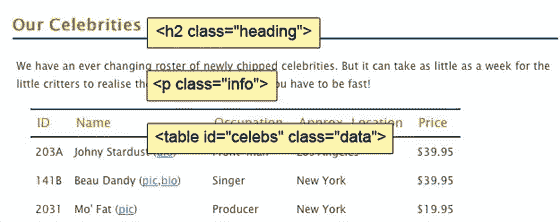

# 选择:jQuery 的核心

> 原文：<https://www.sitepoint.com/selecting-the-core-of-jquery/>

时间在流逝，最后期限不等人。客户注意到人们从网站上引用了不正确的名人 id。这是因为名人的名字都放在一个大表中，用户很难用正确的参考 id 来排列名人。我们的客户告诉我们，他希望每隔一行是浅灰色，这样用户就可以很容易地找到他们最喜欢的名人。

我们已经准备好了 jQuery，只需要我们为它选择一个目标。在页面上选择想要修改的元素实际上是 jQuery 的艺术。新手和忍者最大的区别之一就是你获取你想玩的元素所花费的时间！

**简单选择**

我们的任务是在名人表上选择备用表行。我们如何做到这一点？当使用 jQuery 进行选择时，您的目标应该是尽可能地具体:您希望找到最简洁的选择器，它确切地返回您想要更改的内容。让我们先来看看名人表的标记，如下所示:



我们可以从选择整个页面上的每个表格行元素开始。要按元素类型选择，只需将元素的 HTML 名称作为字符串参数传递给$函数。要选择所有表格行元素(用`<tr>`标记)，您只需编写:

```
$('tr')
```

**什么都没发生！**

如果运行此命令，页面上不会发生任何事情。这是意料之中的——毕竟，我们只是在选择元素。但是没必要担心；很快我们就会以各种奇怪而奇妙的方式修改我们的选择。

类似地，如果我们想要选择页面上的每个段落、`div`元素、`h1`标题或`input`框，我们将相应地使用这些选择器:

```
$('p')

$('div')

$('h1')

$('input')
```

但是我们不想改变名人页面上的每一个*表行:只改变表中有名人数据的行。我们需要更具体一点，首先选择包含名人列表的包含元素。如果您看一下 HTML 和名人表的图像，您会看到包含我们的名人`table`的`div`有一个`celebs`的`id`，而`table`本身有一个`data`的`class`。我们可以使用其中任何一个来选择`table`。*

jQuery 借用 CSS 的约定来引用`id`和`class`名称。要通过`id`进行选择，请使用散列符号(#)，后跟元素的`id`，并将其作为字符串传递给 jQuery 函数:

```
$('#celebs')
```

您应该注意到，我们传递给 jQuery 函数的字符串与 CSS `id`选择器的格式完全相同。因为`id` s 应该是唯一的，我们希望它只返回一个元素。jQuery 现在保存了对这个元素的引用。

同样，我们可以使用 CSS `class`选择器通过`class`进行选择。我们传递一个由句点(.)后跟元素的`class`名:

```
$('.data')
```

这两个语句都会选择表，但是一个`class`可以被多个元素共享 jQuery 会很高兴地选择我们指向的尽可能多的元素。如果有多个表(或任何其他元素)也有`class`数据，它们都会被选中。出于这个原因，我们将坚持使用这个`id`！

你能说得更具体些吗？

就像 CSS 一样，我们可以选择`$('.data')`或者更具体的`$('table.data')`。通过指定除了`class`之外的元素类型，选择器将只返回带有`class data`的`table`元素，而不是带有`class data`的*所有*元素。此外，像 CSS 一样，您可以添加父容器选择器来进一步缩小选择范围。

**缩小我们的选择范围**

我们已经成功地选择了表格，尽管我们对表格本身不感兴趣——我们希望*每隔一行*在其中。我们已经选择了包含元素，并且我们希望从该包含元素中挑选出所有表行的后代:也就是说，我们希望指定包含`table`的中的所有表行*。为此，我们在祖先和后代之间放置一个空格:*

```
$('#celebs tr')
```

您可以使用这个构造来深入到您正在寻找的元素，但是为了清楚起见，尽量保持您的选择器尽可能简洁。

让我们把这个想法更进一步。假设我们想要选择`p`元素内的所有 span 元素，这些元素本身也在`div`元素内——但前提是这些`div`恰好有一个`fancy`类。我们将使用选择器:

```
$('div.fancy p span')
```

如果你能做到这一点，你就可以选择任何东西了！

**测试我们的选择**

好吧，回到我们手头的任务。感觉我们越来越近了，但迄今为止，我们只是盲目地选择，没有办法知道我们是否在正确的道路上。我们需要一种方法来确认我们选择了正确的元素。实现这一点的一个简单方法是利用长度属性。length 返回选择器当前匹配的元素数量。我们可以将此与良好的 ol' trusty alert 语句相结合，以确保我们的元素已被选中:

```
$(document).ready(function() {
  alert($('#celebs tr').length + ' elements!');
});
```

这将提醒名人`table`的选择长度——7 个元素。这个结果可能与你预期的不同，因为表中只有六位名人！如果你看一下 HTML，你会发现我们的问题所在:`table`头也是一个`tr`，所以总共有 7 行。一个快速的解决方法是缩小选择器的范围，只查找位于`tbody`元素内部的表行:

```
$(document).ready(function() {
  alert($('#celebs tbody tr').length + ' elements!');
});
```

这将提醒 6 个元素的正确长度 jQuery 对象现在保存了我们的 6 个名人表行元素。

如果警报显示 0，您将知道您的选择器有错误。解决这类问题的一个好方法是尽可能减少选择器的数量。

在我们的例子中，我们可以简单地编写`$('#celebs')`，它将只选择`div`元素，并警告长度为 1。从这里开始，您可以使您的选择器更加具体，并检查您选择的元素数量是否正确。

**过滤器**

知道我们已经成功地选择了所有的表行，将我们的选择范围缩小到每隔一行就很简单了——因为 jQuery 有一个*过滤器*来完成这项工作。过滤器会删除某些项目，只保留我们需要的项目。当我们学习更多的例子时，你会对什么可以被过滤有一个感觉，但是现在我们将直接跳到我们的斑马纹需要的过滤器:

```
$(document).ready(function() {
  alert($('#celebs tbody tr:even').length + ' elements!');
});
```

过滤器附加到您要过滤的项目(在本例中为表格行)，并由冒号后跟过滤器名称来定义。这里使用的`:even`过滤器保留了选择中的每个偶数索引元素，并删除了其余的元素，这就是我们想要的。当我们现在提醒选择长度时，我们看到了 3，正如我们所料。所有奇数行都已从选择中过滤掉。我们可以使用各种各样的 jQuery 选择器过滤器:`:odd`(如您所料)`:first`、`:last`、`:eq()`(例如，用于选择第三个元素)，等等。我们将根据需要更详细地了解每一项。

**选择多个元素**

基本选择的最后一个技巧是在一条语句中选择多个元素的能力。这非常有用，因为我们经常想要对页面不相关部分的几个元素应用相同的动作。用逗号分隔选择器字符串允许您这样做。例如，如果我们想要选择页面上的每个段落、`div`元素、`h1`标题和`input`框，我们可以使用这个选择器:

```
$('p,div,h1,input')
```

学习如何一起使用所有这些不同的选择器来访问您想要的页面元素是掌握 jQuery 的一个重要部分。这也是使用 jQuery 最令人满意的地方之一，因为您可以将一些相当复杂的选择逻辑打包到一小段代码中！

**成为优秀的选择者**

选择看起来很容易，从某种程度上来说，的确如此。但是到目前为止，我们所涉及的仅仅是选择的皮毛。在大多数情况下，您需要的只是一些基础知识:如果您只是试图定位一个元素或一组相关元素，那么元素名、`id`和`class`是实现这一点的最有效和最简单的方法。

当从一个给定的元素开始在 DOM 中移动时，情况变得有点棘手。jQuery 为遍历 DOM 提供了无数的选择器和动作。*遍历*意味着在页面层次结构中上下移动，通过父元素和子元素。您可以随时添加和删除元素，在每一步应用不同的操作——这让您可以在一条 jQuery 语句中执行一些令人难以置信的复杂操作！

如果你是 CSS 方面的专家，你应该已经熟悉了很多语句；它们大多是直接从 CSS 规范中借用的。但是可能有一些你不熟悉的，特别是如果你还没有花很多时间学习 CSS3 选择器的话。当然，当我们在示例和演示中实现高级选择技术时，我们将会涉及和学习这些技术。出于这个原因，任何时候你想了解更多关于所有可用的 jQuery 选择器的信息，你都可以直接到[在线文档](http://api.jquery.com/category/selectors/)去浏览！

**note:**Want more?

看看这本书，并在网上购买:jQuery:忍者新手，作者厄尔·卡斯尔丁&克雷格·沙尔基

## 分享这篇文章