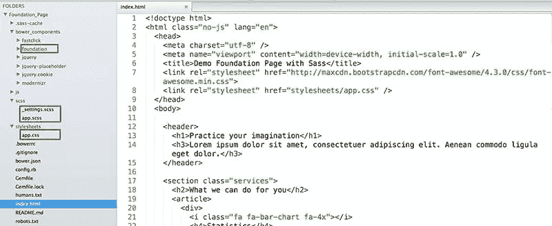
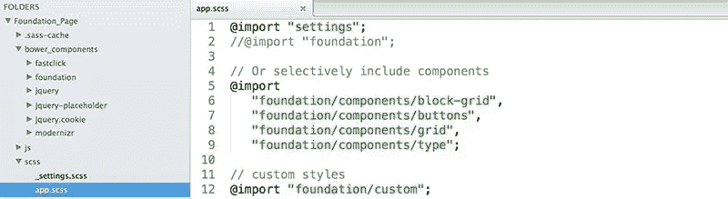
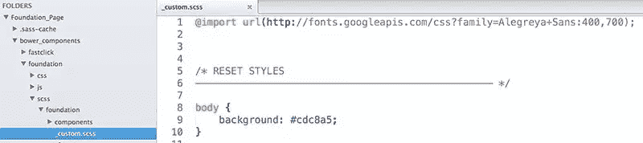
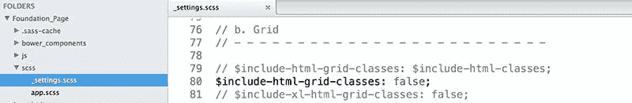
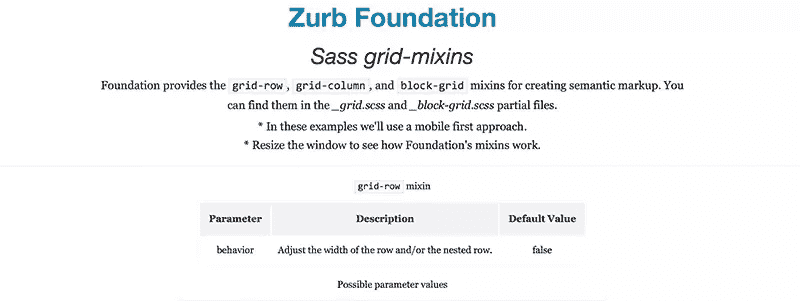
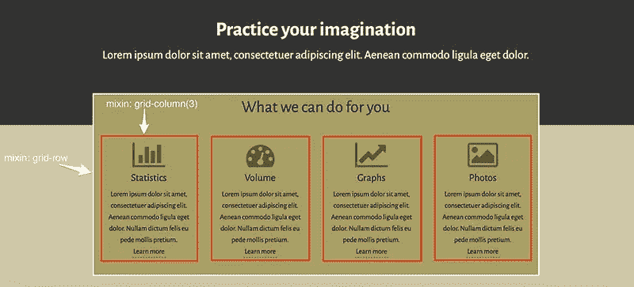
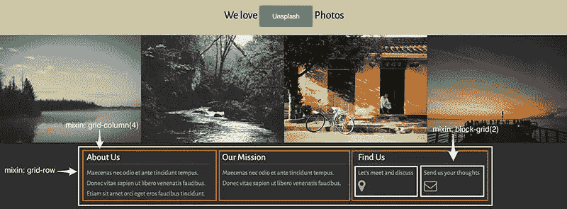

# 使用 Foundation 5 和 Sass 的语义标记

> 原文：<https://www.sitepoint.com/semantic-markup-foundation-5-sass/>

在我之前文章的[一篇](https://www.sitepoint.com/grid-system-comparison-bootstrap-vs-foundation/)中，我比较了[基金会 5](http://foundation.zurb.com/) 和 [Bootstrap 3](http://getbootstrap.com/) 的网格系统。

然而这一次，我将超越基础网格结构的基础。也就是说，我将向您展示如何利用预构建的 Sass mixins 创建更多的语义网格。为了演示它，我将重新构建前述文章的[演示页面](http://codepen.io/SitePoint/full/MYjqYE)。但是首先，让我介绍一下本文将使用的项目。

## 项目结构

使用 [Foundation 的命令行界面](http://foundation.zurb.com/docs/sass.html)，我建立了一个[指南针](http://compass-style.org/)项目。其结构如下所示:



请留意以下文件夹:

| 文件夹名称 | 描述 |
| --- | --- |
| 基础 | 包含基金会的所有资产(css、scss partials、js)。 |
| scss | 包含可用于自定义 Foundation 的文件。 |
| 样式表 | 包含输出 CSS 文件。 |

`app.scss`文件决定了我们的项目将包含的组件。默认情况下，它们都是导入的。然而，在我们的例子中，我们选择导入其中的四个。这是因为我们只对使用位于三个部分文件(`_block-grid.scss`、`_grid.scss`、`_buttons.scss`)中的 mixins 感兴趣。此外，我们希望保持基金会的印刷风格，因此我们也导入了`_type.scss`部分。

除了预定义的组件，`app.scss`文件还可以包含自定义样式。下面是我们文件的结构:



下面是自定义分部的路径:



此外，我们必须限制输出 CSS(减少其大小)。事实上，我们希望`app.css`文件只包含 Foundation 的印刷样式和我们的定制样式。为此，我们将以下变量值设置为`false`:

*   `include-html-grid-classes`
*   `include-html-block-grid-classes`
*   `include-html-button-classes`

我们可以在`_settings.scss`部分文件中改变它们的值:



最后但同样重要的是，这个项目的所有文件都可以在这里找到[。](https://uploads.sitepoint.com/wp-content/uploads/2015/03/1425564105Foundation_Page.zip)

让我们继续讨论 Foundation 的三个核心组合。请记住，第二个项目中有这些混音的例子。它看起来是这样的:



## 行

mixin 允许你定义网格的行。以下是它的参数:

| 参数 | 描述 | 缺省值 |
| --- | --- | --- |
| 行为 | 调整行和/或嵌套行的宽度。 | 错误的 |

以下是该参数的可能值:

| 价值观念 | 描述 |
| --- | --- |
| 错误的 | 当您想要将列换行到一行中时，请使用此选项。这将给它一个`max-width`属性值。此外，它会将其`margin-left`和`margin-right`属性值设置为`auto`。 |
| 倒塌 | 当您想要将列换行到一行中时，请使用此选项。这将给它一个`max-width`属性值。此外，它会将其所有边距设置为`0`。 |
| 筑巢 | 当您想要创建嵌套行时，请使用此选项。这将给它一个负的`margin-left`和一个负的`margin-right`属性值。 |
| 巢穴坍塌 | 当您想要创建嵌套行时，请使用此选项。这会将其所有边距设置为`0`。 |

## 列

mixin 生成你的专栏。下表显示了其参数:

| 参数 | 描述 | 缺省值 |
| --- | --- | --- |
| 列 | 所需的列数。 | 错误的 |
| 最后一列 | 这是最后一栏吗？ | 错误的 |
| 中心 | 将这些列居中？ | 错误的 |
| 抵消 | 要偏移的列数。 | 错误的 |
| 推 | 要推送的列数。 | 错误的 |
| 拉 | 要提取的列数。 | 错误的 |
| 倒塌 | 移除列填充？ | 错误的 |
| 漂浮物 | 浮动此列？ | 真实的 |
| 位置 | 定位类型。 | 错误的 |

## 块状网格

如果您想利用块网格，Foundation 提供了`block-grid` mixin。以下是它的参数:

| 价值 | 描述 | 缺省值 |
| --- | --- | --- |
| 每行 | 每行显示的项目数。 | 错误的 |
| 间隔 | 在每个块项目上用作填充的 ems 的数量。 | 0.625 雷姆 |
| 包含间距 | 向列表项添加填充。 | 真实的 |
| 基本风格 | 将基本样式应用于块栅格。 | 真实的 |

## 把所有的放在一起

至此，我们已经准备好创建我们的演示页面了。

在下面的屏幕截图中，您可以看到我们的一个部分的理想布局:



基于视口宽度，我们做出以下假设:

| 窗口宽度 | 描述 |
| ≤640 像素 | 每篇文章都覆盖了其父容器的整个宽度。 |
| 介于 641 像素和 1024 像素之间 | 将`columns`参数的值设置为`6`。也就是说，每件物品占集装箱宽度的 50%。 |
| ≥1025 像素 | 将`columns`参数的值设置为`3`。这意味着，每件物品占集装箱宽度的 25%。 |

下面是相关的 HTML:

```
<section class="services">
    <h2>What we can do for you</h2>
    <article>
        <div>
            <i class="fa fa-bar-chart fa-4x"></i>
            <h4>Statistics</h4>
            <p>
                <!-- content -->
            </p>
            <a href="#">Learn more</a>
        </div>
    </article>
    <article>
        <!-- content -->
    </article>
    <article>
        <!-- content -->
    </article>
    <article>
        <!-- content -->
    </article>
</section>
```

我们的 Sass 代码:

```
.services {
 @include grid-row;

    article {
 @include grid-column(12);

 @media #{$medium-up} {
 @include grid-column(6);
        }

 @media #{$large-up} {
 @include grid-column(3);
        }
    }
}
```

以及由此产生的 CSS:

```
.services {
    width: 100%;
    margin-left: auto;
    margin-right: auto;
    max-width: 62.5rem;
}

.services article {
    padding-left: 0.9375rem;
    padding-right: 0.9375rem;
    width: 100%;
    float: left;
}

@media only screen and (min-width: 40.063em) {
    .services article {
        width: 50%;
        float: left;
    }
}

@media only screen and (min-width: 64.063em) {
    .services article {
        width: 25%;
        float: left;
    }
}
```

*注意:为了简单起见，我只包含了编译后的 CSS 中的一些规则。如果您想查看 Foundation 输出的完整 CSS，请查看一下`app.css`文件。*

同样，让我们继续我们的第二个例子。下面是我们想要应用到`footer`元素的样式:



同样，我们通过考虑一些假设来构建它:

| 窗口宽度 | 描述 |
| --- | --- |
| ≤640 像素 | 每个`div`元素覆盖其父容器的整个宽度。 |
| ≥641 像素 | 将`columns`参数的值设置为`4`。这意味着，每个`div`元素覆盖了大约 33.33%的容器宽度。 |

此外，我们利用`block-grid` mixin 在最后一个`div`元素中包含嵌套行。

HTML 代码如下所示:

```
<footer>
    <section>
        <div>
            <h4>About Us</h4>
            <!-- content -->
        </div>
        <div>
            <h4>Our Mission</h4>
            <!-- content -->
        </div>
        <div>
            <h4>Find Us</h4>
            <ul>
                <!-- content -->
            </ul>
        </div>
    <section>
</footer>
```

这是我们的 Sass 代码:

```
footer {
    section {
 @include grid-row;

        div {
 @include grid-column(12);

 @media #{$medium-up} {
 @include grid-column(4);
            }
        }

        ul {
 @include block-grid(2);
        }
    }
}
```

以及编译后的 CSS:

```
footer section {
 width: 100%;
 margin-left: auto;
 margin-right: auto;
 max-width: 62.5rem;
}

footer section div {
 padding-left: 0.9375rem;
 padding-right: 0.9375rem;
 width: 100%;
 float: left;
}

footer ul > li {
 float: left;
 width: 50%;
 padding: 0 0.625rem 1.25rem;
 list-style: none;
}

@media only screen and (min-width: 40.063em) {
    footer section div {
 width: 33.33333%;
 float: left;
    }
}
```

*注意:同样，为了简单起见，我只包含了编译后的 CSS 中的一些规则。要查看 Foundation 输出的完整 CSS，请查看`app.css`文件。*

## 结论

在本文中，我向您展示了三个 Foundation 的 mixins，您可以使用它们来交付更干净、更具语义的 HTML 代码。下一步，我鼓励您深入研究它的 Sass 文件，检查所有的 mixins(当前版本是 46 个)。谢天谢地，文档真的很好，所以我希望你理解它们不会有任何问题！这样，您将有机会将这个框架的强大功能与您自己的定制结合起来。

## 分享这篇文章